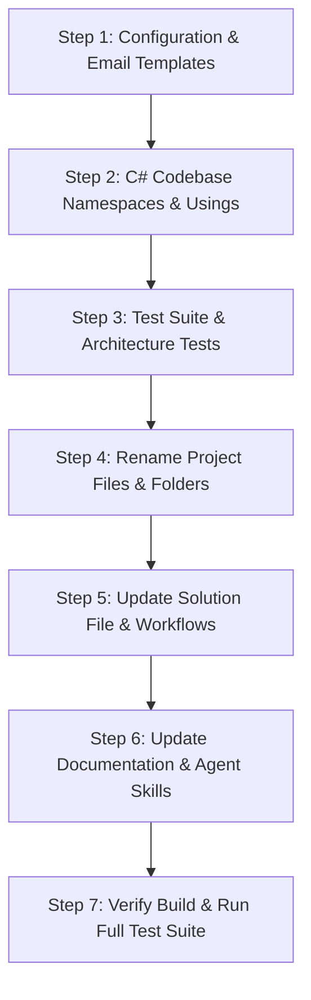

# 🏛️ Smart Court to Mostashar — Comprehensive Rebranding Audit & Execution Guide

> **Project Rebranding:** `Smart Court` / `SmartCourt` / `المحكمة الذكية` ➔ `Mostashar` / `مستشار`  
> **Target Audience:** Engineering Team / Developer executing the rebrand  
> **Scope:** Full Solution Scan (1,141 files, 13,288 line occurrences + 62 Arabic occurrences)

---

## 📌 Executive Summary

This document serves as an exhaustive audit and execution reference for rebranding the backend API and all associated artifacts from **"Smart Court" (المحكمة الذكية)** to **"Mostashar" (مستشار)**.

### 📊 Key Metrics
* **Total Files with Content Matches:** 1,141 files
* **Total Line Occurrences (English):** 13,288 lines
* **Total Line Occurrences (Arabic):** 62 lines across 7 files
* **Files / Directories Requiring Physical Renaming:** 11 items

---

## 🔄 1. Global Rebranding Matrix & Naming Conventions

The developer executing the rebrand must adhere to the following naming conventions across all project tiers:

| Context / Tier | Current Name Pattern | New Target Pattern (`Mostashar`) | Examples |
| :--- | :--- | :--- | :--- |
| **Spaced English (Display)** | `Smart Court` | `Mostashar` | Documentation, Titles, Email Sender Display Name |
| **Spaced Arabic (Display)** | `المحكمة الذكية` / `منصة المحكمة الذكية` | `مستشار` / `منصة مستشار` | Email HTML Templates, Email Subjects, SMS, Prompts |
| **PascalCase (C# Code)** | `SmartCourt` | `Mostashar` | Namespaces, Project Names, Classes, Assemblies |
| **PascalCase + Suffix** | `SmartCourtAPI` / `SmartCourtClient` | `MostasharAPI` / `MostasharClient` | JWT Issuer & Audience Settings |
| **kebab-case (Cloud & URLs)** | `smart-court` / `smart-court-files` | `mostashar` / `mostashar-files` | Supabase / S3 Buckets, URL routes |
| **snake_case (Files & DB)** | `smart_court` | `mostashar` | OpenAPI specs, filenames, DB identifiers |
| **lowercase (Domains & Email)**| `smartcourt` | `mostashar` | `noreply@mostashar.dev`, URLs |
| **UPPERCASE (Constants/Envs)** | `SMARTCOURT` / `SMART_COURT` | `MOSTASHAR` | Environment variables, System constants |

---

## 📁 2. Physical Files & Directories to Rename

| Current Path | Proposed New Path | Description |
| :--- | :--- | :--- |
| `SmartCourt.sln` | `Mostashar.sln` | Visual Studio Solution File |
| `SmartCourt/` | `Mostashar/` | Main Project Root Directory |
| `SmartCourt/SmartCourt.csproj` | `Mostashar/Mostashar.csproj` | Main Project File |
| `SmartCourt.Tests/` | `Mostashar.Tests/` | Test Project Root Directory |
| `SmartCourt.Tests/SmartCourt.Tests.csproj` | `Mostashar.Tests/Mostashar.Tests.csproj` | Test Project File |
| `SmartCourt.Tests/Common/SmartCourtWebApplicationFactory.cs` | `SmartCourt.Tests/Common/MostasharWebApplicationFactory.cs` | Test Host WebApplicationFactory |
| `docs/smart_court_openapi.json` | `docs/mostashar_openapi.json` | OpenAPI JSON Specification |
| `docs/smart_court_openapi.yaml` | `docs/mostashar_openapi.yaml` | OpenAPI YAML Specification |
| `docs/SRS/Smart_Court_SRS.md` | `docs/SRS/Mostashar_SRS.md` | Software Requirements Specification |
| `docs/SRS/Smart_Court_Product_Feature_Specification.md` | `docs/SRS/Mostashar_Product_Feature_Specification.md` | Product Feature Specification |
| `docs/MeetingNotes/smartcourt-transcript.md` | `docs/MeetingNotes/mostashar-transcript.md` | Team Meeting Notes |

---

## 📧 3. Arabic Branding Occurrences (`المحكمة الذكية` ➔ `مستشار`)

### A. Email HTML Templates
* **`SmartCourt/Features/Auth/Shared/Templates/ConfirmationEmail.html`**:
  * Line 70: `<h1>المحكمة الذكية</h1>` ➔ `<h1>مستشار</h1>`
  * Line 74: `<p>شكراً لانضمامك إلى منصة المحكمة الذكية. يرجى تأكيد عنوان بريدك الإلكتروني لإكمال عملية التسجيل وتفعيل حسابك.</p>` ➔ `<p>شكراً لانضمامك إلى منصة مستشار. يرجى تأكيد عنوان بريدك الإلكتروني لإكمال عملية التسجيل وتفعيل حسابك.</p>`
  * Line 83: `<p>&copy; {{Year}} منصة المحكمة الذكية. جميع الحقوق محفوظة.</p>` ➔ `<p>&copy; {{Year}} منصة مستشار. جميع الحقوق محفوظة.</p>`
* **`SmartCourt/Features/Auth/Shared/Templates/ResendVerificationEmail.html`**:
  * Line 70: `<h1>المحكمة الذكية</h1>` ➔ `<h1>مستشار</h1>`
  * Line 74: `<p>شكراً لانضمامك إلى منصة المحكمة الذكية...</p>` ➔ `<p>شكراً لانضمامك إلى منصة مستشار...</p>`
  * Line 83: `<p>&copy; {{Year}} منصة المحكمة الذكية. جميع الحقوق محفوظة.</p>` ➔ `<p>&copy; {{Year}} منصة مستشار. جميع الحقوق محفوظة.</p>`
* **`SmartCourt/Features/Auth/Shared/Templates/ResetPasswordEmail.html`**:
  * Line 70: `<h1>المحكمة الذكية</h1>` ➔ `<h1>مستشار</h1>`
  * Line 84: `<p>&copy; {{Year}} منصة المحكمة الذكية. جميع الحقوق محفوظة.</p>` ➔ `<p>&copy; {{Year}} منصة مستشار. جميع الحقوق محفوظة.</p>`

### B. Email Subject Lines (C# Backend Services)
* **`SmartCourt/Features/Auth/Shared/AuthHelperService.cs`**:
  * Line 72: `var subject = "تأكيد البريد الإلكتروني - المحكمة الذكية";` ➔ `var subject = "تأكيد البريد الإلكتروني - مستشار";`
* **`SmartCourt/Features/Auth/ForgotPassword/ForgotPasswordService.cs`**:
  * Line 40: `var subject = "إعادة تعيين كلمة المرور - المحكمة الذكية";` ➔ `var subject = "إعادة تعيين كلمة المرور - مستشار";`

### C. AI Chat Agent Prompts
* **`SmartCourt/Features/ChatAgent/ChatAgentPrompts.cs`**:
  * Line 29: `أنت مستشار ومساعد قانوني ذكي موجه للموكل (العميل) عبر منصة SmartCourt.` ➔ `أنت مستشار ومساعد قانوني ذكي موجه للموكل (العميل) عبر منصة مستشار (Mostashar).`

### D. SMS Verification (Already Verified)
* **`SmartCourt/Features/Auth/PhoneVerification/SendPhoneVerificationTokenHandler.cs`**:
  * Line 26: `$"كود التوثيق الخاص بك في منصة مستشار هو: {token}"` *(Already updated to مستشار ✅)*

---

## ⚙️ 4. Technical Component Audit & Line Occurrences

### A. Configuration & AppSettings (13 occurrences across 3 files)
* **`SmartCourt/appsettings.json`**:
  * Line 4: `"LocalConnection": "Server=.;Database=SmartCourt_Graduation;..."` ➔ `Database=Mostashar_Graduation` (or as required)
  * Line 74: `"Bucket": "smart-court-files"` ➔ `"mostashar-files"`
  * Line 78: `"Issuer": "SmartCourtAPI"` ➔ `"MostasharAPI"`
  * Line 79: `"Audience": "SmartCourtClient"` ➔ `"MostasharClient"`
* **`SmartCourt/appsettings.Development.json`**:
  * Line 3: `"DefaultConnection": "Server=.;Database=SmartCourt_dev;..."` ➔ `Database=Mostashar_dev`
  * Line 46: `"Issuer": "SmartCourtAPI"` ➔ `"MostasharAPI"`
  * Line 47: `"Audience": "SmartCourtClient"` ➔ `"MostasharClient"`
  * Line 108: `"Bucket": "SmartCourt"` ➔ `"Mostashar"`
  * Line 114: `"FromEmail": "noreply@smartcourt.dev"` ➔ `"noreply@mostashar.dev"`
* **`SmartCourt/appsettings.Development.Hosted.json`**:
  * Line 27: `"Bucket": "smart-court-files"` ➔ `"mostashar-files"`
  * Line 31: `"Issuer": "SmartCourtAPI"` ➔ `"MostasharAPI"`
  * Line 32: `"Audience": "SmartCourtClient"` ➔ `"MostasharClient"`

---

### B. Solution & Project Files (3 occurrences across 2 files)
* **`SmartCourt.sln`**:
  * Lines 6–8:
    ```
    Project("{FAE04EC0-301F-11D3-BF4B-00C04F79EFBC}") = "SmartCourt", "SmartCourt\SmartCourt.csproj", "{67900D39-75B8-4569-8C22-2ED960BAA51C}"
    Project("{FAE04EC0-301F-11D3-BF4B-00C04F79EFBC}") = "SmartCourt.Tests", "SmartCourt.Tests\SmartCourt.Tests.csproj", "{BAA70B44-9258-4ECE-8AA8-B289E93A8CFA}"
    ```
    ➔ Replace project names and folder paths with `Mostashar` and `Mostashar.Tests`.
* **`SmartCourt.Tests/SmartCourt.Tests.csproj`**:
  * Line 22: `<ProjectReference Include="..\SmartCourt\SmartCourt.csproj" />` ➔ `<ProjectReference Include="..\Mostashar\Mostashar.csproj" />`

---

### C. Startup & Dependency Injection (118 occurrences across 2 files)
* **`SmartCourt/Program.cs`**:
  * Line 71: `SmartCourt.Persistence.DatabaseSeeder.SeedAsync(...)`
  * Line 75: `SmartCourt.Infrastructure.Providers.Jobs`
  * Swagger / OpenAPI registration metadata and title.
* **`SmartCourt/DependencyInjection.cs`**:
  * Line 170: `services.AddValidatorsFromAssemblyContaining<SmartCourt.Features.Auth.Login.Validators.LoginRequestValidator>();`
  * Lines 407–437: Fully qualified provider options registrations (`SmartCourt.Providers.Payments.Stripe.StripeOptions`, `SmartCourt.Providers.Email...`, etc.).

---

### D. Feature Slices (1,977 occurrences across 569 files)
All files inside `SmartCourt/Features/`:
* **Namespaces:** `namespace SmartCourt.Features.<SliceName>...` ➔ `namespace Mostashar.Features.<SliceName>...`
* **Using Statements:** `using SmartCourt.Common...`, `using SmartCourt.Features...`, `using SmartCourt.Infrastructure...` ➔ `using Mostashar...`
* **Controller Responses:**
  * Health check / Ping endpoint: `"Pong! Smart Court API is fully operational."` ➔ `"Pong! Mostashar API is fully operational."`
  * Email sender name: `"Smart Court"` ➔ `"Mostashar"`

---

### E. Infrastructure, Providers, Common & Entities (280 occurrences across 150 files)
* **`SmartCourt/Infrastructure/` & `SmartCourt/Providers/` (83 files, 168 matches):**
  * Namespaces `namespace SmartCourt.Infrastructure...` & `namespace SmartCourt.Providers...`
  * Provider Options classes: `StripeOptions`, `PaymobOptions`, `QdrantOptions`, `TwilioOptions`, `MailKitOptions`, `JwtOptions`, `FileStorageOptions`.
* **`SmartCourt/Common/`, `SmartCourt/Entities/`, `SmartCourt/Interfaces/` (67 files, 90 matches):**
  * Namespaces `namespace SmartCourt.Common...`, `namespace SmartCourt.Entities...`, `namespace SmartCourt.Interfaces...`
  * Domain entities: `ApplicationUser`, `BaseEntity`, `AuditableEntity`, `ClientProfile`, `LawyerProfile`.

---

### F. Database Migrations & SQL Scripts (5,458 occurrences across 106 files)
* **EF Core Migrations (`SmartCourt/Persistence/Migrations/` & `SmartCourt/Migrations/` - 24 files, 1,958 matches):**
  * Migration class namespaces: `namespace SmartCourt.Persistence.Migrations` ➔ `namespace Mostashar.Persistence.Migrations`
  * Snapshot class: `ApplicationDbContextModelSnapshot.cs` / `SmartCourtDbContextModelSnapshot.cs`
* **SQL Scripts (`SmartCourt/script.sql`, `SmartCourt/create.sql` - 3,500 matches):**
  * DDL schema creation scripts with namespace comments.

---

### G. Test Suite (`SmartCourt.Tests/` - 4,628 occurrences across 165 files)
* **`SmartCourt.Tests/Common/SmartCourtWebApplicationFactory.cs`**:
  * Rename class to `MostasharWebApplicationFactory`
  * Test JWT configurations: `"Issuer": "MostasharAPI"`, `"Audience": "MostasharClient"`
  * Default test user emails: `user@smartcourt.test` ➔ `user@mostashar.test`
* **Architecture Tests:**
  * `SmartCourt.Tests/Architecture/ContractAndPaymentArchitectureRules.cs` & `ContractAndPaymentArchitectureTests.cs`:
  * Update hardcoded path strings: `"SmartCourt/Features/..."`, `"SmartCourt.sln"`, `"SmartCourt/Entities"`, `"SmartCourt/Providers"`.
* **All Unit / Integration Tests & HTTP Test Scripts:**
  * Namespaces and usings across 160+ test classes.
  * PowerShell HTTP test scripts in `SmartCourt.Tests/HttpTests/`.

---

### H. Documentation & OpenAPI Specs (771 occurrences across 122 files)
* **`README.md`** (14 occurrences): Project overview, clone commands, folder paths, dotnet ef commands.
* **`docs/smart_court_openapi.json` & `docs/smart_court_openapi.yaml`**: Title `"SmartCourt API"`, descriptions, endpoint example payloads.
* **`docs/frontend_api.md` & `docs/frontend_api_contract.md`**: Route references, payload definitions, response models.
* **`docs/SRS/`**: Requirement specifications.
* **`docs/Architecture/`, `docs/Reviews/`, `docs/System-and-Infrastructure/`**: Architecture diagrams, review notes, setup guides.

---

### I. Automation Scripts & Tools (12 occurrences across 7 files)
* `scripts/Ingest-ExportedChunks.ps1`
* `scripts/Ingest-LawDocs.ps1`
* `scripts/Remove-SaudiChunks.ps1`
* `scripts/count_chunks.ps1`
* `scripts/CleanLegalChunks/Program.cs`
* `scripts/GenerateNewChunks/Program.cs`
* `fix.csx`

---

### J. Agent Skills & Rules (28 occurrences across 7 files)
* `.agents/AGENTS.md` (Project structure rules, naming standards)
* `.agents/skills/add-app-setting/SKILL.md`
* `.agents/skills/add-infra-provider/SKILL.md`
* `.agents/skills/add-rate-limit/SKILL.md`
* `.agents/skills/create-vertical-slice/SKILL.md`
* `.agents/skills/generate-http-test/SKILL.md`

---

### K. CI/CD & Workflows (1 occurrence)
* **`.github/workflows/deploy.yml`**:
  * Line 22: `dotnet restore SmartCourt.sln` ➔ `Mostashar.sln`
  * Line 25: `dotnet build SmartCourt.sln ...`
  * Line 28: `dotnet test SmartCourt.Tests/SmartCourt.Tests.csproj ...`
  * Line 59: `Set-Content -Path "SmartCourt/appsettings.Production.json" ...`
  * Line 62: `dotnet publish SmartCourt/SmartCourt.csproj ...`
* **`.gitignore`**:
  * Line 499: `SmartCourt/uploads/` ➔ `Mostashar/uploads/`

---

## 🛠️ 5. Recommended Step-by-Step Execution Plan

When executing the rebrand, follow this sequenced workflow to avoid compilation or tooling breakage:



1. **Step 1: Update In-Code Strings & Templates (No path renaming yet)**
   * Replace Arabic terms in `ConfirmationEmail.html`, `ResendVerificationEmail.html`, `ResetPasswordEmail.html`.
   * Replace Arabic terms in `AuthHelperService.cs`, `ForgotPasswordService.cs`, and `ChatAgentPrompts.cs`.
   * Replace JWT Issuer/Audience and Bucket names in `appsettings*.json`.
2. **Step 2: Global Namespace & Using Replacement**
   * Replace `namespace SmartCourt` ➔ `namespace Mostashar`.
   * Replace `using SmartCourt` ➔ `using Mostashar`.
   * Replace fully qualified references in `DependencyInjection.cs` and `Program.cs`.
3. **Step 3: Test Suite Updates**
   * Update `SmartCourtWebApplicationFactory` ➔ `MostasharWebApplicationFactory`.
   * Update path assertions in `ContractAndPaymentArchitectureRules.cs` and `ContractAndPaymentArchitectureTests.cs`.
4. **Step 4: Rename Files and Directories**
   * Rename `SmartCourt/` folder to `Mostashar/`.
   * Rename `SmartCourt.csproj` to `Mostashar.csproj`.
   * Rename `SmartCourt.Tests/` folder to `Mostashar.Tests/`.
   * Rename `SmartCourt.Tests.csproj` to `Mostashar.Tests.csproj`.
   * Rename `SmartCourt.sln` to `Mostashar.sln`.
5. **Step 5: Update Solution and CI/CD References**
   * Update `.sln`, `.github/workflows/deploy.yml`, `.gitignore`.
6. **Step 6: Update Documentation, OpenAPI Specs & Agent Skills**
   * Update `README.md`, `docs/smart_court_openapi.*`, `docs/frontend_api*.md`, `.agents/`.
7. **Step 7: Verification & Build**
   * Run `dotnet restore Mostashar.sln`
   * Run `dotnet build Mostashar.sln`
   * Run `dotnet test Mostashar.sln`
