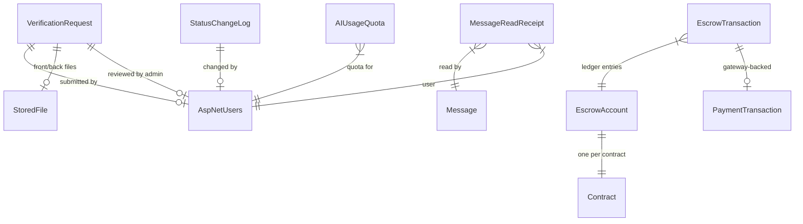

# Smart Court — Database Schema Architectural Review

> **Review Type:** Comprehensive Architectural Audit  
> **Schema Version:** `schema.md` (1,139 lines, 7 modules, ~30 tables)  
> **Reviewer Role:** Senior Database Architect  
> **Date:** July 3, 2026  

---

## Executive Summary

The Smart Court schema presents a **well-structured MVP foundation** for an AI-powered legal marketplace. The modular decomposition (Identity, Cases, Proposals, Contracts, Reviews, AI Assistant, Knowledge Base) demonstrates clear domain understanding and reasonable separation of concerns. The use of UUIDs, junction tables for many-to-many relationships, and immutable audit fields (`CreatedAt`, `UpdatedAt`) reflects mature design instincts.

However, under production-grade scrutiny, the schema reveals **27 distinct issues** across five severity tiers that, if unaddressed, will create compounding technical debt. The most critical gaps are:

| Severity | Count | Summary |
|----------|-------|---------|
| 🔴 **Critical** | 5 | Missing audit trail infrastructure, no soft-delete on legal records, no escrow ledger, status fields as bare integers, PII stored without structural isolation |
| 🟠 **High** | 8 | File storage lacks multi-cloud metadata, AI output schema is rigid, verification logic is duplicated, no refund/partial-payment model, notification has no entity linkage |
| 🟡 **Medium** | 7 | Missing indexes on high-query columns, denormalization opportunities in messaging, LawyerMatch staleness risk, no article versioning, Review has no response mechanism |
| 🟢 **Low** | 5 | ViewCount race conditions, ConversationParticipant missing LeftAt, AIMessage stores tokens on user messages, minor naming inconsistencies |
| ⚪ **Advisory** | 2 | Consider CQRS read-models for dashboard aggregations, future multi-tenancy hooks |

> [!CAUTION]
> The schema **completely omits an escrow/wallet ledger** despite the SRS listing escrow as a core requirement. The current `PaymentRelease` → `PaymentTransaction` chain tracks outbound payments but has no representation of client deposits, held funds, platform fees, or balance reconciliation. This is the single most critical gap.

---

## Detailed Module-by-Module Breakdown

---

### Module 1 — Identity & User Management

**Tables:** `AspNetUsers`, `StoredFile`, `ClientProfile`, `LawyerProfile`, `LegalCategory`, `LawyerSpecialization`

---

#### 1.1 `AspNetUsers` — Identity Core

**Current Assessment:** Minimal and functional for MVP. Defers role management to ASP.NET Identity's built-in `AspNetRoles`/`AspNetUserRoles` tables (not shown but implied).

**Issues Found:**

| # | Severity | Issue | Detail |
|---|----------|-------|--------|
| 1 | 🔴 | **No soft-delete** | `IsActive` serves as a logical toggle, but there is no `DeletedAt` timestamp and no guarantee that application code filters by `IsActive` universally. A user deactivated mid-contract could corrupt downstream FK references. |
| 2 | 🟠 | **No `LastLoginAt`** | Required for security monitoring, session management, and dormant-account policies mandated by Egyptian data-protection guidelines. |
| 3 | 🟠 | **No `EmailVerified` / `PhoneVerified` flags** | ASP.NET Identity provides `EmailConfirmed` and `PhoneNumberConfirmed` in its default schema, but they are omitted here. If this is intentional (relying on the framework), it should be explicitly documented. If not, it is a gap. |
| 4 | 🟢 | **Missing `MiddleName` / `FullNameArabic`** | Egyptian legal documents use four-part names (الاسم الرباعي). A `varchar` `FirstName`/`LastName` pair is insufficient for legal-grade identity verification. |

**Recommendation:**
```diff
Table AspNetUsers {
  Id uuid [pk]
  UserName varchar
  Email varchar
  PhoneNumber varchar
  FirstName varchar
+ MiddleName varchar [null]
  LastName varchar
+ FullNameArabic nvarchar [null]
  ProfilePictureFileId uuid [null]
  IsActive bool
+ IsDeleted bool [default: false]
+ DeletedAt datetime [null]
+ LastLoginAt datetime [null]
  CreatedAt datetime
  UpdatedAt datetime
}
```

---

#### 1.2 `StoredFile` — File Storage Architecture

**Current Assessment:** A single, flat table for all platform file storage. This is a **monolithic anti-pattern** for a legal platform where document sensitivity varies drastically (profile picture vs. national ID scan vs. case evidence vs. contract attachment).

**Issues Found:**

| # | Severity | Issue | Detail |
|---|----------|-------|--------|
| 5 | 🟠 | **No sensitivity classification** | A profile avatar and a national ID scan share the same storage table with no structural distinction. Access-control rules, encryption-at-rest policies, and retention schedules differ fundamentally between these categories. |
| 6 | 🟠 | **No multi-cloud / CDN metadata** | `StoragePath` is a single text field. Production systems need `StorageProvider` (S3, Azure Blob, GCS), `BucketName`, `Region`, `CdnUrl`, and `Checksum` fields for provider-agnostic file retrieval, integrity verification, and CDN invalidation. |
| 7 | 🟡 | **No `IsDeleted` / `DeletedAt`** | File records are presumably hard-deleted. Legal document retention requirements (often 5-10 years) require soft-delete with scheduled purge jobs. |
| 8 | 🟡 | **No virus scan / validation status** | Uploaded files should be quarantined until scanned. A `ScanStatus` field (`Pending`, `Clean`, `Infected`, `Failed`) is essential for a platform accepting user-uploaded documents. |
| 9 | 🟢 | **Polymorphic association is implicit** | The file's owner context (which entity it belongs to) is only discoverable by reverse-traversing FKs from `CaseAttachment`, `MessageAttachment`, etc. There is no `OwnerEntityType` + `OwnerEntityId` pair on `StoredFile` itself, making orphan detection and bulk operations difficult. |

**Recommended Schema:**
```diff
Table StoredFile {
  Id uuid [pk]
  OriginalFileName varchar
  StoredFileName varchar
  ContentType varchar
  Extension varchar
  FileSize bigint
  StoragePath text
+ StorageProvider varchar        -- 'S3', 'AzureBlob', 'GCS'
+ BucketName varchar [null]
+ CdnUrl text [null]
+ Checksum varchar [null]        -- SHA-256 hash for integrity
+ SensitivityLevel int           -- 0=Public, 1=Internal, 2=Confidential, 3=Restricted
+ ScanStatus int [default: 0]    -- 0=Pending, 1=Clean, 2=Infected, 3=Error
  UploadedByUserId uuid
+ IsDeleted bool [default: false]
+ DeletedAt datetime [null]
  CreatedAt datetime
}
```

---

#### 1.3 `ClientProfile` & `LawyerProfile` — Verification Logic Duplication

**Current Assessment:** Both profiles contain near-identical verification field clusters (`NationalIdFrontFileId`, `NationalIdBackFileId`, `NationalIdVerificationStatus`, `NationalIdReviewedByUserId`, `NationalIdVerifiedAt`). The `LawyerProfile` duplicates this entire block and adds a second one for bar card verification.

**Issues Found:**

| # | Severity | Issue | Detail |
|---|----------|-------|--------|
| 10 | 🟠 | **Verification logic is copy-pasted, not normalized** | Six fields are duplicated between `ClientProfile` and `LawyerProfile` for national ID verification. The `LawyerProfile` adds another six for bar card verification. This means 18 fields across two tables doing the same job. If a third verification type is added (e.g., law firm registration), a third copy is required. |
| 11 | 🟠 | **No verification audit trail** | There is no record of *why* a verification was rejected, nor a history of re-submissions. If an admin rejects a national ID, the `NationalIdVerificationStatus` is overwritten with no trace of the previous state. |
| 12 | 🟡 | **No rejection reason** | When an admin rejects a verification, there is no field to store the rejection reason communicated to the user. |

**Recommended Refactor — Extract `VerificationRequest` Table:**
```
Table VerificationRequest {
  Id uuid [pk]
  UserId uuid                       -- FK → AspNetUsers
  VerificationType int              -- NationalId=0, BarCard=1, LawFirmReg=2
  FrontFileId uuid [null]           -- FK → StoredFile
  BackFileId uuid [null]            -- FK → StoredFile
  Status int                        -- Pending=0, Approved=1, Rejected=2
  ReviewedByUserId uuid [null]      -- FK → AspNetUsers (admin)
  ReviewedAt datetime [null]
  RejectionReason text [null]
  SubmittedAt datetime
  CreatedAt datetime
  UpdatedAt datetime

  indexes {
    (UserId, VerificationType)
  }
}
```

This eliminates all 18 verification fields from both profile tables, provides a full audit history (multiple rows per user per type), and scales to any future verification type without schema changes.

---

#### 1.4 Status Fields as Bare Integers — Schema-Wide Anti-Pattern

> [!WARNING]
> This issue recurs across **every module**. The tables `ClientProfile`, `LawyerProfile`, `LegalCase`, `Proposal`, `Contract`, `Milestone`, `PaymentRelease`, `PaymentTransaction`, `Dispute`, `Notification`, `AIConversation`, `AIMessage`, and `LegalArticle` all use `int` for status/type fields with no documentation of valid values in the schema itself.

| # | Severity | Issue | Detail |
|---|----------|-------|--------|
| 13 | 🔴 | **Integer statuses with no constraints** | Nothing prevents inserting `Status = 999` into any table. There are no CHECK constraints, no ENUM types, and no lookup tables. The "meaning" of each integer lives exclusively in application code, creating a single point of failure and making the database impossible to reason about independently. |

**Recommended Approach (choose one per context):**

| Approach | When to Use | Example |
|----------|-------------|---------|
| **Database ENUM** | PostgreSQL, small fixed sets | `CREATE TYPE case_status AS ENUM ('Draft','Submitted','Analyzed','Matched','Closed');` |
| **CHECK constraint** | Any RDBMS, small fixed sets | `CHECK (Status IN (0,1,2,3,4))` |
| **Lookup table** | Large/dynamic sets, admin-editable labels | `StatusLookup(Id int PK, Name varchar, Module varchar)` |

**Minimum viable fix:** Add CHECK constraints to every `int` status column and document the enum mapping in table notes.

---

### Module 2 — Legal Cases & AI

**Tables:** `LegalCase`, `AIAnalysis`, `LawyerMatch`, `CaseAttachment`

---

#### 2.1 `LegalCase` — Case Lifecycle Gaps

| # | Severity | Issue | Detail |
|---|----------|-------|--------|
| 14 | 🔴 | **No case status audit log** | The SRS mandates audit logs (§4). When a case transitions from `Draft` → `Submitted` → `Analyzed` → `Matched`, only the current `Status` is preserved. There is no record of *who* triggered the transition, *when*, or *why*. |
| 15 | 🟡 | **No `AssignedLawyerUserId`** | After a proposal is accepted, the case has no direct FK to the assigned lawyer. This information is only recoverable through a 3-table JOIN chain (`LegalCase` → `Proposal` → `Contract`), which is expensive for dashboards, reporting, and access-control checks. |
| 16 | 🟡 | **`CaseLocation` is unstructured `text`** | Legal jurisdiction matters enormously. A freetext field cannot support location-based filtering, geospatial queries, or jurisdiction validation. Consider a `GovernorateId` FK to a `Governorate` lookup table (Egypt has 27 governorates). |

**Recommended — Status Audit Trail (Reusable Across All Modules):**
```
Table StatusChangeLog {
  Id uuid [pk]
  EntityType varchar             -- 'LegalCase', 'Contract', 'Dispute', etc.
  EntityId uuid
  OldStatus int
  NewStatus int
  ChangedByUserId uuid [null]    -- null for system-triggered transitions
  Reason text [null]
  CreatedAt datetime

  indexes {
    (EntityType, EntityId)
    (CreatedAt)
  }
}
```

This single table provides a complete audit trail for every status-bearing entity in the system.

---

#### 2.2 `AIAnalysis` — AI Output Schema Rigidity

**Current Assessment:** The table stores AI analysis results in five separate `text` columns: `StrengthPoints`, `WeakPoints`, `MissingInformation`, `Recommendations`, `OverallAssessment`. This is a **structural commitment to a specific AI output format**.

| # | Severity | Issue | Detail |
|---|----------|-------|--------|
| 17 | 🟠 | **Rigid output schema** | If the AI model is updated to produce additional fields (e.g., `LegalPrecedents`, `RiskScore`, `SuggestedDocuments`), a schema migration is required. Each model iteration risks a breaking schema change. |
| 18 | 🟡 | **No versioning of AI prompt templates** | `ModelName` tracks which LLM was used, but not which prompt version produced the output. Prompt engineering iterations are invisible in the data. |

**Recommended Hybrid Approach:**

Keep the high-cardinality, frequently-queried fields as dedicated columns (for indexing and type safety), but store the full AI response as a `JSONB` column for flexibility:

```diff
Table AIAnalysis {
  Id uuid [pk]
  LegalCaseId uuid
  AnalysisNumber int
  LegalCategoryId uuid [null]
- StrengthPoints text
- WeakPoints text
- MissingInformation text
- Recommendations text
- OverallAssessment text
+ AnalysisResult jsonb            -- Full structured AI output
+ OverallAssessment text          -- Extracted for display/search
  ConfidenceScore decimal
  ModelName varchar
+ PromptVersion varchar [null]    -- e.g., 'case_analysis_v2.3'
  PromptTokens int
  CompletionTokens int
  TotalTokens int
+ CostUsd decimal [null]          -- Computed from token usage
  CreatedAt datetime
}
```

**Why JSONB over full normalization?**
- AI outputs are **write-once, read-many** — normalization overhead adds complexity without update benefits.
- The schema of AI outputs **evolves faster than database migrations** can safely be deployed.
- PostgreSQL's `JSONB` supports indexing (`GIN`), partial extraction (`->>`), and full-text search within the column.

---

#### 2.3 `LawyerMatch` — Cache Invalidation Problem

| # | Severity | Issue | Detail |
|---|----------|-------|--------|
| 19 | 🟡 | **No expiration or invalidation mechanism** | Matches are cached but never expire. If a lawyer's profile changes (new specialization, availability toggle, suspended account), stale matches persist indefinitely. |
| 20 | 🟡 | **No link to the `AIAnalysis` that produced the match** | If a case is re-analyzed (new `AIAnalysis` row), the old matches remain. There is no FK from `LawyerMatch` to `AIAnalysis` to determine which analysis version produced the match. |

**Recommended Fix:**
```diff
Table LawyerMatch {
  Id uuid [pk]
  LegalCaseId uuid
+ AIAnalysisId uuid              -- FK → AIAnalysis.Id (which analysis produced this match)
  LawyerUserId uuid
  MatchScore decimal
  MatchReason text
  Rank int
+ IsStale bool [default: false]  -- Set true when lawyer profile changes
+ ExpiresAt datetime [null]      -- Optional TTL
  CreatedAt datetime

  indexes {
    (LegalCaseId, LawyerUserId) [unique]
+   (LegalCaseId, IsStale, Rank)  -- For fetching active matches in order
  }
}
```

---

### Module 3 — Proposals & Communication

**Tables:** `Proposal`, `Conversation`, `ConversationParticipant`, `Message`, `MessageAttachment`

---

#### 3.1 `Proposal` — Structural Soundness

The Proposal table is clean and well-designed. The 1:1 relationship with `Conversation` (via `Conversation.ProposalId [unique]`) is correct.

| # | Severity | Issue | Detail |
|---|----------|-------|--------|
| 21 | 🟡 | **No `RejectionReason` field** | When a lawyer rejects a proposal, the client receives no structured feedback. A `RejectionReason text [null]` field would improve the user experience and provide data for AI-driven matching improvements. |

---

#### 3.2 Messaging Architecture — Scalability Analysis

**Current Assessment:** The `Conversation` → `ConversationParticipant` → `Message` architecture is **correctly normalized** and supports group chats and moderator injection as noted in the table comments. This is a good design.

**Issues Found:**

| # | Severity | Issue | Detail |
|---|----------|-------|--------|
| 22 | 🟡 | **No read receipts / delivery status** | There is no `MessageReadReceipt` table. For a legal platform where message acknowledgment has evidentiary value, this is a gap. |
| 23 | 🟡 | **No soft-delete on messages** | `IsEdited` + `EditedAt` supports editing, but there is no `IsDeleted`/`DeletedAt`. In a legal context, deleted messages may need to be preserved for dispute evidence. |
| 24 | 🟢 | **`ConversationParticipant` missing `LeftAt`** | A participant can join (`JoinedAt`) but never leave. This prevents modeling moderator departure after dispute resolution. |
| 25 | 🟡 | **Missing indexes on `Message`** | No index on `(ConversationId, CreatedAt)` — this is the primary query pattern for chat pagination and will cause full table scans at scale. |

**Recommended — Message Read Receipt:**
```
Table MessageReadReceipt {
  MessageId uuid
  UserId uuid
  ReadAt datetime

  indexes {
    (MessageId, UserId) [pk]
  }
}
```

**Recommended — Strategic Denormalization for Conversation List:**

The "inbox" query (list all conversations with last message preview, unread count) is the most expensive query in any messaging system. At scale, this requires JOINing `Conversation` → `ConversationParticipant` → `Message` with aggregation.

```
-- Denormalized fields on Conversation for inbox performance:
Table Conversation {
  ...
+ LastMessageAt datetime [null]
+ LastMessagePreview varchar [null]   -- Truncated content (first 100 chars)
+ LastMessageSenderUserId uuid [null]
}
```

This trades write complexity (update on every message insert) for dramatic read performance improvement on the highest-frequency query.

---

### Module 4 — Contracts & Payments

**Tables:** `Contract`, `Milestone`, `ScheduledPayment`, `PaymentRelease`, `PaymentTransaction`, `ContractAttachment`

---

#### 4.1 `Contract` — Well-Structured with Minor Gaps

| # | Severity | Issue | Detail |
|---|----------|-------|--------|
| 26 | 🟡 | **No `CancelledByUserId` / `CancellationReason`** | `CancelledAt` records *when* but not *who* or *why*. This is critical for dispute resolution. |
| 27 | 🟢 | **`Currency` as `varchar` without constraint** | No CHECK constraint or lookup table ensures valid ISO 4217 codes. An `EGP` typo as `EGB` would be silently accepted. |

---

#### 4.2 Escrow System — The Critical Missing Piece

> [!CAUTION]
> **The SRS explicitly lists "Escrow System" as a core functional requirement.** The current schema has NO representation of:
> - Client fund deposits (money flowing IN to the platform)
> - Escrow holds (funds locked against a contract/milestone)
> - Platform fee deductions
> - Lawyer payouts
> - Refunds (partial or full)
> - Balance reconciliation
> 
> The current `PaymentRelease` → `PaymentTransaction` chain only models the OUTBOUND leg (releasing money to the lawyer). The INBOUND leg (client deposits money into escrow) is entirely absent.

| # | Severity | Issue | Detail |
|---|----------|-------|--------|
| 28 | 🔴 | **No escrow/wallet ledger** | The most critical gap in the entire schema. Without this, there is no auditable record of fund movements, no way to verify balances, and no basis for financial reconciliation or regulatory compliance. |
| 29 | 🔴 | **No refund model** | If a milestone is rejected or a dispute is resolved in the client's favor, there is no mechanism to model a refund transaction. |
| 30 | 🟠 | **No platform fee tracking** | The platform presumably takes a commission. There is no `PlatformFee` column on `PaymentRelease` or a separate `PlatformLedgerEntry` table. |

**Recommended — Escrow Ledger Architecture:**

```
Table EscrowAccount {
  Id uuid [pk]
  ContractId uuid [unique]          -- FK → Contract
  TotalDeposited decimal
  TotalReleased decimal
  TotalRefunded decimal
  PlatformFeeCollected decimal
  CurrentBalance decimal            -- Computed: Deposited - Released - Refunded - Fee
  Currency varchar
  Status int                        -- Active, Settled, Disputed, Frozen
  CreatedAt datetime
  UpdatedAt datetime
}

Table EscrowTransaction {
  Id uuid [pk]
  EscrowAccountId uuid              -- FK → EscrowAccount
  TransactionType int               -- Deposit=0, Release=1, Refund=2, PlatformFee=3, Adjustment=4
  Amount decimal
  RunningBalance decimal            -- Balance after this transaction
  ReferenceEntityType varchar [null] -- 'Milestone', 'ScheduledPayment', 'Dispute'
  ReferenceEntityId uuid [null]
  PaymentTransactionId uuid [null]  -- FK → PaymentTransaction (if gateway-backed)
  Description text [null]
  CreatedByUserId uuid [null]       -- null for system-triggered
  CreatedAt datetime

  Note: '''
  Immutable, append-only ledger.
  Every fund movement is a new row.
  RunningBalance enables instant
  balance queries without SUM().
  '''
}
```

---

#### 4.3 `PaymentTransaction` — Payment Processing Gaps

| # | Severity | Issue | Detail |
|---|----------|-------|--------|
| 31 | 🟠 | **No webhook idempotency key** | Stripe (and similar providers) send duplicate webhooks. Without a `GatewayEventId` or `IdempotencyKey` field, the system risks processing duplicate payment events. |
| 32 | 🟠 | **No `RefundedAmount` / `RefundTransactionId`** | If a `PaymentTransaction` is partially or fully refunded, there is no structural representation of the refund. |

```diff
Table PaymentTransaction {
  Id uuid [pk]
  PaymentReleaseId uuid
  Gateway varchar
  GatewayTransactionId varchar
+ GatewayEventId varchar [null]    -- Webhook idempotency key
  Amount decimal
  Currency varchar
  Status int
  FailureReason text [null]
+ RefundedAmount decimal [null]
+ RefundedAt datetime [null]
  ProcessedAt datetime [null]
  CreatedAt datetime
}
```

---

### Module 5 — Reviews, Disputes & Notifications

**Tables:** `Review`, `Dispute`, `DisputeAttachment`, `Notification`, `UserNotification`, `NotificationPreference`

---

#### 5.1 `Review` — Adequate with Minor Gaps

| # | Severity | Issue | Detail |
|---|----------|-------|--------|
| 33 | 🟡 | **No `Rating` constraint** | The `int` type allows negative ratings or ratings of 1000. A CHECK constraint `Rating BETWEEN 1 AND 5` is essential. |
| 34 | 🟡 | **No response mechanism** | Most marketplace platforms allow the reviewee to post a public response to a review. A `ResponseComment text [null]` + `RespondedAt datetime [null]` on `Review`, or a separate `ReviewResponse` table, would be appropriate. |
| 35 | 🟢 | **No soft-delete** | If a review is flagged as abusive, there is no way to hide it without hard-deleting. A `IsVisible bool [default: true]` + `HiddenReason text [null]` would support content moderation. |

---

#### 5.2 `Dispute` — Solid Design, Missing Evidence Chain

| # | Severity | Issue | Detail |
|---|----------|-------|--------|
| 36 | 🟡 | **No `DisputeStatusLog`** | Disputes go through multiple stages (Open → Under Review → Awaiting Response → Resolved/Escalated). Only the current `Status` is preserved. Given the legal sensitivity, a full status history with moderator notes is essential. → Use the generic `StatusChangeLog` table recommended in §2.1. |
| 37 | 🟢 | **No `Priority` or `Category` field** | Not all disputes are equal. A payment dispute differs from a quality-of-work dispute. Categorization enables routing, SLA tracking, and reporting. |

---

#### 5.3 `Notification` / `UserNotification` — Architecture Analysis

| # | Severity | Issue | Detail |
|---|----------|-------|--------|
| 38 | 🟠 | **No entity linkage** | A notification says "Milestone Approved" but has no FK to the `Milestone` that was approved. The user cannot click through to the relevant entity. `RelatedEntityType varchar [null]` + `RelatedEntityId uuid [null]` fields are essential for actionable notifications. |
| 39 | 🟡 | **`NotificationPreference` is too coarse** | A single row per user with three booleans (`EnableInApp`, `EnableEmail`, `EnableSms`) applies globally. Users typically want fine-grained control: "Email me for payment events, SMS me for disputes, in-app only for proposals." This requires a `NotificationPreference` per `NotificationType`. |

**Recommended:**
```diff
Table NotificationPreference {
- UserId uuid [pk]
+ Id uuid [pk]
+ UserId uuid
+ NotificationType int            -- Mirrors Notification.NotificationType
  EnableInApp bool
  EnableEmail bool
  EnableSms bool
  CreatedAt datetime
  UpdatedAt datetime

+ indexes {
+   (UserId, NotificationType) [unique]
+ }
}
```

```diff
Table Notification {
  Id uuid [pk]
  Title varchar
  Message text
  NotificationType int
+ RelatedEntityType varchar [null]    -- 'Milestone', 'Contract', 'Dispute'
+ RelatedEntityId uuid [null]
  CreatedAt datetime
}
```

---

### Module 6 — AI Assistant

**Tables:** `AIConversation`, `AIMessage`

---

#### 6.1 `AIMessage` — Token Tracking Waste

| # | Severity | Issue | Detail |
|---|----------|-------|--------|
| 40 | 🟢 | **Token fields populated on user messages** | `PromptTokens`, `CompletionTokens`, `TotalTokens`, `ResponseTimeMs`, and `ModelName` are irrelevant for `SenderType = User` messages. These fields will be `0` or `null` for ~50% of all rows, wasting storage and creating confusion. |

**Options:**
1. Make all AI-specific fields nullable and only populate on AI responses
2. Extract to a separate `AIMessageMetrics` table linked 1:1 to AI-type messages
3. Accept the waste as a minor tradeoff for schema simplicity (pragmatic for MVP)

**Recommendation:** Option 1 (nullable fields) is sufficient for MVP. Option 2 is the clean solution for production.

---

#### 6.2 Missing: AI Usage Quotas & Rate Limiting

| # | Severity | Issue | Detail |
|---|----------|-------|--------|
| 41 | 🟠 | **No AI usage tracking per user** | Without a `UserAIUsage` table or aggregation mechanism, there is no way to enforce per-user quotas, bill for AI usage, or detect abuse. Token counts are stored per-message but never aggregated. |

**Recommended:**
```
Table AIUsageQuota {
  Id uuid [pk]
  UserId uuid
  PeriodStart datetime
  PeriodEnd datetime
  TotalTokensUsed int
  TotalRequestsUsed int
  TokenLimit int
  RequestLimit int
  CreatedAt datetime
  UpdatedAt datetime

  indexes {
    (UserId, PeriodStart) [unique]
  }
}
```

---

### Module 7 — Knowledge Base

**Tables:** `LegalArticle`, `LegalArticleCategory`, `LegalArticleAttachment`

---

#### 7.1 `LegalArticle` — Content Platform Gaps

| # | Severity | Issue | Detail |
|---|----------|-------|--------|
| 42 | 🟡 | **`ViewCount` as a mutable integer** | Concurrent reads/writes to a single row counter will cause contention under load. At scale, this should be moved to a separate `ArticleStats` table or tracked via an event stream (Redis increment → periodic DB flush). |
| 43 | 🟡 | **No slug / URL-friendly identifier** | Articles need SEO-friendly URLs (`/articles/understanding-egyptian-labor-law`). A `Slug varchar [unique]` field is missing. |
| 44 | 🟢 | **No version history** | The SRS notes that articles can be drafted and published. There is no way to revert to a previous version or track edit history. A separate `LegalArticleVersion` table would support this. |
| 45 | 🟢 | **No `Tags` or full-text search support** | Beyond category classification, articles benefit from free-form tagging and full-text indexing on `Title`, `Summary`, and `Content`. |

---

## Cross-Cutting Concerns

### A. Normalization Analysis Summary

| Normal Form | Assessment | Issues |
|-------------|------------|--------|
| **1NF** | ✅ Satisfied | All tables have atomic values. No repeating groups detected. The `AIAnalysis` text fields *could* contain structured lists (comma-separated?), which would violate 1NF — clarify whether these are freetext or structured. |
| **2NF** | ✅ Satisfied | All non-key attributes are fully dependent on the entire primary key. Junction tables (`LawyerSpecialization`, `LegalArticleCategory`, `ConversationParticipant`) use composite PKs correctly. |
| **3NF** | ⚠️ Partial Violation | `LawyerProfile` contains transitive dependencies: `NationalIdVerificationStatus` depends on the verification *request*, not the lawyer profile itself. Same for `BarCardVerificationStatus`. → Resolved by the `VerificationRequest` extraction recommended in §1.3. |

### B. Strategic Denormalization Recommendations

| Area | Current Cost | Denormalization | Benefit |
|------|-------------|-----------------|---------|
| **Conversation Inbox** | 3-table JOIN + aggregation per conversation | `LastMessageAt`, `LastMessagePreview` on `Conversation` | O(1) inbox rendering |
| **Lawyer Dashboard — Active Cases Count** | JOIN chain: `LawyerProfile` → `Proposal` → `LegalCase` with status filter | `ActiveCaseCount int` on `LawyerProfile` (event-driven update) | O(1) dashboard rendering |
| **Case — Assigned Lawyer** | `LegalCase` → `Proposal(Status=Accepted)` → `LawyerProfile` | `AssignedLawyerUserId uuid [null]` on `LegalCase` | O(1) access-control checks |
| **Lawyer — Average Rating** | `Review` GROUP BY with JOIN to `Contract` → `Proposal` → `LawyerProfile` | `AverageRating decimal`, `TotalReviews int` on `LawyerProfile` | O(1) search/sort by rating |

### C. Missing Index Recommendations

> [!IMPORTANT]
> The schema defines very few indexes. The following are **critical** for query performance at scale:

| Table | Recommended Index | Justification |
|-------|-------------------|---------------|
| `Message` | `(ConversationId, CreatedAt DESC)` | Chat pagination — the single most frequent query |
| `AIMessage` | `(ConversationId, CreatedAt)` | AI chat history retrieval |
| `LegalCase` | `(ClientUserId, Status)` | Client dashboard — "my cases" query |
| `Proposal` | `(LawyerUserId, Status)` | Lawyer dashboard — "my proposals" query |
| `Proposal` | `(LegalCaseId, Status)` | Case detail page — proposals for this case |
| `Contract` | `(Status)` | Admin dashboard — contracts by status |
| `UserNotification` | `(UserId, IsRead, CreatedAt DESC)` | Notification bell — unread count + recent list |
| `PaymentTransaction` | `(GatewayTransactionId)` | Webhook processing — idempotency lookup |
| `LawyerMatch` | `(LegalCaseId, Rank)` | Match results display — ordered by rank |
| `Review` | `(RevieweeUserId)` | Lawyer profile page — all reviews for this lawyer |
| `LegalArticle` | `(Status, PublishedAt DESC)` | Article listing page |
| `StoredFile` | `(UploadedByUserId)` | User's uploaded files |
| `EscrowTransaction` | `(EscrowAccountId, CreatedAt)` | Escrow ledger queries |

### D. Security & Compliance Structural Recommendations

| # | Area | Issue | Recommendation |
|---|------|-------|----------------|
| S1 | **PII Isolation** | National ID numbers, personal addresses, and phone numbers sit in the same database as operational data. | Consider a separate `PII` schema or database with stricter access controls, encryption-at-rest, and separate backup/retention policies. At minimum, add a `DataClassification` column to tables containing PII. |
| S2 | **Encryption at Rest** | No structural indication of column-level encryption for sensitive fields like `NationalIdFrontFileId` paths or `PhoneNumber`. | Implement Transparent Data Encryption (TDE) at the database level and column-level encryption for PII fields. |
| S3 | **Audit Trail** | The SRS mandates audit logs (§4). The schema has none beyond `CreatedAt`/`UpdatedAt`. | The `StatusChangeLog` table (§2.1) covers status changes. Additionally, consider database-level audit triggers or a `UserActivityLog` table for login, data access, and admin actions. |
| S4 | **Data Retention** | Legal documents may require 5-10 year retention under Egyptian law. No retention policy is structurally enforced. | Add `RetentionUntil datetime [null]` to `StoredFile` and `LegalCase`. Implement a scheduled purge job that respects retention dates. |
| S5 | **Row-Level Security** | No structural mechanism ensures a client cannot query another client's cases at the database level. | Implement Row-Level Security (RLS) policies in PostgreSQL, or enforce via application middleware with database-level CHECK constraints. |

---

## Prioritized Action Plan

### 🔴 Phase 1 — Critical (Before Launch)

| # | Action | Tables Affected | Effort |
|---|--------|-----------------|--------|
| 1 | **Build Escrow Ledger** (`EscrowAccount` + `EscrowTransaction`) | New tables + modify `PaymentRelease` | 3-5 days |
| 2 | **Add `StatusChangeLog`** for audit trail | New table + application hooks | 2 days |
| 3 | **Add CHECK constraints** to all `int` status columns | All tables with `Status`/`Type` fields | 1 day |
| 4 | **Add soft-delete** (`IsDeleted`, `DeletedAt`) to `AspNetUsers`, `LegalCase`, `Contract`, `Message`, `StoredFile` | 5 tables | 1 day |
| 5 | **Add critical indexes** (see §C) | 12+ tables | 1 day |

### 🟠 Phase 2 — High Priority (Sprint 1-2 Post-Launch)

| # | Action | Tables Affected | Effort |
|---|--------|-----------------|--------|
| 6 | **Extract `VerificationRequest`** from profile tables | `ClientProfile`, `LawyerProfile`, new table | 2-3 days |
| 7 | **Enhance `StoredFile`** with multi-cloud metadata + sensitivity + scan status | `StoredFile` | 1-2 days |
| 8 | **Migrate `AIAnalysis`** to hybrid JSONB model | `AIAnalysis` | 1-2 days |
| 9 | **Add entity linkage** to `Notification` | `Notification` | 0.5 days |
| 10 | **Add refund model** to `PaymentTransaction` | `PaymentTransaction` | 1 day |
| 11 | **Add webhook idempotency** to `PaymentTransaction` | `PaymentTransaction` | 0.5 days |
| 12 | **Add `AIUsageQuota`** for rate limiting | New table | 1 day |
| 13 | **Add `LastLoginAt`** to `AspNetUsers` | `AspNetUsers` | 0.5 days |

### 🟡 Phase 3 — Medium Priority (Sprint 3-4)

| # | Action | Tables Affected | Effort |
|---|--------|-----------------|--------|
| 14 | **Add `MessageReadReceipt`** table | New table | 1 day |
| 15 | **Denormalize `Conversation`** with last-message fields | `Conversation` | 1 day |
| 16 | **Add `LawyerMatch.AIAnalysisId`** + staleness tracking | `LawyerMatch` | 0.5 days |
| 17 | **Add `Slug`** to `LegalArticle` | `LegalArticle` | 0.5 days |
| 18 | **Granular `NotificationPreference`** per type | `NotificationPreference` | 1 day |
| 19 | **Add `RejectionReason`** to `Proposal` | `Proposal` | 0.5 days |
| 20 | **Add `CancellationReason` / `CancelledByUserId`** to `Contract` | `Contract` | 0.5 days |

### 🟢 Phase 4 — Refinements (Backlog)

| # | Action | Tables Affected | Effort |
|---|--------|-----------------|--------|
| 21 | **Denormalize `AverageRating`/`TotalReviews`** on `LawyerProfile` | `LawyerProfile` | 0.5 days |
| 22 | **Add `FullNameArabic`** to `AspNetUsers` | `AspNetUsers` | 0.5 days |
| 23 | **Extract `ArticleStats`** from `LegalArticle` | New table | 0.5 days |
| 24 | **Add `LeftAt`** to `ConversationParticipant` | `ConversationParticipant` | 0.5 days |
| 25 | **Add review response mechanism** | `Review` | 0.5 days |
| 26 | **Make AI message metrics nullable** | `AIMessage` | 0.5 days |
| 27 | **Add `Governorate` lookup** for case location | New table + `LegalCase` | 1 day |

---

## Entity Relationship Additions Summary

The following diagram shows the **new tables** recommended by this review and their relationships to existing tables:



---

> [!NOTE]
> This review is based solely on the structural schema definition. Runtime behaviors (stored procedures, triggers, application-level validations) may address some of the identified gaps. Cross-reference with the application codebase is recommended before executing the action plan.
