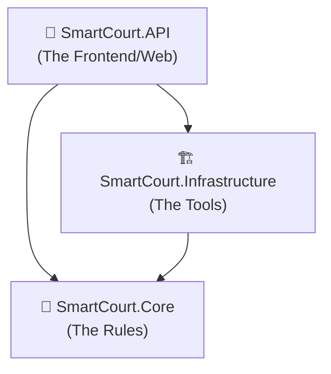

# SmartCourt Architecture Overview

The project uses a stripped-down version of **Clean Architecture**. This means we split the code into 3 separate projects (layers) so that changes in one area don't break code in another.

## Dependency Flow (The Golden Rule)
The golden rule of Clean Architecture is: **Dependencies always point inwards toward the Core.**

*Notice how NO arrows point away from Core? Core doesn't know the other projects exist!*

---

### 1. `🧠 SmartCourt.Core` (The Brain / The Rules)
This is the center of your application. It contains all the business rules and definitions.
* **What goes here:** Your database models (`User`, `Lawyer`, `TestEntity`), your Enums, and Interfaces.
* **What does it depend on?** **NOTHING**. It is completely independent. It doesn't know about databases, it doesn't know about the web, it just contains raw C# code.
* **Why?** If you decide to switch from SQL Server to PostgreSQL, or from a Web API to a Desktop App, the `Core` project never has to change.

### 2. `🏗️ SmartCourt.Infrastructure` (The Tools)
This project is responsible for communicating with the outside world.
* **What goes here:** Entity Framework (`ApplicationDbContext`), Database Migrations, Email Senders, external API integrations (like Stripe or Azure).
* **What does it depend on?** It depends on `Core`. It needs to know what a `TestEntity` is so it can map it to a SQL Server table.
* **Why?** All the messy, complicated third-party tools are quarantined here. The rest of the app doesn't care *how* data is saved to SQL Server, it just tells Infrastructure to do it.

### 3. `🚀 SmartCourt.API` (The Delivery Mechanism)
This is the entry point. It's the only project that is actually "run" by the server. 
* **What goes here:** `Controllers` (the endpoints the user calls), `Program.cs` (startup logic), `appsettings.json`, and Middlewares.
* **What does it depend on?** It depends on **everything** (`Core` and `Infrastructure`) because it has to wire them all together in `Program.cs`.
* **Why?** Its only job is to receive an HTTP request from a user, ask `Infrastructure` to get data from the database, apply the rules from `Core`, and return a JSON response.

---

### A Real-World Analogy
Imagine a Restaurant:
1. **Core** is the **Recipe Book**. It defines what a "Burger" is and what ingredients it needs. The recipe book doesn't care who cooks it or who eats it.
2. **Infrastructure** is the **Kitchen Staff**. They know how to take the recipe (from Core) and physically use the ovens, fryers, and third-party tools to build it.
3. **API** is the **Waitress**. She takes the order from the customer (HTTP Request), tells the kitchen (Infrastructure) to make it, and hands the final burger back to the customer (JSON Response).
