# Contract API Contract and Frontend Integration Guide

**Code snapshot analyzed:** 2026-08-12  
**Primary route prefix:** `/api/contracts`  
**Audience:** Web/mobile frontend developers integrating the Lawyer/Client contract lifecycle

> This guide describes the implementation in source code, including its current inconsistencies. It does not substitute intended product behavior for actual wire behavior.

## Wire-level conventions

| Concern | Actual behavior |
|---|---|
| Authentication | Every Contract endpoint is protected. Send `Authorization: Bearer <JWT>` or use the application's `accessToken` HttpOnly cookie. The cookie wins if both are present because the JWT handler explicitly reads it. |
| Content type | Send `Content-Type: application/json` for endpoints with a body. Success and middleware-handled errors are JSON. |
| JSON naming | Response and request examples use `camelCase`. ASP.NET Core binding is case-insensitive, but frontend code should use the documented casing. |
| Enum encoding | **Enum-valued JSON fields are numbers**, because MVC has no `JsonStringEnumConverter`. Query-string enum binding may accept a defined name such as `Active` or its numeric value; numeric values are safest against the current wire contract. The one exception is `ContractActionResultDto.status`, which is deliberately returned as a string such as `"Draft"`. |
| Dates | `DateTime` values serialize as ISO-8601 strings; stored timestamps are UTC and normally end in `Z`. Nullable dates are JSON `null` until the event occurs. |
| Money | `decimal` values are JSON numbers. Currency is fixed to `"EGP"`; do not submit currency or calculate authoritative totals client-side. |
| Nulls | Null response properties are not globally suppressed. Envelopes therefore normally include `message: null`, `errors: null`, and failed envelopes include `data: null`. |
| Error codes | There is **no machine-readable application error-code field**. HTTP status plus localized `message`/`errors` is the only implemented discriminator. Frontend logic must not depend on the Arabic prose when an HTTP status or current resource state can be used. |
| Rate limiting | Contract methods carry rate-limit metadata, but `app.UseRateLimiter()` is currently commented out. The documented 429 policy is therefore configured but not active in the current pipeline. |

### Standard success envelope

```json
{
  "success": true,
  "data": {},
  "message": null,
  "errors": null,
  "statusCode": 200
}
```

Creation uses `statusCode: 201`. The `data` shape is endpoint-specific.

### Middleware-handled error envelope

```json
{
  "success": false,
  "data": null,
  "message": "Localized or generic error message",
  "errors": null,
  "statusCode": 400
}
```

If the custom `ValidationException` is thrown, `errors` is an array of strings such as `"Title: ..."`. Contract FluentValidation normally runs through `[ApiController]` automatic model validation instead, producing the separate validation-problem shape below.

### Automatic binding/FluentValidation error shape

```json
{
  "type": "https://tools.ietf.org/html/rfc9110#section-15.5.1",
  "title": "One or more validation errors occurred.",
  "status": 400,
  "errors": {
    "Title": ["عنوان العقد مطلوب."],
    "TermsAndConditions": ["شروط وأحكام العقد مطلوبة."]
  },
  "traceId": "00-..."
}
```

This is not an `ApiResponse<T>`. Malformed JSON, missing non-nullable body data, invalid enum text, and route/model binding errors may also use framework-generated problem details or an empty framework response rather than the custom envelope.

### Global HTTP error behavior

| HTTP status | Source | Response behavior / meaning |
|---:|---|---|
| `400 Bad Request` | FluentValidation, binding, or `BusinessException` | Validation problem details for automatic validation; otherwise custom failed envelope. Used for malformed/absent `If-Match`, invalid state, and failed creation prerequisites. |
| `401 Unauthorized` | Authorization framework or `AuthenticationException` | Missing/invalid/expired token is normally a framework 401 and may have an empty body. A service-thrown authentication error uses the custom envelope. |
| `403 Forbidden` | Role policy or `ForbiddenAccessException` | Wrong controller role is normally a framework 403 and may have an empty body. Resource/participant denial uses the custom envelope. |
| `404 Not Found` | GUID route mismatch, absent route, or `NotFoundException` | A valid but absent contract uses the custom envelope `العقد غير موجود.`; a non-GUID path does not match the route and may return an empty/framework 404. |
| `409 Conflict` | Duplicate, stale rowversion, repeated signature, settlement conflict | Custom failed envelope. This implementation uses 409—not 412—for a well-formed but stale `If-Match`. |
| `412 Precondition Failed` | Supported by shared middleware only | No Contract service path currently throws `PreconditionFailedException`; do not expect 412 from these endpoints as implemented. |
| `429 Too Many Requests` | Configured limiter | Would return the custom failed envelope and possibly `Retry-After`, but rate-limit middleware is disabled in `Program.cs`. |
| `500 Internal Server Error` | Unhandled exception | Custom envelope with `message: "An internal server error occurred."`; implementation details are not exposed. |

---

## 1. Complete Endpoint Catalog

### Endpoint overview

| Method | Exact route | Allowed controller roles | Success | Request body | Concurrency |
|---|---|---|---:|---|---|
| `POST` | `/api/contracts` | Lawyer | `201` | `CreateContractRequest` | None |
| `GET` | `/api/contracts` | Client, Lawyer | `200` | None | None |
| `GET` | `/api/contracts/{contractId}` | Client, Lawyer, Moderator, SuperAdministrator | `200` | None | Returns `data.version` |
| `PUT` | `/api/contracts/{contractId}` | Lawyer | `200` | `UpdateContractRequest` | Required `If-Match` |
| `POST` | `/api/contracts/{contractId}/accept` | Client, Lawyer | `200` | None | Required `If-Match` |
| `POST` | `/api/contracts/{contractId}/terminate` | Client, Lawyer | `200` | `TerminateContractRequest` | Required `If-Match` |
| `GET` | `/api/contracts/{contractId}/state-history` | Client, Lawyer, Moderator, SuperAdministrator | `200` | None | None |

### 1.1 Create a contract

**HTTP Method & Exact Route:** `POST /api/contracts`

**Purpose:** The Lawyer creates one Draft contract from an already accepted proposal. The proposal supplies the case, Client, and Lawyer identities; the caller cannot override them.

**Request Structure (What they send)**

| Location | Name | Required | Type | Details |
|---|---|---:|---|---|
| Header/cookie | Authentication | Yes | JWT | Caller must have the `Lawyer` role and be the Lawyer on the accepted proposal. |
| Header | `Content-Type` | Yes | string | `application/json` |
| Header | `Idempotency-Key` | No / unsupported | — | This endpoint does not consume an idempotency header. |
| Body | `proposalId` | Yes | UUID string | Non-empty accepted proposal identifier. |
| Body | `title` | Yes | string | 3–200 characters. |
| Body | `termsAndConditions` | Yes | string | 20–20,000 characters. |

```json
{
  "proposalId": "11111111-1111-1111-1111-111111111111",
  "title": "Legal representation contract",
  "termsAndConditions": "The complete terms agreed by both parties..."
}
```

**Business preconditions**

- The proposal must exist and be accepted.
- The authenticated Lawyer must be the Lawyer attached to that proposal.
- The proposal must reference a case eligible for contracting, and its Client must match the case owner.
- Both users must exist, be `Active`, and have the Client/Lawyer roles appropriate to their side.
- No Contract may already exist for the proposal. A unique database constraint enforces this race-safely.
- A newly created Contract is `Draft` (`status: 0`), uses `currency: "EGP"`, and records a `ContractCreated` state-history entry.

**Response Structure (What they get): `201 Created`**

```json
{
  "success": true,
  "data": {
    "id": "22222222-2222-2222-2222-222222222222",
    "proposalId": "11111111-1111-1111-1111-111111111111",
    "legalCaseId": "33333333-3333-3333-3333-333333333333",
    "clientUserId": "44444444-4444-4444-4444-444444444444",
    "lawyerUserId": "55555555-5555-5555-5555-555555555555",
    "title": "Legal representation contract",
    "termsAndConditions": "The complete terms agreed by both parties...",
    "currency": "EGP",
    "status": 0,
    "acceptedByClientAt": null,
    "acceptedByLawyerAt": null,
    "activatedAt": null,
    "completedAt": null,
    "terminatedAt": null,
    "currentMilestoneTotal": 0,
    "version": "\"AAAAAAAAB9E=\"",
    "milestones": [],
    "payments": [],
    "permittedActions": ["Update", "Accept", "Terminate"]
  },
  "message": null,
  "errors": null,
  "statusCode": 201
}
```

**Endpoint-specific failures**

| Status | Condition | Implemented message / response |
|---:|---|---|
| `400` | Invalid request fields | Automatic validation problem; exact rules are in section 3. |
| `400` | Proposal absent/not accepted | `العرض غير موجود أو لم تتم الموافقة عليه.` |
| `400` | Caller is not proposal Lawyer | `محامي العرض المقبول فقط هو من يمكنه إنشاء العقد.` |
| `400` | Case ineligible | `القضية غير مؤهلة لإنشاء عقد.` |
| `400` | Proposal/case Client mismatch | `العرض المقبول لا يطابق مالك القضية المؤهلة.` |
| `400` | Client inactive/wrong role | `صاحب العرض غير مؤهل لإبرام العقد بصفته عميلاً.` |
| `400` | Lawyer inactive/wrong role | `محامي العرض غير مؤهل لإبرام العقد.` |
| `409` | Contract already exists for proposal | `تم إنشاء عقد لهذا العرض مسبقًا.` |
| `401` / `403` | Missing token / non-Lawyer role | Framework authorization response. |

### 1.2 List the current user's contracts

**HTTP Method & Exact Route:** `GET /api/contracts`

**Purpose:** Returns a page of contracts in which the authenticated user is the Client or Lawyer, optionally filtered by exact Contract status.

**Request Structure (What they send)**

| Location | Name | Required | Type | Default | Constraint / semantics |
|---|---|---:|---|---:|---|
| Header/cookie | Authentication | Yes | JWT | — | Controller permits only `Client` or `Lawyer`. |
| Query | `status` | No | `ContractStatus` | null | Any defined value `0`–`4`; filters by equality. |
| Query | `page` | No | int | `1` | Minimum 1. |
| Query | `pageSize` | No | int | `10` | 1–100 inclusive. |

Example: `GET /api/contracts?status=1&page=1&pageSize=20`

Results are ordered by internal `UpdatedAt` descending, then `Id` ascending. There is no client-selectable sorting.

**Response Structure (What they get): `200 OK`**

```json
{
  "success": true,
  "data": {
    "items": [
      {
        "id": "22222222-2222-2222-2222-222222222222",
        "legalCaseId": "33333333-3333-3333-3333-333333333333",
        "clientUserId": "44444444-4444-4444-4444-444444444444",
        "lawyerUserId": "55555555-5555-5555-5555-555555555555",
        "title": "Legal representation contract",
        "currency": "EGP",
        "status": 1,
        "activatedAt": "2026-08-12T10:00:00Z",
        "completedAt": null
      }
    ],
    "page": 1,
    "pageSize": 20,
    "totalCount": 1,
    "hasNextPage": false
  },
  "message": null,
  "errors": null,
  "statusCode": 200
}
```

**Endpoint-specific failures**

| Status | Condition | Response |
|---:|---|---|
| `400` | `page < 1`, `pageSize` outside 1–100, or a bound but undefined status | Automatic validation problem. Invalid status text may fail model binding before the validator. |
| `401` / `403` | Missing token / role other than Client or Lawyer | Framework authorization response. |

> The query service contains moderator-wide listing logic, but the controller excludes Moderator and SuperAdministrator. That path is unreachable through this endpoint.

### 1.3 Get Contract detail

**HTTP Method & Exact Route:** `GET /api/contracts/{contractId}`

**Purpose:** Returns the full Contract snapshot, derived milestone total, embedded milestones, escrow-hold payment summaries, concurrency version, and UI action hints.

**Request Structure (What they send)**

| Location | Name | Required | Type | Details |
|---|---|---:|---|---|
| Header/cookie | Authentication | Yes | JWT | Client/Lawyer participants, or eligible Moderator/SuperAdministrator. |
| Route | `contractId` | Yes | UUID string | Must match the ASP.NET `guid` route constraint. |

No query parameters or body are accepted.

**Response Structure (What they get): `200 OK`**

The `data` object is exactly `ContractDetailDto` shown in section 2. See the Create example for its top-level shape and the nested DTO dictionaries for milestone/payment objects.

**Authorization:** A Client/Lawyer can read only a Contract on which their user ID is a party. A Moderator/SuperAdministrator can read any Contract only if the database eligibility lookup confirms that role. FinanceAdministrator is not allowed.

**Endpoint-specific failures**

| Status | Condition | Implemented response |
|---:|---|---|
| `403` | Role allowed by controller but user is neither participant nor eligible moderator/admin | `غير مصرح لك بالاطلاع على هذا العقد.` |
| `404` | Valid UUID but Contract absent | `العقد غير موجود.` |
| `404` | `contractId` is not a GUID | Route does not match; framework 404. |

> Copy `data.version` exactly—including its quote characters—for the next Contract mutation's `If-Match` header. No actual HTTP `ETag` response header is set.

### 1.4 Update a Draft Contract

**HTTP Method & Exact Route:** `PUT /api/contracts/{contractId}`

**Purpose:** Replaces the Draft title and terms. Only the Contract Lawyer can update it.

**Request Structure (What they send)**

| Location | Name | Required | Type | Details |
|---|---|---:|---|---|
| Header/cookie | Authentication | Yes | JWT | Must have Lawyer role and be this Contract's Lawyer. |
| Header | `If-Match` | **Yes** | string | Strong quoted Base64 rowversion copied from `ContractDetailDto.version`; weak tags and `*` are rejected. |
| Header | `Content-Type` | Yes | string | `application/json` |
| Route | `contractId` | Yes | UUID string | Target Contract. |
| Body | `title` | Yes | string | Complete replacement; 3–200 characters. |
| Body | `termsAndConditions` | Yes | string | Complete replacement; 20–20,000 characters. |

```http
If-Match: "AAAAAAAAB9E="
```

```json
{
  "title": "Revised legal representation contract",
  "termsAndConditions": "The complete revised terms agreed by both parties..."
}
```

**Critical side effect:** Every successful edit clears both `acceptedByClientAt` and `acceptedByLawyerAt`. Both parties must accept the new version again.

**Response Structure (What they get): `200 OK`**

Returns `ApiResponse<ContractDetailDto>` with a new `data.version` and updated action hints.

**Endpoint-specific failures**

| Status | Condition | Implemented message / response |
|---:|---|---|
| `400` | Body validation failure | Automatic validation problem. |
| `400` | Missing/malformed/weak/wildcard `If-Match` | Validator message: `قيمة If-Match مطلوبة.` and/or `قيمة If-Match يجب أن تكون وسم ETag قويًا يحتوي على rowversion مشفّر بصيغة base64 بين علامتي اقتباس.` in the custom failed envelope, because the controller manually invokes this validator as a `BusinessException`. |
| `400` | Contract not Draft | `لا يمكن تعديل العقد إلا عندما يكون في حالة مسودة.` |
| `403` | Authenticated Lawyer is not Contract Lawyer | `محامي العقد فقط هو من يمكنه تعديل المسودة.` |
| `409` | Well-formed but stale rowversion / database race | `تم تعديل العقد بواسطة عملية أخرى. يرجى إعادة تحميله والمحاولة مرة أخرى.` |
| `404` | Contract absent | `العقد غير موجود.` |

### 1.5 Accept the current Contract version

**HTTP Method & Exact Route:** `POST /api/contracts/{contractId}/accept`

**Purpose:** Records acceptance by the calling Client or Lawyer. This is acceptance/signature of the **current Draft version**, not a generic status update.

**Request Structure (What they send)**

| Location | Name | Required | Type | Details |
|---|---|---:|---|---|
| Header/cookie | Authentication | Yes | JWT | Caller must have Client/Lawyer role and be a Contract party. |
| Header | `If-Match` | **Yes** | string | Strong quoted Base64 Contract version. |
| Route | `contractId` | Yes | UUID string | Target Contract. |
| Body | — | No | — | Send no body. `{}` is harmless but not required. |

There is **no required order**: Lawyer may accept before Client or Client before Lawyer.

Activation occurs when all of the following are true:

- Contract is still Draft.
- Both `acceptedByClientAt` and `acceptedByLawyerAt` are set.
- At least one milestone has `amount > 0`, has been accepted by both parties, and is not Cancelled.

If both Contract signatures exist but the milestone condition is not yet satisfied, the response remains `Draft`. Milestone approval later emits an asynchronous activation request, so the frontend should refresh or consume notifications.

**Response Structure (What they get): `200 OK`**

```json
{
  "success": true,
  "data": {
    "entityId": "22222222-2222-2222-2222-222222222222",
    "status": "Draft",
    "occurredAt": "2026-08-12T10:05:00Z"
  },
  "message": null,
  "errors": null,
  "statusCode": 200
}
```

On the acceptance that satisfies every activation condition, `status` is `"Active"`.

> This response does **not** contain the new rowversion. After one party accepts, the other party must call `GET /api/contracts/{contractId}` and use the refreshed `data.version`; reusing the first party's version produces 409.

**Endpoint-specific failures**

| Status | Condition | Implemented message / response |
|---:|---|---|
| `400` | Missing/malformed `If-Match` | Same manual `If-Match` validation as Update. |
| `400` | Contract not Draft | `لا يمكن قبول العقد إلا عندما يكون في حالة مسودة.` |
| `403` | Role is Client/Lawyer but caller is not a party | `هذا الإجراء متاح لطرفي العقد فقط.` |
| `409` | Caller already accepted this version | Client: `قام العميل بقبول النسخة الحالية من العقد مسبقًا.` Lawyer: `قام المحامي بقبول النسخة الحالية من العقد مسبقًا.` |
| `409` | Stale rowversion | `تم تعديل العقد بواسطة عملية أخرى. يرجى إعادة تحميله والمحاولة مرة أخرى.` |
| `404` | Contract absent | `العقد غير موجود.` |

### 1.6 Terminate a Contract

**HTTP Method & Exact Route:** `POST /api/contracts/{contractId}/terminate`

**Purpose:** A Contract party requests termination. The service records the request, settles financial state, cancels future Draft/AwaitingFunding milestones, and then moves the Contract to Terminated. Active financial work can delay or block finalization.

**Request Structure (What they send)**

| Location | Name | Required | Type | Details |
|---|---|---:|---|---|
| Header/cookie | Authentication | Yes | JWT | Caller must be Client or Lawyer and a Contract party. |
| Header | `If-Match` | **Yes** | string | Strong quoted Base64 Contract version. |
| Header | `Content-Type` | Yes | string | `application/json` |
| Route | `contractId` | Yes | UUID string | Target Contract. |
| Body | `reason` | Yes | string | Non-empty, maximum 2,000 characters; no configured minimum beyond non-empty. |

```json
{
  "reason": "The parties mutually agreed to terminate the engagement."
}
```

The endpoint permits Draft, Active, and—at service level—SuspendedByDispute contracts. Completed and already Terminated contracts are rejected. This is a unilateral API action; no counterparty confirmation endpoint exists.

**Response Structure (What they get): `200 OK`**

Returns `ApiResponse<ContractDetailDto>` with `status: 4`, non-null `terminatedAt`, a new `version`, and no permitted Contract actions.

**Endpoint-specific failures**

| Status | Condition | Implemented message / response |
|---:|---|---|
| `400` | Invalid reason | Automatic validation problem. |
| `400` | Missing/malformed `If-Match` | Same manual `If-Match` validation as Update. |
| `400` | Completed/already Terminated | `لا يمكن إنهاء عقد مكتمل أو منتهٍ.` |
| `400` | Settlement service unavailable | `خدمة التسوية المالية اللازمة لإنهاء العقد غير متاحة.` |
| `400` | Financial invariants invalid | May expose settlement messages such as `تعذر رد تمويل المرحلة لأن أرصدة الضمان أو المحفظة غير متطابقة.` or `رصيد حساب الضمان لا يكفي لرد تمويل المرحلة.` |
| `403` | Caller is not a party | `هذا الإجراء متاح لطرفي العقد فقط.` |
| `409` | Stale rowversion | Standard concurrent-modification message. |
| `409` | Different actor/reason while earlier request is settling | `يوجد طلب سابق لإنهاء العقد قيد التسوية المالية.` |
| `409` | Settlement recorded but not yet completed | `تم تسجيل طلب إنهاء العقد، وتستمر محاولة إتمام التسوية المالية تلقائيًا.` |
| `409` | Active milestone prevents final termination | `لا يمكن إنهاء العقد قبل تسوية جميع المراحل النشطة.` Active blockers are FundingProcessing, FundedInProgress, Submitted, AcceptedHold, or Disputed. |
| `404` | Contract absent | `العقد غير موجود.` |

> A 409 after the termination request can mean the request **was persisted** and background recovery continues. Refresh the Contract and notifications before presenting the action as wholly failed. There is no frontend-visible `TerminationPending` status or operation resource.

### 1.7 Get Contract state history

**HTTP Method & Exact Route:** `GET /api/contracts/{contractId}/state-history`

**Purpose:** Returns the auditable Contract status-transition history, newest first.

**Request Structure (What they send)**

| Location | Name | Required | Type | Default | Constraint |
|---|---|---:|---|---:|---|
| Header/cookie | Authentication | Yes | JWT | Participant or eligible Moderator/SuperAdministrator. |
| Route | `contractId` | Yes | UUID string | Target Contract. |
| Query | `page` | No | int | `1` | Minimum 1. |
| Query | `pageSize` | No | int | `100` | 1–100 inclusive. |

**Response Structure (What they get): `200 OK`**

```json
{
  "success": true,
  "data": {
    "items": [
      {
        "id": "66666666-6666-6666-6666-666666666666",
        "previousStatus": 0,
        "newStatus": 1,
        "trigger": "ContractActivated",
        "actorUserId": "44444444-4444-4444-4444-444444444444",
        "reason": "وافق طرفا العقد على نسخة تتضمن مرحلة معتمدة ومسعّرة.",
        "createdAt": "2026-08-12T10:05:00Z"
      },
      {
        "id": "77777777-7777-7777-7777-777777777777",
        "previousStatus": null,
        "newStatus": 0,
        "trigger": "ContractCreated",
        "actorUserId": "55555555-5555-5555-5555-555555555555",
        "reason": "تم إنشاء مسودة العقد من العرض المقبول.",
        "createdAt": "2026-08-12T09:00:00Z"
      }
    ],
    "page": 1,
    "pageSize": 100,
    "totalCount": 2,
    "hasNextPage": false
  },
  "message": null,
  "errors": null,
  "statusCode": 200
}
```

State-changing triggers currently visible here include `ContractCreated`, `ContractActivated`, `ContractCompleted`, `ContractTerminated`, `DisputeOpened`, and `DisputeResolved`. Draft edits, individual Contract acceptances, and termination requests generate notifications/outbox events but not state-history rows because status did not yet change.

**Endpoint-specific failures:** same authorization/not-found behavior as Get detail, plus 400 automatic validation for invalid pagination.

---

## 2. Exhaustive DTO & Field Dictionary

### 2.1 Request DTOs

#### `CreateContractRequest`

| Field name | Data type | Required | Description / mechanics |
|---|---|---:|---|
| `proposalId` | UUID string (`Guid`) | Yes | Accepted proposal from which case and participant identities are derived. Non-empty. |
| `title` | string | Yes | User-facing Contract title; 3–200 characters. |
| `termsAndConditions` | string | Yes | Full Contract terms; 20–20,000 characters. |

#### `UpdateContractRequest`

| Field name | Data type | Required | Description / mechanics |
|---|---|---:|---|
| `title` | string | Yes | Complete replacement title; 3–200 characters. |
| `termsAndConditions` | string | Yes | Complete replacement terms; 20–20,000 characters. Successful update resets both Contract acceptances. |

#### `TerminateContractRequest`

| Field name | Data type | Required | Description / mechanics |
|---|---|---:|---|
| `reason` | string | Yes | Human explanation stored internally and written to the final termination history entry; non-empty and at most 2,000 characters. It is **not included in `ContractDetailDto`**. |

### 2.2 Query DTOs

#### `ContractListQuery`

| Field name | Data type | Required | Default | Description |
|---|---|---:|---:|---|
| `status` | nullable `ContractStatus` | No | null | Exact status filter. All values are listed below. |
| `page` | int | No | 1 | One-based page number; minimum 1. |
| `pageSize` | int | No | 10 | Items requested; 1–100. |

#### `ContractStateHistoryQuery`

| Field name | Data type | Required | Default | Description |
|---|---|---:|---:|---|
| `page` | int | No | 1 | One-based page number; minimum 1. |
| `pageSize` | int | No | 100 | History rows requested; 1–100. |

### 2.3 Response envelope and paging DTOs

#### `ApiResponse<T>`

| Field name | Data type | Nullable | Description |
|---|---|---:|---|
| `success` | boolean | No | `true` for controller success envelopes; `false` for middleware failures. |
| `data` | `T` | Yes | Endpoint payload. Null on failure. |
| `message` | string | Yes | Optional success/error prose. Contract successes do not set it. |
| `errors` | array of string | Yes | Populated only by some custom validation exceptions; automatic validation uses a dictionary in ProblemDetails instead. |
| `statusCode` | int | No | HTTP status copied into the body. |

#### `PagedResult<T>`

| Field name | Data type | Description |
|---|---|---|
| `items` | array of `T` | Current page; never intentionally null. |
| `page` | int | Echoed one-based page requested. May exceed available pages and then return an empty `items`. |
| `pageSize` | int | Echoed requested size. |
| `totalCount` | int | Count after access scoping and filtering, before pagination. |
| `hasNextPage` | boolean | `page * pageSize < totalCount`. There is no `totalPages`, `hasPreviousPage`, or continuation token. |

### 2.4 Contract response DTOs

#### `ContractSummaryDto`

| Field name | Data type | Nullable | Description |
|---|---|---:|---|
| `id` | UUID string | No | Contract identifier. |
| `legalCaseId` | UUID string | No | Associated case identifier. |
| `clientUserId` | UUID string | No | Contract Client user. |
| `lawyerUserId` | UUID string | No | Contract Lawyer user. |
| `title` | string | No | Contract title. |
| `currency` | string | No | Always `EGP` under entity/database constraints. |
| `status` | `ContractStatus` (JSON int) | No | Current lifecycle state. |
| `activatedAt` | ISO-8601 UTC string | Yes | When Contract entered Active. |
| `completedAt` | ISO-8601 UTC string | Yes | When Contract completed. Terminated summaries do not expose `terminatedAt`. |

#### `ContractDetailDto`

| Field name | Data type | Nullable | Description / frontend use |
|---|---|---:|---|
| `id` | UUID string | No | Contract identifier. |
| `proposalId` | UUID string | No | Source accepted proposal. |
| `legalCaseId` | UUID string | No | Associated legal case. |
| `clientUserId` | UUID string | No | Client party. |
| `lawyerUserId` | UUID string | No | Lawyer party. |
| `title` | string | No | Current title. |
| `termsAndConditions` | string | No | Current full terms. Treat as untrusted user text; frontend must escape it rather than rendering raw HTML. |
| `currency` | string | No | `EGP`. |
| `status` | `ContractStatus` (JSON int) | No | Current Contract lifecycle state. |
| `acceptedByClientAt` | ISO-8601 UTC string | Yes | Client acceptance time for the current Draft version; cleared by a Draft edit. |
| `acceptedByLawyerAt` | ISO-8601 UTC string | Yes | Lawyer acceptance time for the current Draft version; cleared by a Draft edit. |
| `activatedAt` | ISO-8601 UTC string | Yes | Initial activation time. |
| `completedAt` | ISO-8601 UTC string | Yes | Completion time. |
| `terminatedAt` | ISO-8601 UTC string | Yes | Final termination time. There is no public termination-requested timestamp. |
| `currentMilestoneTotal` | decimal JSON number | No | Server-derived sum of positive, mutually accepted, non-Cancelled milestones. This is not a writable Contract amount. |
| `version` | string | No | **Optimistic concurrency token:** strong ETag text containing Base64 rowversion, including surrounding quote characters. Send verbatim as `If-Match`. |
| `milestones` | array of `ContractMilestoneDto` | No | All Contract milestones, ordered by `orderNumber`. |
| `payments` | array of `ContractPaymentDto` | No | Escrow holds for milestones, ordered by milestone order. Not all provider payment transactions. |
| `permittedActions` | array of string | No | UI hints currently using `Update`, `Accept`, `Terminate`. Do not treat as authorization truth; known inconsistencies are documented in section 5. |

#### `ContractMilestoneDto`

| Field name | Data type | Nullable | Description / enum |
|---|---|---:|---|
| `id` | UUID string | No | Milestone identifier used by Milestone/Payment APIs. |
| `orderNumber` | int | No | Display/execution order. |
| `title` | string | No | Milestone title. |
| `description` | string | Yes | Optional details. |
| `amount` | decimal JSON number | No | Gross agreed milestone amount in Contract currency. |
| `durationDays` | int | Yes | Planned duration in days. |
| `dueDate` | ISO-8601 UTC string | Yes | Scheduled due date. |
| `status` | `MilestoneStatus` (JSON int) | No | Detailed lifecycle; all values below. |
| `fundingStatus` | `MilestoneFundingStatus` (JSON int) | No | Derived funding summary; all values below. |
| `escrowHoldId` | UUID string | Yes | Associated escrow hold when created. |
| `fundedAt` | ISO-8601 UTC string | Yes | Successful funding time. |
| `submittedAt` | ISO-8601 UTC string | Yes | Lawyer work-submission time. |
| `autoAcceptEligibleAt` | ISO-8601 UTC string | Yes | Earliest automatic acceptance eligibility time. |
| `holdExpiresAt` | ISO-8601 UTC string | Yes | End of escrow hold/dispute window. |
| `netLawyerAmount` | decimal JSON number | Yes | Escrow hold net amount payable to Lawyer after platform fee. |
| `version` | string | No | Separate strong quoted Base64 **milestone** rowversion for Milestone mutations; do not use it as the Contract `If-Match`. |

#### `ContractPaymentDto`

| Field name | Data type | Nullable | Description / enum |
|---|---|---:|---|
| `id` | UUID string | No | Escrow hold ID (despite the DTO name `Payment`). |
| `milestoneId` | UUID string | No | Related milestone. |
| `grossAmount` | decimal JSON number | No | Amount funded by Client into escrow. |
| `platformFee` | decimal JSON number | No | Platform fee amount. |
| `netAmount` | decimal JSON number | No | Amount attributable to Lawyer after fee. |
| `currency` | string | No | Hard-coded `EGP` in mapping. |
| `status` | `EscrowHoldStatus` (JSON int) | No | Hold settlement state; all values below. |
| `holdExpiresAt` | ISO-8601 UTC string | Yes | Time the hold window expires. |
| `settledAt` | ISO-8601 UTC string | Yes | Release/refund settlement time. |

#### `ContractStateHistoryDto`

| Field name | Data type | Nullable | Description |
|---|---|---:|---|
| `id` | UUID string | No | History entry identifier. |
| `previousStatus` | nullable `ContractStatus` (JSON int) | Yes | Null only for initial creation; otherwise state before transition. |
| `newStatus` | `ContractStatus` (JSON int) | No | State after transition. |
| `trigger` | string | No | Domain event name, max persisted length 100. Known Contract-state triggers are listed under endpoint 1.7. |
| `actorUserId` | UUID string | Yes | User responsible, if a user context exists; automated work can make it null. |
| `reason` | string | Yes | Human-readable transition explanation, persisted up to 2,000 characters. |
| `createdAt` | ISO-8601 UTC string | No | UTC transition timestamp. |

#### `ContractActionResultDto`

| Field name | Data type | Description |
|---|---|---|
| `entityId` | UUID string | Contract ID. Note the generic name, not `contractId`. |
| `status` | string | Enum name as text: `Draft`, `Active`, `SuspendedByDispute`, `Completed`, or `Terminated`. This differs from numeric status fields elsewhere. |
| `occurredAt` | ISO-8601 UTC string | Time the accept/evaluation call was processed; it is populated even if no state transition occurred. |

#### `ContractSettlementSummaryDto` (defined but not returned by a Contract endpoint)

| Field name | Data type | Description |
|---|---|---|
| `contractId` | UUID string | Contract settled. |
| `currency` | string | Settlement currency. |
| `grossAmount` | decimal JSON number | Aggregate gross amount. |
| `clientRefundAmount` | decimal JSON number | Total returned to Client. |
| `lawyerReleaseAmount` | decimal JSON number | Total released to Lawyer. |
| `platformFeeAmount` | decimal JSON number | Total platform fee. |

No current Contract controller action exposes this DTO. Frontend code should not expect it from `/terminate`.

### 2.5 Complete enum dictionary

#### `ContractStatus`

| JSON value | Enum name | Meaning |
|---:|---|---|
| `0` | `Draft` | Editable/pre-activation Contract. Parties accept this version; edits clear acceptances. |
| `1` | `Active` | Both Contract parties and at least one priced milestone have accepted; work/funding can proceed. |
| `2` | `SuspendedByDispute` | A qualifying milestone dispute has frozen Contract execution pending resolution. |
| `3` | `Completed` | Approved milestones are all Released/Refunded/Cancelled and there is no active dispute, processing provider attempt, unsettled hold, or termination request. Terminal. |
| `4` | `Terminated` | Termination settlement completed and future milestones were cancelled. Terminal. |

#### `MilestoneStatus`

| JSON value | Enum name | Meaning |
|---:|---|---|
| `0` | `Draft` | Milestone terms are being drafted/approved. |
| `1` | `AwaitingFunding` | Mutually approved and ready for Client funding. |
| `2` | `FundingProcessing` | Payment provider funding attempt is in progress. |
| `3` | `FundedInProgress` | Escrow funded; Lawyer work is in progress. |
| `4` | `Submitted` | Lawyer submitted work for Client review. |
| `5` | `AcceptedHold` | Work accepted; funds remain in the hold/dispute window. |
| `6` | `Disputed` | Milestone is under formal dispute. |
| `7` | `Released` | Escrow funds released to Lawyer. Terminal for that milestone. |
| `8` | `Refunded` | Escrow funds refunded to Client. Terminal for that milestone. |
| `9` | `Cancelled` | Milestone cancelled. Terminal for that milestone. |

#### `MilestoneFundingStatus`

| JSON value | Enum name | Meaning |
|---:|---|---|
| `0` | `Unfunded` | No escrow hold/funding yet. |
| `1` | `Processing` | Milestone is in `FundingProcessing`. |
| `2` | `Funded` | An escrow hold exists and has not settled. |
| `3` | `Settled` | Milestone/hold was released or refunded. |

#### `EscrowHoldStatus`

| JSON value | Enum name | Meaning |
|---:|---|---|
| `0` | `Funded` | Money is held in escrow. |
| `1` | `Frozen` | Escrow is frozen by a dispute. |
| `2` | `Released` | Money settled to Lawyer. |
| `3` | `Refunded` | Money settled back to Client. |

### 2.6 Advanced API mechanics

#### Optimistic concurrency

| Operation | Token source | Required header | Failure behavior |
|---|---|---|---|
| Update Contract | `GET/create/update/terminate` response `data.version` | `If-Match: "<Base64>"` | Malformed/missing → 400; valid but stale → 409. |
| Accept Contract | Detail `data.version` | Same | Successful accept changes rowversion but returns no replacement token; re-fetch detail. |
| Terminate Contract | Detail `data.version` | Same | Same; a conflict may still have persisted a pending termination request. |
| Milestone mutations | Embedded milestone `version` | Adjacent Milestone endpoints use their own token | Never confuse milestone and Contract versions. |

The API requires a **strong** ETag-shaped value: quoted Base64, not `W/"..."`, not bare Base64, and not `*`. `UpdatedAt` is internal and absent from DTOs; it is not a concurrency token.

#### Idempotency

| Contract operation | `Idempotency-Key` support | Retry semantics |
|---|---|---|
| Create | None | Retrying after success returns 409 duplicate proposal. Resolve by listing/fetching rather than blindly retrying. |
| Update | None | Protected by rowversion; retry with stale version returns 409. |
| Accept | None | Not idempotent: repeating the same party's acceptance returns 409. |
| Terminate | None | Contains internal recovery behavior, but has no client idempotency key. A pending request can survive a 409 and be retried in background. |

Adjacent payment actions such as `POST /api/milestones/{milestoneId}/fund` use `Idempotency-Key`, but **no `/api/contracts` action consumes it**.

### 2.7 Contract-slice entities not exposed as DTOs

These persistence fields matter for gap analysis but are not writable/readable through the Contract controller.

| Entity | Fields | Frontend exposure |
|---|---|---|
| `Contract` | `Id`, `ProposalId`, `LegalCaseId`, `ClientUserId`, `LawyerUserId`, `Title`, `TermsAndConditions`, `Currency`, `Status`, acceptance/activation/completion/termination timestamps, `TerminationReason`, `TerminatedByUserId`, `RowVersion`, `CreatedAt`, `UpdatedAt` | Detail exposes most business fields, but not termination reason/requester, created/updated timestamps, or raw rowversion. |
| `ContractAttachment` | `Id`, `ContractId`, `StoredFileId`, `UploadedByUserId`, `CreatedAt` | No Contract attachment CRUD/list DTO or controller endpoint exists. |
| `ContractStateHistory` | Detail DTO fields plus internal `ContractId` and `CorrelationId` | History API omits `contractId` (implied by route) and `correlationId`. |
| `ContractFileAccessAudit` | `Id`, `ActorUserId`, `StoredFileId`, `Purpose`, `RelatedEntityId`, `ModeratorAccess`, `AccessedAt` | Internal only; no frontend audit endpoint. Purpose values are ContractAttachment=1, MilestoneSubmission=2, DisputeEvidence=3. |

---

## 3. Validation Rules Summary

### 3.1 Exact field and query validation

| DTO / input | Field | Required | Exact rule | Validator message |
|---|---|---:|---|---|
| `CreateContractRequest` | `proposalId` | Yes | Non-empty GUID | `معرّف العرض مطلوب.` |
| `CreateContractRequest` | `title` | Yes | Not empty; length 3–200 inclusive | `عنوان العقد مطلوب.` / `عنوان العقد يجب أن يكون بين 3 و200 حرف.` |
| `CreateContractRequest` | `termsAndConditions` | Yes | Not empty; length 20–20,000 inclusive | `شروط وأحكام العقد مطلوبة.` / `شروط وأحكام العقد يجب أن تكون بين 20 و20000 حرف.` |
| `UpdateContractRequest` | `title` | Yes | Not empty; length 3–200 inclusive | Same title messages. |
| `UpdateContractRequest` | `termsAndConditions` | Yes | Not empty; length 20–20,000 inclusive | Same terms messages. |
| `TerminateContractRequest` | `reason` | Yes | Not empty; maximum 2,000; no separate minimum | `سبب إنهاء العقد مطلوب.` / `سبب إنهاء العقد يجب ألا يتجاوز 2000 حرف.` |
| `ContractListQuery` | `status` | No | Null or `Enum.IsDefined(ContractStatus)` | `حالة العقد المحددة غير صالحة.` |
| `ContractListQuery` | `page` | No | Integer ≥ 1; default 1 | `رقم الصفحة يجب أن يكون 1 أو أكبر.` |
| `ContractListQuery` | `pageSize` | No | Integer 1–100 inclusive; default 10 | `حجم الصفحة يجب أن يكون بين 1 و100.` |
| `ContractStateHistoryQuery` | `page` | No | Integer ≥ 1; default 1 | Same page message. |
| `ContractStateHistoryQuery` | `pageSize` | No | Integer 1–100 inclusive; default 100 | Same size message. |
| `IfMatchRequest` | `If-Match` | Yes on mutation endpoints | Non-empty strong quoted Base64 decoding to ≥1 byte; weak ETags and wildcard rejected | Messages documented under Update. |

### 3.2 Cross-property and domain validation

| Rule | Where enforced | Frontend behavior to mirror |
|---|---|---|
| Only accepted proposal Lawyer may create | Creation dependency gate | Show Create only to accepted proposal Lawyer. |
| Exactly one Contract per proposal | Service check + unique DB index | Disable duplicate Create; handle 409 races. |
| Case and proposal Client must match | Creation dependency gate | Treat proposal/case mismatch as non-recoverable without backend data correction. |
| Both parties must be active and correctly role-qualified | Creation dependency gate | Do not assume accepted proposal alone guarantees creation. |
| Draft is the only editable/acceptable state | Service | Disable update/accept outside status 0. |
| Update invalidates **both** Contract acceptances | Service | Warn user before edit; reset signature UI after success. |
| Only Lawyer can update Draft | Controller + service | Never show editable terms to Client based only on `permittedActions`. |
| Either party may accept first | Service | There is no “Lawyer cannot sign before Client” rule. |
| A party may accept once per version | Service | Disable that party's Accept when its acceptance timestamp is non-null. |
| Activation requires both Contract acceptances **and** ≥1 positive, mutually accepted, non-Cancelled milestone | Service/evaluator | Do not promise Active immediately merely because both Contract signatures exist. |
| Completion requires at least one approved milestone; all approved milestones final; no termination request, active dispute, processing payment attempt, or Funded/Frozen hold | Completion evaluator | Completion is automatic/system-driven; no public Complete endpoint exists. |
| Termination forbidden after Completed or Terminated | Service | Hide/disable Terminate for terminal states. |
| Active milestone settlement can block termination | Service/settlement | Treat 409 as a potentially pending workflow, refresh status/notifications. |

### 3.3 Important validation non-rules

- No regex applies to title, terms, or reason.
- Strings are not explicitly trimmed or normalized. Whitespace-only values fail FluentValidation `NotEmpty`, but surrounding spaces count toward length.
- No HTML/script sanitization occurs at Contract validation; escape all displayed user text.
- No Contract start date/end date fields exist, so no date cross-validation exists.
- Currency, status, Client/Lawyer IDs, total, acceptance flags, and versions are not accepted in request bodies.
- Unknown JSON properties are ignored by default rather than rejected.
- Contract route IDs have no explicit FluentValidator; the `guid` route constraint rejects non-GUID strings, while `Guid.Empty` reaches the service and may produce a business/not-found response depending on operation.

---

## 4. Contract Lifecycle Diagrams

### 4.1 State machine diagram

```mermaid
stateDiagram-v2
    [*] --> Draft: Lawyer creates from accepted proposal\nContractCreated

    state Draft {
        [*] --> AwaitingAcceptances
        AwaitingAcceptances --> AwaitingAcceptances: Lawyer updates terms\nclears both acceptances
        AwaitingAcceptances --> PartiallyAccepted: Either party accepts current version
        PartiallyAccepted --> AwaitingAcceptances: Lawyer updates terms\nclears both acceptances
        PartiallyAccepted --> ReadyToActivate: Other party accepts
        ReadyToActivate --> ReadyToActivate: Wait for positive mutually-approved milestone
    }

    Draft --> Active: Both Contract acceptances +\npositive mutually-approved milestone\nContractActivated
    Draft --> Terminated: Either party terminates + settlement succeeds\nContractTerminated

    Active --> SuspendedByDispute: Qualifying AcceptedHold milestone disputed\nDisputeOpened
    SuspendedByDispute --> Active: Dispute financial resolution completes\nDisputeResolved

    Active --> Completed: All approved milestones settled/final +\nno dispute, processing payment, hold, or termination request\nContractCompleted
    SuspendedByDispute --> Completed: Transition allowed by guard;\ncompletion prerequisites must also be clear

    Active --> Terminated: Either party terminates + settlement succeeds
    SuspendedByDispute --> Terminated: Either party terminates + settlement succeeds

    Completed --> [*]
    Terminated --> [*]
```



The persisted enum does not distinguish “awaiting Client signature,” “awaiting Lawyer signature,” or “termination pending”; those are substates inferred from timestamps/internal fields while `status` remains Draft or the previous nonterminal state.

### 4.2 Actor interaction sequence diagram

This sequence includes adjacent Milestone and Payment endpoints only where they are required to explain the real Contract lifecycle. Their detailed DTO contracts belong to their own slices.

```mermaid
sequenceDiagram
    autonumber
    actor Client
    participant API as Smart Court API
    actor Lawyer
    participant Jobs as Outbox / background jobs

    Note over Client,Lawyer: Prerequisite: Client proposal exists and Lawyer has accepted it
    Lawyer->>API: POST /api/contracts\n{proposalId, title, termsAndConditions}
    API-->>Lawyer: 201 ContractDetail (Draft, version)
    API-->>Client: In-app/SignalR notification: contract.created

    opt Lawyer revises the Draft
        Lawyer->>API: PUT /api/contracts/{id}\nIf-Match: current Contract version
        API-->>Lawyer: 200 ContractDetail (new version)
        API-->>Client: Notification: contract.draft-updated
    end

    Lawyer->>API: POST /api/contracts/{id}/milestones\nAdd priced milestone
    API-->>Lawyer: 201 Milestone
    Lawyer->>API: POST /api/milestones/{milestoneId}/approve\nIf-Match: milestone version
    API-->>Lawyer: 200 Milestone (new milestone version)
    Client->>API: GET /api/contracts/{id}
    API-->>Client: 200 ContractDetail with milestone version
    Client->>API: POST /api/milestones/{milestoneId}/approve\nIf-Match: milestone version
    API-->>Client: 200 Milestone

    Lawyer->>API: GET /api/contracts/{id}
    API-->>Lawyer: 200 ContractDetail (Contract version)
    Lawyer->>API: POST /api/contracts/{id}/accept\nIf-Match: Contract version
    API-->>Lawyer: 200 ActionResult (usually Draft; no new version)
    API-->>Client: Notification: contract.acceptance-recorded

    Client->>API: GET /api/contracts/{id}\nRefresh after Lawyer acceptance
    API-->>Client: 200 ContractDetail (fresh Contract version)
    Client->>API: POST /api/contracts/{id}/accept\nIf-Match: fresh Contract version
    API-->>Client: 200 ActionResult (Active if milestone prerequisite met)
    API-->>Client: Notification: contract.activated
    API-->>Lawyer: Notification: contract.activated

    Lawyer->>API: POST /api/milestones/{milestoneId}/ready-for-funding
    Client->>API: POST /api/milestones/{milestoneId}/fund\nIdempotency-Key: unique payment key
    API-->>Client: Funding operation
    Lawyer->>API: POST /api/milestones/{milestoneId}/submit
    Client->>API: POST /api/milestones/{milestoneId}/accept
    Jobs->>API: Release/settle escrow and evaluate completion
    API-->>Client: Notification: contract.completed
    API-->>Lawyer: Notification: contract.completed

    alt Either party terminates before completion
        Client->>API: GET /api/contracts/{id}
        API-->>Client: ContractDetail (fresh version)
        Client->>API: POST /api/contracts/{id}/terminate\nIf-Match + {reason}
        API-->>Client: 200 Terminated detail OR 409 pending/blocking settlement
        Jobs->>API: Retry pending termination settlement
        API-->>Client: Notification: contract.terminated
        API-->>Lawyer: Notification: contract.terminated
    else Qualifying milestone is disputed
        Client->>API: POST /api/disputes\nDispute request for milestone
        API-->>Client: Contract becomes SuspendedByDispute
        Note over API,Jobs: Moderator resolves dispute via admin Dispute API
        Jobs->>API: Contract resumes Active; completion reevaluates later
    end
```

### Frontend refresh strategy

- Use `/hubs/notifications` and the `NotificationCreated`, `NotificationRead`, and `NotificationsReadAll` client methods for realtime updates. A REST fallback exists at `GET /api/notifications` and `GET /api/notifications/unread-count`.
- Contract notification types include `contract.created`, `contract.draft-updated`, `contract.acceptance-recorded`, `contract.activated`, `contract.completed`, `contract.termination-requested`, and `contract.terminated`.
- On any Contract notification, stale-version 409, first-party acceptance, payment completion, or dispute resolution, refresh `GET /api/contracts/{id}` before enabling a mutation.
- Contract lifecycle events also append system messages to the contract/proposal chat conversation asynchronously.

---

## 5. Gap Analysis & Missing Features Report

### 5.1 CRUD and lifecycle coverage

| Capability | Status | Evidence / impact |
|---|---|---|
| Create | Implemented | Lawyer-only from accepted proposal; one Contract per proposal. |
| Read detail | Implemented | Participant plus Moderator/SuperAdministrator. |
| List | Partially implemented | Pagination and status filter exist; no search, date/case/party filters, sorting choice, or admin-accessible route. |
| Update | Partially implemented | Full replacement of title/terms, Draft-only, Lawyer-only. No PATCH and no amendment/version object after activation. |
| Delete | Missing by design/current code | No hard-delete endpoint. Financial/legal records likely should not be hard-deleted, but retention behavior is undocumented. |
| Cancel | No distinct operation | Pre-activation cancellation is represented by `/terminate`; there is no Cancelled status or lightweight cancel endpoint. |
| Terminate | Implemented with opacity gaps | Either party can terminate; settlement/recovery exists. No explicit `TerminationPending` state/resource or status endpoint. |
| Complete | Automatic only | No user-facing Complete action. Completion evaluation is called by internal workflow. |
| Amend active Contract | Missing | No amendment request, negotiation, counterparty approval, revision history, or post-activation terms versioning. |
| Dispute | Implemented in separate slice | `POST /api/disputes` can suspend an Active Contract through a qualifying milestone; there is no Contract-scoped `/contracts/{id}/disputes` convenience route. |
| State audit | Implemented | Paginated state transitions, but not Draft revisions/acceptance events and no correlation ID. |

### 5.2 Specific requested checks

#### Cancel, amend, dispute

- **Cancel:** no dedicated cancel endpoint/status. Terminate is the only Contract-level option, including for Draft.
- **Amend:** no supported amendment after activation. Draft PUT overwrites the current record and emits a notification but does not preserve public revision content/history. A production legal workflow normally needs immutable revisions, amendment proposal, both-party approval, effective time, and attachment/signature evidence.
- **Dispute:** supported in the separate Disputes slice and connected to Contract state. A dispute can be opened only for an `AcceptedHold` milestone on an Active Contract with verified funding/hold prerequisites—not for arbitrary Contract terms.

#### Pagination, sorting, filtering

- Listing **does have pagination** (`page`, `pageSize`) and one filter (`status`).
- It has fixed sorting by internal `UpdatedAt DESC, Id ASC`; there is no sort query.
- Missing useful filters include `legalCaseId`, `proposalId`, counterparty, role/side, created/updated/activated date ranges, amount range, title search, actionable-only, terminated/completed date, and milestone/payment condition.
- Offset pagination can shift under concurrent updates. Cursor pagination would be more stable for infinite scrolling.
- State history is paginated with fixed newest-first ordering.

#### Soft delete and archiving

- No `IsDeleted`, `DeletedAt`, or soft-delete query filter exists on `Contract`.
- No archive/unarchive endpoint or `ArchivedAt`/per-user archive preference exists.
- No Contract delete endpoint exists.
- Frontend “archive” views must currently approximate archival using Completed/Terminated status; this is not equivalent to per-user hiding/retention.

#### Webhooks, notifications, polling

- **In-app notifications are implemented** through an outbox, REST notification list/unread-count endpoints, and authenticated SignalR at `/hubs/notifications`.
- Contract events also create asynchronous system chat messages.
- **External/public Contract webhooks are missing.** Payment-provider inbound webhooks do not provide outbound lifecycle subscriptions for frontend partners.
- There is no Contract-specific long-poll/SSE endpoint, but `GET /api/contracts/{id}` is a usable snapshot polling endpoint and SignalR is the preferred live channel.
- There is no frontend-visible outbox/event delivery status, notification-to-version value, or `updatedAt` in detail/summary. The frontend must fetch the Contract after a notification.
- The termination workflow especially needs a queryable operation/pending status, estimated retry state, and final failure/escalation detail.

### 5.3 High-priority implementation inconsistencies and risks

| Priority | Finding | Frontend consequence | Recommended backend correction |
|---:|---|---|---|
| Critical | `ContractQueryService.GetPermittedActions` adds `"Update"` for a Draft Client, but PUT is Lawyer-only and service rejects non-Lawyer. | Client UI can render an action guaranteed to fail 403. | Centralize permission calculation and return structured booleans/reasons derived from the same authorization policy. |
| High | Query mapping omits `"Terminate"` for `SuspendedByDispute`, while `TerminateAsync` and a second service mapper permit it. | UI behavior differs by response source; a valid action can disappear. | Use one mapper/policy for every Contract detail response. |
| High | Accept response changes Contract rowversion but returns no `version` and sets no HTTP `ETag`. | Next party cannot safely accept without an extra GET; naïve clients get 409. | Return `ContractDetailDto` or include `version`; also emit a real `ETag` header. |
| High | Error formats vary among `ApiResponse`, ValidationProblemDetails, and empty framework 401/403/404. | Multiple parsing branches; no stable app error code. | Standardize RFC 7807 or one envelope and add stable codes such as `CONTRACT_STALE_VERSION`. |
| High | Termination may persist a request then return 409 while Contract retains its old enum state. | UI may report failure although background settlement continues. | Add `TerminationPending` or a termination-operation resource with status/retry/failure reason. |
| High | No idempotency for create/accept/terminate. | Network timeout retries can yield confusing 409s or duplicate intent. | Support scoped `Idempotency-Key` on creation and lifecycle mutations. |
| Medium | List controller excludes moderators although service has moderator-wide logic. | Admin contract-list screen cannot use the endpoint. | Align controller roles with service policy or remove dead logic and add an explicit admin route. |
| Medium | Numeric status in most DTOs but string status in action result. | Type/schema inconsistency and error-prone client models. | Choose one representation, preferably documented string enums or generated numeric enum types. |
| Medium | Contract timestamps `createdAt` and `updatedAt` are not exposed. | Poor sorting labels, cache invalidation, and audit UX. | Add both timestamps to summary/detail. |
| Medium | Termination reason/requester are stored but absent from detail. | Frontend cannot explain why/by whom a Contract ended. | Expose appropriately authorized termination metadata. |
| Medium | Draft PUT overwrites legal terms without public revision history. | Cannot render “what changed” or prove accepted revision content. | Add immutable ContractRevision plus signatures bound to revision hash. |
| Medium | Contract attachment and file-access entities exist without Contract attachment endpoints/DTOs. | Frontend cannot manage Contract-level supporting documents. | Add authorized upload/link/list/download/remove endpoints and expose audit-safe metadata. |
| Medium | Rate-limit attributes exist but middleware is disabled. | Abuse controls and documented 429 behavior are not actually enforced. | Enable and test `UseRateLimiter()` in the correct pipeline position. |
| Low | Summary omits `terminatedAt`, total, counterparty display data, and action hints. | Lists require detail fan-out or reduced UX. | Enrich summary/read model while avoiding sensitive fields. |

### 5.4 Production-readiness feature backlog

1. **Legally robust signatures:** signature method/evidence, signer identity snapshot, revision hash, IP/device/audit metadata, consent text, and downloadable executed document are absent. Current “acceptance” is only a timestamp.
2. **Amendment workflow:** immutable revisions, proposed amendments, diff, counterparty acceptance, effective date, rejection/cancellation, and state history.
3. **Termination workflow resource:** pending/settling/completed/failed/manual-review states, settlement summary, counterparty consent policy if required, appeal window, and retry-safe commands.
4. **Contract document management:** Contract-level attachment endpoints, metadata, virus/content scanning visibility, signed URL refresh, delete/retention policy, and executed PDF generation.
5. **Discovery/listing:** stable cursor pagination, search, comprehensive filters/sort, admin list access, and archive preferences.
6. **Stable integration schema:** consistent enum encoding, documented OpenAPI examples, standardized problem details with machine codes, and generated frontend types.
7. **Event integration:** outbound webhooks with signing, retries, event IDs/versions, subscription management, replay, and delivery logs for external consumers.
8. **Audit transparency:** expose revision/acceptance history and safe correlation identifiers; keep sensitive internal financial/audit data role-scoped.
9. **Concurrency UX:** real HTTP `ETag` headers on reads and mutation responses, `412 Precondition Failed` for precondition mismatches, and refreshed representation on conflict where safe.
10. **Lifecycle clarity:** explicit API representation of signature substates and pending termination rather than forcing the frontend to infer them from nullable timestamps and notifications.

---

## Frontend implementation checklist

- Model top-level Contract statuses as numeric `0`–`4`; model action-result status separately as a string until the backend is normalized.
- Always escape `title`, `termsAndConditions`, `reason`, and history prose when rendering.
- Fetch detail immediately before Update/Accept/Terminate and send `data.version` verbatim in `If-Match`.
- After successful Accept, fetch detail again because the response has no new version.
- Treat 409 as “refresh and reconcile,” not a generic validation error; for termination, also show a pending-processing state until refreshed.
- Mirror exact client-side lengths, but still display server validation because domain prerequisites are not derivable from the form alone.
- Gate Update by actual Lawyer identity/role, not solely by `permittedActions`.
- Subscribe to notifications and refresh Contract snapshots after lifecycle/payment/dispute events.
- Do not calculate or submit Contract status, currency, party IDs, or `currentMilestoneTotal`.
- Preserve both error parsers: `ApiResponse` and ValidationProblemDetails, plus graceful handling of empty 401/403/404 responses.
