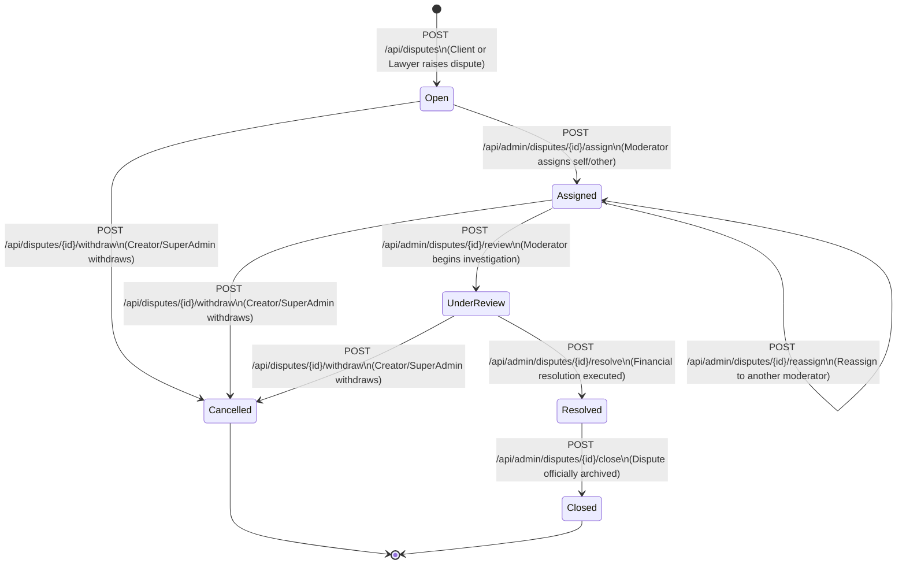

# Disputes & Lawyer Penalties API Contract and Frontend Integration Guide

**Authoritative Code Snapshot:** Working tree as of `2026-08-17`  
**Runtime Controllers:**  
- `DisputesController` (`/api/disputes`, `/api/admin/disputes`)
- `LawyerPenaltiesController` (`/api/admin/lawyer-penalties`, `/api/lawyer-penalties`)  
**Audience:** Frontend Engineers, Fullstack Integrators, QA Engineers

---

## 1. Executive Summary & Non-Negotiable Wire Rules

| Concern | Rule / Requirement |
| :--- | :--- |
| **Authentication** | Every endpoint requires JWT authentication (`Authorization: Bearer <JWT>` or `accessToken` cookie). |
| **Content-Type** | `application/json` for requests with payload bodies. |
| **Enum Encoding** | **Numeric Ordinals (Integers)**. Send and expect enums as integers (e.g., `status: 0` for `Open`), except for action strings (e.g., `"Withdraw"`). |
| **Timestamps** | All dates/times are ISO-8601 UTC with `Z` suffix (e.g., `"2026-08-17T21:00:00Z"`). |
| **Currency & Monetary Amounts** | Decimal amounts in Egyptian Pounds (**EGP**). Up to 2 decimal places (e.g., `1500.50`). |
| **Dynamic UI Actions** | Always inspect the `permittedActions` array in the response to show/hide action buttons (e.g., `["AddEvidence", "Withdraw"]`). |
| **Evidence Immutability** | Evidence is **append-only**. Once uploaded, evidence cannot be edited or deleted. Multiple evidence items can be appended at any time before resolution. |
| **Presigned Downloads** | File attachments use secure, time-limited presigned download URLs obtained via the dedicated download URL endpoint. |
| **Rate Limiting** | Endpoints are protected by partitioned rate limits. Respect HTTP `429` with `Retry-After` headers. |

---

## 2. System State Machines & Workflow Diagrams

### 2.1 Dispute Lifecycle State Machine



### 2.2 Milestone & Escrow Impact During Dispute Lifecycle

1. **Raising a Dispute (`POST /api/disputes`)**:
   - Milestone must be in `FundedInProgress (3)`, `Submitted (4)`, or `AcceptedHold (5)`.
   - The Milestone transitions to `Disputed (6)`.
   - The associated Escrow Hold transitions from `Funded (0)` to `Frozen (1)`.
   - Contract transitions to `Disputed (4)`.
   - The pre-dispute milestone status and contract status are snapshotted in `dispute.previousMilestoneStatus` and `dispute.previousContractStatus`.

2. **Withdrawing / Cancelling a Dispute (`POST /api/disputes/{id}/withdraw`)**:
   - The Dispute transitions to `Cancelled (5)`.
   - The Escrow Hold unfreezes from `Frozen (1)` back to `Funded (0)`.
   - The Milestone transitions from `Disputed (6)` back to its snapshot status (`FundedInProgress`, `Submitted`, or `AcceptedHold`).
   - The Contract returns to its previous status (`Active` or `CompletedOnHold`).

3. **Resolving a Dispute (`POST /api/admin/disputes/{id}/resolve`)**:
   - **`FullRefundToClient (0)`**: Milestone becomes `Refunded (8)`, Hold becomes `Refunded (3)`. Contract becomes `Active` (or `Terminated` if terminated).
   - **`FullReleaseToLawyer (1)`**: Milestone becomes `Released (7)`, Hold becomes `Released (2)`. Contract advances toward `Completed (2)`.
   - **`SplitSettlement (2)`**: Calculated portions refunded to client wallet and released to lawyer wallet. Milestone becomes `Released (7)` / `Refunded (8)`.
   - **`Dismissed (3)`**: Dispute dismissed. Status reverts or settles per moderator ruling.
   - **Lawyer Penalty**: If `lawyerPenaltyType` is provided, a `LawyerPenalty` record is appended. If `TemporarySuspension (1)` or `PermanentBan (2)`, the lawyer is automatically disqualified from taking/accepting new contracts while active.

---

## 3. Enumeration Reference

### 3.1 `DisputeStatus`
| Ordinal | Name | Description |
| :---: | :--- | :--- |
| `0` | `Open` | Raised by client/lawyer, awaiting moderator assignment |
| `1` | `Assigned` | Assigned to a specific moderator |
| `2` | `UnderReview` | Under active investigation by assigned moderator |
| `3` | `Resolved` | Settlement executed; resolution summary recorded |
| `4` | `Closed` | Officially completed and closed |
| `5` | `Cancelled` | Withdrawn by creator or SuperAdmin before resolution |

### 3.2 `DisputeCategory`
| Ordinal | Name | Description |
| :---: | :--- | :--- |
| `0` | `DeliverableQuality` | Substandard quality of work or deliverables |
| `1` | `LateDelivery` | Failure to meet agreed milestone deadlines |
| `2` | `ScopeMismatch` | Deliverables do not match agreed scope of work |
| `3` | `CommunicationFailure` | Inability to reach counterparty or unresponsive conduct |
| `4` | `FraudOrMisrepresentation` | Falsified claims, documents, or impersonation |
| `5` | `UnjustifiedChange` | Unagreed changes or demands outside contract terms |
| `6` | `Other` | Other contractual disputes |

### 3.3 `DisputeResolutionType`
| Ordinal | Name | Description |
| :---: | :--- | :--- |
| `0` | `FullRefundToClient` | 100% of escrow hold refunded to client |
| `1` | `FullReleaseToLawyer` | 100% of escrow hold (minus platform fees) paid to lawyer |
| `2` | `SplitSettlement` | Partial refund to client and partial payout to lawyer |
| `3` | `Dismissed` | Dispute dismissed with no financial adjustment |

### 3.4 `LawyerPenaltyType`
| Ordinal | Name | Description |
| :---: | :--- | :--- |
| `0` | `Warning` | Official written reprimand; no restriction on new contracts |
| `1` | `TemporarySuspension` | Account temporarily suspended until `endsAt`; cannot accept/create contracts |
| `2` | `PermanentBan` | Permanent disqualification from legal marketplace |
| `3` | `FeeDeduction` | Platform fee deduction or administrative fine |

---

## 4. Permitted Actions Matrix (`permittedActions`)

The backend dynamically computes `permittedActions` based on the user's role, their ownership of the dispute, and current dispute status:

| Action String | Who Receives It | When Available | UI Button Action |
| :--- | :--- | :--- | :--- |
| `"AddEvidence"` | Client or Lawyer party | Status is `Open (0)`, `Assigned (1)`, or `UnderReview (2)` | Opens Add Evidence Modal / Uploader |
| `"Withdraw"` | Dispute Creator or SuperAdmin | Status is `Open (0)`, `Assigned (1)`, or `UnderReview (2)` | Shows "Withdraw Dispute" confirmation modal |
| `"Assign"` | Moderator or SuperAdmin | Status is `Open (0)` | "Assign to Me" or "Assign Moderator" button |
| `"Reassign"` | Moderator or SuperAdmin | Status is `Open (0)` or `Assigned (1)` | "Reassign Moderator" dropdown & button |
| `"StartReview"` | Assigned Moderator or SuperAdmin | Status is `Assigned (1)` | "Start Review" button |
| `"Resolve"` | Assigned Moderator or SuperAdmin | Status is `UnderReview (2)` | "Resolve Dispute" dialog with settlement breakdown |
| `"Close"` | Assigned Moderator or SuperAdmin | Status is `Resolved (3)` | "Close Dispute" final button |

---

## 5. Complete Endpoint Catalog

### 5.1 Dispute Endpoints (`/api/disputes`)

#### 1. Raise a Dispute
- **Route:** `POST /api/disputes`
- **Roles:** `Client`, `Lawyer`
- **Rate Limit Policy:** `SensitiveMutation` (30 req / 1 min IP, 10 req / 1 min User)
- **Request Body (`CreateDisputeRequest`):**
```typescript
interface CreateDisputeRequest {
  contractId: string;                 // UUID
  milestoneId: string;                // UUID (must be FundedInProgress, Submitted, or AcceptedHold)
  category: DisputeCategory;          // 0 to 6
  reason: string;                     // 10 - 2000 chars
  claimedAmount?: number | null;      // Optional, must be > 0 and <= milestone amount
  evidenceDescription?: string | null;// Optional initial evidence text (max 2000 chars)
  evidenceStoredFileIds?: string[];   // Optional array of StoredFile UUIDs
}
```
- **Sample Request:**
```json
{
  "contractId": "48b1112b-2fe7-4fcf-8472-ae311a2f6456",
  "milestoneId": "d0e12345-6789-4abc-8def-0123456789ab",
  "category": 0,
  "reason": "The submitted draft pleading lacks essential statutory grounds discussed.",
  "claimedAmount": 5000.00,
  "evidenceDescription": "Attached initial draft vs agreed outline.",
  "evidenceStoredFileIds": ["c1a2b3c4-d5e6-7f8a-9b0c-1d2e3f4a5b6c"]
}
```
- **Response (`201 Created` - `ApiResponse<DisputeDetailDto>`):**
```json
{
  "success": true,
  "statusCode": 201,
  "message": null,
  "errors": null,
  "data": {
    "id": "7a8b9c0d-1e2f-3a4b-5c6d-7e8f9a0b1c2d",
    "contractId": "48b1112b-2fe7-4fcf-8472-ae311a2f6456",
    "contractTitle": "Corporate Litigation Representation",
    "milestoneId": "d0e12345-6789-4abc-8def-0123456789ab",
    "milestoneTitle": "Drafting First Pleading",
    "milestoneAmount": 5000.00,
    "raisedByUserId": "11111111-2222-3333-4444-555555555555",
    "raisedByUserName": "Ahmed Mansour",
    "clientUserId": "11111111-2222-3333-4444-555555555555",
    "clientName": "Ahmed Mansour",
    "lawyerUserId": "22222222-3333-4444-5555-666666666666",
    "lawyerName": "Counsel Mahmoud Tarek",
    "assignedModeratorUserId": null,
    "assignedModeratorName": null,
    "status": 0,
    "category": 0,
    "reason": "The submitted draft pleading lacks essential statutory grounds discussed.",
    "claimedAmount": 5000.00,
    "previousMilestoneStatus": 4,
    "previousContractStatus": 1,
    "cancelledByUserId": null,
    "cancelledAt": null,
    "cancellationReason": null,
    "createdAt": "2026-08-17T21:10:00Z",
    "underReviewAt": null,
    "resolvedAt": null,
    "closedAt": null,
    "evidence": [
      {
        "id": "e1f2a3b4-c5d6-7e8f-9a0b-1c2d3e4f5a6b",
        "disputeId": "7a8b9c0d-1e2f-3a4b-5c6d-7e8f9a0b1c2d",
        "uploadedByUserId": "11111111-2222-3333-4444-555555555555",
        "uploadedByUserName": "Ahmed Mansour",
        "storedFileId": "c1a2b3c4-d5e6-7f8a-9b0c-1d2e3f4a5b6c",
        "fileName": "outline_comparison.pdf",
        "fileSizeInBytes": 204850,
        "contentType": "application/pdf",
        "description": "Attached initial draft vs agreed outline.",
        "createdAt": "2026-08-17T21:10:00Z"
      }
    ],
    "resolution": null,
    "penalty": null,
    "permittedActions": ["AddEvidence", "Withdraw"]
  }
}
```

---

#### 2. Query & Filter Disputes List
- **Route:** `GET /api/disputes`
- **Roles:** `Client`, `Lawyer`, `Moderator`, `SuperAdmin`
- **Rate Limit Policy:** `AuthenticatedQuery` (300 req / 1 min IP, 100 req / 1 min User)
- **Query Parameters:**
  - `contractId?: string` (Filter by contract)
  - `milestoneId?: string` (Filter by milestone)
  - `status?: DisputeStatus` (`0` to `5`)
  - `category?: DisputeCategory` (`0` to `6`)
  - `assignedModeratorUserId?: string` (Moderator/Admin query filter)
  - `raisedByUserId?: string`
  - `search?: string` (Searches contract title, milestone title, user names, reason)
  - `fromDateUtc?: string` (ISO UTC)
  - `toDateUtc?: string` (ISO UTC)
  - `page?: number` (Default `1`)
  - `pageSize?: number` (Default `10`, max `50`)
- **Response (`200 OK` - `ApiResponse<DisputeListDto>`):**
```json
{
  "success": true,
  "statusCode": 200,
  "data": {
    "items": [
      {
        "id": "7a8b9c0d-1e2f-3a4b-5c6d-7e8f9a0b1c2d",
        "contractId": "48b1112b-2fe7-4fcf-8472-ae311a2f6456",
        "contractTitle": "Corporate Litigation Representation",
        "milestoneId": "d0e12345-6789-4abc-8def-0123456789ab",
        "milestoneTitle": "Drafting First Pleading",
        "milestoneAmount": 5000.00,
        "raisedByUserId": "11111111-2222-3333-4444-555555555555",
        "raisedByUserName": "Ahmed Mansour",
        "clientUserId": "11111111-2222-3333-4444-555555555555",
        "clientName": "Ahmed Mansour",
        "lawyerUserId": "22222222-3333-4444-5555-666666666666",
        "lawyerName": "Counsel Mahmoud Tarek",
        "assignedModeratorUserId": null,
        "assignedModeratorName": null,
        "status": 0,
        "category": 0,
        "claimedAmount": 5000.00,
        "evidenceCount": 1,
        "createdAt": "2026-08-17T21:10:00Z",
        "resolvedAt": null,
        "closedAt": null
      }
    ],
    "totalCount": 1,
    "page": 1,
    "pageSize": 10,
    "totalPages": 1
  }
}
```

---

#### 3. Get Dispute Details
- **Route:** `GET /api/disputes/{id}`
- **Roles:** `Client`, `Lawyer`, `Moderator`, `SuperAdmin`
- **Rate Limit Policy:** `AuthenticatedQuery`
- **Response (`200 OK` - `ApiResponse<DisputeDetailDto>`):** Full `DisputeDetailDto` object.

---

#### 4. Append Evidence to Dispute
- **Route:** `POST /api/disputes/{id}/evidence`
- **Roles:** `Client`, `Lawyer`
- **Rate Limit Policy:** `StandardMutation` (60 req / 1 min IP, 20 req / 1 min User)
- **Request Body (`AddDisputeEvidenceRequest`):**
```typescript
interface AddDisputeEvidenceRequest {
  description: string;       // 3 - 2000 chars
  storedFileId?: string | null;// Optional UUID of uploaded StoredFile
}
```
- **Response (`200 OK` - `ApiResponse<DisputeEvidenceDto>`):** Returns the newly created `DisputeEvidenceDto`.

---

#### 5. Get Presigned Evidence Download URL
- **Route:** `GET /api/disputes/{id}/evidence/{evidenceId}/download-url`
- **Roles:** `Client`, `Lawyer`, `Moderator`, `SuperAdmin`
- **Rate Limit Policy:** `AuthenticatedQuery`
- **Response (`200 OK` - `ApiResponse<EvidenceDownloadUrlDto>`):**
```json
{
  "success": true,
  "statusCode": 200,
  "data": {
    "downloadUrl": "https://storage.provider.com/contracts/cases/uuid/outline_comparison.pdf?token=expiring_token_here",
    "expiresAtUtc": "2026-08-17T22:10:00Z",
    "fileName": "outline_comparison.pdf",
    "contentType": "application/pdf"
  }
}
```

---

#### 6. Withdraw / Cancel Dispute
- **Route:** `POST /api/disputes/{id}/withdraw`
- **Roles:** `Client`, `Lawyer`, `SuperAdmin` (Client or Lawyer must be the creator who opened the dispute)
- **Rate Limit Policy:** `SensitiveMutation`
- **Request Body (`WithdrawDisputeRequest`):**
```typescript
interface WithdrawDisputeRequest {
  reason: string; // 5 - 1000 chars
}
```
- **Response (`200 OK` - `ApiResponse<DisputeDetailDto>`):** Returns updated dispute with `status: 5` (`Cancelled`).

---

### 5.2 Moderator & Admin Adjudication Endpoints (`/api/admin/disputes`)

#### 7. Assign Moderator
- **Route:** `POST /api/admin/disputes/{id}/assign`
- **Roles:** `Moderator`, `SuperAdmin`
- **Request Body (`AssignDisputeRequest`):**
```typescript
interface AssignDisputeRequest {
  moderatorUserId: string; // UUID
}
```
- **Response (`200 OK` - `ApiResponse<DisputeDetailDto>`):** Status changes from `Open (0)` to `Assigned (1)`.

---

#### 8. Reassign Moderator
- **Route:** `POST /api/admin/disputes/{id}/reassign`
- **Roles:** `Moderator`, `SuperAdmin`
- **Request Body (`ReassignDisputeRequest`):**
```typescript
interface ReassignDisputeRequest {
  newModeratorUserId: string; // UUID
  reason: string;             // 5 - 1000 chars
}
```
- **Response (`200 OK` - `ApiResponse<DisputeDetailDto>`):** Updates `assignedModeratorUserId` while remaining in `Assigned (1)`.

---

#### 9. Start Review Phase
- **Route:** `POST /api/admin/disputes/{id}/review`
- **Roles:** `Moderator`, `SuperAdmin`
- **Request Body:** None
- **Response (`200 OK` - `ApiResponse<DisputeDetailDto>`):** Status advances from `Assigned (1)` to `UnderReview (2)`.

---

#### 10. Resolve Dispute (Financial Resolution & Optional Penalty)
- **Route:** `POST /api/admin/disputes/{id}/resolve`
- **Roles:** `Moderator`, `SuperAdmin`
- **Rate Limit Policy:** `AdminFinancialMutation` (10 req / 1 min IP, 3 req / 1 min User)
- **Optional Header:** `Idempotency-Key: <unique-uuid>`
- **Request Body (`ResolveDisputeRequest`):**
```typescript
interface ResolveDisputeRequest {
  resolutionType: DisputeResolutionType; // 0: FullRefund, 1: FullRelease, 2: SplitSettlement, 3: Dismissed
  resolutionNotes: string;               // 10 - 2000 chars
  lawyerPenaltyType?: LawyerPenaltyType | null; // 0: Warning, 1: TempSuspension, 2: PermanentBan, 3: FeeDeduction
  penaltyNotes?: string | null;          // Max 2000 chars
  penaltyEndsAt?: string | null;         // Required if penaltyType is TemporarySuspension (ISO UTC)
  clientRefundAmount?: number | null;    // Required if resolutionType is SplitSettlement (EGP)
  lawyerPayoutAmount?: number | null;    // Required if resolutionType is SplitSettlement (EGP)
}
```
- **Split Settlement Rule:** If `resolutionType === 2`, `clientRefundAmount + lawyerPayoutAmount` must exactly equal `milestone.amount`.
- **Response (`200 OK` - `ApiResponse<DisputeDetailDto>`):** Status advances to `Resolved (3)` with `resolution` and `penalty` sub-objects populated.

---

#### 11. Close Dispute
- **Route:** `POST /api/admin/disputes/{id}/close`
- **Roles:** `Moderator`, `SuperAdmin`
- **Request Body:** None
- **Response (`200 OK` - `ApiResponse<DisputeDetailDto>`):** Status advances to `Closed (4)`.

---

#### 12. Dispute Aggregated Statistics
- **Route:** `GET /api/admin/disputes/stats`
- **Roles:** `Moderator`, `SuperAdmin`
- **Response (`200 OK` - `ApiResponse<DisputeStatsDto>`):**
```json
{
  "success": true,
  "statusCode": 200,
  "data": {
    "totalDisputes": 48,
    "openCount": 5,
    "assignedCount": 8,
    "underReviewCount": 12,
    "resolvedCount": 18,
    "closedCount": 3,
    "cancelledCount": 2,
    "unassignedOpenCount": 5
  }
}
```

---

### 5.3 Lawyer Penalty Management Endpoints (`/api/admin/lawyer-penalties`, `/api/lawyer-penalties`)

#### 13. Admin Penalty Audit Listing
- **Route:** `GET /api/admin/lawyer-penalties`
- **Roles:** `Moderator`, `SuperAdmin`
- **Rate Limit Policy:** `AuthenticatedQuery`
- **Query Parameters (`LawyerPenaltyFilterQuery`):**
  - `lawyerUserId?: string`
  - `disputeId?: string`
  - `penaltyType?: LawyerPenaltyType` (`0` to `3`)
  - `isActive?: boolean` (Filters unrevoked penalties where `endsAt > now` or `endsAt == null`)
  - `isRevoked?: boolean`
  - `fromDateUtc?: string`
  - `toDateUtc?: string`
  - `page?: number`
  - `pageSize?: number`
- **Response (`200 OK` - `ApiResponse<LawyerPenaltyListDto>`):**
```json
{
  "success": true,
  "statusCode": 200,
  "data": {
    "items": [
      {
        "id": "99a8b7c6-d5e4-3f2a-1b0c-9d8e7f6a5b4c",
        "lawyerUserId": "22222222-3333-4444-5555-666666666666",
        "lawyerName": "Counsel Mahmoud Tarek",
        "disputeId": "7a8b9c0d-1e2f-3a4b-5c6d-7e8f9a0b1c2d",
        "penaltyType": 1,
        "notes": "Failure to provide timely deliverables with repeated unresponsive conduct.",
        "endsAt": "2026-09-17T21:00:00Z",
        "isRevoked": false,
        "revokedAt": null,
        "revokedByUserId": null,
        "revocationReason": null,
        "createdAt": "2026-08-17T21:30:00Z"
      }
    ],
    "totalCount": 1,
    "page": 1,
    "pageSize": 10,
    "totalPages": 1
  }
}
```

---

#### 14. Lawyer Self-Service Penalty History
- **Route:** `GET /api/lawyer-penalties/me`
- **Roles:** `Lawyer`
- **Rate Limit Policy:** `AuthenticatedQuery`
- **Query Parameters:** `isActive`, `isRevoked`, `fromDateUtc`, `toDateUtc`, `page`, `pageSize`
- **Response (`200 OK` - `ApiResponse<LawyerPenaltyListDto>`):** Returns penalty history for the currently logged-in lawyer.

---

#### 15. Revoke Penalty (SuperAdmin Only)
- **Route:** `POST /api/admin/lawyer-penalties/{id}/revoke`
- **Roles:** `SuperAdmin`
- **Rate Limit Policy:** `StandardMutation`
- **Request Body (`RevokeLawyerPenaltyRequest`):**
```typescript
interface RevokeLawyerPenaltyRequest {
  reason: string; // 5 - 1000 chars
}
```
- **Response (`200 OK` - `ApiResponse<LawyerPenaltyDto>`):** Returns updated penalty record with `isRevoked: true`, restoring the lawyer's platform standing.

---

## 6. TypeScript Interface Definitions for Frontend

```typescript
// ==========================================
// Enums
// ==========================================

export enum DisputeStatus {
  Open = 0,
  Assigned = 1,
  UnderReview = 2,
  Resolved = 3,
  Closed = 4,
  Cancelled = 5
}

export enum DisputeCategory {
  DeliverableQuality = 0,
  LateDelivery = 1,
  ScopeMismatch = 2,
  CommunicationFailure = 3,
  FraudOrMisrepresentation = 4,
  UnjustifiedChange = 5,
  Other = 6
}

export enum DisputeResolutionType {
  FullRefundToClient = 0,
  FullReleaseToLawyer = 1,
  SplitSettlement = 2,
  Dismissed = 3
}

export enum LawyerPenaltyType {
  Warning = 0,
  TemporarySuspension = 1,
  PermanentBan = 2,
  FeeDeduction = 3
}

export type DisputePermittedAction =
  | 'AddEvidence'
  | 'Withdraw'
  | 'Assign'
  | 'Reassign'
  | 'StartReview'
  | 'Resolve'
  | 'Close';

// ==========================================
// Standard API Envelope
// ==========================================

export interface ApiResponse<T> {
  success: boolean;
  data: T | null;
  message: string | null;
  errors: string[] | null;
  statusCode: number;
}

// ==========================================
// DTOs
// ==========================================

export interface DisputeEvidenceDto {
  id: string;
  disputeId: string;
  uploadedByUserId: string;
  uploadedByUserName: string;
  storedFileId: string | null;
  fileName: string | null;
  fileSizeInBytes: number | null;
  contentType: string | null;
  description: string;
  createdAt: string;
}

export interface DisputeResolutionDto {
  id: string;
  disputeId: string;
  resolvedByUserId: string;
  resolvedByUserName: string;
  resolutionType: DisputeResolutionType;
  resolutionNotes: string;
  clientRefundAmount: number;
  lawyerPayoutAmount: number;
  platformFeeAmount: number;
  resolvedAt: string;
}

export interface LawyerPenaltyDto {
  id: string;
  lawyerUserId: string;
  lawyerName: string;
  disputeId: string;
  penaltyType: LawyerPenaltyType;
  notes: string | null;
  endsAt: string | null;
  isRevoked: boolean;
  revokedAt: string | null;
  revokedByUserId: string | null;
  revocationReason: string | null;
  createdAt: string;
}

export interface DisputeDetailDto {
  id: string;
  contractId: string;
  contractTitle: string;
  milestoneId: string;
  milestoneTitle: string;
  milestoneAmount: number;
  raisedByUserId: string;
  raisedByUserName: string;
  clientUserId: string;
  clientName: string;
  lawyerUserId: string;
  lawyerName: string;
  assignedModeratorUserId: string | null;
  assignedModeratorName: string | null;
  status: DisputeStatus;
  category: DisputeCategory;
  reason: string;
  claimedAmount: number | null;
  previousMilestoneStatus: number | null;
  previousContractStatus: number | null;
  cancelledByUserId: string | null;
  cancelledAt: string | null;
  cancellationReason: string | null;
  createdAt: string;
  underReviewAt: string | null;
  resolvedAt: string | null;
  closedAt: string | null;
  evidence: DisputeEvidenceDto[];
  resolution: DisputeResolutionDto | null;
  penalty: LawyerPenaltyDto | null;
  permittedActions: DisputePermittedAction[];
}

export interface DisputeListItemDto {
  id: string;
  contractId: string;
  contractTitle: string;
  milestoneId: string;
  milestoneTitle: string;
  milestoneAmount: number;
  raisedByUserId: string;
  raisedByUserName: string;
  clientUserId: string;
  clientName: string;
  lawyerUserId: string;
  lawyerName: string;
  assignedModeratorUserId: string | null;
  assignedModeratorName: string | null;
  status: DisputeStatus;
  category: DisputeCategory;
  claimedAmount: number | null;
  evidenceCount: number;
  createdAt: string;
  resolvedAt: string | null;
  closedAt: string | null;
}

export interface DisputeListDto {
  items: DisputeListItemDto[];
  totalCount: number;
  page: number;
  pageSize: number;
  totalPages: number;
}

export interface DisputeStatsDto {
  totalDisputes: number;
  openCount: number;
  assignedCount: number;
  underReviewCount: number;
  resolvedCount: number;
  closedCount: number;
  cancelledCount: number;
  unassignedOpenCount: number;
}

export interface EvidenceDownloadUrlDto {
  downloadUrl: string;
  expiresAtUtc: string;
  fileName: string;
  contentType: string;
}

export interface LawyerPenaltyListDto {
  items: LawyerPenaltyDto[];
  totalCount: number;
  page: number;
  pageSize: number;
  totalPages: number;
}
```

---

## 7. Frontend Error Handling Guide

All error responses from the backend follow the consistent format:
```json
{
  "success": false,
  "data": null,
  "message": "لا يمكنك التراجع عن نزاع قيد المراجعة إلا من قبل مسؤول النظام.",
  "errors": ["Specific validation error string here"],
  "statusCode": 400
}
```

### Common HTTP Status Codes & Recommended UI Behaviors:
- **`400 Bad Request`**: Validation failure (e.g., claimed amount exceeds milestone total, reason too short, split settlement amounts do not sum to gross amount). Display `message` or `errors` directly in the form banner or toast.
- **`401 Unauthorized`**: Token missing or expired. Redirect to login.
- **`403 Forbidden`**: User is not a party to this dispute or lacks required moderator/admin role. Show access denied notice.
- **`404 Not Found`**: Dispute, milestone, or evidence ID not found. Show 404 state.
- **`409 Conflict`**: Illegal state transition (e.g., trying to resolve a dispute that is already resolved, or assigning a dispute that is already closed). Prompt user to refresh data.
- **`429 Too Many Requests`**: Rate limit reached. Disable action button and display countdown matching the `Retry-After` header.
