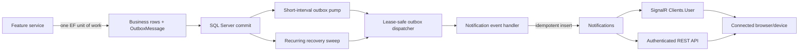

# Notifications Architecture Decision

Status: **In-app V1 implemented and verified**  
Scope: database-backed in-app notifications plus SignalR. Email/SMS escalation remains part of the target architecture but is deferred to a later approved increment.

## Decision summary

SmartCourt uses a custom, SQL Server-backed notification inbox with ASP.NET Core SignalR for real-time acceleration. A later increment may add policy-driven fallback through the existing Email and SMS providers without changing the in-app REST or SignalR contracts.

Notification triggers should use SmartCourt's existing **transactional outbox**, not MediatR:

- A feature changes its aggregate and adds a semantic `OutboxEvent` to the same `ApplicationDbContext` unit of work.
- The existing Hangfire outbox dispatcher delivers committed events to a notification event handler with retry and leasing.
- The handler idempotently materializes one or more `Notification` records.
- SignalR broadcasts the persisted DTO to every active connection for the recipient.
- REST remains the source of truth for initial load, reconnects, missed messages, and read state.

The authorization granted to use MediatR only for background publishing is therefore not needed. The new notification slice must not use MediatR for HTTP requests or notification dispatch. Existing MediatR usage elsewhere in the repository is legacy/current project code and is not a pattern to extend here.

## Repository evidence

The decision is based on the current repository rather than a greenfield design:

| Existing capability | Location | Architectural consequence |
|---|---|---|
| Pure Vertical Slice + service rules | `.agents/AGENTS.md` | Notification HTTP endpoints use a controller and service interface/implementation; no MediatR, AutoMapper, or Data Annotations. |
| SignalR and JWT hub authentication | `DependencyInjection.cs`, `Program.cs` | `AddSignalR()` is registered, `/hubs/notifications` is recognized by `JwtBearerEvents.OnMessageReceived`, and the authorized hub is mapped with authentication-expiration closure. |
| Working strongly typed SignalR pattern | `Features/Chat/Hubs`, `Features/Chat/Realtime` | Reuse a strongly typed client contract and a notifier abstraction. |
| Transactional outbox with leases, retry, and backoff | `Infrastructure/Providers/Events` | Reuse it as the durable trigger mechanism instead of adding an in-memory event bus. |
| Proposal and contract lifecycle events | `ContractPaymentEventTypes` and feature services/handlers | Many useful triggers already exist and can be consumed without coupling their producers to notification presentation. |
| Hangfire and recurring outbox sweep | `Providers/Jobs`, `ContractRecurringJobRegistrar` | Reuse durable jobs for fallback checks and recovery. Generalize notification/outbox job naming rather than creating a second scheduler. |
| Provider abstractions | `IEmailProvider`, `ISmsProvider` | Notification code depends only on provider interfaces. The current return value means “queued by Hangfire,” not provider-confirmed delivery. |
| Removed notification implementation | migrations `AddNotificationsTable` and `RemoveNotificationsTable`, Git history | Do not restore the old synchronous save-then-broadcast design. It lacked idempotency, fallback state, pagination, concurrency, and durable event delivery, and used Data Annotations and MediatR HTTP handlers. |

## Why the outbox is preferable to MediatR here

MediatR notifications are in-process. Publishing after a database commit leaves a crash window in which business data is committed but the event is lost. Publishing before commit can perform SignalR, Email, or SMS side effects even if the transaction later rolls back. MediatR also has no built-in durable retry, lease, or replay semantics.

The existing outbox already solves those problems:

- the business mutation and outbox row share one EF Core transaction;
- rolled-back work leaves no event;
- failed handlers remain retryable with exponential backoff;
- multiple application instances can claim work safely through leases and row-version concurrency;
- the event ID provides a stable idempotency key.

Adding MediatR behind the outbox would only wrap `IOutboxEventHandler` with another in-memory dispatch layer. It would add registrations and failure paths without improving isolation or durability.

## Target flow

### Near-real-time wake-up and recovery

The recurring outbox sweep runs once per minute. That is an appropriate recovery mechanism but is too slow to be the normal SignalR path. In-app V1 therefore includes a configurable hosted outbox pump that calls the existing lease-safe dispatcher on a short interval (default: one second) and backs off after infrastructure failures. The existing Hangfire sweep remains enabled as recovery.

A `SaveChangesInterceptor` is deliberately not the V1 wake-up mechanism: `SavedChangesAsync` can run before an explicit surrounding transaction commits. A fast dispatcher pump avoids that transaction boundary race, requires no feature-service dispatch call, and remains safe across multiple instances because the current outbox claim path already uses leases and optimistic concurrency.

### Delivery guarantees

- Database inbox: at-least-once event consumption with effectively-once materialization through a unique idempotency key.
- SignalR: best effort and potentially duplicate. A retry can rebroadcast the same notification ID.
- REST: authoritative reconciliation path.
- Email/SMS: deferred. When added, the current provider contracts can initially prove queue acceptance only, not provider-confirmed delivery.

## Slice boundary

The feature is self-contained under `SmartCourt/Features/Notifications`:

- controller and `INotificationService`/`NotificationService` for authenticated REST operations;
- DTOs and FluentValidation validators;
- notification entity owned by the slice;
- hub and strongly typed client contract;
- real-time notifier abstraction and SignalR implementation;
- outbox event handler(s) and event-to-notification mapping;
- a short-interval hosted outbox dispatch pump.

EF Core configuration is in the project-native `SmartCourt/Persistence/Configurations` location applied by `ApplicationDbContext`.

## Conceptual persistence model

This is the implemented in-app V1 persistence model.

### Notification

| Field | Purpose |
|---|---|
| `Id` | Stable public ID and client deduplication key. |
| `Sequence` | Database-generated monotonic value used only for stable newest-first cursor pagination. |
| `RecipientUserId` | Required FK to `AspNetUsers`; never accepted from a read/update HTTP request. |
| `SourceEventId` | The outbox message ID that caused the notification. |
| `Type` | Stable machine code such as `proposal.created`; it is not localized display text. |
| `Severity` | `Information`, `Success`, `Warning`, or `Critical`. |
| `Title` / `Body` | Persisted display snapshot so notification history does not change when templates change. Plain text, not arbitrary HTML. |
| `ActionUrl` | Optional relative application route from a server-side allowlisted mapper. |
| `DataJson` | Optional small, non-sensitive metadata object for typed UI behavior. |
| `CreatedAtUtc` | UTC creation time derived from `TimeProvider`. |
| `ReadAtUtc` | Null until read; this is the source of `isRead`. |
| `ExpiresAtUtc` | Optional business expiry; expiry does not erase audit history immediately. |
| `RowVersion` | Optimistic concurrency for idempotent read updates. |

Required constraints/indexes:

- unique `(SourceEventId, RecipientUserId, Type)` to make outbox retries safe;
- unique `Sequence` plus `(RecipientUserId, Sequence DESC)` for stable feed queries;
- filtered unread index on recipient/read state where SQL Server supports the chosen filter;
- restricted FK delete behavior so deleting an account cannot accidentally cascade-delete notification history outside an explicit retention policy;
- UTC checks/conventions consistent with the current persistence helpers.

### Future Email/SMS persistence extension

In-app V1 does not create `NotificationDelivery` or invoke Email/SMS providers. A later fallback increment should add a separate delivery-attempt record because one notification can use several channels and each channel has independent state:

- `NotificationId`, `Channel` (`Email` or `Sms`), `Status` (`Scheduled`, `Queued`, `Skipped`, `Failed`);
- due/scheduled/attempt timestamps, attempt count, and truncated last error;
- a unique `(NotificationId, Channel)` constraint to prevent duplicate fallback jobs from queueing the same channel twice.

`Sent` or `Delivered` must not be claimed until the provider contracts expose an actual provider result or callback. This can be enhanced later without changing the notification API.

That later notification handler should persist the inbox row and its required `Scheduled` delivery rows atomically. Individual Hangfire jobs can provide prompt execution, while a recurring reconciliation job scans overdue `Scheduled`/retryable delivery rows so a crash between commit and Hangfire scheduling cannot lose a fallback.

## Trigger contracts

### Preferred: consume semantic events

Feature slices publish facts such as `ProposalCreated`, `ProposalAccepted`, `MilestoneSubmitted`, or `FundsReleased`. The notification handler owns:

- recipient resolution;
- localized title/body generation;
- severity and fallback policy;
- safe action URL construction.

This prevents Proposal, Payment, and Dispute code from depending on UI wording or channel rules. The existing Proposal events already include client and lawyer user IDs and can be used for the first end-to-end scenario.

There is no generic direct-notification publisher in V1. If a later use case has no reusable business meaning, its contract must be designed and approved before implementation. Backend slices must not bypass the semantic outbox path or construct notification rows directly.

The backend guide defines the current producer and transaction rules.

## SignalR contract

- Hub endpoint: `/hubs/notifications`.
- Authorization: `[Authorize]`; no client-callable business methods are required.
- Recipient routing: `Clients.User(recipientUserId.ToString())`, using the existing unique `ClaimTypes.NameIdentifier`. This naturally reaches all connections for the same user and avoids maintaining raw-GUID groups.
- Client methods:
  - `NotificationCreated(NotificationDto notification)`
  - `NotificationRead(NotificationReadDto update)`
  - `NotificationsReadAll(NotificationsReadAllDto update)`
- Real-time payloads use the same DTO shapes as REST.
- A SignalR exception must never remove the persisted inbox row. Retrying may repeat the event, so clients deduplicate by `id`.

The JWT bearer setup closes a connection when authentication expires so the client reconnects with fresh credentials. Browser clients should use the existing HttpOnly access-token cookie. Non-browser clients may use `accessTokenFactory`; bearer query strings must only travel over HTTPS and should be redacted from request logs.

## REST contract

All endpoints are authenticated and return the repository-standard `ApiResponse<T>` shape.

| Method | Route | Purpose |
|---|---|---|
| `GET` | `/api/notifications?cursor={cursor}&pageSize=20&isRead={optional}` | Stable, newest-first feed plus `nextCursor` and current `unreadCount`. Cursor pagination avoids page drift while new rows arrive. |
| `GET` | `/api/notifications/unread-count` | Lightweight badge reconciliation. |
| `PATCH` | `/api/notifications/{notificationId}/read` | Idempotently mark one owned notification as read and return its updated DTO. |
| `PATCH` | `/api/notifications/read-all` | Idempotently mark the caller's unread notifications as read and return the resulting unread count. |

There is no public “create notification” endpoint. Notifications originate from trusted server-side events. There is no general delete endpoint in the initial contract; retention is a server policy, not a per-request hard delete.

Every query/update derives the recipient from `ICurrentUserService`. A caller cannot supply a different user ID, and a notification owned by another user should be indistinguishable from a missing notification.

## Future fallback policy (not in in-app V1)

“Fallback” should mean **unread escalation**, not “SignalR says the user is offline.” SignalR presence is transient, hard to make authoritative across multiple instances, and does not prove that a person saw a notification.

Recommended configurable defaults:

| Policy | Initial action | Email check | SMS check |
|---|---|---|---|
| `InAppOnly` | Persist + SignalR | None | None |
| `InAppThenEmail` | Persist + SignalR | After 5 minutes if still unread and Email is confirmed | None |
| `InAppThenEmailThenSms` | Persist + SignalR | After 2 minutes if still unread and Email is confirmed | After 10 minutes if still unread and phone is confirmed |

Each delayed job must reload the notification and user, then atomically reserve its `(NotificationId, Channel)` delivery before calling the provider. A read notification, expired notification, unconfirmed/missing destination, or already-reserved channel is skipped. Retried jobs remain idempotent.

Critical security/authentication notices may deliberately use an immediate Email/SMS policy rather than unread escalation; that should be a separate explicit policy so feature authors cannot accidentally make every notification expensive.

## Failure handling and observability

- A producer never calls SignalR, SMTP, or Twilio inside its transaction.
- Notification materialization validates event version and payload/aggregate consistency.
- Poison outbox messages retain their error and backoff under the existing dispatcher.
- Notification logs include `SourceEventId`, `NotificationId`, recipient ID, type, channel, and status, but never message bodies, Email addresses, phone numbers, or access tokens.
- In-app V1 metrics should distinguish outbox lag, materialization failures, SignalR broadcast failures, and unread age. Fallback channel metrics are added with the later provider increment.
- Retention should be configurable; 90 days is a reasonable initial default subject to product/legal approval.
- If SmartCourt later runs on multiple web nodes, add a SignalR backplane (for example Redis or a managed SignalR service). The SQL inbox and REST reconciliation contract do not change.

## Alternatives considered

| Alternative | Decision |
|---|---|
| Database + SignalR + MediatR domain notifications | Rejected. MediatR is in-memory and duplicates the durable outbox/handler abstraction. |
| Direct `INotificationService.SendAsync` after each feature save | Rejected. It creates a commit-to-publish crash window and couples producers to presentation/channel concerns. |
| SignalR only | Rejected. Offline clients lose events and there is no durable read model. |
| REST polling only | Rejected as the primary UX. It is reliable but needlessly delays notifications and increases query traffic; retain REST for reconciliation. |
| New RabbitMQ/Azure Service Bus dependency | Deferred. It is unnecessary for the current monolith; the outbox boundary allows a broker to be added later. |
| Restore the removed notification code | Rejected. It violates current architecture rules and lacks the required durability and fallback behavior. |

## Implemented V1 baseline

The implemented and verified baseline is:

1. SQL Server is the source of truth and SignalR is a best-effort accelerator.
2. The existing transactional outbox, not MediatR, is the notification trigger bus.
3. In-app notifications are implemented first; Email/SMS unread escalation is a later increment.
4. The REST and SignalR contracts in this document are implemented and form the frontend integration baseline.
5. In-app V1 does not create delivery-attempt rows or call Email/SMS providers.

For exact producer steps and consumer payloads, use the [Backend Integration Guide](./backend_integration_guide.md) and [Frontend/API Contract](./frontend_integration_guide.md).

## References

- [Microsoft: Authentication and authorization in ASP.NET Core SignalR](https://learn.microsoft.com/en-us/aspnet/core/signalr/authn-and-authz)
- [Microsoft: Use hubs in ASP.NET Core SignalR](https://learn.microsoft.com/en-us/aspnet/core/signalr/hubs)
- [Microsoft: ASP.NET Core SignalR JavaScript client](https://learn.microsoft.com/en-us/aspnet/core/signalr/javascript-client)
