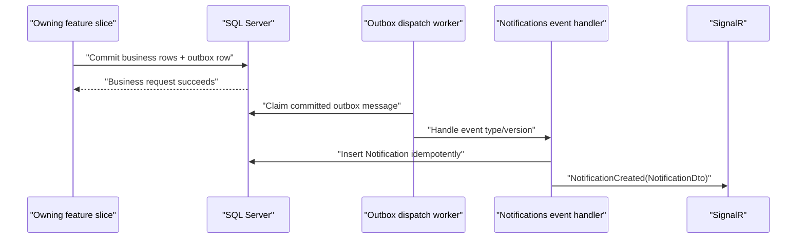

# Backend Notification Integration Guide

Status: **implemented backend contract**  
Scope: in-app notifications only. Email and SMS delivery are intentionally deferred.

This guide is for SmartCourt backend developers who need a feature slice to cause an in-app notification. It documents the code that exists today; it does not define a public notification-creation API and it does not require frontend changes.

## The integration rule

Persist a semantic outbox event in the **same EF Core unit of work** as the business change. The Notifications slice consumes that committed event, chooses the recipient and content, inserts the inbox row idempotently, and broadcasts the persisted DTO through SignalR.

A producer feature must not call any of these directly:

- `NotificationsHub` or `IHubContext`;
- `INotificationService`;
- `IEmailProvider` or `ISmsProvider`;
- Hangfire;
- MediatR for notification dispatch.

There is currently no `INotificationPublisher`, `NotificationRequestedV1`, public create endpoint, or test-only create endpoint. Add a semantic outbox event and a Notifications-side consumer instead.

## Runtime flow



The producer request completes after its business transaction commits. It does not wait for the notification to appear. The configured outbox worker normally claims work about every second; the existing recurring dispatcher remains a recovery path.

## Notifications implemented today

The Notifications slice currently consumes version `1` of these existing proposal events:

| Source event | Recipient | Notification type | Severity | Title | Body |
|---|---|---|---|---|---|
| `ProposalCreated` | `LawyerUserId` | `proposal.created` | `Information` | `New proposal` | `A client sent you a new proposal.` |
| `ProposalAccepted` | `ClientUserId` | `proposal.accepted` | `Success` | `Proposal accepted` | `A lawyer accepted your proposal.` |
| `ProposalRejected` | `ClientUserId` | `proposal.rejected` | `Warning` | `Proposal rejected` | `A lawyer rejected your proposal.` |

All three mappings use:

- action URL: `/proposals/{proposalId}`;
- data: `proposalId` and `legalCaseId` as string GUID values;
- source event ID: the persisted outbox message ID;
- creation time: the outbox message's UTC creation time.

The implementation is in `Features/Notifications/Events/ProposalNotificationOutboxHandler.cs` and `ProposalNotificationMapper.cs`.

## Quick start: add notifications for your slice

For a normal slice integration, the team member changes **two areas only**:

| Area | What to add |
|---|---|
| Your owning slice | A small business event payload and one `IOutboxWriter.EnqueueAsync(...)` call inside the existing business transaction. Skip this when a suitable outbox event already exists. |
| `Features/Notifications/Events` | A mapper/handler that converts that event into an in-app notification, plus one DI registration. |

You do **not** add or change a notification controller, hub, entity, migration, REST endpoint, or frontend file for each slice.

### Five-minute integration checklist

Suppose the `CaseReview` slice needs to notify a client when a review is completed.

#### Step 1: declare the business event

Put the event contract with the owning slice's integration events, not in the Notifications DTO folder:

```csharp
namespace SmartCourt.Features.CaseReview.Events;

public static class CaseReviewEventTypes
{
    public const string Completed = "CaseReviewCompleted";
}

public sealed record CaseReviewCompletedV1(
    Guid CaseReviewId,
    Guid ClientUserId);
```

If an equivalent outbox event already exists, reuse it and skip this step.

#### Step 2: enqueue it with the business change

Inject `IOutboxWriter` into the slice's service/handler. Enqueue before the transaction commits:

```csharp
dbContext.CaseReviews.Update(caseReview);

await outboxWriter.EnqueueAsync(
    new OutboxEvent(
        EventType: CaseReviewEventTypes.Completed,
        EventVersion: 1,
        Payload: new CaseReviewCompletedV1(
            caseReview.Id,
            caseReview.ClientUserId),
        AggregateType: nameof(CaseReview),
        AggregateId: caseReview.Id,
        CorrelationId: correlationId),
    cancellationToken);

// The business row and outbox row are committed together.
await dbContext.SaveChangesAsync(cancellationToken);
```

`correlationId` should be the operation's existing correlation ID when one is available; otherwise create it once for the operation. Do not create a different correlation ID for every related event.

#### Step 3: add the Notifications-side mapping

Create `Features/Notifications/Events/CaseReviewNotificationMapper.cs`. This file owns recipient selection and user-visible copy:

```csharp
internal static class CaseReviewNotificationMapper
{
    public static CaseReviewNotificationDefinition Map(
        CaseReviewCompletedV1 payload)
    {
        return new CaseReviewNotificationDefinition(
            RecipientUserId: payload.ClientUserId,
            Type: "case-review.completed",
            Severity: NotificationSeverity.Success,
            Title: "Case review completed",
            Body: "Your case review is ready.",
            ActionUrl: $"/case-reviews/{payload.CaseReviewId}",
            Data: new Dictionary<string, string>
            {
                ["caseReviewId"] = payload.CaseReviewId.ToString()
            });
    }
}

internal sealed record CaseReviewNotificationDefinition(
    Guid RecipientUserId,
    string Type,
    NotificationSeverity Severity,
    string Title,
    string Body,
    string ActionUrl,
    IReadOnlyDictionary<string, string> Data);
```

The example text and route are illustrative; use product-approved plain text and a real frontend route. Never accept title, body, severity, or action URL directly from the HTTP request.

#### Step 4: add the outbox handler

Create `Features/Notifications/Events/CaseReviewNotificationOutboxHandler.cs`. The fastest safe approach is to copy `ProposalNotificationOutboxHandler` and change only:

- `EventTypes` to `CaseReviewEventTypes.Completed`;
- payload type to `CaseReviewCompletedV1`;
- payload/aggregate validation to `CaseReviewId`;
- mapping call to `CaseReviewNotificationMapper.Map(payload)`.

The resulting handler must retain this materialization pattern:

```csharp
var definition = CaseReviewNotificationMapper.Map(payload);

var notification = await dbContext.Notifications
    .SingleOrDefaultAsync(item =>
        item.SourceEventId == message.Id
        && item.RecipientUserId == definition.RecipientUserId
        && item.Type == definition.Type,
        cancellationToken);

if (notification is null)
{
    notification = Notification.Create(
        id: Guid.NewGuid(),
        recipientUserId: definition.RecipientUserId,
        sourceEventId: message.Id,
        type: definition.Type,
        severity: definition.Severity,
        title: definition.Title,
        body: definition.Body,
        actionUrl: definition.ActionUrl,
        dataJson: NotificationJson.Serialize(definition.Data),
        createdAtUtc: DateTime.SpecifyKind(
            message.CreatedAt,
            DateTimeKind.Utc));

    dbContext.Notifications.Add(notification);
    await dbContext.SaveChangesAsync(cancellationToken);
}

await realtimeNotifier.NotificationCreatedAsync(
    notification.RecipientUserId,
    NotificationMapper.ToDto(notification),
    cancellationToken);
```

Do not remove the lookup. The outbox can retry, and that lookup plus the database unique key prevents duplicate inbox rows.

#### Step 5: register the handler

Add one scoped registration in `DependencyInjection.cs` next to the existing notification handler:

```csharp
services.AddScoped<
    IOutboxEventHandler,
    CaseReviewNotificationOutboxHandler>();
```

No controller or hub registration is required for the new notification type.

#### Step 6: verify it

At minimum, prove:

1. completing the real CaseReview operation writes the outbox event;
2. the intended client eventually receives `case-review.completed` from `GET /api/notifications`;
3. another user cannot read or update it;
4. replaying the same outbox message creates only one row;
5. mark-read and unread-count work without any slice-specific API changes.

Use bounded polling in the HTTP test because notification creation is asynchronous. The existing `SmartCourt.Tests/HttpTests/Notifications_Test.ps1` is the reference lifecycle.

### What each slice team member actually owns

For one new notification type, the expected change set is usually:

```text
SmartCourt/Features/<YourSlice>/Events/<YourSlice>EventTypes.cs
SmartCourt/Features/<YourSlice>/Events/<YourEvent>V1.cs
SmartCourt/Features/<YourSlice>/<BusinessServiceOrHandler>.cs
SmartCourt/Features/Notifications/Events/<YourSlice>NotificationMapper.cs
SmartCourt/Features/Notifications/Events/<YourSlice>NotificationOutboxHandler.cs
SmartCourt/DependencyInjection.cs
SmartCourt.Tests/Features/Notifications/<YourSlice>NotificationTests.cs
```

When the semantic event already exists, the first three entries normally require no changes. The slice team adds only the Notifications mapper/handler, registration, and tests.

### When this quick path is not appropriate

- **Broadcast to many or all users:** recipient expansion, batching, and rate limits need a reviewed design; do not loop over all users inside a request.
- **User-entered announcement text:** V1 has no trusted direct-notification contract; do not write `Notification` rows from the owning slice.
- **Email/SMS:** deferred; do not call channel providers from the slice.
- **Sensitive/security message:** obtain a security review for payload, copy, retention, and future channel policy.

## Detailed integration rules

### 1. Define or reuse a semantic event

Prefer a business fact that remains meaningful outside notifications, for example `ProposalCreated`, `MilestoneSubmitted`, or `DisputeResolved`. Reuse an existing event when its payload already provides authoritative recipient/resource IDs.

For a new fact, define:

- an immutable event-type constant;
- an explicit integer version, starting at `1`;
- a small payload record containing IDs and bounded state needed by consumers.

Keep rendered title/body text, action-route formatting, severity, and channel policy out of the producing feature.

### 2. Enqueue the event in the business unit of work

Inject the existing `IOutboxWriter`. Add the business entity changes and enqueue the `OutboxEvent` before the unit of work is committed.

This is the existing Proposal pattern, simplified to highlight the transaction boundary:

```csharp
dbContext.Proposals.Add(proposal);

await outboxWriter.EnqueueAsync(
    new OutboxEvent(
        EventType: ContractPaymentEventTypes.ProposalCreated,
        EventVersion: 1,
        Payload: new ProposalEventPayload(
            proposal.Id,
            proposal.LegalCaseId,
            proposal.ClientUserId,
            proposal.LawyerUserId),
        AggregateType: nameof(Proposal),
        AggregateId: proposal.Id,
        CorrelationId: Guid.NewGuid()),
    cancellationToken);

await dbContext.SaveChangesAsync(cancellationToken);
```

Required ordering:

1. Track the business mutation.
2. Enqueue the outbox message on the same scoped `ApplicationDbContext`.
3. Commit the unit of work.
4. Return without calling Notifications, SignalR, Email, or SMS.

If the operation uses an explicit transaction and multiple saves, ensure both the business mutation and outbox row are inside that transaction. A rollback must remove both.

### 3. Map and consume the event inside Notifications

Add a Notifications-owned mapper and an `IOutboxEventHandler` implementation. The handler must:

1. advertise its supported event types through `EventTypes`;
2. reject unsupported event versions;
3. deserialize with the repository JSON conventions;
4. validate required IDs and aggregate/payload consistency;
5. resolve a trusted recipient from authoritative event data or database state;
6. map the event to server-owned plain text, severity, safe relative route, and small metadata;
7. look up the unique `(SourceEventId, RecipientUserId, Type)` materialization;
8. insert only when that row does not exist;
9. broadcast the persisted `NotificationDto` after the row exists.

Register the handler as an `IOutboxEventHandler` in `DependencyInjection.cs`. Do not register it as a MediatR request/notification handler.

### 4. Add tests before enabling the mapping

At minimum, cover:

- each supported type/version maps to the intended recipient and copy;
- unknown type and unsupported version fail deterministically;
- invalid or mismatched aggregate/payload IDs are rejected;
- replaying the same outbox message produces one inbox row;
- different recipients/types may legitimately produce separate rows;
- the persisted DTO is broadcast to the authenticated recipient;
- no Email/SMS provider is invoked;
- another user cannot fetch or mark the notification read.

For a complete feature lifecycle, extend the PowerShell methodology used by `SmartCourt.Tests/HttpTests/Notifications_Test.ps1`: perform a real authenticated business operation, poll the recipient's feed with a bounded timeout, then test read behavior. Never insert a notification directly into SQL for an end-to-end test.

## Event and payload rules

### Stable names and versions

- Treat an event type string as an immutable machine contract.
- Start at version `1` and add a new payload/version for breaking changes.
- Do not silently reinterpret an old version.
- Keep integration payload records out of controller DTO folders.

### Minimal and non-sensitive data

Use authoritative IDs and small bounded values. Do not include:

- Email addresses or phone numbers;
- access, refresh, verification, or password-reset tokens;
- payment method references;
- evidence/document content or private storage paths;
- full entity snapshots;
- rendered HTML;
- client-supplied recipient IDs that have not been re-authorized.

Notification title and body are persisted history and may later be surfaced through more channels, so keep them concise and avoid unnecessary personal or legal details.

### Recipient resolution

Prefer participant IDs captured when the event occurred. When current database state must be loaded, treat missing/ineligible recipients as a deliberate deterministic outcome rather than an endless transient retry.

The source endpoint must still authorize the business operation. Notification delivery never grants access to the resource named by `actionUrl` or `data`.

### Idempotency and retries

Outbox delivery is at least once. The notification table's unique `(SourceEventId, RecipientUserId, Type)` key makes materialization effectively once.

A handler retry can find the existing row and broadcast it again. This is supported behavior. Consumers deduplicate by notification `id`; backend code must not generate a replacement ID for an already materialized source/recipient/type tuple.

## Notification content contract

Mappings must respect the entity constraints:

| Field | Rule |
|---|---|
| `Type` | Required stable machine code, maximum 100 characters. |
| `Severity` | `Information`, `Success`, `Warning`, or `Critical`. |
| `Title` | Required plain text, maximum 200 characters. |
| `Body` | Required plain text, maximum 1,000 characters. |
| `ActionUrl` | Optional relative application route, maximum 500 characters; must start with one `/`, must not start `//`, contain backslashes/control characters, or be absolute. |
| `Data` | Optional JSON object of string values in the public DTO; stored JSON is limited to 4,000 characters. |
| `CreatedAtUtc` | UTC. |
| `ExpiresAtUtc` | Optional UTC value later than creation. Expired rows are omitted from feed and unread count. |

Type strings should use lower-case dotted namespaces such as `proposal.created`. Existing type semantics are a client contract; changing the meaning of an existing type requires compatibility review.

## Backend API boundary

The Notifications slice owns only authenticated inbox consumption:

| Method | Route | Result |
|---|---|---|
| `GET` | `/api/notifications` | Cursor-paged `NotificationPageDto`. |
| `GET` | `/api/notifications/unread-count` | `UnreadNotificationCountDto`. |
| `PATCH` | `/api/notifications/{notificationId}/read` | Updated `NotificationDto`. |
| `PATCH` | `/api/notifications/read-all` | `NotificationsReadAllDto`. |

There is no public create or delete route. Every operation derives the recipient from the authenticated user. Marking another user's notification returns `404`, preventing ownership disclosure.

The exact REST and SignalR payload contract for consumers is in [Frontend Notification Integration Guide](./frontend_integration_guide.md).

## Operations and failure behavior

The `OutboxDispatch` settings are strongly typed:

```json
{
  "OutboxDispatch": {
    "Enabled": true,
    "BatchSize": 100,
    "IdleDelayMilliseconds": 1000,
    "ErrorDelayMilliseconds": 5000
  }
}
```

- `Enabled`: starts/stops the short-interval hosted worker.
- `BatchSize`: maximum messages requested per dispatch pass.
- `IdleDelayMilliseconds`: wait after a successful/idle pass.
- `ErrorDelayMilliseconds`: wait after an infrastructure failure.

Operational expectations:

- a producer succeeds once its transaction commits, even if notification processing occurs shortly afterward;
- poison payload/version failures remain visible on the outbox retry path;
- SignalR failure must not roll back or delete a persisted notification;
- logs may contain event ID, notification ID, recipient ID, type, and status, but not bodies, contact details, or tokens;
- REST remains the recovery path whenever SignalR is missed or duplicated.

## Email and SMS boundary

Email and SMS are not part of this increment. Do not add channel flags to producer payloads and do not call existing provider interfaces from notification mappings.

A later approved increment may add server-owned fallback policies and delivery-attempt rows. It must reuse the same semantic events and preserve the existing REST/SignalR contract. No current producer should need to change merely because a fallback channel is introduced.

## Backend review checklist

- [ ] A semantic event is reused or introduced intentionally.
- [ ] Business changes and the outbox row share one committed transaction.
- [ ] The payload is versioned, minimal, and contains no secrets/contact details.
- [ ] The producer contains no notification copy, SignalR, Email, SMS, Hangfire, or MediatR dispatch call.
- [ ] The Notifications mapper owns recipient, type, severity, text, route, and metadata.
- [ ] Recipient and resource IDs are authoritative and ownership-safe.
- [ ] Duplicate handling produces one inbox row.
- [ ] SignalR duplicates are safe and the same persisted ID is reused.
- [ ] Type/version, idempotency, authorization, and REST lifecycle tests pass.
- [ ] `TimeProvider`, async APIs, and `CancellationToken` are used consistently.
- [ ] No public create endpoint or direct SQL test shortcut was introduced.
- [ ] Email/SMS remain untouched in the in-app-only increment.

## Related documentation

- [Architecture Decision](./architecture.md)
- [Frontend/API Contract](./frontend_integration_guide.md)
- [Implemented Plan and Verification](./implementation_plan.md)
