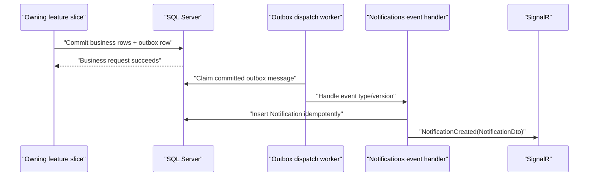

# Backend Notification Integration Guide

Status: **implemented backend contract**  
Scope: in-app notifications only. Email and SMS delivery are intentionally deferred.

This guide is for SmartCourt backend developers who need a feature slice to cause an in-app notification. It documents the code that exists today; it does not define a public notification-creation API and it does not require frontend changes.

## The integration rule

Persist a semantic outbox event in the **same EF Core unit of work** as the business change. The Notifications slice consumes that committed event, chooses the recipient and content, inserts the inbox row idempotently, and broadcasts the persisted DTO through SignalR.

A producer feature must not call any of these directly:

- `NotificationsHub` or `IHubContext`;
- `INotificationService`;
- `IEmailProvider` or `ISmsProvider`;
- Hangfire;
- MediatR for notification dispatch.

There is currently no `INotificationPublisher`, `NotificationRequestedV1`, public create endpoint, or test-only create endpoint. Add a semantic outbox event and a Notifications-side consumer instead.

## Runtime flow



The producer request completes after its business transaction commits. It does not wait for the notification to appear. The configured outbox worker normally claims work about every second; the existing recurring dispatcher remains a recovery path.

## Notifications implemented today

The Notifications slice currently consumes version `1` of these existing proposal events:

| Source event | Recipient | Notification type | Severity | Title | Body |
|---|---|---|---|---|---|
| `ProposalCreated` | `LawyerUserId` | `proposal.created` | `Information` | `عرض جديد` | `أرسل إليك موكل عرضًا جديدًا لمراجعته.` |
| `ProposalAccepted` | `ClientUserId` | `proposal.accepted` | `Success` | `تم قبول العرض` | `وافق المحامي على عرضك.` |
| `ProposalRejected` | `ClientUserId` | `proposal.rejected` | `Warning` | `تم رفض العرض` | `رفض المحامي عرضك. يمكنك مراجعة التفاصيل واختيار محامٍ آخر.` |

All three mappings use:

- action URL: `/proposals/{proposalId}`;
- data: `proposalId` and `legalCaseId` as string GUID values;
- source event ID: the persisted outbox message ID;
- creation time: the outbox message's UTC creation time.

The event-specific implementation is in `Features/Notifications/Events/ProposalNotificationEventMapper.cs`. The shared `NotificationOutboxHandler.cs` owns idempotent persistence and SignalR delivery for every registered notification mapper.

The Contracts integration currently consumes these semantic facts:

| Source event | Recipient | Notification type | Severity | Arabic title |
|---|---|---|---|---|
| `ContractCreated` V1 | Client | `contract.created` | `Information` | `مسودة عقد جديدة` |
| `ContractDraftUpdated` V1 | Client | `contract.draft-updated` | `Warning` | `تم تحديث مسودة العقد` |
| `ContractAccepted` V2, first participant only | Other participant | `contract.acceptance-recorded` | `Information` | `موافقة جديدة على العقد` |
| `ContractActivated` V1 | Client and Lawyer | `contract.activated` | `Success` | `تم تفعيل العقد` |
| `ContractCompleted` V1 | Client and Lawyer | `contract.completed` | `Success` | `اكتمل العقد` |
| `ContractTerminationRequested` V1 | Counterparty; requester also while settlement remains pending | `contract.termination-requested` | `Warning` | `تم طلب إنهاء العقد` |
| `ContractTerminated` V1 | Client and Lawyer | `contract.terminated` | `Warning` | `تم إنهاء العقد` |

Every Contract notification has `actionUrl: null` until the frontend team approves a Contract route. Its `data` contains string GUID values for `contractId`, `proposalId`, and `legalCaseId`. Historical `ContractAccepted` V1 messages are consumed as safe no-ops because they did not record the accepting actor; guessing a recipient from current state could notify the wrong participant.

The Milestones integration consumes these version `1` semantic facts:

| Source event | Recipient | Notification type | Severity |
|---|---|---|---|
| `MilestoneCreated` | Other participant | `milestone.created` | `Information` |
| `MilestoneDraftUpdated` | Other participant | `milestone.draft-updated` | `Warning` |
| `MilestoneAcceptanceRecorded` | Participant whose approval is still required | `milestone.acceptance-recorded` | `Information` |
| `MilestoneApproved` | Client and Lawyer | `milestone.approved` | `Success` |
| `MilestoneReadyForFunding` | Client | `milestone.ready-for-funding` | `Information` |
| `MilestoneSubmitted` | Client | `milestone.submitted` | `Information` |
| `MilestoneChangesRequested` | Lawyer | `milestone.changes-requested` | `Warning` |
| `MilestoneAccepted` | Lawyer | `milestone.accepted` | `Success` |
| `MilestoneAutoAccepted` | Client / Lawyer | `milestone.auto-accepted` | `Warning` / `Success` |
| `MilestoneChangeRequestCreated` | Other participant | `milestone.change-request-created` | `Information` |
| `MilestoneChangeRequestApproved` | Requester | `milestone.change-request-approved` | `Success` |
| `MilestoneChangeRequestRejected` | Requester | `milestone.change-request-rejected` | `Warning` |
| `MilestoneChangeRequestCancelled` | Other participant | `milestone.change-request-cancelled` | `Information` |

Every Milestone notification has `actionUrl: null` and string GUID values for `milestoneId`, `contractId`, `proposalId`, and `legalCaseId`; formal change-request items additionally contain `changeRequestId`. `MilestoneNotificationEventMapper` gets recipient and relationship facts through the Milestones-owned `IMilestoneNotificationContextReader`. It never trusts a request-provided recipient and never copies milestone descriptions, notes, reasons, amounts, or file identifiers into the notification.

For new Milestone actions, follow the same small extension pattern: emit or reuse a semantic outbox fact inside the existing Milestone transaction, then extend `MilestoneNotificationEventMapper`. Do not call the notification service from `MilestoneService`, and do not add notification code to a controller. The implemented draft and participant-approval events are the reference examples when an existing lifecycle event is not sufficient.

The Payments/Wallet integration consumes these version `1` facts:

| Source event | Recipient | Notification type | Severity |
|---|---|---|---|
| `MilestoneFundingStarted` | Lawyer | `milestone.funding-started` | `Information` |
| `MilestoneFunded` | Client and Lawyer | `milestone.funded` | `Success` |
| `MilestoneFundingFailed` | Client | `milestone.funding-failed` | `Critical` |
| `FundsReleased` | Client and Lawyer | `funds.released` | `Success` |
| `FundsRefunded` | Client / Lawyer | `funds.refunded` | `Success` / `Information` |
| `WithdrawalCompleted` | Lawyer | `wallet.withdrawal-completed` | `Success` |
| `WithdrawalFailed` | Lawyer | `wallet.withdrawal-failed` | `Warning` |
| `WithdrawalDelayed` | Lawyer | `wallet.withdrawal-delayed` | `Warning` |
| `WalletAdjusted` | Lawyer | `wallet.adjusted` | `Warning` |

`PaymentNotificationEventMapper` reuses `IMilestoneNotificationContextReader` for funding and settlement relationships and uses the Payments-owned `IPaymentNotificationContextReader` for withdrawals and adjustments. The reader resolves recipients from committed authoritative rows; payload recipient IDs are checked against those rows rather than trusted. Existing funding/release/refund events require no producer change. `WalletService` emits withdrawal outcomes only at real completed, failed, or SLA-delayed transitions, while `AdminWalletAdjustmentService` emits `WalletAdjusted` inside its existing serializable transaction.

All Payments/Wallet notifications use `actionUrl: null`. Funding data is `milestoneId`, `contractId`, `proposalId`, and `legalCaseId`; settlement data additionally contains `escrowHoldId` and `paymentTransactionId`; withdrawal data contains only `withdrawalId`; adjustment data contains `walletAdjustmentId` and `contractId`. Amounts, currency, payment/destination references, provider identifiers, failure details, administrative reasons, and idempotency keys are never copied into the inbox payload.

## Administrative Verification integration (Gate 5)

The Admin Verifications slice emits these version `1` semantic events from its existing handlers. Each event is queued in the same EF unit of work before the existing save/commit; the owning slice does not call `INotificationService`, SignalR, Email, SMS, or Hangfire. `VerificationNotificationEventMapper` resolves the recipient and current status through the Verification-owned `IVerificationNotificationContextReader`.

| Source event | Trigger and recipient | Notification type | Severity | Exact Arabic title | Exact Arabic body |
|---|---|---|---|---|---|
| `VerificationDocumentApproved` V1 | A current document changes to `Verified`; document owner | `verification.document-approved` | `Success` | `تم اعتماد مستند التحقق` | `تم اعتماد أحد مستندات التحقق الخاصة بك. يمكنك متابعة حالة التحقق من حسابك.` |
| `VerificationDocumentRejected` V1 | A current document changes to `Rejected`; document owner | `verification.document-rejected` | `Warning` | `تم رفض مستند التحقق` | `تم رفض أحد مستندات التحقق الخاصة بك. يرجى مراجعة التفاصيل واستبدال المستند عند الحاجة.` |
| `VerificationDocumentExpired` V1 | Review discovers a current document is expired; document owner | `verification.document-expired` | `Warning` | `انتهت صلاحية مستند التحقق` | `انتهت صلاحية أحد مستندات التحقق الخاصة بك. يرجى إعادة رفع مستند ساري المفعول.` |
| `VerificationAccountApproved` V1 | Account actually transitions to `Active`; affected user only | `account.approved` | `Success` | `تم اعتماد حسابك` | `تم اعتماد حسابك وأصبح جاهزًا للاستخدام.` |
| `VerificationAccountRejected` V1 | Account actually transitions to `Rejected`; affected user only | `account.rejected` | `Critical` | `تم رفض الحساب` | `تم رفض طلب اعتماد حسابك. يرجى مراجعة التفاصيل واتخاذ الإجراء المطلوب.` |

All five mappings use `actionUrl: null`. Document event data contains only string GUID `documentId` and the English `documentType`; account event data contains only string GUID `userId`. The source payload may carry the bounded authoritative IDs/type/status needed for mapper validation, but it never carries a storage path, file URL/content, full rejection reason, private review comment, Email, phone, national number, provider ID, token, or idempotency key. `account.approved` is emitted only for a real transition to `Active`, never once per approved document.

The shared `NotificationOutboxHandler` uses the committed outbox message ID for idempotent inbox materialization and SignalR delivery. Replayed requests and repeated decisions therefore preserve the existing endpoint result without creating duplicate notification rows. REST remains the durable source of truth through the normal notification list/count/read/read-all endpoints; SignalR is best-effort and may duplicate an already persisted item, so clients reconcile by notification ID.

Gate 5 is verified by `SmartCourt.Tests/Features/Notifications/VerificationNotificationEventMapperTests.cs` and [`AdminVerificationNotifications_Report.md`](../../../SmartCourt.Tests/HttpTests/AdminVerificationNotifications_Report.md). The HTTP artifact covers authorization boundaries, pending/detail/content routes, approve/reject/expiry, account transitions, concurrency/conflicts, validation, exact Arabic snapshots, forbidden metadata, recipient isolation, mock Email confirmation, and API/outbox/provider log monitoring.

## User Verification Submission integration (Gate 6)

`SubmitVerificationDocumentsHandler` emits one `VerificationReviewRequested` version `1` event before its existing `SaveChangesAsync` when at least one requested document is successfully persisted. The event uses the submitting account as its aggregate, records only the account ID and successful document count, and is committed atomically with the document rows, stored-file rows, and `PendingReview` state. A partial upload therefore creates one event for the successful subset; a multi-file request still creates one event rather than one event per file. Failed-only validation or upload outcomes enqueue no event.

`VerificationNotificationEventMapper` resolves recipients through `IVerificationNotificationContextReader`. The context reader queries Identity membership for the exact `Admin` role only. It does not infer recipients from a request payload, include `SuperAdministrator`, or notify the uploading user. The mapper returns one draft per Admin, with no draft when there are no Admin role members. Existing MediatR request handlers remain in place; no MediatR notification dispatch was added.

| Source event | Trigger and recipient | Notification type | Severity | Exact Arabic title | Exact Arabic body | Data | `actionUrl` |
|---|---|---|---|---|---|---|---|
| `VerificationReviewRequested` V1 | At least one document is persisted by a user verification submission; every exact `Admin` role member | `verification.review-requested` | `Information` | `طلب مراجعة مستندات التحقق` | `تم رفع مستندات تحقق جديدة لأحد المستخدمين. يرجى مراجعتها واتخاذ الإجراء المناسب.` | `userId`, `documentCount` | `null` |

The event payload and notification data never contain storage paths, file URLs/content, file names, private review metadata, rejection reasons, Email addresses, phone numbers, national numbers, provider IDs, tokens, or idempotency keys. The source outbox message ID is the idempotency key used internally by `NotificationOutboxHandler`; replaying a message preserves one persisted row per `(source event, Admin recipient, type)`. REST list/count/read/read-all remains durable, and SignalR delivers the persisted DTO best-effort.

Gate 6 is verified by `VerificationNotificationEventMapperTests` and [`UserVerificationNotifications_Report.md`](../../../SmartCourt.Tests/HttpTests/UserVerificationNotifications_Report.md). The report records `147 passed, 0 failed, 1 documented skip` and proves the action response precedes notification polling for successful, partial, multi-file, and replacement uploads, while failed-only uploads create no event. It also covers every UserVerification endpoint, deletion, ownership boundaries, exact Arabic data, forbidden fields, Admin-only isolation, mock Email confirmation, API/outbox/provider monitoring, API shutdown, and port release.

## Quick start: add notifications for your slice

Before adding a trigger, check the [Notification Opportunity Catalog](./notification_opportunity_catalog.md). It records the agreed candidate story, recipient, priority, proposed type, and whether an existing event can be reused. The catalog is analysis, so selecting a story for implementation still requires inclusion in an approved integration plan.

For a normal slice integration, the team member changes **two areas only**:

| Area | What to add |
|---|---|
| Your owning slice | A small business event payload and one `IOutboxWriter.EnqueueAsync(...)` call inside the existing business transaction. Skip this when a suitable outbox event already exists. |
| `Features/Notifications/Events` | One `INotificationEventMapper` that converts the event into one or more in-app notification drafts, plus one DI registration. |

You do **not** add or change a notification controller, hub, entity, migration, REST endpoint, or frontend file for each slice.

### Five-minute integration checklist

Suppose the `CaseReview` slice needs to notify a client when a review is completed.

#### Step 1: declare the business event

Put the event contract with the owning slice's integration events, not in the Notifications DTO folder:

```csharp
namespace SmartCourt.Features.CaseReview.Events;

public static class CaseReviewEventTypes
{
    public const string Completed = "CaseReviewCompleted";
}

public sealed record CaseReviewCompletedV1(
    Guid CaseReviewId,
    Guid ClientUserId);
```

If an equivalent outbox event already exists, reuse it and skip this step.

#### Step 2: enqueue it with the business change

Inject `IOutboxWriter` into the slice's service/handler. Enqueue before the transaction commits:

```csharp
dbContext.CaseReviews.Update(caseReview);

await outboxWriter.EnqueueAsync(
    new OutboxEvent(
        EventType: CaseReviewEventTypes.Completed,
        EventVersion: 1,
        Payload: new CaseReviewCompletedV1(
            caseReview.Id,
            caseReview.ClientUserId),
        AggregateType: nameof(CaseReview),
        AggregateId: caseReview.Id,
        CorrelationId: correlationId),
    cancellationToken);

// The business row and outbox row are committed together.
await dbContext.SaveChangesAsync(cancellationToken);
```

`correlationId` should be the operation's existing correlation ID when one is available; otherwise create it once for the operation. Do not create a different correlation ID for every related event.

#### Step 3: add one Notifications-side event mapper

Create `Features/Notifications/Events/CaseReviewNotificationEventMapper.cs`. This file owns payload validation, recipient selection, and user-visible Arabic copy. It does not persist or broadcast anything:

```csharp
internal sealed class CaseReviewNotificationEventMapper
    : INotificationEventMapper
{
    public IReadOnlyCollection<string> EventTypes =>
        [CaseReviewEventTypes.Completed];

    public Task<IReadOnlyCollection<NotificationDraft>> MapAsync(
        OutboxMessage message,
        CancellationToken cancellationToken)
    {
        if (message.EventVersion != 1)
        {
            throw new InvalidOperationException(
                $"Case review notification event version {message.EventVersion} is unsupported.");
        }

        var payload = JsonSerializer.Deserialize<CaseReviewCompletedV1>(
            message.Payload,
            new JsonSerializerOptions(JsonSerializerDefaults.Web)
            {
                PropertyNameCaseInsensitive = true
            }) ?? throw new InvalidOperationException(
                "Case review notification payload is invalid.");

        if (payload.CaseReviewId == Guid.Empty
            || payload.CaseReviewId != message.AggregateId)
        {
            throw new InvalidOperationException(
                "Case review aggregate and payload identifiers do not match.");
        }

        NotificationDraft draft = new(
            RecipientUserId: payload.ClientUserId,
            Type: "case-review.completed",
            Severity: NotificationSeverity.Success,
            Title: "اكتملت مراجعة القضية",
            Body: "مراجعة قضيتك جاهزة الآن.",
            ActionUrl: null,
            Data: new Dictionary<string, string>
            {
                ["caseReviewId"] = payload.CaseReviewId.ToString()
            });

        return Task.FromResult<IReadOnlyCollection<NotificationDraft>>([draft]);
    }
}
```

The example text is illustrative. SmartCourt notification titles and bodies are Arabic by default; machine contracts such as event types, notification types, and `data` keys remain English. Leave `ActionUrl` as `null` until the frontend team confirms a real route. Never accept title, body, severity, or action URL directly from the HTTP request.

#### What is stored, and when the mapper runs

The mapper runs once when the outbox dispatcher handles the committed source event. Its Arabic `Title` and `Body` are materialized into the `Notifications` row at that time. REST reads and SignalR recovery read that persisted snapshot; they do not rerun the mapper.

The following values intentionally remain English because they are machine contracts, not display copy:

- outbox `EventType`, such as `ContractCompleted`;
- notification `Type`, such as `contract.completed`;
- `data` keys, such as `contractId` and `milestoneId`.

Changing mapper copy affects only notifications created from subsequently dispatched events. It does not rewrite historical rows. If historical display copy ever needs correction, use an explicit reviewed data migration rather than relying on mapper execution during reads.

#### Step 4: register the mapper

Add one scoped mapper registration in `DependencyInjection.cs` next to the Proposal mapper:

```csharp
services.AddScoped<
    INotificationEventMapper,
    CaseReviewNotificationEventMapper>();
```

Do not add another `IOutboxEventHandler`. The existing shared `NotificationOutboxHandler` automatically advertises all registered mapper event types, materializes each draft using the database uniqueness rule, saves the batch once, and broadcasts the persisted DTOs. It rejects duplicate mapper ownership of the same event type during dependency activation.

#### Step 5: add mapper tests

Cover the supported event/version, exact Arabic copy, authoritative recipient, aggregate/payload mismatch, retry idempotency, and expected `data`. No controller or hub registration is required for a new notification type.

#### Step 6: verify it

At minimum, prove:

1. completing the real CaseReview operation writes the outbox event;
2. the intended client eventually receives `case-review.completed` from `GET /api/notifications`;
3. another user cannot read or update it;
4. replaying the same outbox message creates only one row;
5. mark-read and unread-count work without any slice-specific API changes.

Use bounded polling in the HTTP test because notification creation is asynchronous. The existing `SmartCourt.Tests/HttpTests/Notifications_Test.ps1` is the reference lifecycle.

### What each slice team member actually owns

For one new notification type, the expected change set is usually:

```text
SmartCourt/Features/<YourSlice>/Events/<YourSlice>EventTypes.cs
SmartCourt/Features/<YourSlice>/Events/<YourEvent>V1.cs
SmartCourt/Features/<YourSlice>/<BusinessServiceOrHandler>.cs
SmartCourt/Features/Notifications/Events/<YourSlice>NotificationEventMapper.cs
SmartCourt/DependencyInjection.cs
SmartCourt.Tests/Features/Notifications/<YourSlice>NotificationTests.cs
```

When the semantic event already exists, the first three entries normally require no changes. The slice team adds only the Notifications mapper, registration, and tests.

### When this quick path is not appropriate

- **Broadcast to many or all users:** recipient expansion, batching, and rate limits need a reviewed design; do not loop over all users inside a request.
- **User-entered announcement text:** V1 has no trusted direct-notification contract; do not write `Notification` rows from the owning slice.
- **Email/SMS:** deferred; do not call channel providers from the slice.
- **Sensitive/security message:** obtain a security review for payload, copy, retention, and future channel policy.

## Detailed integration rules

### 1. Define or reuse a semantic event

Prefer a business fact that remains meaningful outside notifications, for example `ProposalCreated`, `MilestoneSubmitted`, or `DisputeResolved`. Reuse an existing event when its payload already provides authoritative recipient/resource IDs.

For a new fact, define:

- an immutable event-type constant;
- an explicit integer version, starting at `1`;
- a small payload record containing IDs and bounded state needed by consumers.

Keep rendered title/body text, action-route formatting, severity, and channel policy out of the producing feature.

### 2. Enqueue the event in the business unit of work

Inject the existing `IOutboxWriter`. Add the business entity changes and enqueue the `OutboxEvent` before the unit of work is committed.

This is the existing Proposal pattern, simplified to highlight the transaction boundary:

```csharp
dbContext.Proposals.Add(proposal);

await outboxWriter.EnqueueAsync(
    new OutboxEvent(
        EventType: ContractPaymentEventTypes.ProposalCreated,
        EventVersion: 1,
        Payload: new ProposalEventPayload(
            proposal.Id,
            proposal.LegalCaseId,
            proposal.ClientUserId,
            proposal.LawyerUserId),
        AggregateType: nameof(Proposal),
        AggregateId: proposal.Id,
        CorrelationId: Guid.NewGuid()),
    cancellationToken);

await dbContext.SaveChangesAsync(cancellationToken);
```

Required ordering:

1. Track the business mutation.
2. Enqueue the outbox message on the same scoped `ApplicationDbContext`.
3. Commit the unit of work.
4. Return without calling Notifications, SignalR, Email, or SMS.

If the operation uses an explicit transaction and multiple saves, ensure both the business mutation and outbox row are inside that transaction. A rollback must remove both.

### 3. Map the event inside Notifications

Add one Notifications-owned `INotificationEventMapper`. The mapper must:

1. advertise its supported event types through `EventTypes`;
2. reject unsupported event versions;
3. deserialize with the repository JSON conventions;
4. validate required IDs and aggregate/payload consistency;
5. resolve trusted recipients from authoritative event data or database state;
6. return zero, one, or several `NotificationDraft` values containing server-owned Arabic plain text, severity, an optional safe relative route, and small metadata.

Register it as `INotificationEventMapper` in `DependencyInjection.cs`. The shared `NotificationOutboxHandler` owns the unique `(SourceEventId, RecipientUserId, Type)` lookup, insertion, one-batch save, and post-persistence SignalR broadcast. Do not reproduce that infrastructure in a slice mapper and do not register a MediatR request/notification handler.

### 4. Add tests before enabling the mapping

At minimum, cover:

- each supported type/version maps to the intended recipient and copy;
- unknown type and unsupported version fail deterministically;
- invalid or mismatched aggregate/payload IDs are rejected;
- replaying the same outbox message produces one inbox row;
- different recipients/types may legitimately produce separate rows;
- the persisted DTO is broadcast to the authenticated recipient;
- no Email/SMS provider is invoked;
- another user cannot fetch or mark the notification read.

For a complete feature lifecycle, extend the PowerShell methodology used by `SmartCourt.Tests/HttpTests/Notifications_Test.ps1`: perform a real authenticated business operation, poll the recipient's feed with a bounded timeout, then test read behavior. Never insert a notification directly into SQL for an end-to-end test.

## Event and payload rules

### Stable names and versions

- Treat an event type string as an immutable machine contract.
- Start at version `1` and add a new payload/version for breaking changes.
- Do not silently reinterpret an old version.
- Keep integration payload records out of controller DTO folders.

### Minimal and non-sensitive data

Use authoritative IDs and small bounded values. Do not include:

- Email addresses or phone numbers;
- access, refresh, verification, or password-reset tokens;
- payment method references;
- evidence/document content or private storage paths;
- full entity snapshots;
- rendered HTML;
- client-supplied recipient IDs that have not been re-authorized.

Notification title and body are persisted history and may later be surfaced through more channels, so keep them concise and avoid unnecessary personal or legal details.

### Recipient resolution

Prefer participant IDs captured when the event occurred. When current database state must be loaded, treat missing/ineligible recipients as a deliberate deterministic outcome rather than an endless transient retry.

The source endpoint must still authorize the business operation. Notification delivery never grants access to the resource named by `actionUrl` or `data`.

### Idempotency and retries

Outbox delivery is at least once. The notification table's unique `(SourceEventId, RecipientUserId, Type)` key makes materialization effectively once.

A handler retry can find the existing row and broadcast it again. This is supported behavior. Consumers deduplicate by notification `id`; backend code must not generate a replacement ID for an already materialized source/recipient/type tuple.

## Notification content contract

Mappings must respect the entity constraints:

| Field | Rule |
|---|---|
| `Type` | Required stable machine code, maximum 100 characters. |
| `Severity` | `Information`, `Success`, `Warning`, or `Critical`. |
| `Title` | Required plain text, maximum 200 characters. |
| `Body` | Required plain text, maximum 1,000 characters. |
| `ActionUrl` | Optional relative application route, maximum 500 characters; must start with one `/`, must not start `//`, contain backslashes/control characters, or be absolute. |
| `Data` | Optional JSON object of string values in the public DTO; stored JSON is limited to 4,000 characters. |
| `CreatedAtUtc` | UTC. |
| `ExpiresAtUtc` | Optional UTC value later than creation. Expired rows are omitted from feed and unread count. |

Type strings should use lower-case dotted namespaces such as `proposal.created`. Existing type semantics are a client contract; changing the meaning of an existing type requires compatibility review.

## Backend API boundary

The Notifications slice owns only authenticated inbox consumption:

| Method | Route | Result |
|---|---|---|
| `GET` | `/api/notifications` | Cursor-paged `NotificationPageDto`. |
| `GET` | `/api/notifications/unread-count` | `UnreadNotificationCountDto`. |
| `PATCH` | `/api/notifications/{notificationId}/read` | Updated `NotificationDto`. |
| `PATCH` | `/api/notifications/read-all` | `NotificationsReadAllDto`. |

There is no public create or delete route. Every operation derives the recipient from the authenticated user. Marking another user's notification returns `404`, preventing ownership disclosure.

The exact REST and SignalR payload contract for consumers is in [Frontend Notification Integration Guide](./frontend_integration_guide.md).

## Operations and failure behavior

The `OutboxDispatch` settings are strongly typed:

```json
{
  "OutboxDispatch": {
    "Enabled": true,
    "BatchSize": 100,
    "IdleDelayMilliseconds": 1000,
    "ErrorDelayMilliseconds": 5000
  }
}
```

- `Enabled`: starts/stops the short-interval hosted worker.
- `BatchSize`: maximum messages requested per dispatch pass.
- `IdleDelayMilliseconds`: wait after a successful/idle pass.
- `ErrorDelayMilliseconds`: wait after an infrastructure failure.

Operational expectations:

- a producer succeeds once its transaction commits, even if notification processing occurs shortly afterward;
- poison payload/version failures remain visible on the outbox retry path;
- SignalR failure must not roll back or delete a persisted notification;
- logs may contain event ID, notification ID, recipient ID, type, and status, but not bodies, contact details, or tokens;
- REST remains the recovery path whenever SignalR is missed or duplicated.

## Email and SMS boundary

Email and SMS are not part of this increment. Do not add channel flags to producer payloads and do not call existing provider interfaces from notification mappings.

A later approved increment may add server-owned fallback policies and delivery-attempt rows. It must reuse the same semantic events and preserve the existing REST/SignalR contract. No current producer should need to change merely because a fallback channel is introduced.

## Backend review checklist

- [ ] A semantic event is reused or introduced intentionally.
- [ ] Business changes and the outbox row share one committed transaction.
- [ ] The payload is versioned, minimal, and contains no secrets/contact details.
- [ ] The producer contains no notification copy, SignalR, Email, SMS, Hangfire, or MediatR dispatch call.
- [ ] The Notifications mapper owns recipient, type, severity, text, route, and metadata.
- [ ] Recipient and resource IDs are authoritative and ownership-safe.
- [ ] Duplicate handling produces one inbox row.
- [ ] SignalR duplicates are safe and the same persisted ID is reused.
- [ ] Type/version, idempotency, authorization, and REST lifecycle tests pass.
- [ ] `TimeProvider`, async APIs, and `CancellationToken` are used consistently.
- [ ] No public create endpoint or direct SQL test shortcut was introduced.
- [ ] Email/SMS remain untouched in the in-app-only increment.

## Related documentation

- [Architecture Decision](./architecture.md)
- [Notification Opportunity Catalog](./notification_opportunity_catalog.md)
- [Frontend/API Contract](./frontend_integration_guide.md)
- [Implemented Plan and Verification](./implementation_plan.md)
- [Milestones Notification HTTP Verification Report](../../../SmartCourt.Tests/HttpTests/MilestonesNotifications_Report.md)
