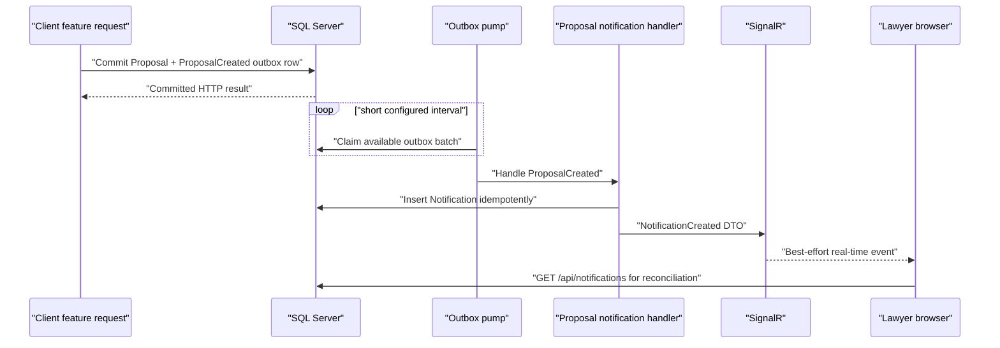

# In-App Notifications V1 Implementation Plan

Status: **Backend implementation and Gate 5/Gate 6 notification verification complete; Gate 6 stopped for review**

Verification on 2026-08-11:

- solution build: passed;
- Gate 5 focused mapper, local-provider, and Admin Verification tests: `23/23` passed;
- Gate 5 monitored PowerShell HTTP lifecycle: `122/122` assertions passed, with
  three documented environment/fixture skips;
- latest full repository baseline from Gate 3: `710 passed, 24 failed, 0 skipped`
  out of `734`; all failures are the known legacy HTTP `201 Created` versus runtime
  `200 OK` expectations. No Notification or Gate 5 test failed.
- Gate 5 administrative verification HTTP report: `122 passed, 0 failed, 3 skipped`;
  the report includes mock Email confirmation, exact Arabic snapshots, expiry,
  transition deduplication, concurrency, recipient isolation, and clean API/
  outbox/provider monitoring.
- Gate 6 focused mapper/admin-verification regression: `21 passed, 0 failed`;
- Gate 6 monitored User Verification HTTP report: `147 passed, 0 failed, 1 skipped`;
  the report covers every UserVerification endpoint, successful/partial/multi-file/
  replacement uploads, deletion, ownership, Admin-only recipients, exact Arabic
  snapshots, forbidden metadata, mock Email confirmation, clean logs, and port release.

This plan implements the first approved increment of the SmartCourt notification system: a durable in-app inbox, authenticated REST APIs, SignalR delivery, and transactional-outbox triggers. Email and SMS are deliberately deferred.

## 1. Scope

### Included

- SQL Server-backed notification persistence.
- A Pure Vertical Slice under `SmartCourt/Features/Notifications` with controller, service interface/implementation, DTOs, validators, entity, event consumers, hub, and real-time notifier.
- Authenticated feed, unread-count, mark-one-read, and mark-all-read endpoints.
- Strongly typed SignalR events at `/hubs/notifications`.
- Notification creation from the existing `ProposalCreated`, `ProposalAccepted`, and `ProposalRejected` transactional outbox events.
- Effectively-once inbox materialization under at-least-once outbox delivery.
- A short-interval hosted outbox pump for near-real-time processing, with the existing Hangfire recurring dispatch retained as recovery.
- Backend unit, persistence, integration, authorization, outbox, and SignalR tests.
- A comprehensive PowerShell HTTP lifecycle test and Markdown report.

### Explicitly deferred

- Calls to `IEmailProvider` or `ISmsProvider`.
- Delivery-policy fields and `NotificationDelivery` records.
- Email/SMS scheduling, retries, receipts, templates, or escalation settings.
- Push/mobile notifications.
- User channel preferences and quiet hours.
- A distributed SignalR backplane; the initial deployment remains a single monolith instance.
- A public/test-only endpoint that directly creates notifications.
- Frontend package, store, connection-manager, bell, inbox, or layout changes. The
  frontend guide remains the server contract for a later frontend increment.

The deferred channel increment will consume the same persisted `Notification` records and event mappings. It must not require breaking changes to the V1 REST or SignalR DTOs.

## 2. Fixed architectural decisions

1. **No MediatR in the Notifications slice.** HTTP endpoints call `INotificationService`; background triggers implement the existing `IOutboxEventHandler` contract.
2. **REST is authoritative.** SignalR is a best-effort, potentially duplicate acceleration path.
3. **The existing transactional outbox is the trigger bus.** Producer features never invoke the hub directly.
4. **The entity belongs to the slice.** Use `Features/Notifications/Entities/Notification.cs`, consistent with the rule that feature-owned entities remain in their slice.
5. **Configuration follows the repository, not a hypothetical folder.** EF configuration goes in `SmartCourt/Persistence/Configurations`, because that is the actual configuration root currently applied by `ApplicationDbContext`.
6. **Cursor pagination uses a generated sequence.** A SQL `bigint IDENTITY` sequence avoids unstable page-number results and avoids database-specific GUID comparison logic.
7. **No SaveChanges dispatch interceptor in V1.** A short-interval hosted pump avoids the fact that `SavedChangesAsync` may occur before an explicit outer transaction commits.
8. **No public create endpoint.** The first E2E trigger is a real Proposal operation.

## 3. Target runtime flow



If SignalR delivery fails after the row is committed, the outbox handler remains retryable. A retry finds the existing notification through its idempotency key and may broadcast it again. The frontend deduplicates by notification `id`.

## 4. Domain and persistence changes

### 4.1 Notification entity

Create `SmartCourt/Features/Notifications/Entities/Notification.cs` as a sealed entity with a private EF constructor and guarded factory/mutation methods.

Fields:

| Field | Type | Rules |
|---|---|---|
| `Id` | `Guid` | Non-empty public identifier. |
| `Sequence` | `long` | Database-generated `IDENTITY`; immutable and unique. |
| `RecipientUserId` | `Guid` | Required user FK; immutable. |
| `SourceEventId` | `Guid` | Required outbox message ID; immutable. |
| `Type` | `string` | Required stable machine code, non-Unicode, max 100. |
| `Severity` | enum | `Information`, `Success`, `Warning`, `Critical`; persisted as integer. |
| `Title` | `string` | Required plain text, Unicode, max 200. |
| `Body` | `string` | Required plain text, Unicode, max 1,000. |
| `ActionUrl` | `string?` | Optional relative route, Unicode, max 500. |
| `DataJson` | `string?` | Optional non-sensitive JSON, Unicode, max 4,000. |
| `CreatedAtUtc` | `DateTime` | Required UTC value from `TimeProvider`. |
| `ReadAtUtc` | `DateTime?` | Null until read; UTC when present. |
| `ExpiresAtUtc` | `DateTime?` | Optional UTC business expiry. |
| `RowVersion` | `byte[]` | SQL rowversion concurrency token. |

Entity behavior:

- `Create(...)` validates IDs, UTC timestamps, lengths, relative action URL, valid severity, and JSON size/shape.
- `MarkRead(DateTime nowUtc)` is idempotent: the first call stores `ReadAtUtc`; later calls preserve the original timestamp.
- `IsRead` is a derived property and is not mapped as a second source of truth.
- No Data Annotations, public property setters, Email/SMS fields, soft-delete flag, or navigation collection is required.

Create `SmartCourt/Features/Notifications/Enums/NotificationSeverity.cs` with explicit values `1..4`.

### 4.2 EF Core configuration

Create `SmartCourt/Persistence/Configurations/NotificationConfiguration.cs`:

- table name `Notifications` and PK on `Id`;
- `Sequence` generated on add as `bigint IDENTITY` with a unique index;
- required/max-length/Unicode rules listed above;
- UTC property conventions for all timestamps;
- rowversion concurrency configuration;
- `RecipientUserId -> AspNetUsers.Id` with `DeleteBehavior.Restrict`;
- unique idempotency index named `UX_Notifications_Source_Recipient_Type` on `(SourceEventId, RecipientUserId, Type)`;
- feed index named `IX_Notifications_Recipient_Sequence` on `(RecipientUserId, Sequence DESC)`;
- filtered unread index named `IX_Notifications_Recipient_Unread_Sequence` on recipient/sequence with `[ReadAtUtc] IS NULL`;
- check constraint for severity range and a positive sequence where supported.

Update `ApplicationDbContext` with `DbSet<Notification> Notifications` and import only the slice entity namespace. Do not add notification auditing to the contract/payment append-only guards.

### 4.3 Migration

Generate one migration named `AddInAppNotificationsV1` from the active `ApplicationDbContext` model. Use the canonical `SmartCourt/Migrations` output directory because that directory owns the current `ApplicationDbContextModelSnapshot`. Do not hand-author the designer or snapshot.

Before accepting the migration:

1. List discoverable migrations and confirm the mixed historical `Migrations`/`Persistence/Migrations` namespaces are understood.
2. Verify the generated `Up` only creates the V1 `Notifications` table/indexes/FK/check constraints.
3. Verify it does not recreate the notification table removed by `20260806182109_RemoveNotificationsTable` in an unintended historical position.
4. Verify `Down` drops only the V1 table.
5. Generate an idempotent SQL script and inspect it.
6. Test both a fresh database and an upgrade from the current latest migration.

No `NotificationDelivery` table is created in V1.

## 5. Notification vertical slice

### 5.1 Implemented file structure

```text
SmartCourt/Features/Notifications/
├── NotificationsController.cs
├── INotificationService.cs
├── NotificationService.cs
├── DTOs/
│   ├── GetNotificationsRequest.cs
│   ├── NotificationDto.cs
│   ├── NotificationPageDto.cs
│   ├── NotificationReadDto.cs
│   ├── NotificationsReadAllDto.cs
│   └── UnreadNotificationCountDto.cs
├── Validators/
│   └── GetNotificationsRequestValidator.cs
├── Entities/
│   └── Notification.cs
├── Enums/
│   └── NotificationSeverity.cs
├── Hubs/
│   ├── INotificationClient.cs
│   └── NotificationsHub.cs
├── Realtime/
│   ├── INotificationRealtimeNotifier.cs
│   └── SignalRNotificationRealtimeNotifier.cs
├── Events/
│   ├── INotificationEventMapper.cs
│   ├── NotificationDraft.cs
│   ├── NotificationOutboxHandler.cs
│   └── ProposalNotificationEventMapper.cs
└── Shared/
    ├── NotificationCursor.cs
    └── NotificationJson.cs
```

No command/query handler folders and no MediatR request types are added.

### 5.2 REST service contract

`INotificationService` exposes async methods with cancellation tokens:

```csharp
Task<NotificationPageDto> GetAsync(
    GetNotificationsRequest request,
    CancellationToken cancellationToken);

Task<UnreadNotificationCountDto> GetUnreadCountAsync(
    CancellationToken cancellationToken);

Task<NotificationDto> MarkReadAsync(
    Guid notificationId,
    CancellationToken cancellationToken);

Task<NotificationsReadAllDto> MarkAllReadAsync(
    CancellationToken cancellationToken);
```

Service rules:

- Require the user ID through `ICurrentUserService.RequireUserId`.
- Every query/update includes `RecipientUserId == currentUserId`.
- Use `AsNoTracking()` for reads.
- Manually map entities to DTOs; do not use AutoMapper.
- Treat a notification owned by another user as not found.
- `MarkReadAsync` is idempotent and broadcasts `NotificationRead` only after a successful database save. A repeated call returns the original read timestamp.
- `MarkAllReadAsync` changes only the caller's unread rows, returns the server timestamp and zero unread count, and emits one `NotificationsReadAll` event.
- Domain/not-found failures use the existing exception middleware; no manual 500 responses.

### 5.3 Cursor pagination

`GetNotificationsRequest` fields:

- `string? Cursor`
- `int PageSize = 20`, valid range `1..50`
- `bool? IsRead`

`NotificationCursor` Base64Url-encodes the last returned positive `Sequence` as an opaque versioned cursor. Invalid, non-positive, oversized, or unsupported cursors fail validation with a standardized 400 response.

Query behavior:

- order by `Sequence DESC`;
- when a cursor is present, filter `Sequence < decodedSequence`;
- apply the optional read filter;
- fetch `PageSize + 1` to determine `nextCursor`;
- compute `unreadCount` for the current user independently of the page filter;
- exclude expired notifications from the active feed only if an expiry is present and passed; retention remains separate.

### 5.4 HTTP endpoints

Create an `[Authorize]`, `[ApiController]` controller at `api/notifications`:

| Method | Route | Response |
|---|---|---|
| `GET` | `/api/notifications` | `ApiResponse<NotificationPageDto>` |
| `GET` | `/api/notifications/unread-count` | `ApiResponse<UnreadNotificationCountDto>` |
| `PATCH` | `/api/notifications/{notificationId:guid}/read` | `ApiResponse<NotificationDto>` |
| `PATCH` | `/api/notifications/read-all` | `ApiResponse<NotificationsReadAllDto>` |

Controllers call the service directly and wrap successful results with `ApiResponse<T>.Ok`. FluentValidation handles query validation. No endpoint accepts `RecipientUserId`, creates a notification, deletes history, or selects a delivery channel.

### 5.5 DTO contract

`NotificationDto` exposes:

- `Id`
- `Type`
- `Severity` as a stable string
- `Title`
- `Body`
- `ActionUrl`
- parsed non-sensitive `Data`
- `CreatedAtUtc`
- `ReadAtUtc`
- `ExpiresAtUtc`

It does not expose recipient IDs, source event IDs, row versions, sequence values, provider fields, or raw JSON.

## 6. Transactional outbox integration

### 6.1 Initial event coverage

Register `ProposalNotificationEventMapper` behind the shared `NotificationOutboxHandler` for:

| Source event | Recipient | Notification type | Severity |
|---|---|---|---|
| `ProposalCreated` | `LawyerUserId` | `proposal.created` | `Information` |
| `ProposalAccepted` | `ClientUserId` | `proposal.accepted` | `Success` |
| `ProposalRejected` | `ClientUserId` | `proposal.rejected` | `Warning` |

All three are `InAppOnly` in V1. The mapper owns the plain-text title/body, safe relative `/proposals/{id}` action route, and a small JSON object containing `proposalId` and `legalCaseId`.

### 6.2 Mapper and shared-handler algorithm

For each message:

1. Require event version `1`.
2. Deserialize `ProposalEventPayload` case-insensitively.
3. Verify `payload.ProposalId == message.AggregateId`.
4. Return the approved recipient/type/Arabic copy as a `NotificationDraft`.
5. Let the shared handler look up each row by `(message.Id, recipientId, type)`.
6. If absent, construct the notification using `message.CreatedAt` as UTC creation time and save all drafts once.
7. Broadcast each persisted DTO through `INotificationRealtimeNotifier`.

If a retry finds an existing row, it skips insertion and rebroadcasts the existing DTO. A unique constraint remains the final concurrency guard. New slices add a mapper rather than duplicating persistence/SignalR logic. No producer change is required for the existing Proposal events.

### 6.3 Direct notification requests

No generic `INotificationPublisher`/`NotificationRequestedV1` contract exists in V1. A future direct-request contract remains deferred until a real non-lifecycle use case is selected and approved. V1 establishes the durable inbox and proves the preferred semantic-event route first.

### 6.4 Contracts extension

Contracts uses the same shared handler through `ContractNotificationEventMapper`. Existing creation, activation, completion, and termination facts are reused. Draft updates, actor-aware acceptance V2, and first termination requests add semantic outbox facts in their existing EF units of work. Contract notification copy is Arabic, metadata keys remain English, and `actionUrl` is `null` pending an approved frontend route.

The Contracts extension is verified by the mapper and service integration suites plus `SmartCourt.Tests/HttpTests/ContractsNotifications_Test.ps1`. Its monitored report records `146 passed, 0 failed`, including mock Email confirmation, exact Arabic contracts, both participant directions, funded/unfunded termination, completion, and recipient isolation. The full repository regression is `675 passed, 24 failed`; those failures are pre-existing HTTP `201 Created` expectations against the current `200 OK` runtime behavior.

### 6.5 Milestones extension

Milestones uses `MilestoneNotificationEventMapper` and a Milestones-owned `IMilestoneNotificationContextReader`. Draft creation/update and actor-aware participant approval add semantic outbox events inside the existing EF transactions; ready-for-funding, execution, automatic acceptance, and formal change-request mappings reuse existing outbox facts. The mapper owns authoritative recipients, Arabic copy, severity, metadata, and the `null` action URL. No controller, endpoint contract, authorization rule, lifecycle transition, automatic-acceptance scheduler, Email provider, or SMS provider is changed.

The extension is verified by mapper and Milestone service suites plus `SmartCourt.Tests/HttpTests/MilestonesNotifications_Test.ps1`. The monitored HTTP report records `143 passed, 0 failed` across every Milestones endpoint, both participant directions, validation/security/concurrency cases, all four change-request outcomes, manual acceptance, the real Hangfire automatic-acceptance job, exact Arabic payloads, recipient isolation, and three registrations confirmed from mock Email logs. Its generated report contains no unredacted credentials, contact details, or payment references, and the final server-log segment contains no notification/outbox/unhandled failure signal. The automatic-acceptance fixture creates the job through the real submit endpoint, then transactionally advances only that disposable milestone's eligibility time and existing schedule score; it never inserts a notification or outbox row. The full repository regression is `697 passed, 24 failed, 0 skipped` out of `721`; the same 24 pre-existing failures expect `201 Created` while the current runtime returns `200 OK`.

### 6.6 Payments and wallets extension

Payments uses `PaymentNotificationEventMapper`, the existing Milestone context reader for funding/settlement relationships, and a Payments-owned `IPaymentNotificationContextReader` for withdrawal and adjustment ownership. Existing funding, release, and refund semantic facts are reused. `WalletService` adds versioned events only when a withdrawal actually becomes completed, failed, or SLA-delayed, and `AdminWalletAdjustmentService` adds `WalletAdjusted` inside its existing serializable unit of work. No Payment controller, endpoint, authorization rule, ledger invariant, provider interface, production provider, Email provider, or SMS provider is changed.

The mapper persists exact Arabic title/body snapshots and English machine identifiers. It emits nine notification types/variants, always with `actionUrl: null`, and excludes financial amounts, reasons, destination/payment references, provider identifiers, and idempotency keys. The mock payment provider accepts `mock-success*`, `mock-fail*`, and `mock-timeout*` withdrawal destinations solely to make the existing provider abstraction deterministic during HTTP verification; production provider behavior is unchanged.

Verification includes mapper, wallet, and adjustment suites plus `SmartCourt.Tests/HttpTests/PaymentsNotifications_Test.ps1`. The focused Gate 3 suite is `24 passed, 0 failed`. The monitored HTTP report records `210 passed, 0 failed` across every Payment/Wallet/AdminEscrow/AdminWallet endpoint, direct and webhook funding, retry uncertainty, release, refund, wallet adjustment, completed/failed/delayed withdrawals, validation, roles, idempotency, exact Arabic payloads, and recipient isolation. Three disposable accounts were confirmed from mock Email log links. The report redacts auth fields and payment references, and the final run contains no notification/outbox dispatch failure. The deliberate delayed-withdrawal fixture produced the expected critical operational log before its warning notification. The complete Payments namespace is `87 passed, 6 failed`; the full repository regression is `710 passed, 24 failed, 0 skipped` out of `734`. The failure set is unchanged and consists only of pre-existing tests that expect `201 Created` while the runtime returns `200 OK`.

### 6.7 Administrative Verification extension (Gate 5)

The Admin Verifications slice now emits five version `1` semantic facts from its existing transactional handlers: `VerificationDocumentApproved`, `VerificationDocumentRejected`, `VerificationDocumentExpired`, `VerificationAccountApproved`, and `VerificationAccountRejected`. `VerificationNotificationEventMapper` uses `IVerificationNotificationContextReader` to resolve the authoritative document owner/account owner and validate the committed status/type. Existing MediatR handlers remain in place; no MediatR notification dispatch was added.

The exact persisted contracts are `verification.document-approved` (`Success`, `تم اعتماد مستند التحقق`, `تم اعتماد أحد مستندات التحقق الخاصة بك. يمكنك متابعة حالة التحقق من حسابك.`), `verification.document-rejected` (`Warning`, `تم رفض مستند التحقق`, `تم رفض أحد مستندات التحقق الخاصة بك. يرجى مراجعة التفاصيل واستبدال المستند عند الحاجة.`), `verification.document-expired` (`Warning`, `انتهت صلاحية مستند التحقق`, `انتهت صلاحية أحد مستندات التحقق الخاصة بك. يرجى إعادة رفع مستند ساري المفعول.`), `account.approved` (`Success`, `تم اعتماد حسابك`, `تم اعتماد حسابك وأصبح جاهزًا للاستخدام.`), and `account.rejected` (`Critical`, `تم رفض الحساب`, `تم رفض طلب اعتماد حسابك. يرجى مراجعة التفاصيل واتخاذ الإجراء المطلوب.`). All use `actionUrl: null`; document data is `documentId`/`documentType`, and account data is `userId`. Storage paths, file URLs/content, full rejection reasons, private review comments, contact details, provider IDs, tokens, and idempotency keys are excluded. Repeated transitions and outbox replays are idempotent by outbox message ID; REST is durable and SignalR is best-effort.

Gate 5 verification includes `VerificationNotificationEventMapperTests` and `SmartCourt.Tests/HttpTests/AdminVerificationNotifications_Test.ps1`. The final monitored report is [`AdminVerificationNotifications_Report.md`](../../../SmartCourt.Tests/HttpTests/AdminVerificationNotifications_Report.md) with `122 passed, 0 failed, 3 skipped`; it covers authorization, pending/detail/content endpoints, approve/reject/expired review, account transition deduplication, concurrency/conflicts, hostile validation, exact Arabic payloads, forbidden fields, recipient isolation, mock Email confirmation, and API/outbox/provider logs. `VER-07` expiry reminders remain deferred.

### 6.8 User Verification Submission extension (Gate 6)

`SubmitVerificationDocumentsHandler` now enqueues the version `1` semantic event `VerificationReviewRequested` before its existing EF save when at least one document is successfully persisted. The event aggregate is the submitting `ApplicationUser`; its payload contains only `UserId` and successful `DocumentCount`. A partial-success request creates one event for the successful subset, a multi-file request creates one event rather than one per file, and failed-only validation/upload outcomes create none. Existing UserVerification MediatR handlers, endpoint routes, response DTOs, validation, file-storage behavior, and business transitions remain otherwise unchanged.

`VerificationNotificationEventMapper` uses the Verification-owned `IVerificationNotificationContextReader` to validate the source account and resolve every user in the exact `Admin` role from Identity membership. It excludes `SuperAdministrator`, ordinary users, and the uploader. Each Admin receives one `verification.review-requested` notification draft with `Information` severity, title `طلب مراجعة مستندات التحقق`, body `تم رفع مستندات تحقق جديدة لأحد المستخدمين. يرجى مراجعتها واتخاذ الإجراء المناسب.`, `actionUrl: null`, and data keys `userId` and `documentCount`. Storage paths, file URLs/content/names, private metadata, rejection reasons, contact details, provider IDs, tokens, and idempotency keys are forbidden. The outbox message ID makes dispatch replay idempotent; REST is durable and SignalR is best-effort.

Gate 6 verification uses `SmartCourt.Tests/Features/Notifications/VerificationNotificationEventMapperTests.cs` and [`UserVerificationNotifications_Report.md`](../../../SmartCourt.Tests/HttpTests/UserVerificationNotifications_Report.md). The final report records `147 passed, 0 failed, 1 documented skip`; its causal assertions verify that each successful upload action is observed before the matching Admin notification, including partial, multi-file, and replacement requests, while failed-only uploads create no event. The report also verifies deletion, ownership boundaries, notification list/count/read/read-all, exact Arabic payloads, forbidden metadata, Admin recipient isolation, mock Email confirmation, clean API/outbox/provider logs, API shutdown, and port release. Gate 6 is complete locally and stopped for explicit review; Gate 7 has not started.

## 7. Near-real-time outbox processing

Add a general infrastructure worker, not a notification-specific timer:

- `Infrastructure/Providers/Events/OutboxDispatchOptions.cs`
- `Infrastructure/Providers/Events/OutboxDispatchBackgroundService.cs`

Implemented strongly typed settings:

```json
{
  "OutboxDispatch": {
    "Enabled": true,
    "BatchSize": 100,
    "IdleDelayMilliseconds": 1000,
    "ErrorDelayMilliseconds": 5000
  }
}
```

Validation ranges:

- batch size `1..500`;
- idle delay `250..30000` ms;
- error delay `1000..60000` ms.

Worker behavior:

- derive from `BackgroundService` and create a fresh DI scope for each dispatch call;
- call `IOutboxDispatcher.DispatchAvailableAsync` with the configured batch size;
- immediately continue when a full batch was processed;
- wait the idle interval when no messages were available;
- log infrastructure exceptions and wait the error interval;
- honor application cancellation without logging shutdown as an error;
- never hold an `ApplicationDbContext` across iterations.

The existing Hangfire recurring `contract-payment-outbox-dispatch` job remains enabled as a recovery sweep during V1. Renaming/generalizing that recurring job is allowed only if tests prove no duplicate registration or operational regression.

## 8. SignalR implementation

### Hub and routing

- Add `[Authorize] public sealed class NotificationsHub : Hub<INotificationClient>`.
- Expose no client-callable business methods.
- Do not manage per-user groups.
- Route with `IHubContext<NotificationsHub, INotificationClient>.Clients.User(recipientUserId.ToString())`; the existing JWT contains `ClaimTypes.NameIdentifier`.

### Strongly typed client methods

```csharp
Task NotificationCreated(NotificationDto notification);
Task NotificationRead(NotificationReadDto update);
Task NotificationsReadAll(NotificationsReadAllDto update);
```

`INotificationRealtimeNotifier` hides SignalR from services and outbox handlers and provides testable methods matching those events.

### Startup/authentication changes

- Register the service, notifier, event handler, options, and hosted pump in `DependencyInjection.cs`.
- Map `/hubs/notifications` in `Program.cs` and require authorization.
- Keep the existing `OnMessageReceived` path support for `/hubs/notifications`.
- Enable JWT bearer `CloseOnAuthenticationExpiration` so an expired connection must reconnect and reauthenticate.
- Do not add permissive CORS. The current frontend development path remains same-origin through Vite's `/hubs` proxy.

## 9. Frontend integration is deferred

This increment exposes and verifies the backend REST and SignalR contracts only.
It does not change `SmartCourtFE`. The existing frontend integration guide documents
how a future frontend increment can consume these contracts without changing the
backend DTOs or hub method names.

## 10. Automated test plan

### 10.1 Domain/entity tests

Create `SmartCourt.Tests/Features/Notifications/NotificationEntityTests.cs` covering:

- valid creation and immutable identity/source fields;
- empty IDs, invalid severity, non-UTC timestamps;
- maximum title/body/type/action/data lengths;
- invalid absolute/protocol-relative action URLs and malformed data JSON;
- first mark-read timestamp and repeated idempotent mark-read behavior;
- optional expiry validation.

### 10.2 Persistence and migration tests

Create notification-specific configuration/migration tests covering:

- table, columns, max lengths, Unicode choices, FK delete behavior, rowversion, and severity check;
- unique source/recipient/type index;
- unique sequence and feed/unread indexes;
- duplicate materialization rejected at the database boundary;
- migration discovery by `ApplicationDbContext`;
- clean `Up`/`Down` operations;
- SQL Server integration where provider-specific index/filter behavior matters;
- SQLite test factory compatibility for generated sequence/rowversion behavior.

Update `SmartCourtWebApplicationFactory` only as required to support the new generated sequence and rowversion; do not disable notification constraints globally.

### 10.3 Service/controller tests

Cover:

- 401 for all endpoints without authentication;
- newest-first first page and opaque next cursor;
- second page with no duplicates/gaps;
- invalid cursor and page size produce 400;
- read/unread filtering;
- unread count is scoped to the caller;
- cross-user notification is never returned or mutated;
- mark read succeeds, updates count, and is idempotent;
- mark all read affects only the caller;
- empty feed and zero-count responses;
- every successful/error response keeps the expected `ApiResponse<T>` contract.

### 10.4 Outbox/real-time tests

Cover:

- each Proposal event maps to the correct recipient, type, severity, route, and metadata;
- unsupported version or aggregate/payload mismatch fails deterministically;
- rolled-back Proposal transaction produces neither outbox nor notification;
- duplicate handler execution creates one notification;
- retry of an already-created notification can rebroadcast the same ID;
- a recording notifier receives only after the notification is saved;
- SignalR notifier targets `Clients.User` for the recipient and never `Clients.All`;
- multiple authenticated connections for one user receive the typed event;
- a different user receives nothing;
- hosted outbox pump processes available messages promptly, creates scopes per iteration, survives transient failure, and stops cleanly;
- existing recurring outbox dispatch remains safe alongside the pump.

## 11. PowerShell HTTP E2E script

Create:

- `SmartCourt.Tests/HttpTests/Notifications_Test.ps1`
- generated report `SmartCourt.Tests/HttpTests/Notifications_Report.md`

The script will reuse `TestHelpers.psm1`, use unique test users, emit explicit PASS/FAIL assertions, remove temporary files, and exit non-zero when any assertion fails. It will use bounded polling rather than fixed long sleeps for asynchronous outbox processing.

### Lifecycle exercised

1. Verify API health and assert anonymous notification access returns 401.
2. Register and confirm a Client and Lawyer using the existing mock Email log helper.
3. Log in both users and complete the minimum profiles.
4. Log in the seeded Admin, approve both accounts, then re-login for fresh eligible tokens.
5. Assert the Lawyer's notification feed is empty/known and unread count is zero before the trigger.
6. Create and finalize a real Case using the established lifecycle setup.
7. Create a Proposal as the Client for the Lawyer. This writes the existing `ProposalCreated` outbox event.
8. Poll `GET /api/notifications?isRead=false` as the Lawyer until the matching `proposal.created` item appears or the bounded timeout expires.
9. Assert type, severity, title/body presence, relative action route, proposal metadata, unread count, and `ApiResponse<T>` shape.
10. Assert the Client cannot mark the Lawyer's notification read (404) and the Lawyer's unread count remains unchanged.
11. Mark the notification read as the Lawyer; verify `ReadAtUtc` and unread count.
12. Mark it read again; verify success and the original read timestamp (idempotency).
13. Accept the Proposal as the Lawyer, poll for the Client's `proposal.accepted` notification, then exercise `read-all` as the Client.
14. Verify read/unread filters, malformed cursor validation, maximum page-size validation, and recipient isolation.
15. Write a summary containing generated IDs and totals but no tokens/passwords.

The script will not insert notifications directly into SQL, call a test-only trigger endpoint, or alter outbox/Hangfire tables. A separate automated SignalR integration test covers the actual socket broadcast; the HTTP script covers the requested login → trigger → fetch → mark-read lifecycle.

## 12. Documentation delivered

The documentation now:

- describes the backend/frontend contracts as implemented;
- records endpoint status codes, final DTO JSON, pagination, and SignalR events;
- documents the outbox producer pattern, worker settings, and operational behavior;
- identifies Email/SMS as future work;
- keeps frontend implementation explicitly outside this backend increment.

## 13. Implementation sequence and gates

### Gate A: baseline

- Confirm branch and preserve unrelated user changes.
- Run baseline backend build/tests before edits.
- Record any pre-existing failures separately.

### Gate B: domain/persistence

- Add entity, enum, EF configuration, DbSet, and migration.
- Pass domain, configuration, migration, and database tests.
- Inspect generated SQL before proceeding.

### Gate C: read/update slice

- Add DTOs, validator, service, controller, and REST integration tests.
- Verify ownership, cursor, unread count, and idempotent read behavior.

### Gate D: event and real-time path

- Add Proposal event mapper/handler, notifier, hub, outbox pump, DI, and hub mapping.
- Pass outbox idempotency, worker, and SignalR tests.

### Gate E: full verification

- Run targeted notification tests.
- Run the entire `SmartCourt.Tests` suite.
- Run migration discovery/idempotent SQL checks.
- Start the application and run `Notifications_Test.ps1` to completion.
- Verify authenticated and unauthenticated SignalR negotiation over HTTP.
- Review `git diff --check`, changed-file scope, logs, generated report, and docs.

No remote push is permitted at any gate. Any push requires all tests to pass and explicit user approval after final review.

## 14. Required commands after implementation

Exact paths/configuration may be adjusted to the installed SDK, but verification will include equivalents of:

```powershell
dotnet build SmartCourt.sln
dotnet test SmartCourt.Tests/SmartCourt.Tests.csproj --filter Notifications
dotnet test SmartCourt.sln
dotnet ef migrations list --project SmartCourt/SmartCourt.csproj --startup-project SmartCourt/SmartCourt.csproj --context ApplicationDbContext
dotnet ef migrations script --idempotent --project SmartCourt/SmartCourt.csproj --startup-project SmartCourt/SmartCourt.csproj --context ApplicationDbContext
pwsh -File SmartCourt.Tests/HttpTests/Notifications_Test.ps1
```

Commands that require package download, application startup outside the sandbox, or a local SQL Server will request approval when needed.

## 15. Acceptance criteria

The in-app V1 is complete only when:

- a committed Proposal lifecycle event creates exactly one notification for the correct recipient;
- a rolled-back or duplicate event cannot create an extra inbox row;
- an authenticated user can page/filter only their notifications;
- unread count, mark-one-read, and mark-all-read are correct and idempotent;
- a connected recipient receives the strongly typed SignalR event and other users do not;
- reconnecting clients can recover all state through REST;
- notification processing is normally near-real-time and the existing recurring sweep still recovers pending work;
- no Notification code uses MediatR, AutoMapper, Data Annotations, controllers from other slices, Email, or SMS providers;
- backend tests, complete solution tests, migration checks, and the PowerShell lifecycle script all pass;
- documentation and OpenAPI match the verified implementation;
- no code has been pushed.

## 16. Approval checkpoint

Approval of this plan authorizes implementation of the in-app V1 scope only. It does **not** authorize Email/SMS work or a remote push. After implementation and all verification gates, the result will be presented for final review before any push.
