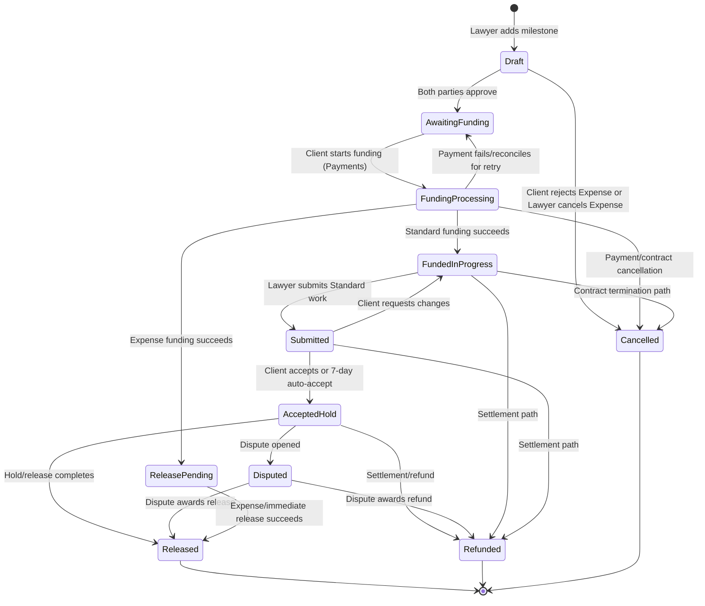
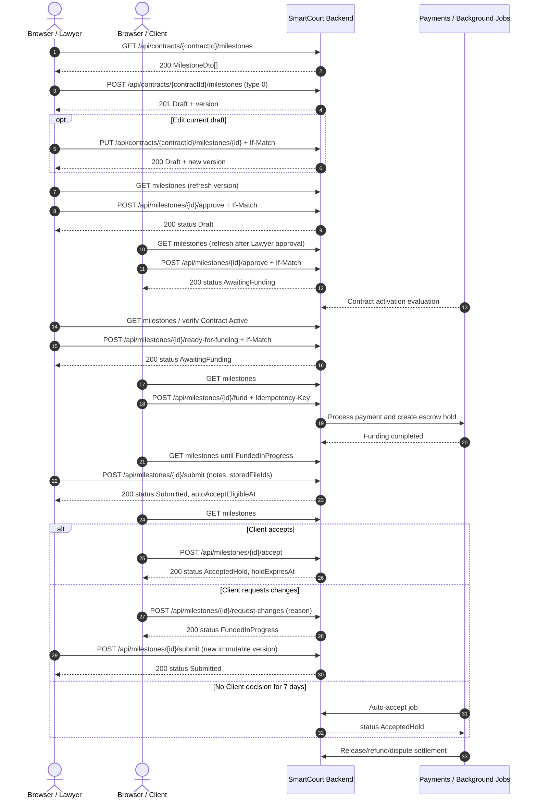

# Milestone API Contract and Frontend Integration Guide

**Authoritative code snapshot:** current working tree on 2026-08-13

**Runtime controller:** `MilestonesController` (`[Route("api")]`)
**Audience:** frontend developers integrating Standard work milestones and Expense proposals

> This document describes the API that is currently reachable from the controller. Four change-request actions are commented out in `MilestonesController`; they are not runtime endpoints and are intentionally excluded. Milestone-related funding and contract-signing calls are identified as adjacent slice dependencies, not counted as Milestone endpoints.

## 1. Frontend Workflow & Step-by-Step Integration Guide (MANDATORY)

### 1.1 Non-negotiable wire rules

| Concern | Frontend contract |
|---|---|
| Authentication | Every endpoint requires an authenticated user. Send `Authorization: Bearer <JWT>` or rely on the application's `accessToken` HttpOnly cookie. The JWT middleware checks the cookie after the bearer handler reads the request; use the application's established auth client. |
| JSON | Use `Content-Type: application/json` for requests with bodies. Property names in this guide are `camelCase`; input matching is case-insensitive. |
| Enum encoding | Send and receive enum-valued fields as **JSON numbers**. No `JsonStringEnumConverter` is configured. `MilestoneActionResultDto.status` is the exception: it is a string such as `"Draft"` or `"Cancelled"`. |
| Dates | Send ISO-8601 UTC values with `Z`, for example `"2026-09-01T10:00:00Z"`. The Add flow additionally rejects a non-UTC `dueDate` at the entity boundary. |
| Money | `amount` is a JSON decimal in EGP. There is no currency field in Milestone requests. Never infer a different currency. |
| Refresh strategy | `GET /api/contracts/{contractId}/milestones` is the only Milestone read endpoint. There is no `GET /api/milestones/{id}`. Refresh the list after every mutation. |
| UI actions | Prefer each returned milestone's `permittedActions` array over duplicating the state machine in UI code. Still handle server rejection because state may change between read and write. |
| Concurrency | Update, approve, ready-for-funding, reject, and cancel require `If-Match` copied exactly from the latest `data.version`. Every successful mutation changes the row version; refresh before the next actor acts. |
| Idempotency | No active endpoint in `MilestonesController` accepts `Idempotency-Key`. Do not automatically replay its POST/PUT requests after an ambiguous network failure; refresh state first. The adjacent Payments funding endpoint does require `Idempotency-Key`. |

### 1.2 Standard milestone workflow (`type = 0`)

1. **Initialize the screen.** Call `GET /api/contracts/{contractId}/milestones`. Render the ordered array and use `permittedActions` to enable buttons. Also obtain the Contract from the Contracts slice because contract status and contract-party acceptance are lifecycle prerequisites.
2. **Append a draft (Lawyer).** Call `POST /api/contracts/{contractId}/milestones` with `type: 0`. `orderNumber` must be exactly `max(existing orderNumber) + 1`; use `1` when the array is empty. Standard milestones may only be added while the Contract is `Draft`.
3. **Edit before approval (Lawyer, optional).** Call `PUT /api/contracts/{contractId}/milestones/{milestoneId}` with the latest `If-Match`. This is full replacement of editable fields, not PATCH: omitted nullable fields become `null`. `amount` and `orderNumber` cannot be changed by this endpoint. Refresh after the update.
4. **Collect both milestone approvals.** The Lawyer and Client each call `POST /api/milestones/{milestoneId}/approve`. Each call must use the version from a fresh list response. The first approval leaves `status = 0` (`Draft`); the second changes it to `status = 1` (`AwaitingFunding`). A duplicate approval by the same actor is rejected.
5. **Complete Contract activation prerequisites.** Contract-level Client and Lawyer acceptance occurs in the Contracts slice. When a Draft milestone gains both approvals, an asynchronous contract-activation request is emitted. Do not call ready-for-funding until the Contract actually reports `Active` (`ContractStatus = 1`).
6. **Mark the current Standard milestone ready (Lawyer).** When `permittedActions` contains `"ReadyForFunding"`, call `POST /api/milestones/{milestoneId}/ready-for-funding` with current `If-Match`. Only the earliest nonterminal Standard milestone qualifies, and no other Standard milestone may have funding processing or an unsettled escrow hold.
7. **Fund it (Client; adjacent Payments slice).** When the Client receives `"Fund"`, call either `POST /api/milestones/{milestoneId}/fund` or `POST /api/milestones/{milestoneId}/payment-session` as documented by Payments. Send a unique, stable `Idempotency-Key` (maximum 200 characters). Poll the list until the milestone is `status = 3` (`FundedInProgress`) and `fundingStatus = 2` (`Funded`); do not assume an asynchronous payment completed from the initial HTTP response alone.
8. **Prepare submission files (Lawyer).** The Milestone slice has no upload endpoint. `storedFileIds` must already resolve to non-deleted `UserVerificationDocument` records owned by the current Lawyer. This is the current implementation contract, even though it is semantically narrower than a general deliverable upload system.
9. **Submit work (Lawyer).** When `"Submit"` is permitted, call `POST /api/milestones/{milestoneId}/submit` with notes and at least one unique, nonempty stored file ID. The server verifies the EGP escrow chain, creates an immutable submission version, changes status to `Submitted` (`4`), and sets `autoAcceptEligibleAt` to seven days after submission.
10. **Review (Client).** Refresh the list. The Client chooses exactly one:
    - Call `POST /api/milestones/{milestoneId}/accept` to enter `AcceptedHold` (`5`) and start a 14-day hold.
    - Call `POST /api/milestones/{milestoneId}/request-changes` with a reason to return to `FundedInProgress` (`3`). The prior submission remains immutable; the Lawyer repeats steps 8-9 and the next submission version is created.
11. **Settlement/dispute (adjacent slices/background jobs).** If the Client does nothing, auto-accept may move `Submitted` to `AcceptedHold` after seven days. Disputes may move `AcceptedHold` to `Disputed`. Release/refund actions occur in Payments/Disputes/background processing, not through this controller.

> Integration gap: `MilestoneDto` does not expose submission notes, submission version, attachment metadata, download URLs, acceptance source, or rejection reason. This controller therefore cannot by itself render a complete Client review screen; the backend needs a submission-read contract or the frontend must use another explicitly documented source.

### 1.3 Expense proposal workflow (`type = 1`)

1. **List current milestones** with `GET /api/contracts/{contractId}/milestones`.
2. **Propose the expense (Lawyer)** with `POST /api/contracts/{contractId}/milestones`, `type: 1`, `durationDays: null`, and `deliverables: null`. Expense proposals may be added while the Contract is `Draft` or `Active`. Creation automatically records the Lawyer's approval.
3. **Optionally edit (Lawyer)** while it remains `Draft`, using `PUT ...` plus current `If-Match`. Editing resets the Client's approval and re-records the Lawyer's approval.
4. **Resolve the proposal before funding:**
    - Client approves via `POST /api/milestones/{id}/approve` with `If-Match`; this moves it directly to `AwaitingFunding` and internally marks it ready for funding.
    - Client rejects via `POST /api/milestones/{id}/reject` with a reason and `If-Match`; status becomes `Cancelled`.
    - Lawyer withdraws via `POST /api/milestones/{id}/cancel` with a reason and `If-Match`; status becomes `Cancelled`.
5. **Fund an approved expense (Client; adjacent Payments slice).** When `"Fund"` is returned, call the Payments funding endpoint with `Idempotency-Key`. Expense milestones skip ready-for-funding, submission, review, and accepted-hold stages. Successful funding drives `AwaitingFunding -> FundingProcessing -> ReleasePending`, then the release workflow settles it to `Released`.

### 1.4 Frontend retry and concurrency algorithm

1. Read the milestone list and keep the complete quoted `version`, for example `"AAAAAAAAB9E="` as the string value.
2. Set the HTTP header to that value exactly: `If-Match: "AAAAAAAAB9E="`. Do not send the JSON escape characters (`\`) and do not strip the quotes.
3. On `409`, treat the version/state as stale, refresh the list, re-render, and require the user to confirm again.
4. On `412`, the header was missing/malformed or a database write race occurred. Refresh and retry only after reconstructing the request from current state.
5. On a timeout or lost response from an action without idempotency, refresh before deciding whether another mutation is necessary.

## 2. Complete Endpoint Catalog (MANDATORY)

### 2.1 Endpoint inventory

| # | Method and exact route | Role gate | Body | `If-Match` | Success |
|---:|---|---|---|---|---:|
| 1 | `POST /api/contracts/{contractId}/milestones` | Lawyer | `AddMilestoneRequest` | No | `201` |
| 2 | `GET /api/contracts/{contractId}/milestones` | Client, Lawyer, Moderator, SuperAdministrator | None | No | `200` |
| 3 | `PUT /api/contracts/{contractId}/milestones/{milestoneId}` | Lawyer | `UpdateMilestoneRequest` | **Yes** | `200` |
| 4 | `POST /api/milestones/{milestoneId}/approve` | Client, Lawyer | None | **Yes** | `200` |
| 5 | `POST /api/milestones/{milestoneId}/ready-for-funding` | Lawyer | None | **Yes** | `200` |
| 6 | `POST /api/milestones/{milestoneId}/reject` | Client | `ExpenseMilestoneDecisionRequest` | **Yes** | `200` |
| 7 | `POST /api/milestones/{milestoneId}/cancel` | Lawyer | `ExpenseMilestoneDecisionRequest` | **Yes** | `200` |
| 8 | `POST /api/milestones/{milestoneId}/submit` | Lawyer | `SubmitMilestoneRequest` | No | `200` |
| 9 | `POST /api/milestones/{milestoneId}/accept` | Client | None | No | `200` |
| 10 | `POST /api/milestones/{milestoneId}/request-changes` | Client | `RequestMilestoneChangesRequest` | No | `200` |

There are no query parameters on any active Milestone endpoint. Every route ID uses the ASP.NET `guid` constraint. A non-GUID path fails route matching and normally returns a framework `404`.

### 2.2 Shared success and error wire shapes

All controller-produced successes use this envelope; nullable envelope fields are still serialized:

```json
{
  "success": true,
  "data": {},
  "message": null,
  "errors": null,
  "statusCode": 200
}
```

Middleware-handled application failures use:

```json
{
  "success": false,
  "data": null,
  "message": "Localized or generic error message",
  "errors": null,
  "statusCode": 409
}
```

FluentValidation/model-binding failures use ASP.NET validation problem details, not `ApiResponse<T>`:

```json
{
  "type": "https://tools.ietf.org/html/rfc9110#section-15.5.1",
  "title": "One or more validation errors occurred.",
  "status": 400,
  "errors": {
    "Title": ["Localized validation message"]
  },
  "traceId": "00-..."
}
```

| HTTP status | Exact class of outcome |
|---:|---|
| `400` | Invalid body rules or invalid business state/prerequisite. Validation failures use problem details; `BusinessException` uses the failed API envelope. |
| `401` | Missing/invalid authentication usually comes from the authorization framework and may have an empty body. |
| `403` | Wrong controller role usually has an empty framework body; authenticated-but-not-the-contract-actor failures use the failed API envelope. |
| `404` | Existing route with absent Contract/Milestone uses the failed API envelope. Invalid GUID or unmatched route is a framework 404. |
| `409` | Well-formed but stale `If-Match`, duplicate actor approval, already-ready state, funding collision, or unique-key race. Uses the failed API envelope when thrown by application code. |
| `412` | Missing/weak/malformed `If-Match`, or `DbUpdateConcurrencyException` during save. Uses the failed API envelope. |
| `415` | Unsupported content type is a framework response/problem detail. |
| `429` | Policies are configured and attributes are present, but `app.UseRateLimiter()` is currently commented out, so enforcement is inactive. |
| `500` | Unhandled failure; envelope message is exactly `"An internal server error occurred."`. |

### 2.3 Add Milestone

**HTTP Method & Exact Route:** `POST /api/contracts/{contractId}/milestones`

**When to use:** Lawyer appends the next Standard milestone to a Draft Contract or proposes an Expense during a Draft/Active Contract. Never use it for updates or reordering.

**Request structure**

| Location | Name | Required | Type | Contract |
|---|---|---:|---|---|
| Header/cookie | Authentication | Yes | JWT/cookie | User must have Lawyer role and be this Contract's Lawyer. |
| Header | `Content-Type` | Yes | string | `application/json`. |
| Route | `contractId` | Yes | UUID | Existing authorized Contract. |
| Body | — | Yes | `AddMilestoneRequest` | Full dictionary in §3.2. |

The service calculates the required order from all existing milestones. It creates a `Draft`, emits a creation outbox event, and automatically records Lawyer acceptance only for Expense type. Standard creation is allowed only for a Draft Contract; Expense creation is allowed for Draft or Active.

**`201 Created` — `ApiResponse<MilestoneDto>`**

```json
{
  "success": true,
  "data": {
    "id": "11111111-1111-1111-1111-111111111111",
    "orderNumber": 1,
    "title": "Prepare claim",
    "description": "Draft and file the claim.",
    "deliverables": ["Filed claim PDF"],
    "amount": 5000.00,
    "durationDays": 14,
    "dueDate": "2026-09-01T10:00:00Z",
    "status": 0,
    "fundingStatus": 0,
    "escrowHoldId": null,
    "fundedAt": null,
    "submittedAt": null,
    "autoAcceptEligibleAt": null,
    "holdExpiresAt": null,
    "netLawyerAmount": null,
    "version": "\"AAAAAAAAB9E=\"",
    "type": 0,
    "permittedActions": ["Update", "Approve"]
  },
  "message": null,
  "errors": null,
  "statusCode": 201
}
```

Endpoint-specific failures include `400` for wrong next order, invalid amount/dates/fields; `403` for a Lawyer who is not this Contract's Lawyer; `404` for absent Contract; and `409` for a disallowed Contract status or concurrent order collision. The database index is named `UX_Milestones_ContractId_OrderNumber`, but the catch filter currently searches for `IX_Milestones_ContractId_OrderNumber`; a true simultaneous insert race can therefore leak to `500` instead of the intended `409`.

### 2.4 List Contract Milestones

**HTTP Method & Exact Route:** `GET /api/contracts/{contractId}/milestones`

**When to use:** Initial page load, polling after asynchronous funding/activation/release, and mandatory refresh after every mutation or concurrency error.

**Request structure**

| Location | Name | Required | Type | Contract |
|---|---|---:|---|---|
| Header/cookie | Authentication | Yes | JWT/cookie | Client/Lawyer contract participant, or eligible Moderator/SuperAdministrator. |
| Route | `contractId` | Yes | UUID | Existing authorized Contract. |

No body and no query string. The server returns all milestones ordered by `orderNumber`; there is no pagination or filter.

**`200 OK` — `ApiResponse<MilestoneDto[]>`**

```json
{
  "success": true,
  "data": [
    {
      "id": "11111111-1111-1111-1111-111111111111",
      "orderNumber": 1,
      "title": "Prepare claim",
      "description": null,
      "amount": 5000.00,
      "durationDays": 14,
      "dueDate": null,
      "status": 1,
      "fundingStatus": 0,
      "escrowHoldId": null,
      "fundedAt": null,
      "submittedAt": null,
      "autoAcceptEligibleAt": null,
      "holdExpiresAt": null,
      "netLawyerAmount": null,
      "version": "\"AAAAAAAAB9F=\"",
      "type": 0,
      "permittedActions": ["ReadyForFunding"]
    }
  ],
  "message": null,
  "errors": null,
  "statusCode": 200
}
```

`deliverables` is uniquely omitted when it is `null`; other nullable `MilestoneDto` fields are included as `null`. Failures are primarily `401`, role/record-level `403`, and Contract `404`.

### 2.5 Update Draft Milestone

**HTTP Method & Exact Route:** `PUT /api/contracts/{contractId}/milestones/{milestoneId}`

**When to use:** Lawyer replaces editable terms before the milestone leaves Draft. It is not a partial update.

| Location | Name | Required | Type | Contract |
|---|---|---:|---|---|
| Header/cookie | Authentication | Yes | JWT/cookie | Lawyer role and this Contract's Lawyer. |
| Header | `Content-Type` | Yes | string | `application/json`. |
| Header | `If-Match` | **Yes** | strong ETag | Exact latest `MilestoneDto.version`. |
| Route | `contractId` | Yes | UUID | Parent Contract. |
| Route | `milestoneId` | Yes | UUID | Draft milestone that must belong to that Contract. |
| Body | — | Yes | `UpdateMilestoneRequest` | Full dictionary in §3.3. |

The service preserves type only when `type` is omitted/null; all other editable nullable fields are overwritten with `null` when omitted. It resets Client approval. Lawyer approval is reset for Standard or automatically set for Expense. Amount and order are immutable. During an Active Contract only a Draft Expense may be edited and it may not be converted to Standard.

**`200 OK`:** the same complete `ApiResponse<MilestoneDto>` shape shown in §2.3, with `statusCode: 200`, updated values, a new `version`, and recalculated `permittedActions`.

Failures: body `400`; milestone/contract mismatch or non-Draft state `400`; absent entities `404`; stale valid ETag `409`; missing/malformed ETag or save race `412`; wrong actor `403`.

### 2.6 Approve Milestone Terms

**HTTP Method & Exact Route:** `POST /api/milestones/{milestoneId}/approve`

**When to use:** Each party approves the current Draft terms. Standard needs one call by each party. Expense creation/update already counts as Lawyer approval, so the normal Expense UI exposes this only to Client.

| Location | Name | Required | Type | Contract |
|---|---|---:|---|---|
| Header/cookie | Authentication | Yes | JWT/cookie | Client or Lawyer role and the matching Contract party. |
| Header | `If-Match` | **Yes** | strong ETag | Latest milestone version. |
| Route | `milestoneId` | Yes | UUID | Draft milestone. |

No body. Contract must be Draft or Active; Active allows approval only for Expense. First approval records the actor and retains Draft. Once both approvals exist, status changes to AwaitingFunding. Expense also receives `readyForFundingAt` immediately. A Draft Contract emits an asynchronous activation request.

**`200 OK` — `ApiResponse<MilestoneActionResultDto>`**

```json
{
  "success": true,
  "data": {
    "entityId": "11111111-1111-1111-1111-111111111111",
    "status": "AwaitingFunding",
    "occurredAt": "2026-08-13T20:00:00Z"
  },
  "message": null,
  "errors": null,
  "statusCode": 200
}
```

`data.status` can be `"Draft"` for the first Standard approval or `"AwaitingFunding"` for the approval completing both sides. Duplicate actor approval and stale ETag return `409`; missing/malformed ETag returns `412`; invalid Contract/milestone state returns `400`; wrong participant returns `403`; missing milestone returns `404`.

### 2.7 Mark Standard Milestone Ready for Funding

**HTTP Method & Exact Route:** `POST /api/milestones/{milestoneId}/ready-for-funding`

**When to use:** Lawyer unlocks Client funding for the earliest unsettled Standard milestone after the Contract becomes Active. Never call for Expense.

| Location | Name | Required | Type | Contract |
|---|---|---:|---|---|
| Header/cookie | Authentication | Yes | JWT/cookie | Lawyer role and this Contract's Lawyer. |
| Header | `If-Match` | **Yes** | strong ETag | Latest version. |
| Route | `milestoneId` | Yes | UUID | Standard milestone in AwaitingFunding. |

No body. The operation keeps status `AwaitingFunding`, sets `readyForFundingAt`, and emits an event. It rejects later Standard milestones, already-ready milestones, non-Active Contracts, Expense milestones, or a Contract with another Standard funding attempt/unsettled hold.

**`200 OK`:** `ApiResponse<MilestoneActionResultDto>` as in §2.6, with `data.status: "AwaitingFunding"`.

Failures: invalid prerequisites `400`; already ready or parallel unsettled funding `409`; stale ETag `409`; missing/malformed ETag/write race `412`; wrong actor `403`; absent milestone `404`.

### 2.8 Reject Expense Proposal

**HTTP Method & Exact Route:** `POST /api/milestones/{milestoneId}/reject`

**When to use:** Contract Client rejects a pending Expense before approval/funding.

| Location | Name | Required | Type | Contract |
|---|---|---:|---|---|
| Header/cookie | Authentication | Yes | JWT/cookie | Client role and this Contract's Client. |
| Header | `Content-Type` | Yes | string | `application/json`. |
| Header | `If-Match` | **Yes** | strong ETag | Latest version. |
| Route | `milestoneId` | Yes | UUID | Draft Expense milestone. |
| Body | `reason` | Yes | string | 1-2,000 characters after nonempty validation. |

The service changes `Draft -> Cancelled`, stores the reason internally, writes state history, and evaluates Contract completion when the Contract is Active. The reason is not returned by `MilestoneDto`.

**`200 OK`:** `ApiResponse<MilestoneActionResultDto>` with `status: "Cancelled"`.

Failures: body/state/type `400`; stale ETag `409`; missing/malformed ETag/write race `412`; wrong actor `403`; missing milestone `404`.

### 2.9 Cancel Expense Proposal

**HTTP Method & Exact Route:** `POST /api/milestones/{milestoneId}/cancel`

**When to use:** Contract Lawyer withdraws their pending Expense before Client approval/funding.

| Location | Name | Required | Type | Contract |
|---|---|---:|---|---|
| Header/cookie | Authentication | Yes | JWT/cookie | Lawyer role and this Contract's Lawyer. |
| Header | `Content-Type` | Yes | string | `application/json`. |
| Header | `If-Match` | **Yes** | strong ETag | Latest version. |
| Route | `milestoneId` | Yes | UUID | Draft Expense milestone. |
| Body | `reason` | Yes | string | 1-2,000 characters after nonempty validation. |

The service changes `Draft -> Cancelled`, stores the reason internally, writes state history, and evaluates Contract completion when the Contract is Active.

**`200 OK`:** `ApiResponse<MilestoneActionResultDto>` with `entityId` equal to `milestoneId`, `status: "Cancelled"`, and UTC `occurredAt`. The reason is not exposed in `MilestoneDto`.

Failures: body/state/type `400`; stale ETag `409`; missing/malformed ETag/write race `412`; wrong actor `403`; missing milestone `404`.

### 2.10 Submit Standard Milestone Work

**HTTP Method & Exact Route:** `POST /api/milestones/{milestoneId}/submit`

**When to use:** Lawyer submits a funded Standard milestone or resubmits after Client-requested changes.

| Location | Name | Required | Type | Contract |
|---|---|---:|---|---|
| Header/cookie | Authentication | Yes | JWT/cookie | Lawyer role and this Contract's Lawyer. |
| Header | `Content-Type` | Yes | string | `application/json`. |
| Route | `milestoneId` | Yes | UUID | Standard milestone in FundedInProgress. |
| Body | — | Yes | `SubmitMilestoneRequest` | Notes plus owned stored file IDs; §3.4. |

No `If-Match` and no idempotency header are consumed. The service requires an Active Contract, Standard type, FundedInProgress state, valid funded EGP escrow whose gross amount equals milestone amount, and current-Lawyer ownership of every file. It creates the next immutable submission version, attachment links, `Submitted` state, and a seven-day auto-accept deadline.

**`200 OK`:** complete `ApiResponse<MilestoneDto>`; typical changed fields are:

```json
{
  "success": true,
  "data": {
    "id": "11111111-1111-1111-1111-111111111111",
    "orderNumber": 1,
    "title": "Prepare claim",
    "description": null,
    "deliverables": ["Filed claim PDF"],
    "amount": 5000.00,
    "durationDays": 14,
    "dueDate": null,
    "status": 4,
    "fundingStatus": 2,
    "escrowHoldId": "22222222-2222-2222-2222-222222222222",
    "fundedAt": "2026-08-13T18:00:00Z",
    "submittedAt": "2026-08-13T20:00:00Z",
    "autoAcceptEligibleAt": "2026-08-20T20:00:00Z",
    "holdExpiresAt": null,
    "netLawyerAmount": 4500.00,
    "version": "\"AAAAAAAAB9G=\"",
    "type": 0,
    "permittedActions": []
  },
  "message": null,
  "errors": null,
  "statusCode": 200
}
```

For the Client, a refreshed list will expose `Accept` and `RequestChanges`. Failures: validation/business/funding-chain `400`; unauthorized file ownership or wrong contract Lawyer `403`; missing milestone `404`; simultaneous duplicate submission-version race `409`; unhandled persistence failure `500`.

### 2.11 Accept Standard Milestone Submission

**HTTP Method & Exact Route:** `POST /api/milestones/{milestoneId}/accept`

**When to use:** Contract Client accepts the current Standard submission after review.

| Location | Name | Required | Type | Contract |
|---|---|---:|---|---|
| Header/cookie | Authentication | Yes | JWT/cookie | Client role and this Contract's Client. |
| Route | `milestoneId` | Yes | UUID | Standard milestone in Submitted. |

No body, `If-Match`, or idempotency header. The service verifies the latest immutable submission against the funded hold, then sets `AcceptedHold`, manual acceptance, hold start now, and hold expiry now + 14 days. Auto-accept scheduling fields are cleared.

**`200 OK`:** complete `ApiResponse<MilestoneDto>` with `status: 5`, `holdExpiresAt` populated, `autoAcceptEligibleAt: null`, and no Client actions.

Failures: invalid Contract/type/state/funding/submission chain `400`; wrong Client `403`; missing milestone `404`. Because there is no concurrency header/idempotency reservation, a repeated call normally encounters the new state and returns `400`.

### 2.12 Request Changes to Standard Submission

**HTTP Method & Exact Route:** `POST /api/milestones/{milestoneId}/request-changes`

**When to use:** Contract Client rejects the current delivery but keeps the milestone funded for Lawyer rework.

| Location | Name | Required | Type | Contract |
|---|---|---:|---|---|
| Header/cookie | Authentication | Yes | JWT/cookie | Client role and this Contract's Client. |
| Header | `Content-Type` | Yes | string | `application/json`. |
| Route | `milestoneId` | Yes | UUID | Standard milestone in Submitted. |
| Body | `reason` | Yes | string | 1-2,000 characters after nonempty validation. |

The service verifies the current submission/funding, moves `Submitted -> FundedInProgress`, clears `submittedAt` and auto-accept fields, stores the reason internally, and preserves the prior immutable submission and escrow hold.

**`200 OK`:** complete `ApiResponse<MilestoneDto>` with `status: 3`, `submittedAt: null`, `autoAcceptEligibleAt: null`, `fundingStatus: 2`; the Lawyer will see `permittedActions: ["Submit"]` on refresh.

Failures: body/state/type/funding chain `400`; wrong Client `403`; missing milestone `404`. Repeated calls normally return `400` because the first call changed the state.

## 3. Exhaustive DTO & Field Dictionary (MANDATORY)

### 3.1 JSON type conventions

| C# type | JSON representation |
|---|---|
| `Guid` / `Guid?` | UUID string / `null` |
| `decimal` / `decimal?` | JSON number / `null` |
| `int` / `int?` | JSON integer / `null` |
| `DateTime?` | ISO-8601 string / `null` |
| `IReadOnlyList<string>` | JSON string array |
| `IReadOnlyList<Guid>` | JSON UUID-string array |
| enum | JSON integer unless explicitly documented as a string |

### 3.2 `AddMilestoneRequest`

| Field | JSON type | Required | What frontend sends |
|---|---|---:|---|
| `title` | string | Yes | Human-readable milestone/expense title, 3-200 characters. |
| `description` | string or null | No | Detailed scope. Omit or send `null` for none; whitespace-only is invalid; max 10,000. |
| `deliverables` | string[] or null | No | Up to 100 expected outputs; each 1-500 characters. Must be `null`/omitted for Expense. Empty array is allowed for Standard. |
| `orderNumber` | integer | Yes | Next append-only order, positive and exactly max+1. |
| `amount` | decimal | Yes | Positive EGP amount with at most two decimal places. |
| `durationDays` | integer or null | No | 1-365 for Standard; must be `null`/omitted for Expense. |
| `dueDate` | string or null | No | Future UTC ISO-8601 timestamp. |
| `type` | integer | No | `0` Standard (default when omitted) or `1` Expense. |

### 3.3 `UpdateMilestoneRequest`

| Field | JSON type | Required | What frontend sends |
|---|---|---:|---|
| `title` | string | Yes | Complete replacement title, 3-200 characters. |
| `description` | string or null | No | Complete replacement; omit/null clears it. Whitespace-only invalid; max 10,000. |
| `deliverables` | string[] or null | No | Complete replacement; omit/null clears. Up to 100, each 1-500. Must be null for Expense. |
| `durationDays` | integer or null | No | Complete replacement; omit/null clears. 1-365 when present; null for Expense. |
| `dueDate` | string or null | No | Complete replacement; omit/null clears. Must be future when present. |
| `type` | integer or null | No | Omit/null preserves current type; `0` or `1` changes it subject to lifecycle/Expense rules. |

`amount` and `orderNumber` deliberately do not exist in this DTO and are immutable through this endpoint.

### 3.4 `SubmitMilestoneRequest`

| Field | JSON type | Required | What frontend sends |
|---|---|---:|---|
| `notes` | string | Yes | Submission narrative, nonempty, maximum 10,000 characters. |
| `storedFileIds` | UUID[] | Yes | At least one; every ID nonempty and unique. Each must belong to a non-deleted current-Lawyer `UserVerificationDocument` and its non-deleted stored file. No maximum list count is defined by the validator. |

### 3.5 `RequestMilestoneChangesRequest`

| Field | JSON type | Required | What frontend sends |
|---|---|---:|---|
| `reason` | string | Yes | Client's requested corrections; nonempty, maximum 2,000 characters. |

### 3.6 `ExpenseMilestoneDecisionRequest`

| Field | JSON type | Required | What frontend sends |
|---|---|---:|---|
| `reason` | string | Yes | Client rejection or Lawyer cancellation reason; nonempty, maximum 2,000 characters. |

### 3.7 `MilestoneDto`

| Field | JSON type | Null/omission behavior | Meaning |
|---|---|---|---|
| `id` | UUID string | Never null | Milestone identifier. |
| `orderNumber` | integer | Never null | Append order within Contract. |
| `title` | string | Never null | Current title. |
| `description` | string or null | Included as null | Current optional description. |
| `deliverables` | string[] | **Property omitted when null** | Current Standard deliverables; absent for Expense. |
| `amount` | decimal | Never null | Gross EGP milestone amount. |
| `durationDays` | integer or null | Included as null | Planned Standard duration; always null for Expense. |
| `dueDate` | string or null | Included as null | Optional due date. |
| `status` | integer | Never null | `MilestoneStatus`, §3.9. |
| `fundingStatus` | integer | Never null | Derived `MilestoneFundingStatus`, §3.10. |
| `escrowHoldId` | UUID string or null | Included as null | Escrow hold after funding exists. |
| `fundedAt` | string or null | Included as null | UTC funding time. |
| `submittedAt` | string or null | Included as null | UTC current Standard submission time; cleared on requested changes. |
| `autoAcceptEligibleAt` | string or null | Included as null | Seven-day auto-accept eligibility time while Submitted. |
| `holdExpiresAt` | string or null | Included as null | End of the post-acceptance 14-day hold. |
| `netLawyerAmount` | decimal or null | Included as null | Net amount on the escrow hold after platform fee. |
| `version` | string | Never null | Strong ETag string including quotes; optimistic-concurrency token. |
| `type` | integer | Never null | `MilestoneType`, §3.11. |
| `permittedActions` | string[] | Always array | Actor-specific UI commands; §3.12. |

### 3.8 `MilestoneActionResultDto`

| Field | JSON type | Meaning |
|---|---|---|
| `entityId` | UUID string | The affected milestone ID. |
| `status` | string | Case-sensitive `MilestoneStatus` name. Active results here are `Draft`, `AwaitingFunding`, or `Cancelled`. |
| `occurredAt` | ISO-8601 string | UTC server time at which the action was applied. |

### 3.9 `MilestoneStatus` — all values

| Numeric value | Name | Meaning / source |
|---:|---|---|
| `0` | `Draft` | Terms proposed; approvals still negotiable. |
| `1` | `AwaitingFunding` | Both parties approved. Standard still needs Lawyer readiness; Expense is made ready automatically. |
| `2` | `FundingProcessing` | Payment attempt is in progress (Payments slice). |
| `3` | `FundedInProgress` | Standard is funded and Lawyer work/resubmission is active. |
| `4` | `Submitted` | Standard delivery awaits Client review or seven-day auto-accept. |
| `5` | `AcceptedHold` | Delivery accepted; 14-day post-acceptance hold runs. |
| `6` | `Disputed` | An active dispute froze settlement (Disputes slice). |
| `7` | `Released` | Funds released to Lawyer; terminal. |
| `8` | `Refunded` | Funds returned to Client; terminal. |
| `9` | `Cancelled` | Proposal/work cancelled; terminal for sequencing. |
| `10` | `ReleasePending` | Release still needs processing/recovery; normal funded Expense enters this state before immediate release. |

### 3.10 `MilestoneFundingStatus` — all values

| Numeric value | Name | Derivation |
|---:|---|---|
| `0` | `Unfunded` | No hold exists and status is not FundingProcessing/settled. |
| `1` | `Processing` | Milestone status is FundingProcessing. |
| `2` | `Funded` | An escrow hold exists and neither milestone/hold is settled. |
| `3` | `Settled` | Milestone is Released/Refunded or hold status is Released/Refunded. |

### 3.11 `MilestoneType` — all values

| Numeric value | Name | Behavior |
|---:|---|---|
| `0` | `Standard` | Sequential work: approval, readiness, funding, submission, review, hold, settlement. |
| `1` | `Expense` | Reimbursable/out-of-pocket proposal: no duration/deliverables/readiness/submission/review; funding proceeds toward immediate release. |

### 3.12 `permittedActions` — every emitted string

| String | Actor and condition | Endpoint |
|---|---|---|
| `Update` | Contract Lawyer; Draft | `PUT .../milestones/{id}` |
| `Approve` | Client/Lawyer whose approval is not recorded; Draft | `POST /api/milestones/{id}/approve` |
| `Reject` | Contract Client; Draft Expense | `POST /api/milestones/{id}/reject` |
| `Cancel` | Contract Lawyer; Draft Expense | `POST /api/milestones/{id}/cancel` |
| `ReadyForFunding` | Contract Lawyer; current Standard in AwaitingFunding, not already ready | `POST /api/milestones/{id}/ready-for-funding` |
| `Fund` | Contract Client; AwaitingFunding with `readyForFundingAt` set | Payments slice funding endpoint |
| `Submit` | Contract Lawyer; funded Standard in FundedInProgress | `POST /api/milestones/{id}/submit` |
| `Accept` | Contract Client; Standard in Submitted | `POST /api/milestones/{id}/accept` |
| `RequestChanges` | Contract Client; Standard in Submitted | `POST /api/milestones/{id}/request-changes` |

The array is a convenience projection, not authorization proof. Backend rules remain authoritative.

### 3.13 Advanced API mechanics

#### Optimistic concurrency

| Endpoint | Token required | Conflict behavior |
|---|---:|---|
| Update | Yes | Missing/malformed `If-Match` -> `412`; well-formed stale token -> `409`; DB save race -> `412`. |
| Approve | Yes | Same. Refresh between the two actors because the first approval changes the version. |
| Ready for funding | Yes | Same. |
| Reject Expense | Yes | Same. |
| Cancel Expense | Yes | Same. |
| Add/List/Submit/Accept/Request Changes | No | No frontend-supplied optimistic token is consumed. |

The ETag must be strong, quoted, nonempty Base64. Weak tags such as `W/"..."`, wildcard `*`, unquoted values, empty Base64, and invalid Base64 fail.

#### Idempotency

No active Milestone endpoint reads `Idempotency-Key`. State transitions make many duplicate calls fail, but that is not equivalent to safe response replay. The adjacent Client funding endpoints in Payments require a nonempty `Idempotency-Key` of at most 200 characters; reuse the same key only for retries of the exact same funding intent.

#### Domain enum not exposed by `MilestoneDto`

`MilestoneAcceptanceSource` exists on the entity: `0 = Manual`, `1 = Automatic`. Accept sets Manual; the background auto-accept path sets Automatic. The response DTO does not expose this field.

## 4. Validation Rules Summary

### 4.1 Form constraints to mirror

| DTO.field | Required? | Exact rules |
|---|---:|---|
| `AddMilestoneRequest.title` | Yes | Not empty; length 3-200. |
| `.description` | No | Null allowed; if provided cannot be null/empty/whitespace; maximum 10,000. |
| `.deliverables` | No | Null or count <= 100. Each item not empty and max 500. Expense requires null, so `[]` is invalid for Expense. |
| `.orderNumber` | Yes | Integer > 0 and must equal current max order + 1. |
| `.amount` | Yes | Decimal > 0; at most two decimal places. No validator maximum; database storage is `decimal(18,2)` (practical maximum `9999999999999999.99`). |
| `.durationDays` | No | Null or integer 1-365. Expense requires null. |
| `.dueDate` | No | Null or strictly later than server UTC now. Add also requires UTC `DateTimeKind`, so send a `Z` timestamp. |
| `.type` | No | Must be defined: 0 or 1; omitted Add value defaults to 0. |
| `UpdateMilestoneRequest.title` | Yes | Not empty; length 3-200. |
| `.description` | No | Same as Add; omission clears. |
| `.deliverables` | No | Same list rules; Expense requires null; omission clears. |
| `.durationDays` | No | Null or 1-365; Expense requires null; omission clears. |
| `.dueDate` | No | Null or strictly future; omission clears. |
| `.type` | No | Null preserves current; otherwise 0 or 1. |
| `SubmitMilestoneRequest.notes` | Yes | Not empty; maximum 10,000. |
| `.storedFileIds` | Yes | Non-null, count > 0, every GUID nonempty, all distinct. No validator maximum. |
| `RequestMilestoneChangesRequest.reason` | Yes | Not empty; maximum 2,000. |
| `ExpenseMilestoneDecisionRequest.reason` | Yes | Not empty; maximum 2,000. |

`NotEmpty()` rejects null, empty string, and whitespace-only string for the required text fields. String length is .NET character count, not UTF-8 byte count. No regex rules exist in this slice.

### 4.2 Cross-property and service-level rules

| Rule | Frontend implication |
|---|---|
| Expense requires `durationDays == null` and `deliverables == null`. | Hide/clear those controls when `type = 1`; send null, not empty array. |
| New order must equal maximum stored order + 1. | Refresh before append; cancelled milestones still count in max order. |
| Standard may be created only in Draft Contract; Expense in Draft or Active. | Gate creation by Contract status/type. |
| Update is only for Draft milestone; Active Contract permits edits only to Expense. | Disable edit after approval; do not convert an Active expense to Standard. |
| Any edit resets Client approval and recalculates Lawyer approval. | Require re-approval after edit. |
| Standard readiness requires Active Contract and earliest nonterminal Standard milestone. | Do not expose readiness for later milestones. |
| Readiness also blocks if another Standard has FundingProcessing or a Funded/Frozen hold. | Poll and settle prior funding before advancing. |
| Submit/accept/request-changes verify Contract ID, gross amount, currency `EGP`, escrow hold, and current submission version. | Treat funding-chain `400` as a refresh/support condition; do not fabricate client values. |
| Submission files must all be owned by the current Lawyer through non-deleted verification-document records. | Validate upload/source workflow before enabling Submit. |
| Accept/request-changes operate only on Standard Submitted milestones in an Active Contract. | Expense never renders these actions. |
| Reject/cancel operate only on Draft Expense in Draft/Active Contract. | Hide after approval/funding. |

### 4.3 Read-model limitations frontend must account for

| Missing capability | Consequence |
|---|---|
| No single-milestone GET | Refresh the entire Contract milestone list. |
| No delete/reorder endpoint | UI cannot remove/reorder; cancel only exists for pending Expense. |
| No submission-read DTO/endpoint | Notes and attachments cannot be reviewed from this slice. |
| No rejection reason in response | Client-requested-change and Expense-decision reason cannot be redisplayed from `MilestoneDto`. |
| No submission version in response | Frontend cannot show version number although backend stores it. |
| No acceptance source in response | UI cannot distinguish manual from automatic acceptance. |
| Commented change-request routes | Do not call `/api/milestones/{id}/change-requests` or `/api/change-requests/{id}/...`; they are not mapped. |

## 5. Lifecycle and Actor Diagrams

### 5.1 State machine diagram



The transition guard also permits `FundingProcessing -> ReleasePending` for recovery and the external payment/settlement services own several transitions; not all arrows correspond to endpoints in this controller.

### 5.2 Standard milestone actor interaction sequence



### 5.3 Expense actor interaction sequence

```mermaid
sequenceDiagram
    autonumber
    actor L as Browser / Lawyer
    actor C as Browser / Client
    participant B as SmartCourt Backend
    participant P as Payments / Release Processing

    L->>B: POST /api/contracts/{contractId}/milestones (type 1, no duration/deliverables)
    B-->>L: 201 Draft; Lawyer approval pre-recorded
    alt Client approves
        C->>B: GET /api/contracts/{contractId}/milestones
        C->>B: POST /api/milestones/{id}/approve + If-Match
        B-->>C: 200 AwaitingFunding; ready internally
        C->>B: POST /api/milestones/{id}/fund + Idempotency-Key
        B->>P: FundingProcessing then ReleasePending
        P-->>B: Released
    else Client rejects
        C->>B: POST /api/milestones/{id}/reject + If-Match + reason
        B-->>C: 200 Cancelled
    else Lawyer withdraws
        L->>B: POST /api/milestones/{id}/cancel + If-Match + reason
        B-->>L: 200 Cancelled
    end
```

---

**Double-validation basis:** active route attributes and role gates in `MilestonesController`; request/response records; all active FluentValidation validators; `Milestone`, submission and attachment entities/configurations; `MilestoneDraftService`; `MilestoneService`; transition/funding guards; shared response, authorization, JSON, exception, concurrency, rate-limit, file-access, Contracts, Payments, auto-accept, release, and dispute integration paths.
