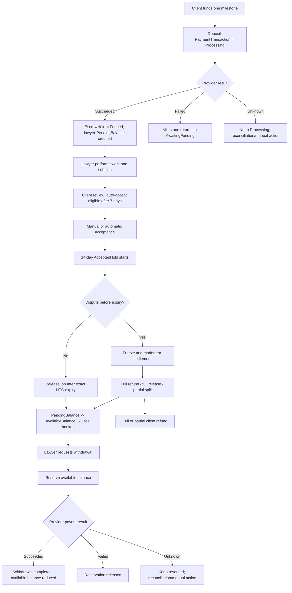

# Phase 1 — End-to-End Payment Lifecycle and Gateway Analysis

> Project: Smart Court (.NET 8 API)  
> Scope: client Pay/Deposit through lawyer Withdraw, including full/partial refunds and the 14-day hold  
> Compared providers: Stripe Connect and Paymob  
> Research and code-review date: 11 August 2026  
> Phase status: complete; no provider has been selected and no implementation code has been changed

## 1. Executive conclusion

Smart Court already contains a serious internal escrow-style accounting workflow. It has milestone-specific deposits, immutable financial attempts, an escrow ledger, a lawyer pending/available wallet, a 14-day post-acceptance hold, disputes with full-refund/full-release/partial-split outcomes, contract-termination refunds, idempotency, background scheduling, webhook deduplication, and reconciliation of uncertain external outcomes.

It does **not** yet have a production-ready gateway integration.

- The running default is `MockPaymentProvider`.
- The existing `PaymobPaymentProvider` calls a repository-invented generic API (`/payments`, `/payouts/releases`, `/refunds`, and so on), not Paymob Accept/Intention and Payouts APIs.
- The current webhook request and signature are custom Smart Court formats and match neither Stripe nor Paymob.
- The provider contracts do not carry enough information to refund the original payment, transfer a release to the correct lawyer, safely onboard a payout account, or complete a browser-based 3DS/hosted-checkout flow.
- The existing `ReleaseAsync` call sends the **gross** hold amount even though the lawyer receives the **net** amount after a 5% platform fee.

### Recommendation

**Pure technical compatibility: Stripe Connect wins.** Its native objects map cleanly to all four existing operations:

| Smart Court operation | Stripe Connect primitive |
|---|---|
| Deposit | Platform PaymentIntent/Charge |
| Release after hold | Transfer from platform to lawyer connected account |
| Refund | Full or partial Refund against the original PaymentIntent/Charge |
| Withdraw | Payout from the connected account balance to its verified external bank account |

However, Stripe's current global availability page does not list Egypt as a country in which a business can open a Stripe platform account. An Egyptian lawyer can appear in Connect country availability for qualifying cross-border platforms, but that does not let an Egypt-incorporated Smart Court platform self-serve a Stripe account. See [Stripe global availability](https://stripe.com/global) and [Connect availability](https://docs.stripe.com/connect/how-connect-works).

**Practical Egypt-production compatibility: Paymob wins, conditionally.** Paymob Accept supports Egyptian checkout flows and callbacks, while Paymob Payouts can disburse EGP to wallets and Egyptian bank/card/IBAN destinations. But it requires two product integrations and a change in semantics: `Release` is an internal Smart Court wallet transition; the external money movement occurs at `Withdraw`, unless Paymob contractually enables a private Marketplace/sub-account transfer API.

Therefore:

1. If Smart Court has, or will establish, a Stripe-supported legal entity and obtains Connect/cross-border approval, choose **Stripe Connect**. It is the best architectural fit.
2. If Smart Court will launch as an Egyptian entity, choose **Paymob Accept + Paymob Payouts**, subject to commercial enablement and written confirmation of the funds-holding/payout model. This is the recommended production route for the project as it exists today.

Neither provider supplies a legally regulated escrow account merely by delaying a transfer. Stripe explicitly says that it does not provide escrow services in its [manual payouts documentation](https://docs.stripe.com/connect/manual-payouts). Smart Court must describe this as an escrow-style platform ledger/payment-delay workflow and obtain Egyptian legal/regulatory advice before holding client money.

## 2. Current end-to-end lifecycle

Important timing fact: the 14-day hold starts **after milestone acceptance**, not at card authorization and not at initial funding. Before it starts, the lawyer can perform work and the client can receive a seven-day submission-review window. Consequently, an authorization-only card hold is not a safe end-to-end strategy even when a gateway offers a 14- or 30-day authorization window. Smart Court must normally capture the client's payment at funding time, retain it in the platform/merchant balance, and delay the lawyer-side money movement.

## 3. Provider contracts and DTO trace

### 3.1 `IPaymentProvider`

Source: `SmartCourt/Infrastructure/Providers/Payments/Interfaces/IPaymentProvider.cs`

The interface defines:

- `DepositAsync(ProviderDepositRequest)`
- `RetryDepositAsync(ProviderDepositRetryRequest)`
- `ReleaseAsync(ProviderReleaseRequest)`
- `RefundAsync(ProviderRefundRequest)`
- `WithdrawAsync(ProviderWithdrawalRequest)`

`IPaymentReconciliationProvider` separately defines status lookup for deposit, release, refund, and withdrawal.

This separation is good. The application treats a network failure or non-terminal provider state as an unknown outcome and reconciles it instead of blindly retrying a financial write.

### 3.2 Request models

Source: `SmartCourt/Infrastructure/Providers/Payments/Models/PaymentProviderRequests.cs`

All requests carry:

- decimal major-unit amount;
- currency;
- a Smart Court business ID;
- a provider idempotency key;
- a correlation ID.

Operation-specific fields are currently limited to:

| Request | Additional fields | Missing production data |
|---|---|---|
| `ProviderDepositRequest` | `PaymentMethodReference` | No way to return a client secret, redirect URL, or next-action state |
| `ProviderDepositRetryRequest` | original key and optional transaction ID | Cannot resume a hosted checkout/intention cleanly |
| `ProviderReleaseRequest` | none | Original charge/source transaction, lawyer provider account, and net transfer amount |
| `ProviderRefundRequest` | reason | Original PaymentIntent/Charge or Paymob transaction ID |
| `ProviderWithdrawalRequest` | free-form `DestinationReference` | Verified owner, payout rail/type, connected account, bank code, IBAN/account token, recipient name/KYC data |
| Status requests | no provider object ID | Reliable lookup usually requires the provider's object/transaction ID or merchant reference |

### 3.3 `ProviderResult`

Source: `SmartCourt/Infrastructure/Providers/Payments/Models/ProviderResult.cs`

`ProviderResult` echoes amount, currency, business ID, idempotency key, and correlation ID, then adds:

- `Outcome`: `Succeeded`, `Failed`, or `Unknown`;
- `ProviderTransactionId`;
- `FailureReason`.

The echo-and-validate pattern is valuable protection against applying a response to the wrong hold. The tri-state outcome is also appropriate for financial operations. It is insufficient for client checkout because `requires_action`, `requires_payment_method`, an Intention client secret, and a redirect/checkout URL are actionable states, not merely unknown outcomes.

### 3.4 Public API DTOs

Source: `SmartCourt/Features/Payments/DTOs/PaymentRequests.cs`

- `FundMilestoneRequest` contains one opaque `PaymentMethodReference`.
- `CreateWithdrawalRequest` contains amount plus one free-form `DestinationReference`.
- `PaymentWebhookRequest` is a normalized internal shape, but the controller expects the gateway to send it directly.

The response DTOs do not expose a hosted-checkout URL, client secret, next action, provider account onboarding status, or payout-destination status.

## 4. Client-side flow: Pay/Deposit through Refund

### 4.1 Funding endpoint

`POST /api/milestones/{milestoneId}/fund`

Source: `SmartCourt/Features/Payments/Escrow/PaymentsController.cs`

- Client-only endpoint.
- Requires an `Idempotency-Key` header.
- Delegates to `PaymentEscrowService.FundAsync`.

### 4.2 Funding service

Source: `SmartCourt/Features/Payments/Escrow/PaymentEscrowService.cs`

The service already implements the right local ordering:

1. Verify that the caller is the contract client.
2. Reserve application-level idempotency.
3. Verify contract/milestone funding eligibility.
4. Create a `PaymentTransaction` in `Processing` and move the milestone to `FundingProcessing`.
5. Commit that intent before calling the external provider.
6. Call `DepositAsync` with a separate provider idempotency key.
7. Verify the result echoes the original request fields.
8. Apply one of three outcomes.

On success it creates or updates:

- `EscrowAccount` for the contract;
- `EscrowHold` for this milestone;
- immutable `Deposit` ledger entry;
- `LawyerWallet` with the lawyer's net amount in `PendingBalance`;
- completed external `PaymentTransaction`;
- milestone state `FundedInProgress`.

`SettlementCalculator` currently fixes the platform fee at 5%. A 100 EGP funded milestone produces a 95 EGP lawyer net amount and 5 EGP platform fee.

On a confirmed failure, no hold is created and the milestone returns to `AwaitingFunding`. On an exception, mismatch, timeout, or unknown response, the transaction remains `Processing` and is intended for reconciliation.

### 4.3 Funding reconciliation and webhook

Sources:

- `SmartCourt/Features/Payments/Reconciliation/PaymentReconciliationService.cs`
- `SmartCourt/Features/Payments/Webhooks/PaymentWebhookService.cs`
- `SmartCourt/Features/Payments/Escrow/PaymentsController.cs`

The reconciliation service can poll deposits and finish or fail local funding. The webhook path provides event deduplication and checks transaction amount/currency/ownership before applying a result.

The existing external webhook contract is not usable with either candidate:

- Route: `POST /api/payments/webhook`
- Custom headers: `X-Payment-Event-Id`, `X-Payment-Timestamp`, `X-Payment-Signature`
- Custom signature: Base64 HMAC-SHA256 of `timestamp.rawBody`
- Custom body: Smart Court's `PaymentWebhookRequest`
- Only deposit transactions are accepted.

Stripe sends a Stripe event envelope and `Stripe-Signature`. Paymob sends a Paymob transaction object and validates a documented ordered-field HMAC-SHA512 value. Paymob says backend callbacks are the source of truth in its [API integration flow](https://developers.paymob.com/paymob-docs/integration-paths/apis), and its [HMAC documentation](https://developers.paymob.com/paymob-docs/developers/webhook-callbacks-and-hmac/hmac/hmac-for-card-tokens) demonstrates ordered-field concatenation with SHA-512. A provider-specific verifier/normalizer must sit in front of the internal webhook service.

### 4.4 Full refund when a contract fails before work begins

Source: `SmartCourt/Features/Payments/Settlement/ContractTerminationSettlementService.cs`

Contract termination refunds every eligible unsettled milestone hold only when:

- no funding attempt remains in progress;
- the hold is `Funded` or `Frozen` but is still an unstarted hold;
- no milestone submission exists;
- no active dispute exists.

It creates an idempotent refund attempt, calls `RefundAsync` for the full gross amount, writes a refund ledger entry, removes the lawyer's pending net amount, and marks both hold and milestone `Refunded`.

### 4.5 Full/partial refund through dispute resolution

Source: `SmartCourt/Features/Disputes/DisputeManagement/DisputeService.cs`

A dispute can be created while the milestone is in its accepted 14-day hold and before expiry. The hold is frozen. A moderator can settle it as:

- full refund;
- full release;
- partial split.

For a partial split, Smart Court calls `RefundAsync` for the approved client amount and `ReleaseAsync` for the lawyer's gross allocation. It then calculates a 5% fee only on the non-refunded allocation, credits the lawyer's net release to available balance, and records all three ledger portions.

The internal arithmetic is sound, but the external refund request lacks the original provider payment ID, and the release request lacks the lawyer recipient ID.

## 5. Lawyer-side flow: Submission through Withdraw

### 5.1 Submission and acceptance

Sources:

- `SmartCourt/Features/Milestones/MilestoneManagement/MilestoneService.cs`
- `SmartCourt/Features/Milestones/AutoAcceptance/MilestoneAutoAcceptanceService.cs`

After verified funding, the lawyer submits a milestone. Smart Court sets automatic acceptance eligibility to seven calendar days after submission. The client can accept manually; otherwise a version-scoped background job can accept automatically.

Both paths set:

- milestone status `AcceptedHold`;
- `HoldStartsAt = now`;
- `HoldExpiresAt = now + 14 days`;
- the same dates on the corresponding `EscrowHold`.

### 5.2 Scheduled release

Sources:

- `SmartCourt/Features/Milestones/Events/MilestoneSchedulingOutboxHandler.cs`
- `SmartCourt/Features/Payments/Escrow/EscrowReleaseService.cs`
- Hangfire implementations behind `IContractJobScheduler`.

An outbox handler schedules release at the exact hold expiry. The release job revalidates:

- hold is still `Funded`;
- milestone is still `AcceptedHold`;
- both expiry timestamps match and have elapsed;
- no active dispute exists;
- account, wallet, and ownership invariants hold;
- no conflicting settlement reservation exists.

It persists the release attempt before the provider call and has bounded retry/manual-action handling. On provider success it:

- writes lawyer release and platform-fee ledger entries;
- moves the lawyer net amount from `PendingBalance` to `AvailableBalance`;
- marks hold and milestone `Released`;
- emits `FundsReleased`.

Critical mismatch: the provider request uses `hold.GrossAmount`, while the lawyer transfer should be `hold.NetAmount`. It also has no connected-account/receiver reference. A real transfer implementation cannot safely use this request as written.

### 5.3 Withdrawal

`POST /api/wallet/withdrawals`

Sources:

- `SmartCourt/Features/Payments/Wallets/WalletsController.cs`
- `SmartCourt/Features/Payments/Wallets/WalletService.cs`
- `SmartCourt/Features/Payments/Entities/WithdrawalRequest.cs`

The lawyer submits amount, `DestinationReference`, and an idempotency key. The service atomically reserves available balance, calls `WithdrawAsync`, and:

- completes and permanently reduces the available balance on success;
- releases the reservation on confirmed failure;
- keeps the amount reserved on an unknown result;
- polls pending withdrawals and escalates stale ones to manual action.

Production gaps:

- `DestinationReference` is supplied by the caller on every request and is not linked to a verified lawyer-owned payout account.
- The destination is not persisted on `WithdrawalRequest`, so the audit trail cannot prove where money was requested to go.
- No provider onboarding/KYC status is stored for the lawyer.
- One string cannot represent Paymob's payout rail, bank code, name, national ID, IBAN/account/card, or wallet number.
- Stripe should use a connected account with a Stripe-hosted verified external account, not accept an arbitrary bank reference from this endpoint.

## 6. What is genuinely built today

| Capability | Internal application | Real gateway |
|---|---|---|
| Milestone-by-milestone EGP deposit | Built | Mock only; Paymob class is placeholder |
| Application/provider idempotency | Built | Not mapped to official Paymob object model yet |
| 5% fee and escrow ledger | Built | Internal only |
| Lawyer pending/available wallet | Built | Internal only |
| Seven-day submission auto-accept | Built | Internal only |
| Fourteen-day post-acceptance hold | Built | Internal job/ledger only |
| Scheduled release | Built with outbox + Hangfire | Provider request is missing source/destination and sends gross |
| Contract-termination full refund | Built | Cannot target original real payment yet |
| Dispute full/partial refund and release | Built | Same missing provider references |
| Withdrawal balance reservation | Built | No verified/persisted recipient integration |
| Unknown-outcome reconciliation | Built | Status lookup inputs do not match real APIs fully |
| Webhook deduplication | Built | Incompatible external body/signature; deposit-only |
| Startup safety | Intended | Strict validation is commented out |
| Provider selection | Configured | Mock registration is forced with `|| true`; Paymob selection registers both implementations |

The existing Paymob tests prove that the generic adapter serializes the repository's chosen payloads and maps synthetic statuses. They do not prove compatibility with Paymob's actual endpoints.

## 7. Stripe Connect analysis

### 7.1 Correct end-to-end model

Use **Separate Charges and Transfers**, not destination charges and not a long-lived authorization:

1. Create and confirm a PaymentIntent on the Smart Court platform at milestone funding.
2. Capture the client payment and keep the proceeds in the platform balance while the work/review/hold lifecycle runs.
3. Before release, a full or partial client allocation can be refunded against the original PaymentIntent/Charge.
4. At release, create a Transfer for the lawyer **net** amount to that lawyer's connected account; keep the platform fee in the platform balance.
5. Configure connected accounts for manual payouts.
6. At withdrawal, create a Payout on the connected account to its verified external bank account.

Stripe documents that separate charges and transfers decouple the platform charge from later transfers, can split one charge among transfers, and require the platform to manage refunds and transfer reversals: [Separate Charges and Transfers](https://docs.stripe.com/connect/separate-charges-and-transfers).

Stripe also documents platform and connected-account pending/available balances and explicitly describes holding funds before transfer for on-demand marketplace use cases: [Connect account balances](https://docs.stripe.com/connect/account-balances).

### 7.2 Refunds

Stripe's Refund API accepts a Charge or PaymentIntent and supports repeated partial refunds up to the remaining unrefunded amount: [Create a refund](https://docs.stripe.com/api/refunds/create).

For separate charges and transfers, refunding the platform charge does not automatically reconcile separate transfers; Smart Court must avoid transferring the refunded portion or reverse a previous transfer where applicable. This aligns with Smart Court's settlement breakdown, provided original charge and transfer IDs are persisted.

### 7.3 Release and withdrawal

A Stripe Transfer moves funds from the platform to the connected account. A Stripe Payout moves funds from that connected account's balance to its external bank account. Stripe explicitly distinguishes those operations in [Manual payouts](https://docs.stripe.com/connect/manual-payouts).

This is why Stripe is the cleanest match to separate `ReleaseAsync` and `WithdrawAsync` methods.

### 7.4 Why authorization/capture is not the Smart Court hold

Standard online card authorizations are typically five to seven days depending on network and transaction type. Stripe says the authorization must be captured before `capture_before`, otherwise it is released: [Place a hold on a payment method](https://docs.stripe.com/payments/place-a-hold-on-a-payment-method).

Extended authorizations can reach 30 days only for eligible networks/categories and have compliance constraints: [Extended authorizations](https://docs.stripe.com/payments/extended-authorization).

Smart Court can exceed both windows because the work period is unbounded and its 14-day clock starts only after acceptance. Deposit must therefore mean capture/collection, while release means the delayed seller-side transfer.

### 7.5 Operational limitation

- EGP is a supported presentment currency: [Stripe currencies](https://docs.stripe.com/currencies).
- Egypt is not listed as a country where a business can open a Stripe account: [Stripe global availability](https://stripe.com/global).
- Egypt can appear as a connected-account country for eligible cross-border platforms, but platform eligibility depends on the platform's country and Stripe approval: [How Connect works](https://docs.stripe.com/connect/how-connect-works) and [Cross-border payouts](https://docs.stripe.com/connect/cross-border-payouts).

Thus a supported foreign platform entity is a hard prerequisite, not a code workaround.

## 8. Paymob analysis

### 8.1 Correct end-to-end model

The viable public-product model is:

1. Use Paymob Accept's Intention API to create the milestone payment and return its client secret/checkout URL to the frontend.
2. Treat Paymob's processed callback/HMAC-verified transaction as the funding source of truth.
3. Capture/collect funds at funding time and maintain Smart Court's own ledger hold.
4. Use Paymob's refund/void transaction APIs against the original Accept transaction for the client branch.
5. Make release an internal transition from pending to available, unless Paymob supplies a contracted Marketplace/sub-account transfer API.
6. At lawyer withdrawal, use the separate Paymob Payouts product to disburse from the merchant's payout budget to the lawyer's verified wallet/bank/card/IBAN destination.

Paymob's current API overview says every payment begins with an Intention, returns a client secret for hosted/embedded checkout, and uses callbacks as the source of truth: [Paymob API integration flow](https://developers.paymob.com/paymob-docs/integration-paths/apis).

### 8.2 Auth/Capture and refunds

Paymob's official product overview lists authorization and capture as a core feature: [Payments and features](https://developers.paymob.com/paymob-docs/payments-and-features). Its transaction model exposes `is_auth`, `is_capture`, `is_captured`, `is_refunded`, `refunded_amount_cents`, and parent-transaction fields: [Paymob transaction response fields](https://developers.paymob.com/paymob-docs/developers/subscription/subscription-actions/last-transaction-subscription).

Paymob also documents that a void cancels a successful card payment before settlement, generally on the same business day: [Paymob Void](https://developers.paymob.com/paymob-docs/developers/manage-payment-apis/void).

These capabilities are useful for immediate cancellation and transaction management, but authorization/capture is not the correct Smart Court long hold for the timing reason described above. Exact capture/refund availability, allowed payment methods, limits, and activation must be confirmed in Smart Court's Paymob contract and test account before implementation.

### 8.3 Paymob Payouts/Send

Paymob's Payouts documentation calls `POST {ENV}/disburse/` an Instant Cashin operation for disbursing e-money to recipients. It supports Egyptian wallet, bank wallet, bank card/account, and instant-bank rails. Bank/IBAN payouts can be asynchronous, and the request uses structured fields such as issuer, amount, bank/account reference, bank code, full name, national ID, and a unique client reference: [Instant Cashin API](https://stagingpayouts.paymobsolutions.com/docs/instant_cashin_api/).

The same documentation shows:

- bank and instant-bank operations can return `pending` and reach a final state later;
- transaction inquiries accept provider transaction IDs or client references and are throttled: [Bulk Transaction Inquiry](https://stagingpayouts.paymobsolutions.com/docs/bulk_transaction_inquiry_api/);
- callbacks notify new statuses only for documented bank/Aman paths, so polling remains necessary for other rails: [Payout callback](https://stagingpayouts.paymobsolutions.com/docs/callback_url/);
- many business failures use HTTP 200 with a non-success status code, so HTTP success cannot be mapped directly to `ProviderOperationOutcome.Succeeded`: [Payout response codes](https://stagingpayouts.paymobsolutions.com/docs/response_codes/).

This is compatible with Smart Court's tri-state/reconciliation approach, but incompatible with its current generic `DestinationReference` and synthetic Paymob status mapper.

### 8.4 Product/financial separation risk

Paymob Accept and Paymob Payouts use different API surfaces, authentication, balances/budgets, status vocabularies, and likely commercial activation. Collection proceeds do not automatically prove that the Payouts budget has enough money for an immediate lawyer withdrawal. Smart Court needs a payout-budget check, liquidity/settlement policy, and written commercial confirmation.

## 9. Comparison for this exact architecture

| Requirement | Stripe Connect | Paymob Accept + Payouts |
|---|---|---|
| Egypt-incorporated platform | Not self-serve supported | Egypt-first product |
| EGP client payment | Supported currency, subject to platform country | Native Egyptian integration |
| Hosted/secure checkout | Payment Element/Checkout + PaymentIntent | Unified Checkout/Pixel + Intention |
| 3DS asynchronous lifecycle | Mature SDK/object/status model | Callback-driven Intention model |
| Hold after an unbounded work period | Capture to platform, defer transfer | Collect to merchant, defer internal availability/payout |
| Native external `Release` | Transfer to connected account | No equivalent shown in public Payouts docs; internal release or private Marketplace API |
| Native external `Withdraw` | Connected-account Payout | Payouts Instant Cashin/disbursement |
| Lawyer onboarding | Connect hosted onboarding/KYC/external account | Smart Court/Paymob payout-recipient data and commercial KYC rules |
| Full/partial refund | First-class Refund API | Transaction refund API/product feature; account enablement must be verified |
| Release after partial refund | Transfer only lawyer net | Internal wallet credit, later disburse net |
| Reconciliation | Retrieve PaymentIntent/Refund/Transfer/Payout | Accept inquiry/callback plus separate Payouts inquiry/callback |
| Webhook verification | Stripe SDK and signed raw body | Ordered-field HMAC-SHA512; separate Payouts callbacks/inquiry |
| .NET integration | Official Stripe.net SDK | Raw typed `HttpClient` integrations |
| Match to current four methods | Best one-to-one match | Deposit/refund/withdraw match; release semantics need change |
| Legal escrow | No | No documented regulated escrow product |

## 10. Exact code and data changes required

### 10.1 Common changes whichever provider is chosen

#### Provider boundary

- `SmartCourt/Infrastructure/Providers/Payments/Models/PaymentProviderRequests.cs`
  - Add original source payment/charge ID to refund and release.
  - Add lawyer provider-recipient/connected-account ID to release and withdrawal.
  - Add provider object ID/client reference to reconciliation requests.
  - Stop treating every payout destination as one opaque string.
- `SmartCourt/Infrastructure/Providers/Payments/Models/ProviderResult.cs`
  - Preserve the tri-state outcome.
  - Add provider status/object type and a safe client-action payload or introduce a separate deposit-session result.
- `SmartCourt/Infrastructure/Providers/Payments/Interfaces/IPaymentProvider.cs`
  - Clarify whether release is an external transfer capability.
  - Prefer capability-specific interfaces or an explicit capabilities contract if Paymob is selected.
- Add an `IPaymentWebhookVerifier`/normalizer so feature services receive verified normalized events rather than provider-specific raw JSON.

#### Persistence

- `SmartCourt/Features/Payments/Entities/PaymentTransaction.cs`
  - Persist the provider object ID as soon as it is created, even while processing/action-required.
  - Persist raw normalized provider status and operation subtype.
- `SmartCourt/Features/Payments/Entities/WithdrawalRequest.cs`
  - Persist the selected verified payout destination/recipient snapshot and provider reference.
- Add a provider-account entity for lawyers (for example `LawyerPayoutAccount`) containing provider code, provider recipient/connected-account ID, onboarding/KYC/capability status, and safe masked destination data.
- Add EF configuration, `ApplicationDbContext` set, and a migration for the new fields/entity.
- Do not persist raw card data. Prefer provider-hosted onboarding/tokenization. Encrypt any Paymob payout PII that must be retained and apply strict access/audit rules.

#### Client funding API

- `SmartCourt/Features/Payments/DTOs/PaymentRequests.cs`
- `SmartCourt/Features/Payments/DTOs/PaymentResponseDtos.cs`
- `SmartCourt/Features/Payments/Validators/FundMilestoneRequestValidator.cs`
- `SmartCourt/Features/Payments/Escrow/PaymentEscrowService.cs`
- `SmartCourt/Features/Payments/Escrow/PaymentsController.cs`

Change the synchronous opaque-reference contract to support create-session/confirm/webhook completion, 3DS, client secret/checkout URL, and idempotent resume.

#### Refund/release services

- `SmartCourt/Features/Payments/Escrow/EscrowReleaseService.cs`
  - Send the lawyer net amount for an external transfer, not gross.
  - Supply original source transaction and lawyer recipient.
- `SmartCourt/Features/Payments/Settlement/ContractTerminationSettlementService.cs`
  - Refund against the original provider payment.
- `SmartCourt/Features/Disputes/DisputeManagement/DisputeService.cs`
  - Supply original payment ID for partial refunds and lawyer recipient/net for releases.
- `SmartCourt/Features/Payments/Reconciliation/PaymentReconciliationService.cs`
  - Reconcile by provider object IDs and provider-specific terminal states.

#### Withdrawal and lawyer onboarding

- `SmartCourt/Features/Payments/DTOs/PaymentRequests.cs`
- `SmartCourt/Features/Payments/Validators/CreateWithdrawalRequestValidator.cs`
- `SmartCourt/Features/Payments/Wallets/WalletService.cs`
- `SmartCourt/Features/Payments/Wallets/WalletsController.cs`
- Add lawyer payout-account onboarding/status endpoints and services.

Withdrawal must select a verified lawyer-owned destination; it must not trust a new arbitrary destination string on every request.

#### Webhooks

- Replace or refactor `SmartCourt/Features/Payments/Escrow/PaymentsController.cs` webhook action.
- Refactor `SmartCourt/Features/Payments/Webhooks/PaymentWebhookService.cs` to consume normalized verified events.
- Extend webhook handling beyond deposit to refund, transfer/release, and payout/withdrawal events where the provider supplies them.
- Keep event deduplication, amount/currency/ownership checks, and reconciliation fallback.

#### Configuration and DI

- `SmartCourt/DependencyInjection.cs`
  - Remove `|| true` from mock registration.
  - Register exactly one production provider and the same instance for command/reconciliation interfaces.
- `SmartCourt/Providers/Payments/PaymentProviderStartupValidator.cs`
  - Re-enable strict validation.
- `SmartCourt/appsettings.json`
  - Replace synthetic paths with typed provider sections and non-secret placeholders.
- Secrets must come from environment variables, secret storage, or .NET user secrets. Existing plaintext development credentials should be removed and rotated; no credential values are reproduced in this report.

#### Tests

- Replace synthetic-provider tests with official request/response fixtures.
- Add webhook signature fixtures and replay/deduplication tests.
- Add 3DS/action-required, async-pending, timeout-after-provider-acceptance, partial-refund, transfer, payout, returned-bank-payout, and reconciliation tests.
- Preserve the current end-to-end tests for 7-day review, exact 14-day UTC expiry, dispute freeze, wallet reservation, and idempotency.

### 10.2 Stripe-specific files to add/change

- Add `Stripe.net` to `SmartCourt/SmartCourt.csproj`.
- Add `SmartCourt/Providers/Payments/Stripe/StripeOptions.cs`.
- Add `SmartCourt/Providers/Payments/Stripe/StripePaymentProvider.cs` implementing commands and reconciliation through the official SDK.
- Add Stripe webhook verification/normalization using the raw request body and `Stripe-Signature`.
- Add connected-account onboarding/account-link endpoints and persist the Stripe account ID/capabilities for each lawyer.
- Configure manual payouts for the connected account.
- Map PaymentIntent, Refund, Transfer, and Payout IDs/statuses separately.
- Update the frontend to complete Payment Element/Checkout actions without sending card data to Smart Court.

### 10.3 Paymob-specific files to add/change

- Replace `SmartCourt/Providers/Payments/PaymobPaymentProvider.cs`; it is not an official Paymob API adapter.
- Replace `PaymobOptions` with separate typed sections for:
  - Accept/Intention base URL, secret/public keys, integration IDs, HMAC secret, notification/redirect URLs;
  - Payouts base URL, OAuth client credentials, timeout, callback settings, and budget policy.
- Add typed Accept clients/models for Intention creation, transaction inquiry, refund/void, and callback normalization.
- Add typed Payouts clients/models for token refresh, budget inquiry, disbursement, transaction inquiry, and callback/status mapping.
- Use Paymob's ordered-field HMAC-SHA512 verification; remove the current generic HMAC-SHA256 helper.
- Make external release conditional/internal unless Paymob supplies a documented Marketplace transfer endpoint for Smart Court's account.
- Add structured lawyer payout recipient registration with issuer/rail, bank code, name, national ID, and tokenized/encrypted destination details.
- Enforce per-rail minimums, asynchronous status rules, fees, returns, and budget availability.
- Update the frontend to use Paymob Unified Checkout or Pixel with the Intention client secret.

## 11. Decision gates before Phase 2

### If choosing Stripe Connect

Confirm first:

- Smart Court's platform legal entity is in a Stripe-supported country.
- Stripe approves the marketplace/legal-services model and required countries.
- Egyptian lawyer connected accounts and bank payouts are available for that platform profile.
- The platform accepts cross-border/FX/Connect fees and settlement constraints.

### If choosing Paymob

Confirm with Paymob sales/account management in writing:

- Accept/Intention, refunds, and required card methods are enabled in test and live modes.
- Payouts API access is enabled for EGP bank/IBAN and desired wallet rails.
- Required recipient KYC/ownership fields and whether Smart Court may store or tokenize them.
- Payout budget funding/settlement timing, fees, minimums, limits, returns, and chargeback exposure.
- Whether Paymob Marketplace provides a real sub-account transfer/release API. If not, approve the internal-release/external-withdraw semantic.
- Whether the proposed held-funds model is allowed under the merchant contract and Egyptian regulation.

## 12. Phase 1 decision request

Select one provider for Phase 2:

- **Stripe Connect** — best technical fit, only if the supported-entity and Connect approval prerequisites are real.
- **Paymob Accept + Payouts** — recommended Egypt-production path, with the documented provider-boundary changes and commercial confirmation gates above.

No setup guide, implementation plan, package change, migration, or provider code will be created until this selection is explicitly approved.
