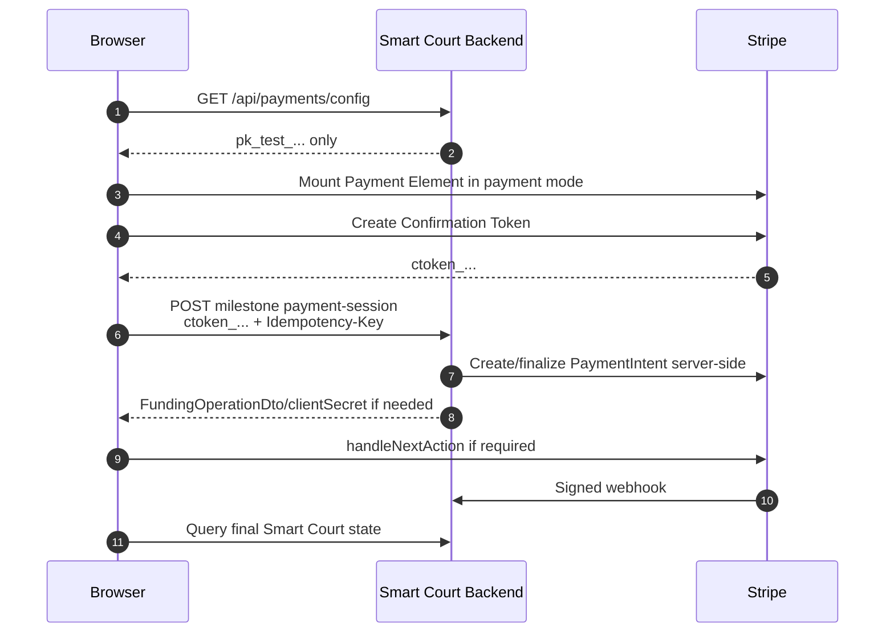

# Payments API integration guide

> **Source of truth:** current `codex/stripe-connect-mvp` code as inspected on 2026-08-12.  
> **Audience:** Smart Court browser/frontend engineers, QA engineers, and API integrators.  
> **Scope:** every route currently declared by a controller in `SmartCourt/Features/Payments`, including user, administrator, legacy-webhook, and Stripe-webhook routes.  
> **Implementation status:** this guide describes the implemented Stripe **test-sandbox** browser contract. The backend supplies publishable configuration, ConfirmationToken checkout, saved-card management, self-service Client retry, Connect onboarding, webhooks, and withdrawal history. Existing registration, email confirmation, account verification, and authorization remain unchanged.

## 1. Stripe Test Data for Browser Demo

Use only Stripe sandbox keys (`pk_test_...` and `sk_test_...`) and Stripe-hosted browser fields. Never type a real card into a sandbox and never send a primary account number, expiry, or CVC to Smart Court.

| Scenario | Card number typed in Stripe UI | Expiry | CVC | Expected result |
|---|---:|---:|---:|---|
| Successful Visa payment | `4242 4242 4242 4242` | `12/34` | `123` | Payment succeeds without a challenge. |
| 3D Secure authentication | `4000 0025 0000 3155` | `12/34` | `123` | Payment requires customer authentication. The UI must complete Stripe's challenge. |
| Generic decline | `4000 0000 0000 0002` | `12/34` | `123` | Stripe declines the payment with `card_declined` / `generic_decline`. |
| Insufficient funds (additional failure test) | `4000 0000 0000 9995` | `12/34` | `123` | Stripe declines the payment with `card_declined` / `insufficient_funds`. |

Any future expiry and any three-digit CVC are valid for these test cards. Any value can be used for other test form fields unless Stripe's hosted form says otherwise. Official reference: [Stripe testing documentation](https://docs.stripe.com/testing).

For automated API tests only—not for a card-entry UI—Stripe also provides test PaymentMethod IDs:

| Scenario | `paymentMethodReference` |
|---|---|
| Successful Visa | `pm_card_visa` |
| Generic decline | `pm_card_visa_chargeDeclined` |
| Insufficient funds | `pm_card_visa_chargeDeclinedInsufficientFunds` |

These IDs are useful for Swagger, PowerShell, or backend integration tests. A browser demo in which the user types a card must obtain a tokenized Stripe reference through Stripe.js; it must not hard-code these IDs as the normal UI behavior.

## 2. Frontend Workflow & Step-by-Step Integration Guide (NEW & MANDATORY)

### 2.1 Backend/frontend responsibility boundary

| Capability | Backend state | Frontend responsibility |
|---|---|---|
| Register and activate Client/Lawyer | Unchanged existing workflow | Use the existing registration, email confirmation, profile, verification, and administrator approval flow. Payments adds no bypass. |
| Retrieve Stripe browser configuration | Complete: `GET /api/payments/config` | Call once at app/checkout startup and initialize Stripe.js only with `publishableKey`. |
| Type a card securely | Backend-ready | Install `@stripe/stripe-js` and `@stripe/react-stripe-js`; render Stripe Payment Element. Card data must never pass through Smart Court. |
| Create/confirm a one-time payment | Complete using ConfirmationTokens | Mount deferred Payment Element, create `ctoken_...`, then call the milestone payment-session endpoint. Handle returned `clientSecret` for 3DS. |
| Save/list/default/delete Client cards | Complete using Stripe Customer + SetupIntent | Build a payment-method settings page using the four `/api/payment-methods` endpoints and `stripe.confirmSetup`. |
| Client retry after decline/failure | Complete | Collect a new ConfirmationToken and call `retry-session` for the failed local transaction. |
| Create Lawyer connected account | Complete using Accounts v2 and Account Links v2 | Redirect to Stripe-hosted onboarding and implement the configured return/refresh pages. |
| Release after the 14-day hold | Complete | Normal release is scheduled; the existing Super Administrator route remains available for operational force release. |
| Transfer milestone proceeds to lawyer | Available, server-controlled | Release creates a Stripe transfer to the enabled connected account; the browser never supplies a destination account. |
| Withdraw and view withdrawal history | Complete | Show wallet/history and submit a withdrawal; never collect bank details in Smart Court UI. |
| Receive Stripe webhooks | Complete | No browser call. Configure two Stripe event destinations/CLI forwarders with the matching signing secrets. |

### 2.2 Existing account and business prerequisites

1. Register, confirm email, complete the profile, submit verification, and obtain administrator approval using the existing workflows.
2. Log in normally; send cookies (`credentials: "include"`) or the returned Bearer access token.
3. Continue the normal Case → Proposal → Contract → Milestones workflow and complete both-party approvals.
4. The contract must be `Active`, the target milestone must be ready for funding, and every earlier milestone must be settled. Only one unsettled funded milestone per contract is allowed.

The Contract and Milestones guides contain the detailed upstream contracts. Payment funding will return a business error if any prerequisite is false.

### 2.3 One-time Client payment flow (recommended)

1. **Read configuration.** Call `GET /api/payments/config`. Require `providerCode == "StripeConnect"`, `sandboxOnly == true`, and a `pk_test_...` `publishableKey`.
2. **Initialize Stripe Elements.** Use `loadStripe(publishableKey)` and create deferred Elements with `{ mode: "payment", amount: Math.round(milestoneAmount * 100), currency: "egp" }`. Mount `<PaymentElement/>`. The amount displayed by the browser is advisory; the backend always loads the milestone amount from its database.
3. **Validate and tokenize.** On Pay, call `await elements.submit()`, then `stripe.createConfirmationToken({ elements, params: { return_url: paymentReturnUrl } })`. This returns a short-lived `ctoken_...`; raw PAN/expiry/CVC never touches Smart Court.
4. **Generate one idempotency key.** Create a UUID for this button action and preserve it through network retries.
5. **Fund the milestone.** Call `POST /api/milestones/{milestoneId}/payment-session` with `Idempotency-Key` and `{ "confirmationTokenReference": "ctoken_..." }`.
5. **Interpret the funding response.** There are three relevant shapes:
   - HTTP `200`, `data.status = "Succeeded"`, and `data.payment != null`: funding is complete.
   - HTTP `202`, `data.status = "RequiresCustomerAction"`, `data.clientActionType = "ConfirmPayment"`, and `data.clientSecret != null`: proceed to step 6.
   - HTTP `202`, `data.status = "Processing"`, `data.payment = null`: show a pending state and poll/query; do not resubmit with a new key.
6. **Complete 3D Secure.** Call `stripe.handleNextAction({ clientSecret })`. Do not call Smart Court to confirm it again; the webhook is authoritative.
7. **Wait for authoritative completion.** Stripe sends `payment_intent.succeeded` or `payment_intent.payment_failed` to `POST /api/payment-providers/stripe/webhooks/platform`. The backend reconciles the provider object and finalizes local state.
8. **Refresh UI state.** Poll `GET /api/milestones/{milestoneId}/payment` and/or `GET /api/contracts/{contractId}/payments`. A payment lookup can be `404` until the escrow hold is created. Also listen for Smart Court payment notifications when available.
9. **Failed payment retry.** Render a fresh Payment Element, create a new ConfirmationToken, create a new idempotency UUID, and call `POST /api/payments/{failedPaymentTransactionId}/retry-session`. Only the owning Client may retry it.

### 2.4 Saved-card management and saved-card checkout

1. Show explicit consent text such as “Save this card for future Smart Court payments.”
2. On consent, call `POST /api/payment-methods/setup-session` with a new `Idempotency-Key`. The backend idempotently creates the Client's Stripe Customer and returns a SetupIntent `clientSecret`.
3. Initialize Elements with `{ clientSecret }`, mount Payment Element, call `elements.submit()`, then `stripe.confirmSetup({ elements, clientSecret, confirmParams: { return_url }, redirect: "if_required" })`.
4. After success call `GET /api/payment-methods`; render only the masked fields returned by Smart Court.
5. Use `PUT /api/payment-methods/{pmId}/default` and `DELETE /api/payment-methods/{pmId}`. Both operations verify that the method belongs to the logged-in Client's Customer.
6. To pay with a listed saved card, call the compatibility endpoint `POST /api/milestones/{milestoneId}/fund` with `{ "paymentMethodReference": "pm_..." }` and an idempotency key. If it returns `RequiresCustomerAction`, call `stripe.handleNextAction({ clientSecret })`.

Official implementation references: [Confirmation Tokens](https://docs.stripe.com/payments/payment-element/migration-ct), [finalize payments on the server](https://docs.stripe.com/payments/finalize-payments-on-the-server), and [SetupIntent/Payment Element saving](https://docs.stripe.com/payments/save-and-reuse?client=react&platform=web&ui=elements).

### 2.5 Lawyer connected-account onboarding flow

1. The Lawyer logs in with a verified Smart Court account.
2. Call `GET /api/wallet/payout-account`.
   - `data = null`: no local payout account exists; show **Set up payouts**.
   - `data.status = "Onboarding" | "Restricted"`: show **Continue setup**.
   - `data.status = "Enabled"`: onboarding is complete.
3. Call `POST /api/wallet/payout-account/onboarding-link` when setup is needed.
4. Immediately navigate the browser to `data.url`. Account Links are short-lived and single-use.
5. The Lawyer enters identity and external bank information only on Stripe-hosted pages. Smart Court must never collect or proxy those fields.
6. Stripe redirects to configured return/refresh URLs. The frontend must implement both routes:
   - `/wallet/payout-account/return`: call `GET /api/wallet/payout-account`, then display the current requirements/readiness.
   - `/wallet/payout-account/refresh`: request a new onboarding link and redirect again; never reuse an expired link.
7. Stripe sends `account.updated` to `POST /api/payment-providers/stripe/webhooks/connect`; the backend synchronizes readiness.
8. Enable withdrawal UI only when `status == "Enabled"` and all three flags are true: `detailsSubmitted`, `transfersEnabled`, `payoutsEnabled`.
9. Optionally call `POST /api/wallet/payout-account/dashboard-link` and redirect the Lawyer to the returned Stripe Express login URL.

### 2.6 Milestone release, wallet, and withdrawal flow

1. Client funds the milestone; Smart Court creates an escrow hold with status `Funded`.
2. Lawyer submits the milestone through the Milestones slice.
3. Client accepts it, or auto-accept runs after its separate review timer. Acceptance sets `holdExpiresAt = acceptance time + 14 days` and places the net lawyer amount in `pendingBalance`.
4. The scheduled release job runs at `holdExpiresAt`. It creates a Stripe Transfer to the enabled connected account, moves `netAmount` from `pendingBalance` to `availableBalance`, records the 15% platform fee, and marks both hold and milestone `Released`.
5. The existing Super Administrator release route is the only manual way to accelerate the hold; otherwise wait for the scheduled 14-day release.
6. Lawyer calls `GET /api/wallet` and reads `availableBalance`.
7. Lawyer generates a fresh idempotency UUID and calls `POST /api/wallet/withdrawals` with the desired amount. `destinationReference` should be omitted or sent as `""`; Stripe uses the connected account's configured external bank account.
8. If response status is `Processing`, keep the amount reserved and refresh the wallet later. Do not create a replacement withdrawal.
9. Stripe sends connected-account `payout.*` events to the Connect webhook. Backend reconciliation changes the withdrawal to `Completed` or `Failed`; failed payout reservations are returned to available balance.

### 2.7 Webhook setup for local browser testing

1. Configure two distinct Stripe signing secrets in backend Development configuration: platform and Connect.
2. Start the Smart Court API at `http://localhost:5049`.
3. Use Stripe CLI forwarding (or an HTTPS tunnel):
   - Platform events → `http://localhost:5049/api/payment-providers/stripe/webhooks/platform`
   - Connected-account events → `http://localhost:5049/api/payment-providers/stripe/webhooks/connect`
4. Forward at minimum the provider-object events needed by this implementation:
   - Platform: PaymentIntent, Refund, and Transfer lifecycle events.
   - Connected accounts: `account.updated` and `payout.*`.
5. Use the signing secret printed for each listener in the matching backend setting. Do not send webhook requests from the browser.
6. Expect HTTP `200` with status `Processed` or `Duplicate`. Invalid signatures, live-mode events, oversized bodies, or processing failures are rejected.

## 3. Complete Endpoint Catalog (MANDATORY)

### 3.1 Catalog summary

| # | Method and exact route | Caller | Purpose |
|---:|---|---|---|
| 1 | `GET /api/payments/config` | Anonymous | Read safe Stripe browser configuration. |
| 2 | `POST /api/milestones/{milestoneId}/payment-session` | Client | Fund using a browser-created ConfirmationToken. |
| 3 | `POST /api/milestones/{milestoneId}/fund` | Client | Fund using a saved/legacy `pm_...` PaymentMethod. |
| 4 | `POST /api/payments/{paymentTransactionId}/retry-session` | Owning Client | Retry a failed deposit with a new ConfirmationToken. |
| 5 | `POST /api/payments/{paymentTransactionId}/retry` | Finance/Super Administrator | Operational retry with a PaymentMethod. |
| 6 | `GET /api/contracts/{contractId}/payments` | Participant/finance admin | Read full contract payment history. |
| 7 | `GET /api/milestones/{milestoneId}/payment` | Participant/finance admin | Read one milestone escrow hold. |
| 8 | `POST /api/payment-methods/setup-session` | Client | Create Customer/SetupIntent for saving a method. |
| 9 | `GET /api/payment-methods` | Client | List the Client's masked saved methods. |
| 10 | `PUT /api/payment-methods/{paymentMethodReference}/default` | Client | Set an owned method as default. |
| 11 | `DELETE /api/payment-methods/{paymentMethodReference}` | Client | Detach an owned saved method. |
| 12 | `GET /api/wallet` | Lawyer | Read wallet balances. |
| 13 | `GET /api/wallet/withdrawals` | Lawyer | Read withdrawal history. |
| 14 | `POST /api/wallet/withdrawals` | Lawyer | Request payout to the connected account's bank. |
| 15 | `GET /api/wallet/payout-account` | Lawyer | Read and synchronize connected-account readiness. |
| 16 | `POST /api/wallet/payout-account/onboarding-link` | Lawyer | Create/continue Stripe-hosted onboarding. |
| 17 | `POST /api/wallet/payout-account/dashboard-link` | Lawyer | Create a Stripe Express Dashboard login link. |
| 18 | `POST /api/admin/payment-providers/stripe/connected-accounts/link` | Finance/Super Administrator | Link an existing sandbox account to a Lawyer. |
| 19 | `POST /api/payment-providers/stripe/webhooks/platform` | Stripe | Process signed platform events. |
| 20 | `POST /api/payment-providers/stripe/webhooks/connect` | Stripe | Process signed connected-account events. |
| 21 | `POST /api/payments/webhook` | Legacy provider/server | Process provider-neutral HMAC webhooks. |
| 22 | `POST /api/admin/milestones/{milestoneId}/release` | Super Administrator | Force scheduled escrow release for operations. |
| 23 | `POST /api/admin/wallets/{lawyerUserId}/adjustments` | Super Administrator | Apply an audited exceptional wallet adjustment. |

### 3.2 `GET /api/payments/config`

**Purpose:** anonymous, safe bootstrap for Stripe.js. Call before rendering checkout or saved-card UI. It never returns secret/webhook keys.

- Headers/body: none.
- Success: HTTP `200`, `ApiResponse<PaymentProviderConfigDto>`.
- Errors: `429` when rate limited; `500` for invalid server configuration/startup failures.

```json
{
  "success": true,
  "data": {
    "providerCode": "StripeConnect",
    "publishableKey": "pk_test_...",
    "currency": "EGP",
    "sandboxOnly": true,
    "confirmationTokensEnabled": true,
    "savedPaymentMethodsEnabled": true
  },
  "message": null,
  "errors": null,
  "statusCode": 200
}
```

### 3.3 `POST /api/milestones/{milestoneId}/payment-session`

**Purpose:** recommended browser checkout. The backend verifies Client ownership and milestone/business state, derives amount/currency server-side, creates and confirms a Stripe PaymentIntent from the single-use ConfirmationToken, and creates the local escrow hold only when Stripe succeeds.

- Auth: `Client`; `Authorization: Bearer ...` or auth cookie.
- Route: nonempty UUID `milestoneId`.
- Header: required `Idempotency-Key`, nonblank, max 200.
- JSON: `{ "confirmationTokenReference": "ctoken_..." }`.
- Success: HTTP `200` with `FundingOperationDto` when complete, or `202` for `RequiresCustomerAction`/`Processing`.
- Errors: `400` invalid token/header or domain gate; `401/403` auth/ownership; `404` missing route resource; `409` conflicting concurrent/idempotency operation; `429`; `500` unknown server failure.

### 3.4 `POST /api/payments/{paymentTransactionId}/retry-session`

**Purpose:** lets the original Client retry their own provider-confirmed failed deposit without an administrator. It requires a new ConfirmationToken and creates a new provider attempt under the existing local transaction rules.

- Auth: `Client`; backend also checks the payment's contract Client equals the caller.
- Route: failed local PaymentTransaction UUID.
- Header: required `Idempotency-Key`, max 200.
- JSON: `{ "confirmationTokenReference": "ctoken_..." }`.
- Success/errors: same `FundingOperationDto`, `200`/`202`, and standard payment errors as payment-session. Nonfailed, unrelated, refunded, or otherwise ineligible attempts are rejected.

### 3.5 `POST /api/payment-methods/setup-session`

**Purpose:** idempotently creates the current Client's Stripe Customer mapping and an `on_session` SetupIntent. Call only after explicit save-card consent.

- Auth: `Client`.
- Header: required `Idempotency-Key`, max 200.
- Body: none.
- Success: HTTP `200`, `ApiResponse<SetupPaymentMethodSessionDto>` containing the Stripe.js-only `clientSecret`.
- Errors: `400`, `401/403`, `429`, `500`.

### 3.6 `GET /api/payment-methods`

**Purpose:** returns only masked methods attached to the logged-in Client's provider Customer. If no Customer exists, `data` is `[]`.

- Auth: `Client`; no params/body.
- Success: HTTP `200`, `ApiResponse<SavedPaymentMethodDto[]>`.
- Errors: `401/403`, `429`, provider `500`.

### 3.7 `PUT /api/payment-methods/{paymentMethodReference}/default`

**Purpose:** sets an attached, caller-owned `pm_...` as the Customer default. Cross-customer IDs are rejected.

- Auth: `Client`; route is the Stripe PaymentMethod ID; no body.
- Success: HTTP `200`, `ApiResponse<string>` with `data = "Default payment method updated."`.
- Errors: `400/404` invalid/missing ownership, `401/403`, `429`, provider `500`.

### 3.8 `DELETE /api/payment-methods/{paymentMethodReference}`

**Purpose:** detaches an attached, caller-owned saved method. Never sends card data to Smart Court.

- Auth/route/errors: same ownership rules as Set Default; no body.
- Success: HTTP `200`, `ApiResponse<string>` with `data = "Payment method removed."`.

All authenticated routes use the application's existing HttpOnly authentication cookies in the current frontend. `Authorization: Bearer <JWT>` is also the documented API form when calling outside that browser client. There are no query parameters in the current Payments controllers.

### 3.9 `POST /api/milestones/{milestoneId}/fund`

**Purpose and timing:** Called once by the Client who owns the contract, after the milestone and contract meet every funding prerequisite. Creates an idempotency reservation and local `PaymentTransaction`, changes the milestone to `FundingProcessing`, creates/confirms a Stripe PaymentIntent, then either creates the escrow hold synchronously or returns pending customer/provider action.

**Request**

- Role: `Client`.
- Route: `milestoneId` (`guid`, required).
- Header: `Idempotency-Key` (`string`, required, nonblank, maximum 200 characters).
- Body:

```json
{
  "paymentMethodReference": "pm_123"
}
```

**Success**

- HTTP `200` when `data.payment` is populated.
- HTTP `202` when the provider result is still processing or requires customer action. The envelope's internal `statusCode` is currently still `200` because the controller wraps the result with `ApiResponse.Ok` before returning HTTP 202.

```json
{
  "success": true,
  "data": {
    "paymentTransactionId": "00000000-0000-0000-0000-000000000000",
    "milestoneId": "00000000-0000-0000-0000-000000000000",
    "status": "Succeeded",
    "clientActionType": null,
    "clientSecret": null,
    "redirectUrl": null,
    "payment": {
      "id": "00000000-0000-0000-0000-000000000000",
      "milestoneId": "00000000-0000-0000-0000-000000000000",
      "grossAmount": 100.00,
      "platformFee": 5.00,
      "netAmount": 95.00,
      "currency": "EGP",
      "status": 0,
      "holdExpiresAt": null,
      "settledAt": null
    },
    "occurredAt": "2026-08-12T12:00:00Z"
  },
  "message": null,
  "errors": null,
  "statusCode": 200
}
```

**Important errors:** `400` for missing idempotency key, ineligible state, missing approvals/readiness, provider-confirmed failure, or uncertain provider outcome; `403` if not the contract Client; `409` for a concurrent funding attempt or existing hold; `401` when unauthenticated. An uncertain result intentionally remains `Processing`; do not retry with a new key.

### 3.10 `GET /api/contracts/{contractId}/payments`

**Purpose and timing:** Reads all escrow holds, provider attempts, and escrow-ledger entries for a contract. Participants may read only their own contract; active Finance/Super Administrators may read any contract.

**Request**

- Roles: `Client`, `Lawyer`, `FinanceAdministrator`, `SuperAdministrator`.
- Route: `contractId` (`guid`, required).
- No body.

**Success:** HTTP `200`, `ApiResponse<PaymentHistoryDto>`. Arrays are returned even when empty. Holds are ordered by funding time; attempts newest-first; ledger entries oldest-first.

```json
{
  "success": true,
  "data": {
    "payments": [],
    "attempts": [],
    "ledgerEntries": []
  },
  "message": null,
  "errors": null,
  "statusCode": 200
}
```

**Important errors:** `404` contract missing; `403` caller is neither participant nor active authorized finance administrator; `401` unauthenticated.

### 3.11 `GET /api/milestones/{milestoneId}/payment`

**Purpose and timing:** Reads the escrow hold for one milestone. Use after funding/webhook completion and throughout the hold/release/refund lifecycle.

**Request**

- Roles: `Client`, `Lawyer`, `FinanceAdministrator`, `SuperAdministrator`.
- Route: `milestoneId` (`guid`, required).
- No body.

**Success:** HTTP `200`, `ApiResponse<PaymentDto>`.

**Important errors:** `404` when the milestone is missing or when funding has not yet created an escrow hold; `403` unauthorized contract access; `401` unauthenticated.

### 3.12 `POST /api/payments/{paymentTransactionId}/retry`

**Purpose and timing:** Operational retry for a deposit whose local transaction is exactly `Failed`. Creates a new PaymentTransaction; it does not mutate/reuse the old provider attempt. It is not a Client self-service endpoint.

**Request**

- Roles: `FinanceAdministrator`, `SuperAdministrator`.
- Route: `paymentTransactionId` (`guid`, required).
- Header: `Idempotency-Key` (`string`, required, maximum 200). The controller overwrites any JSON `idempotencyKey` with this header value.
- Body:

```json
{
  "paymentMethodReference": "pm_new_reference"
}
```

`idempotencyKey` technically exists on the DTO but should be omitted from JSON because the header is authoritative.

**Success:** Same `FundingOperationDto` and HTTP `200`/`202` behavior as funding.

**Important errors:** `400` if the original transaction is not `Failed`, is not a deposit, the new tokenized reference/header is invalid, or funding prerequisites no longer hold; `404` for missing payment/contract/milestone; `403` without active finance eligibility; `409` for concurrent retry; `401` unauthenticated.

### 3.13 `POST /api/payments/webhook` — legacy provider-neutral webhook

**Purpose and timing:** Compatibility route for a non-Stripe provider payload signed with Smart Court's legacy HMAC scheme. **Stripe does not send this body or these headers. The frontend must never call this route.** New Stripe integration uses sections 3.13 and 3.14.

**Request**

- Anonymous network route; optional configured IP/CIDR allow-list is checked.
- Headers, all required:
  - `X-Payment-Event-Id`: must equal JSON `eventId`.
  - `X-Payment-Timestamp`: Unix seconds within ±300 seconds.
  - `X-Payment-Signature`: `v1=` followed by Base64 HMAC-SHA256 of `<timestamp>.<rawBody>` using `PaymentProvider:WebhookSecret`.
- Maximum raw body: configured `WebhookMaximumBodySizeBytes` (default 65,536).
- Body: `PaymentWebhookRequest`.

```json
{
  "eventId": "evt-provider-001",
  "paymentTransactionId": "00000000-0000-0000-0000-000000000000",
  "providerTransactionId": "provider-transaction-id",
  "status": 1,
  "amount": 100.00,
  "currency": "EGP",
  "processedAt": "2026-08-12T12:00:00Z",
  "failureReason": null
}
```

**Success:** HTTP `200`, `PaymentActionResultDto`; `status` is `Completed`, `Failed`, or `Duplicate`.

**Important errors:** `400` invalid body/signature/timestamp/mismatch/nonterminal status; `403` untrusted source IP; `413` oversized body; `429` only if rate-limit middleware is enabled; `500` unexpected processing failure.

### 3.14 `GET /api/wallet`

**Purpose and timing:** Returns the logged-in Lawyer's Smart Court wallet. No wallet row is required: before first funding/release it returns zeros.

**Request:** Role `Lawyer`; no parameters or body.

**Success:** HTTP `200`, `ApiResponse<WalletDto>`.

```json
{
  "success": true,
  "data": {
    "lawyerUserId": "00000000-0000-0000-0000-000000000000",
    "currency": "EGP",
    "pendingBalance": 95.00,
    "availableBalance": 0.00,
    "totalReleased": 0.00
  },
  "message": null,
  "errors": null,
  "statusCode": 200
}
```

**Important errors:** `401` unauthenticated; `403` wrong role.

### 3.15 `GET /api/wallet/withdrawals`

**Purpose:** returns every withdrawal for the logged-in Lawyer, newest first, so the browser can show pending, completed, failed, and manual-review outcomes without database access.

- Auth: `Lawyer`; no params/body.
- Success: HTTP `200`, `ApiResponse<WithdrawalDto[]>`; returns `[]` when none exist.
- Errors: `401/403`, `429`, `500`.

### 3.16 `POST /api/wallet/withdrawals`

**Purpose and timing:** Reserves available Lawyer wallet funds and creates a Stripe Payout in the context of the enabled connected account. The destination is the external account configured at Stripe.

**Request**

- Role: `Lawyer`.
- Header: `Idempotency-Key` required, nonblank, maximum 200.
- Body:

```json
{
  "amount": 95.00,
  "destinationReference": ""
}
```

**Success:** HTTP `200`, `ApiResponse<PaymentActionResultDto>`. `status` is normally `Completed` or `Processing`.

```json
{
  "success": true,
  "data": {
    "entityId": "00000000-0000-0000-0000-000000000000",
    "status": "Completed",
    "occurredAt": "2026-08-12T12:00:00Z"
  },
  "message": null,
  "errors": null,
  "statusCode": 200
}
```

**Important errors:** `400` missing/invalid amount or idempotency key, no wallet, no enabled payout account, insufficient available balance, or uncertain provider result; provider-confirmed payout failure is surfaced as `400` and the reserved amount is returned; `401`/`403` for auth/role. A processing response means funds remain reserved.

### 3.17 `GET /api/wallet/payout-account`

**Purpose and timing:** Returns the Lawyer's local payout account after first synchronizing it from Stripe. Use on payout-settings page load and after returning from Stripe onboarding.

**Request:** Role `Lawyer`; no body.

**Success:** HTTP `200`, `ApiResponse<LawyerPayoutAccountDto?>`; `data` is `null` if no account exists.

**Important errors:** `400` for Stripe/provider synchronization failure; `401`/`403` for auth/role.

### 3.18 `POST /api/wallet/payout-account/onboarding-link`

**Purpose and timing:** Creates a Stripe connected account on first use, persists it, and returns a single-use hosted onboarding link. On subsequent incomplete attempts, returns a new link for the same account.

**Request:** Role `Lawyer`; no body.

**Success:** HTTP `200`, `ApiResponse<PayoutAccountLinkDto>`.

```json
{
  "success": true,
  "data": {
    "url": "https://connect.stripe.com/setup/...",
    "expiresAt": "2026-08-12T12:30:00Z"
  },
  "message": null,
  "errors": null,
  "statusCode": 200
}
```

**Important errors:** `400` missing Lawyer email, account already enabled, or Stripe failure; `401`/`403` for auth/role. Do not cache/reuse the URL.

### 3.19 `POST /api/wallet/payout-account/dashboard-link`

**Purpose and timing:** Creates a short-lived Stripe Express Dashboard login URL for a Lawyer whose connected account already exists.

**Request:** Role `Lawyer`; no body.

**Success:** HTTP `200`, `ApiResponse<PayoutAccountLinkDto>` where `expiresAt` is `null`.

**Important errors:** `400` no local payout account or Stripe failure; `401`/`403` for auth/role.

### 3.20 `POST /api/admin/payment-providers/stripe/connected-accounts/link`

**Purpose and timing:** Sandbox-only operations shortcut that links an existing Stripe test connected account to an existing Smart Court Lawyer. Normal user onboarding should use section 3.10.

**Request**

- Roles: `FinanceAdministrator`, `SuperAdministrator`.
- Body:

```json
{
  "lawyerUserId": "00000000-0000-0000-0000-000000000000",
  "providerAccountId": "acct_123"
}
```

**Success:** HTTP `200`, `ApiResponse<LawyerPayoutAccountDto>`.

**Important errors:** `400` invalid/missing Lawyer or provider account; `403` if not sandbox or provider account is live; `409` if either Lawyer or Stripe account is already linked; `401`/`403` for auth/role.

### 3.21 `POST /api/payment-providers/stripe/webhooks/platform`

**Purpose and timing:** Official Stripe platform webhook. Verifies the exact raw body using `Stripe-Signature` and the configured platform endpoint secret, rejects live-mode events in this sandbox, deduplicates by Stripe event ID, and reconciles a matching PaymentTransaction by Stripe object ID.

**Request**

- Caller: Stripe/Stripe CLI, never the browser.
- Header: `Stripe-Signature` required.
- Body: unmodified Stripe Event JSON; maximum configured webhook body size.

**Success:** HTTP `200`, `PaymentActionResultDto` with `status = "Processed"` or `"Duplicate"`. `entityId` is the local stored webhook-event ID, not the Stripe object ID.

**Important errors:** `400` missing/invalid/expired signature or downstream business reconciliation failure; `403` live Stripe event; `413` payload too large; `500` unexpected failure. Events with no matching transaction are stored and marked processed but cause no payment mutation.

### 3.22 `POST /api/payment-providers/stripe/webhooks/connect`

**Purpose and timing:** Official connected-account webhook using the distinct Connect signing secret. `account.updated` synchronizes Lawyer payout readiness; every event whose type starts with `payout.` triggers reconciliation of pending withdrawals; other matching provider objects use payment reconciliation.

**Request/response/errors:** Same shape as section 3.13, but signed with the Connect webhook endpoint's secret and normally containing Stripe's connected-account context.

### 3.23 `POST /api/admin/milestones/{milestoneId}/release`

**Purpose and timing:** Super Administrator operational/demo action. If both hold and milestone have future hold dates, it sets them to now and runs the same guarded release process. This creates the Stripe Transfer and changes pending wallet funds to available; it does not directly create a payout.

**Request:** Role `SuperAdministrator`; route `milestoneId` (`guid`); no body.

**Success:** HTTP `200`, `PaymentActionResultDto` with `entityId = milestoneId`, `status = "Released"`.

**Important errors:** `400` for any noncompleted release outcome (missing/ineligible hold, missing enabled payout account, provider problem, etc.); `401`/`403` for auth/role.

### 3.24 `POST /api/admin/wallets/{lawyerUserId}/adjustments`

**Purpose and timing:** Exceptional audited correction to pending and/or available Lawyer balances. Requires matching Lawyer, Contract, wallet, and escrow account, creates a ledger entry and adjustment audit record, and prevents negative resulting balances.

**Request**

- Role: `SuperAdministrator`; service also re-checks active Super Administrator eligibility.
- Route: `lawyerUserId` (`guid`, required).
- Header: `Idempotency-Key` required, nonblank, maximum 200.
- Body:

```json
{
  "contractId": "00000000-0000-0000-0000-000000000000",
  "pendingBalanceDelta": -5.00,
  "availableBalanceDelta": 5.00,
  "reason": "Detailed operational correction reason of at least twenty characters."
}
```

**Success:** HTTP `200`, `ApiResponse<AdminWalletAdjustmentDto>`.

**Important errors:** `400` validation, zero correction, negative resulting balance, or idempotency misuse; `404` no matching contract/wallet/escrow combination; `401`/`403` for auth/eligibility; `409` can represent recorded/idempotent operation failure.

### 3.25 Standard success and error envelopes

Normal controller success uses camelCase `ApiResponse<T>`:

```json
{
  "success": true,
  "data": {},
  "message": null,
  "errors": null,
  "statusCode": 200
}
```

Exceptions handled by global middleware use `ApiResponse<string>`:

```json
{
  "success": false,
  "data": null,
  "message": "Human-readable error message",
  "errors": null,
  "statusCode": 400
}
```

`ValidationException` can instead populate `errors`. Automatic `[ApiController]`/FluentValidation model-state rejection can occur before controller code and use ASP.NET Core `ValidationProblemDetails` rather than `ApiResponse`:

```json
{
  "type": "https://tools.ietf.org/html/rfc9110#section-15.5.1",
  "title": "One or more validation errors occurred.",
  "status": 400,
  "errors": {
    "PaymentMethodReference": ["مرجع وسيلة الدفع مطلوب."]
  },
  "traceId": "..."
}
```

Framework authorization failures can be empty/non-wrapped `401` or `403`. The frontend error parser must support all three shapes. Global mapped statuses are `400`, `401`, `403`, `404`, `409`, `412`, `413`, `429`, and `500`. Route constraints can produce framework `404` for a malformed GUID before controller execution.

## 4. Exhaustive DTO & Field Dictionary (MANDATORY)

### 4.1 Request DTOs

#### `FundMilestoneRequest`

| Field | JSON type | Required | Description |
|---|---|---:|---|
| `paymentMethodReference` | `string` | Yes | Stripe-tokenized `pm_...` reference. Nonblank, maximum 200. Never send raw card data. |

#### `CreateMilestonePaymentSessionRequest`

| Field | JSON type | Required | Description |
|---|---|---:|---|
| `confirmationTokenReference` | `string` | Yes | Single-use Stripe ConfirmationToken produced by `stripe.createConfirmationToken`; must match `^ctoken_[A-Za-z0-9_]+$`, maximum 200. This is not a client secret. |

#### `RetryPaymentSessionRequest`

| Field | JSON type | Required | Description |
|---|---|---:|---|
| `confirmationTokenReference` | `string` | Yes | New `ctoken_...` for the retry; same regex/length constraints. |
| `idempotencyKey` | `string` | No in JSON | Controller overwrites it from `Idempotency-Key`; omit from JSON. Maximum 200. |

#### `RetryPaymentRequest`

| Field | JSON type | Required | Description |
|---|---|---:|---|
| `paymentMethodReference` | `string` | Yes | A new tokenized payment reference; nonblank, maximum 200. |
| `idempotencyKey` | `string` | DTO default `""` | Controller replaces this with the `Idempotency-Key` header. Omit it from JSON. Maximum 200. |

#### `PaymentWebhookRequest` (legacy route only)

| Field | JSON type | Required | Description |
|---|---|---:|---|
| `eventId` | `string` | Yes | Provider event ID; nonempty, maximum 200, equals header ID. |
| `paymentTransactionId` | `string` UUID | Yes | Existing local PaymentTransaction ID. |
| `providerTransactionId` | `string` | Yes | Provider transaction reference; maximum 200 and must match any already-recorded ID. |
| `status` | `number` | Yes | `PaymentTransactionStatus`; must be terminal when processing a pending transaction. |
| `amount` | `number` | Yes | Positive amount, maximum two decimals, exact match to original transaction. |
| `currency` | `string` | Yes | Must be exactly `EGP`. |
| `processedAt` | ISO-8601 string or `null` | No | If supplied, parsed `DateTime.Kind` must be UTC. |
| `failureReason` | `string` or `null` | No | Provider failure detail, maximum 2,000. |

#### `CreateWithdrawalRequest`

| Field | JSON type | Required | Description |
|---|---|---:|---|
| `amount` | `number` | Yes | EGP amount greater than zero, maximum two decimals, and no greater than available balance. |
| `destinationReference` | `string` | No | Legacy provider field, default `""`, maximum 200. Stripe ignores it as a bank selector; the connected account determines destination. |

#### `LinkLawyerPayoutAccountRequest`

| Field | JSON type | Required | Description |
|---|---|---:|---|
| `lawyerUserId` | `string` UUID | Yes | Existing Smart Court Lawyer user ID; cannot be empty. |
| `providerAccountId` | `string` | Yes | Existing Stripe sandbox connected-account ID such as `acct_...`; nonblank. No dedicated FluentValidator currently enforces a maximum. |

#### `AdminWalletAdjustmentRequest`

| Field | JSON type | Required | Description |
|---|---|---:|---|
| `contractId` | `string` UUID | Yes | Contract belonging to the target Lawyer and having matching wallet/escrow records. |
| `pendingBalanceDelta` | `number` | Conditional | Signed EGP adjustment in `[-1,000,000, 1,000,000]`, maximum two decimals. |
| `availableBalanceDelta` | `number` | Conditional | Same range/precision. At least one delta must be nonzero. |
| `reason` | `string` | Yes | Nonblank operational justification, 20–1,500 characters. |

### 4.2 Response DTOs

#### `PaymentDto`

| Field | JSON type | Description |
|---|---|---|
| `id` | UUID | Local `EscrowHold.Id`, not the PaymentTransaction or Stripe ID. |
| `milestoneId` | UUID | Associated milestone. |
| `grossAmount` | `number` | Original funded EGP amount. |
| `platformFee` | `number` | Platform fee. Current calculator uses 15% of the Lawyer's gross allocation, rounded to two decimals away from zero. |
| `netAmount` | `number` | Amount allocated to the Lawyer after platform fee. |
| `currency` | `string` | Always `EGP` in the current domain. |
| `status` | `number` | Numeric `EscrowHoldStatus`. |
| `holdExpiresAt` | ISO-8601 string or `null` | Set when milestone is accepted; normally acceptance + 14 days. |
| `settledAt` | ISO-8601 string or `null` | Release/refund settlement time. |

#### `PaymentAttemptDto`

| Field | JSON type | Description |
|---|---|---|
| `id` | UUID | Local PaymentTransaction ID. |
| `milestoneId` | UUID or `null` | Milestone for deposit/release/refund; nullable for withdrawal-compatible model. |
| `operationType` | `number` | Numeric `PaymentOperationType`. |
| `status` | `number` | Numeric `PaymentTransactionStatus`. |
| `amount` | `number` | Business amount in `currency`. |
| `currency` | `string` | Currently `EGP`. |
| `providerName` | `string` | Provider implementation class name recorded when attempt began. |
| `providerAttemptCount` | `number` integer | Number of provider/reconciliation attempts. |
| `nextRetryAt` | ISO-8601 string or `null` | Scheduled reconciliation/retry time. |
| `requiresManualAction` | `boolean` | Operation exceeded automation safety/SLA and needs operations review. |
| `manualActionRequiredAt` | ISO-8601 string or `null` | Escalation time. |
| `createdAt` | ISO-8601 string | Attempt creation time. |
| `processedAt` | ISO-8601 string or `null` | Terminal processing time. |

#### `EscrowLedgerEntryDto`

| Field | JSON type | Description |
|---|---|---|
| `id` | UUID | Ledger-entry ID. |
| `escrowHoldId` | UUID or `null` | Related hold, if any. |
| `transactionType` | `number` | Numeric `LedgerTransactionType`. |
| `amount` | `number` | Positive magnitude of the entry. Direction is represented by transaction type/description, not a negative amount. |
| `runningBalance` | `number` | Escrow running balance after the entry. |
| `currency` | `string` | `EGP`. |
| `description` | `string` | Server-generated audit description. |
| `createdAt` | ISO-8601 string | Entry time. |

#### `PaymentHistoryDto`

| Field | JSON type | Description |
|---|---|---|
| `payments` | `PaymentDto[]` | Every escrow hold under the contract. |
| `attempts` | `PaymentAttemptDto[]` | Every PaymentTransaction under the contract. |
| `ledgerEntries` | `EscrowLedgerEntryDto[]` | Contract escrow-ledger entries. |

#### `WalletDto`

| Field | JSON type | Description |
|---|---|---|
| `lawyerUserId` | UUID | Logged-in Lawyer. |
| `currency` | `string` | Always `EGP`. |
| `pendingBalance` | `number` | Net accepted funds still inside hold/release processing. Not withdrawable. |
| `availableBalance` | `number` | Withdrawable Smart Court wallet balance. |
| `totalReleased` | `number` | Aggregate released amount from related escrow accounts; this is not the same as current available balance. |

#### `WithdrawalDto`

| Field | JSON type | Description |
|---|---|---|
| `id` | UUID | Local withdrawal request ID. |
| `amount` | `number` | Requested EGP amount. |
| `currency` | `string` | `EGP`. |
| `status` | `number` | Numeric `WithdrawalStatus`. |
| `providerStatus` | `string` or `null` | Last Stripe payout status, such as `pending`, `in_transit`, `paid`, or `failed`. |
| `failureReason` | `string` or `null` | Safe provider/local failure explanation. |
| `requiresManualAction` | `boolean` | Operations intervention is required after reconciliation/SLA checks. |
| `requestedAt` | ISO-8601 string | Request time. |
| `processedAt` | ISO-8601 string or `null` | Terminal completion/failure time. |

#### `PaymentActionResultDto`

| Field | JSON type | Description |
|---|---|---|
| `entityId` | UUID | Context-dependent local entity ID: withdrawal, payment transaction, milestone, or stored webhook event. |
| `status` | `string` | Context-dependent string: `Processing`, `Completed`, `Failed`, `Duplicate`, `Processed`, or `Released`. |
| `occurredAt` | ISO-8601 string | Server UTC event/result time. |

#### `FundingOperationDto`

| Field | JSON type | Description |
|---|---|---|
| `paymentTransactionId` | UUID | Local payment attempt ID. Preserve it for support/history, not Stripe.js. |
| `milestoneId` | UUID | Funded milestone. |
| `status` | `string` | Provider outcome string: `Succeeded`, `Processing`, or `RequiresCustomerAction` in successful HTTP responses. Failed/unknown paths are normally thrown as errors. |
| `clientActionType` | `string` or `null` | `ConfirmPayment` when Stripe requires browser authentication; `Redirect` exists in provider model but current Stripe card flow disables redirect methods. |
| `clientSecret` | `string` or `null` | **Sensitive short-lived Stripe client secret required by frontend Stripe.js to complete 3DS. Never log it or store it long term.** |
| `redirectUrl` | `string` or `null` | Provider redirect URL for a future/other provider action; normally null for current Stripe card flow. |
| `payment` | `PaymentDto` or `null` | Non-null only after local funding/hold creation is complete. |
| `occurredAt` | ISO-8601 string | Result time. |

#### `LawyerPayoutAccountDto`

| Field | JSON type | Description |
|---|---|---|
| `id` | UUID | Local payout-account record ID. |
| `providerCode` | `string` | Current Stripe value is `StripeConnect`. |
| `status` | `string` | One of the `LawyerPayoutAccountStatus` names. |
| `detailsSubmitted` | `boolean` | Stripe reports onboarding details submitted. |
| `transfersEnabled` | `boolean` | Current v1 readiness mapping says transfers are enabled. |
| `payoutsEnabled` | `boolean` | Stripe reports payouts enabled. |
| `country` | `string` | Uppercase connected-account country. Development default is currently `US`. |
| `defaultCurrency` | `string` | Lowercase provider account default currency. |
| `maskedDestination` | `string` or `null` | Safe masked external payout destination, if Stripe provides one. |
| `lastSynchronizedAt` | ISO-8601 string or `null` | Last provider refresh time. |

#### `PayoutAccountLinkDto`

| Field | JSON type | Description |
|---|---|---|
| `url` | `string` | Temporary Stripe-hosted onboarding or dashboard URL. Navigate immediately; never persist as durable state. |
| `expiresAt` | ISO-8601 string or `null` | Onboarding-link expiry; dashboard link currently returns null. |

#### `PaymentProviderConfigDto`

| Field | JSON type | Description |
|---|---|---|
| `providerCode` | `string` | Must be `StripeConnect` for this frontend implementation. |
| `publishableKey` | `string` | Safe `pk_test_...` passed only to `loadStripe`; never confuse it with `sk_test_...`. |
| `currency` | `string` | `EGP`. Convert displayed major units to minor units when initializing deferred Elements. |
| `sandboxOnly` | `boolean` | Must be true for this MVP. The UI should refuse the demo if false. |
| `confirmationTokensEnabled` | `boolean` | Whether the modern browser payment-session flow is available. |
| `savedPaymentMethodsEnabled` | `boolean` | Whether SetupIntent/saved-method UI can be shown. |

#### `SetupPaymentMethodSessionDto`

| Field | JSON type | Description |
|---|---|---|
| `setupIntentId` | `string` | Stripe `seti_...` reference for correlation/support. |
| `clientSecret` | `string` | **Stripe.js-only SetupIntent secret. Never log, persist, or expose to another user.** |
| `status` | `string` | Initial Stripe SetupIntent status, normally `requires_payment_method`. |

#### `SavedPaymentMethodDto`

| Field | JSON type | Description |
|---|---|---|
| `paymentMethodReference` | `string` | Stripe `pm_...` ID; may be submitted to the saved-card funding endpoint. |
| `type` | `string` | Stripe method type; current UI should support/display `card`. |
| `brand` | `string` or `null` | Card brand such as `visa`. |
| `last4` | `string` or `null` | Masked final four digits only. |
| `expiryMonth` | `number` integer or `null` | Card expiration month. |
| `expiryYear` | `number` integer or `null` | Four-digit expiration year. |
| `holderName` | `string` or `null` | Billing holder name if collected. |
| `isDefault` | `boolean` | Whether it is the Customer's default method. |

#### `AdminWalletAdjustmentDto`

| Field | JSON type | Description |
|---|---|---|
| `id` | UUID | WalletAdjustment audit record ID. |
| `lawyerUserId` | UUID | Adjusted Lawyer. |
| `contractId` | UUID | Contract supplying the matched escrow scope. |
| `ledgerEntryId` | UUID | Created audit ledger entry. |
| `pendingBalanceDelta` | `number` | Applied signed pending change. |
| `availableBalanceDelta` | `number` | Applied signed available change. |
| `pendingBalance` | `number` | Resulting pending balance. |
| `availableBalance` | `number` | Resulting available balance. |
| `createdByUserId` | UUID | Acting Super Administrator. |
| `createdAt` | ISO-8601 string | Audit creation time. |

#### `ApiResponse<T>`

| Field | JSON type | Description |
|---|---|---|
| `success` | `boolean` | `true` for the normal success wrappers; `false` for middleware failures. |
| `data` | `T` or `null` | Endpoint payload. |
| `message` | `string` or `null` | Optional human-readable message. |
| `errors` | `string[]` or `null` | Flattened validation errors for middleware `ValidationException`. |
| `statusCode` | `number` integer | Body-level status. Note the current HTTP-202 funding response still contains `200`. |

### 4.3 Enum dictionary and string-status unions

ASP.NET Core has no `JsonStringEnumConverter` configured, so enum-typed JSON fields serialize as numbers. Do not confuse those fields with deliberately string-typed status fields.

#### `EscrowHoldStatus`

| Number | Name | Meaning |
|---:|---|---|
| `0` | `Funded` | Deposit succeeded and funds are held. |
| `1` | `Frozen` | Hold frozen by dispute/settlement processing. |
| `2` | `Released` | Net funds transferred/released to Lawyer wallet/account. |
| `3` | `Refunded` | Funds returned to Client. |

Allowed transitions: `Funded → Frozen|Released|Refunded`; `Frozen → Released|Refunded`.

#### `PaymentTransactionStatus`

| Number | Name | Meaning |
|---:|---|---|
| `0` | `Processing` | Provider outcome is pending/unknown and reconciliation owns next action. |
| `1` | `Completed` | Provider operation completed and local state was applied. |
| `2` | `Failed` | Provider confirmed failure. |

#### `PaymentOperationType`

| Number | Name | Meaning |
|---:|---|---|
| `0` | `Deposit` | Client milestone funding. |
| `1` | `Release` | Transfer of Lawyer allocation to connected account. |
| `2` | `Refund` | Full or partial Client refund. |
| `3` | `Withdrawal` | Lawyer payout request. |

#### `LedgerTransactionType`

| Number | Name | Meaning |
|---:|---|---|
| `0` | `Deposit` | Escrow balance increase from funding. |
| `1` | `Release` | Lawyer allocation released. |
| `2` | `Refund` | Client refund. |
| `3` | `PlatformFee` | Platform fee recognized. |
| `4` | `Adjustment` | Exceptional administrator correction. |

#### `WithdrawalStatus`

| Number | Name | Meaning |
|---:|---|---|
| `0` | `Processing` | Payout outcome pending; amount remains reserved. |
| `1` | `Completed` | Payout completed. |
| `2` | `Failed` | Payout failed and reservation is returned. |

#### `LawyerPayoutAccountStatus`

| Number | String returned by DTO | Meaning |
|---:|---|---|
| `0` | `Pending` | Local account exists but onboarding has not started/completed. |
| `1` | `Onboarding` | More Stripe onboarding information or capabilities are required. |
| `2` | `Enabled` | Details, transfers, and payouts all enabled. |
| `3` | `Restricted` | Stripe reports restrictions requiring remediation. |
| `4` | `Disabled` | Disabled state exists in domain enum; current mapper does not actively assign it. |

#### Other internal enums relevant to lifecycle

- `EscrowAccountStatus`: `0 Active`, `1 Closed`.
- `SettlementType`: `0 Release`, `1 Refund`, `2 PartialSplit`.
- `ProviderOperationOutcome` string in funding response: `Succeeded`, `Failed`, `Unknown`, `Processing`, `RequiresCustomerAction`.
- `ProviderClientActionType` string in funding response: `ConfirmPayment`, `Redirect`.

### 4.4 Advanced API mechanics

#### Idempotency

- Exact header name is `Idempotency-Key`, not `X-Idempotency-Key`.
- Required on payment-session, legacy/saved-method funding, both retry routes, SetupIntent creation, withdrawal, and administrator wallet adjustment.
- Maximum 200 characters; UUID v4 is recommended.
- Scope includes actor, operation, and resource. Reusing a key with a different body is rejected.
- Keep the same key across network retries for the same logical button action.
- Generate a new key only after a terminal failure and an explicitly new user action.
- Unknown/processing payment or payout results are deliberately reconciled. Never create a replacement operation merely because the first HTTP request timed out.

#### Client secrets

- `FundingOperationDto.clientSecret` is returned after the server creates/confirms a PaymentIntent and Stripe returns `requires_action`; pass it to `stripe.handleNextAction`.
- `SetupPaymentMethodSessionDto.clientSecret` initializes Elements and is passed to `stripe.confirmSetup`.
- Pass it only to Stripe.js. Do not log it, put it in analytics, store it in localStorage, or send it to another user.
- One-time payment uses deferred Elements plus a ConfirmationToken, so it intentionally does not need a PaymentIntent secret before mounting.

#### Money and timestamps

- Public business currency is EGP.
- JSON uses major units (`95.00`), while Stripe provider code converts to minor units (`9500`).
- Public mutation amounts allow at most two decimals.
- Treat all server timestamps as UTC ISO-8601.

## 5. Validation Rules Summary

### 5.1 Field constraints

| Input | Rules frontend should mirror |
|---|---|
| Funding `paymentMethodReference` | Required, non-whitespace, max 200; tokenized reference only. |
| `confirmationTokenReference` | Required, max 200, regex `^ctoken_[A-Za-z0-9_]+$`; create a fresh token for a new attempt. |
| Saved-method route parameter | Nonblank `pm_...`, max 200 at service boundary, and must belong to the current Client's Stripe Customer. |
| Retry `paymentMethodReference` | Required, non-whitespace, max 200, must be new tokenized method for failed payment. |
| `Idempotency-Key` | Required on payment-session, funding, retry-session, admin retry, setup-session, withdrawal, and admin adjustment; non-whitespace, max 200. |
| Withdrawal `amount` | `> 0`, at most two decimal places, `<= availableBalance`. No explicit configured per-request maximum. |
| Withdrawal `destinationReference` | Optional/default empty, max 200; do not present as Stripe bank selector. |
| Admin adjustment deltas | Each between -1,000,000 and 1,000,000 inclusive; max two decimals; at least one nonzero; resulting pending/available balances cannot be negative. |
| Admin adjustment `reason` | Required, non-whitespace, 20–1,500 characters after service trimming check. |
| Legacy webhook `eventId` | Required, max 200, equals header. |
| Legacy webhook provider transaction ID | Required, max 200. |
| Legacy webhook `amount` | Positive, two decimals, exact original match. |
| Legacy webhook `currency` | Exactly uppercase `EGP`. |
| Legacy webhook `failureReason` | Optional, max 2,000. |
| Webhook body | Maximum configured size; default 65,536 bytes. |

### 5.2 Domain/business gates

- Funding caller must be the contract Client.
- Contract must be `Active`.
- Milestone must be `AwaitingFunding`, accepted by both parties, and marked ready by Lawyer.
- Every lower-order milestone must be settled/cancelled.
- No other active funded milestone or unsettled hold may exist for the contract.
- One escrow hold maximum per milestone.
- Retry accepts only a failed deposit. `retry-session` is restricted to the owning Client; the legacy retry is finance-admin-only.
- Withdrawal requires an existing wallet, sufficient available balance, an `Enabled` payout account, and provider balance allocation.
- Payout account becomes `Enabled` only when details, transfers, and payouts are all enabled.
- Force release still runs all release integrity/provider checks; it is not an unconditional database status change.
- Unknown provider outcomes remain processing for reconciliation rather than rolling back optimistically.

### 5.3 Rate limits

Payments endpoints carry rate-limit metadata, but `app.UseRateLimiter()` remains disabled in the current pipeline, matching the pre-integration application behavior. The frontend should still support HTTP `429`/`Retry-After` for future activation and retain the same idempotency key for the same logical operation.

## 6. Payment Lifecycle Diagrams

### 6.1 State machine diagram

```mermaid
stateDiagram-v2
    [*] --> AwaitingFunding: Contract active + both approve + Lawyer ready
    AwaitingFunding --> FundingProcessing: Client POST fund

    FundingProcessing --> AwaitingFunding: Provider-confirmed failure
    FundingProcessing --> FundingProcessing: Processing / requires 3DS / unknown
    FundingProcessing --> Funded: PaymentIntent succeeded + escrow hold created

    Funded --> AcceptedHold: Lawyer submits; Client/auto accepts
    note right of AcceptedHold
      holdExpiresAt = acceptance + 14 days
      Lawyer net is pending, not withdrawable
    end note

    Funded --> Refunded: Contract termination/refund settlement
    AcceptedHold --> Frozen: Dispute opened
    AcceptedHold --> Released: Hold expires or admin force-release
    AcceptedHold --> Refunded: Client-favor settlement
    Frozen --> Released: Lawyer-favor settlement
    Frozen --> Refunded: Client-favor settlement

    Released --> WithdrawalProcessing: Lawyer POST withdrawal
    WithdrawalProcessing --> WithdrawalCompleted: Stripe payout succeeds
    WithdrawalProcessing --> Released: Stripe payout fails; reservation restored

    Refunded --> [*]
    WithdrawalCompleted --> [*]
```



`FundingProcessing` above combines Milestone state with a `PaymentTransactionStatus.Processing` attempt. `Funded`, `Frozen`, `Released`, and `Refunded` correspond to the escrow-hold enum. Withdrawal is a separate entity/status family.

### 6.2 Actor interaction sequence diagram

```mermaid
sequenceDiagram
    autonumber
    actor Client
    participant Browser as Browser / SmartCourtFE
    participant API as Smart Court Backend
    participant Stripe as Stripe API / Stripe.js
    actor Lawyer

    Note over Client,API: Contract and milestone prerequisites are already complete
    Browser->>API: GET /api/payments/config
    API-->>Browser: pk_test + EGP + sandbox flags
    Browser->>Stripe: Mount deferred Payment Element
    Browser->>Stripe: createConfirmationToken(elements)
    Stripe-->>Browser: ConfirmationToken ctoken_...
    Browser->>API: POST /api/milestones/{id}/payment-session<br/>Idempotency-Key + ctoken_...
    API->>Stripe: Create + confirm PaymentIntent from token

    alt Payment succeeds immediately
        Stripe-->>API: PaymentIntent succeeded
        API-->>Browser: 200 FundingOperationDto<br/>status Succeeded + PaymentDto
    else 3D Secure required
        Stripe-->>API: requires_action + client_secret
        API-->>Browser: 202 FundingOperationDto<br/>ConfirmPayment + clientSecret
        Browser->>Stripe: stripe.handleNextAction(clientSecret)
        Stripe-->>Browser: Authentication result
        Stripe->>API: POST platform webhook<br/>Stripe-Signature + event
        API->>Stripe: Retrieve/reconcile PaymentIntent
        API-->>Stripe: 200 Processed
        Browser->>API: GET milestone payment / contract payments
        API-->>Browser: Completed PaymentDto / history
    else Card declined
        Stripe-->>API: requires_payment_method / decline
        API-->>Browser: 400 error; milestone returns AwaitingFunding
    end

    Lawyer->>API: POST payout-account/onboarding-link
    API->>Stripe: Create connected account/link
    API-->>Lawyer: Temporary onboarding URL
    Lawyer->>Stripe: Complete identity and bank onboarding
    Stripe->>API: POST Connect webhook account.updated
    API->>Stripe: Retrieve account readiness
    API-->>Stripe: 200 Processed

    Note over API,Lawyer: After work acceptance and 14-day hold
    API->>Stripe: Create Transfer to connected account
    API->>API: pendingBalance -> availableBalance
    Lawyer->>API: POST /api/wallet/withdrawals<br/>Idempotency-Key + amount
    API->>Stripe: Create Payout as connected account
    Stripe-->>API: Payout result
    API-->>Lawyer: Completed or Processing
    Stripe->>API: POST Connect webhook payout.*
    API->>Stripe: Retrieve/reconcile Payout
    API-->>Stripe: 200 Processed
```

### 6.3 Implemented browser checkout sequence



## 7. Gap Analysis & Completeness Report

### 7.1 Overall verdict

**The Payments backend is ready for a browser-driven Stripe sandbox payment demo while leaving the existing identity and approval lifecycle unchanged.** It covers one-time and saved-card collection, deposit/retry, authoritative webhooks, refunds through Contract/Dispute settlement, Lawyer Accounts v2 onboarding without manually linking database rows, the 14-day hold, separate transfer, wallet, withdrawal, and withdrawal history.

### 7.2 Completeness matrix

| Requirement | Status | Evidence and consequence |
|---|---|---|
| Client/Lawyer registration and activation | Unchanged | Existing email confirmation, profile, verification, and administrator approval rules continue exactly as before. |
| No manual payment-account database linking | Complete | Client Customer mappings and Lawyer connected-account mappings are created through payment APIs/onboarding. |
| Browser obtains publishable key | Complete | Anonymous config endpoint returns only `pk_test_...` and safe flags. |
| Modern one-time checkout | Complete backend | ConfirmationToken endpoint owns amount/currency and returns action/client secret if needed. |
| Save/list/default/delete payment methods | Complete backend | Customer + SetupIntent + masked method endpoints are implemented with ownership checks. |
| Client retries declined payment | Complete | Owning Client has `retry-session`; processing/unknown attempts remain reconciliation-owned. |
| Lawyer creates payout account from UI | Complete | Accounts v2 recipient configuration plus Account Links v2; onboarding data stays on Stripe. |
| Lawyer return/refresh UI | Frontend pending | Backend URLs are aligned to `http://localhost:5173`; frontend must add the two pages and refetch/regenerate as documented. |
| Transfer/release to Lawyer | Implemented | Separate charge and transfer occurs during escrow release. |
| Real 14-day hold | Implemented | Acceptance schedules release after 14 days. |
| Immediate demo without 14-day wait | Existing admin workflow | Only the existing Super Administrator force-release route can accelerate the hold. |
| Lawyer wallet query and withdrawal | Implemented | Requires enabled connected account and sufficient available balance. |
| Withdrawal history | Complete | Lawyer can list every local withdrawal and reconciliation/manual-action state. |
| Full/partial refunds | Implemented internally | Contract termination/dispute settlement calls provider refund, but Payments exposes no standalone Client refund-request endpoint. UI must use the owning Contract/Dispute workflows. |
| Stripe platform webhooks | Implemented | Signed raw body, sandbox-only guard, deduplication, reconciliation. |
| Stripe Connect webhooks | Implemented | `account.updated`, Accounts v2 events, `payout.*`, and matching provider-object reconciliation. |
| Local webhook reachability | Operational dependency | Stripe CLI/tunnel required; localhost is not directly reachable by Stripe. |
| Rate limiting | Complete | Middleware is enabled and route policies return `429`/`Retry-After`. |
| Stripe frontend SDK/screens | **Frontend pending** | Backend intentionally does not render Stripe Elements or SmartCourtFE pages. |

### 7.3 Mandatory remaining frontend work

1. Install `@stripe/stripe-js` and `@stripe/react-stripe-js`.
2. Add a same-origin development API proxy or correctly configured CORS/development origins; auth cookies require `credentials: "include"`.
3. Build the account prerequisite screens: register, login, profile completion, then sandbox activation.
4. Build deferred Payment Element checkout and the `ctoken_...`/payment-session sequence in section 2.3.
5. Build saved-card consent/setup/list/default/delete UI from section 2.4.
6. Build payout-account setup/return/refresh/dashboard pages. Never collect Lawyer bank/identity data directly.
7. Build payment history, hold countdown, wallet, withdrawal form, and withdrawal history screens.
8. Treat webhooks/query refresh as authoritative. Do not declare success only because Stripe.js returned without an error.
9. Handle `ApiResponse<T>`, validation problem details, empty framework `401/403`, `409`, and `429 Retry-After`.
10. Never log/store raw card fields, client secrets, Account Link URLs, secret keys, or webhook secrets.

### 7.4 Stripe/Connect modernization risks

| Priority | Finding | Required correction |
|---:|---|---|
| High before production | Stripe availability/business eligibility for the platform country is not solved by a sandbox implementation. | Complete Stripe legal/onboarding review before any live launch. The sandbox is suitable only for the MVP discussion. |
| High | Both platform and Connect webhook secrets must be distinct/correct. | Configure both Stripe endpoints and keep their event destinations/signing secrets separate. |
| Medium | Webhook service accepts and stores unrecognized events as `Processed` with no action. | Maintain an explicit subscription/event allow-list and operational metrics so missing mappings are visible. |
| Medium | Current provider disables redirect payment methods (`AllowRedirects = "never"`). | Document card/eligible nonredirect scope for MVP or design return URLs before enabling redirect methods. |
| Medium | Public DTOs mix numeric enums and string status names. | Preserve current contract for compatibility or standardize in a versioned API; frontend must not use one parser for both. |
| Medium | Saved-method list does not yet filter Stripe `allow_redisplay`; consent is therefore essential. | Before production, persist/verify redisplay consent and request only eligible redisplay values. |

### 7.5 Sandbox operational prerequisites

1. Keep `PaymentProvider:UseMockProvider=false`, `ProviderCode=StripeConnect`, `SandboxOnly=true`, and test keys/secrets in uncommitted `appsettings.Development.json`.
2. Start the API once so auto-migration applies `20260812143235_AddClientPaymentCustomers`.
3. Forward platform events to `/api/payment-providers/stripe/webhooks/platform` and connected-account events to `/api/payment-providers/stripe/webhooks/connect`, with the exact listener signing secrets in the matching settings.
4. Enable at minimum `payment_intent.*`, `charge.refund.updated`/refund lifecycle, `transfer.*`, `account.updated`, and `payout.*` events used by this implementation.

### 7.6 Double-validation record

This guide was checked against:

- All Payments controller source files and all **23** declared routes.
- Every request/response DTO in `Features/Payments/DTOs` and `AdminWallets`.
- All eight Payments enum files plus provider outcome/client-action enums.
- All Payments FluentValidators and service-level validation not duplicated in validators.
- Payment, escrow, wallet, payout-account, webhook, withdrawal, and adjustment entities/configuration.
- Stripe provider PaymentIntent, ConfirmationToken, Customer, SetupIntent, PaymentMethod, Transfer, Refund, Payout, Accounts v2, Account Links v2, login-link, and status mapping code.
- Global `ApiResponse<T>` and exception middleware behavior.
- Unchanged registration/auth eligibility, callback URLs, and automatic migrations.
- Official Stripe testing, payment finalization, payment-method saving, and Connect guidance.

No currently declared Payments controller endpoint is omitted from section 3.
