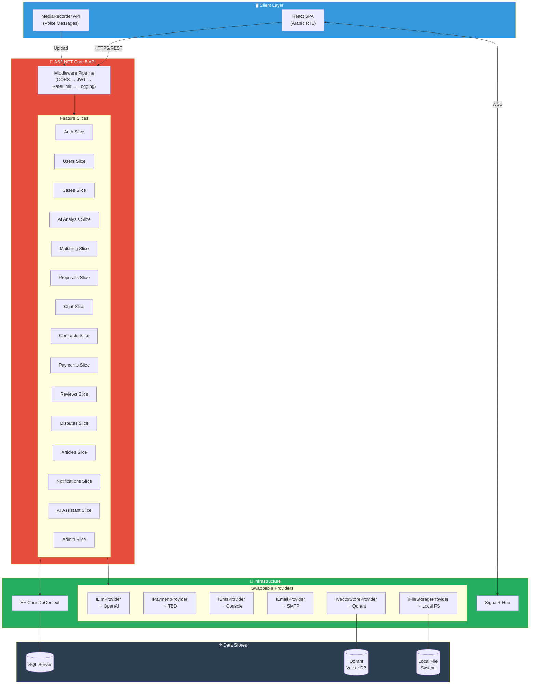
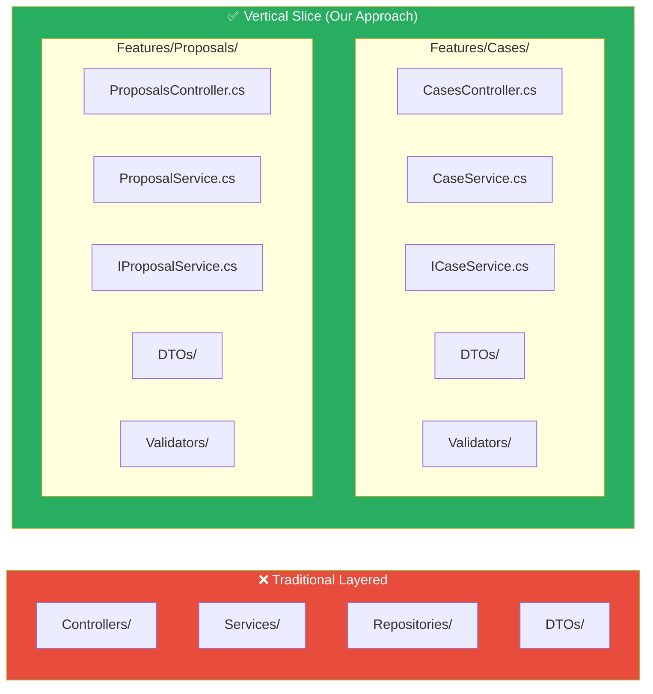
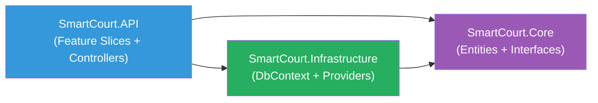
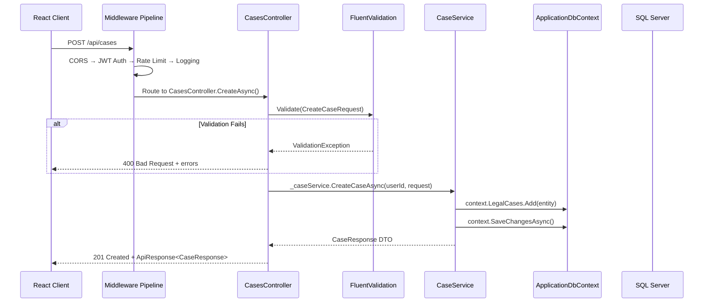
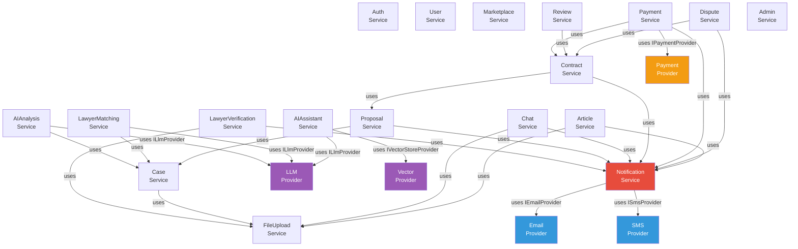
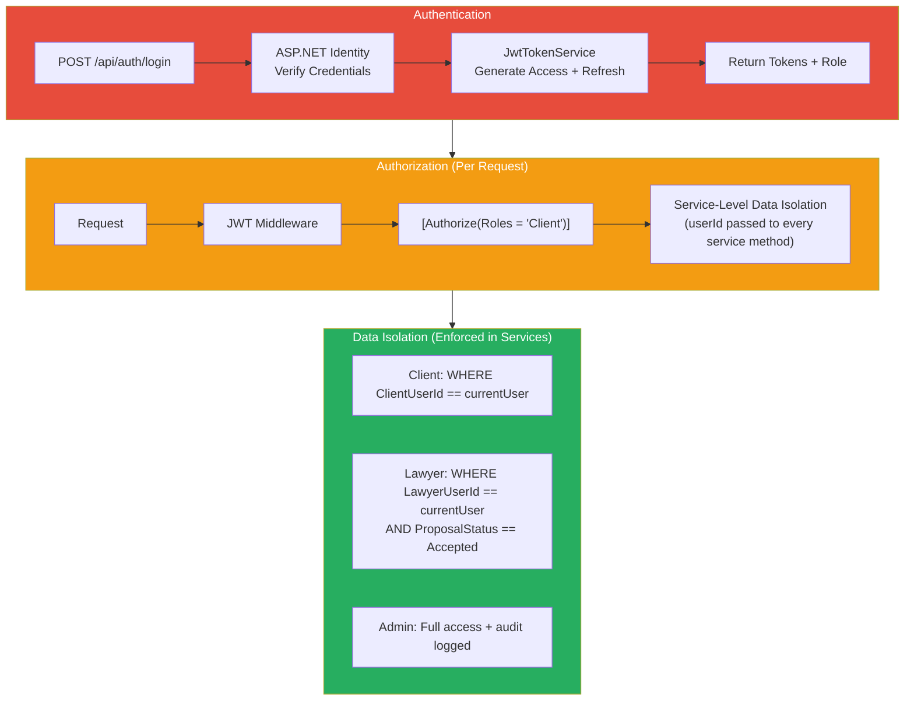

# Smart Court — System Architecture Document (v2)

> **Version:** 2.0 | **Date:** 2026-07-03 | **Status:** Draft for Review
> **Stack:** .NET 8 LTS + React | **DB:** SQL Server | **AI:** OpenAI (swappable)
> **Pattern:** Vertical Slice Architecture + Service Layer

---

## 1. Architecture Philosophy

> [!IMPORTANT]
> **v2 Changes:** Replaced Clean Architecture + CQRS/MediatR with **Vertical Slice Architecture + Service Layer**. Each feature is a self-contained vertical slice. No MediatR, no command/query separation. Business logic lives in **services**, not handlers.

| Principle | Implementation | Benefit |
|-----------|---------------|---------|
| **Vertical Slicing** | Each feature = Controller + Service + DTOs + Validators, all in one folder | Add/remove entire features by adding/deleting a folder |
| **Service Layer** | `IXxxService` → `XxxService` for all business logic | Simple, debuggable, team-familiar pattern |
| **Provider Pattern** | Interfaces for ALL external services (LLM, Payment, SMS, etc.) | Swap providers with zero business logic changes |
| **Minimal Layering** | 3 projects only: Core → Infrastructure → API | No over-engineering; fast to navigate and onboard |

---

## 2. High-Level System Architecture



---

## 3. Vertical Slice Architecture — How It Works

> [!NOTE]
> In vertical slicing, **every feature owns its full stack**: Controller → Service → DTOs → Validators. No shared "Services" or "Controllers" folders. Each slice is independent and self-contained.



### What lives inside each slice:

| Component | Responsibility | Example |
|-----------|---------------|---------|
| `XxxController.cs` | HTTP endpoints, request mapping, auth attributes | `CasesController.cs` |
| `IXxxService.cs` | Service interface (for DI and testability) | `ICaseService.cs` |
| `XxxService.cs` | Business logic, orchestration, calls providers | `CaseService.cs` |
| `DTOs/` | Request and response models for this feature | `CreateCaseRequest.cs`, `CaseResponse.cs` |
| `Validators/` | FluentValidation rules for request models | `CreateCaseRequestValidator.cs` |

### Cross-Feature Communication

When one feature needs another feature's logic (e.g., Proposals needs Case data), it calls the other feature's **service interface** via DI — never the controller.

```csharp
// Features/Proposals/ProposalService.cs
public class ProposalService : IProposalService
{
    private readonly ICaseService _caseService;           // ← from Cases slice
    private readonly INotificationService _notificationService; // ← from Notifications slice
    private readonly ApplicationDbContext _context;

    public ProposalService(
        ICaseService caseService,
        INotificationService notificationService,
        ApplicationDbContext context)
    {
        _caseService = caseService;
        _notificationService = notificationService;
        _context = context;
    }

    public async Task<ProposalResponse> CreateProposalAsync(
        Guid clientUserId, CreateProposalRequest request)
    {
        // Validate case exists and is in correct status
        var legalCase = await _caseService.GetCaseEntityAsync(request.LegalCaseId);
        if (legalCase == null || legalCase.Status != CaseStatus.Finalized)
            throw new BusinessException("Case is not available for proposals");

        // Create proposal
        var proposal = new Proposal { /* ... */ };
        _context.Proposals.Add(proposal);

        // Auto-create conversation
        var conversation = new Conversation
        {
            ProposalId = proposal.Id,
            // ...
        };
        _context.Conversations.Add(conversation);

        await _context.SaveChangesAsync();

        // Notify lawyer
        await _notificationService.SendAsync(
            proposal.LawyerUserId,
            "اقتراح جديد",
            $"لديك اقتراح جديد للقضية: {legalCase.Title}");

        return MapToResponse(proposal);
    }
}
```

---

## 4. Solution Structure (3 Projects)



### 4.1 SmartCourt.Core — Entities & Interfaces

**Zero dependencies.** Contains domain entities (matching your schema.md), enums, value objects, and provider interfaces.

```
SmartCourt.Core/
│
├── Entities/
│   │
│   ├── Identity/                          # Module 1
│   │   ├── ApplicationUser.cs             # Extends IdentityUser (AspNetUsers)
│   │   ├── ClientProfile.cs
│   │   ├── LawyerProfile.cs
│   │   ├── LawyerSpecialization.cs
│   │   └── LegalCategory.cs
│   │
│   ├── Storage/
│   │   └── StoredFile.cs
│   │
│   ├── Cases/                             # Module 2
│   │   ├── LegalCase.cs
│   │   ├── AIAnalysis.cs
│   │   ├── LawyerMatch.cs
│   │   └── CaseAttachment.cs
│   │
│   ├── Communication/                     # Module 3
│   │   ├── Proposal.cs
│   │   ├── Conversation.cs
│   │   ├── ConversationParticipant.cs
│   │   ├── Message.cs
│   │   └── MessageAttachment.cs
│   │
│   ├── Contracts/                         # Module 4
│   │   ├── Contract.cs
│   │   ├── Milestone.cs
│   │   ├── ScheduledPayment.cs
│   │   ├── PaymentRelease.cs
│   │   ├── PaymentTransaction.cs
│   │   └── ContractAttachment.cs
│   │
│   ├── Social/                            # Module 5
│   │   ├── Review.cs
│   │   ├── Dispute.cs
│   │   ├── DisputeAttachment.cs
│   │   ├── Notification.cs
│   │   ├── UserNotification.cs
│   │   └── NotificationPreference.cs
│   │
│   ├── AI/                                # Module 6
│   │   ├── AIConversation.cs
│   │   └── AIMessage.cs
│   │
│   └── Knowledge/                         # Module 7
│       ├── LegalArticle.cs
│       ├── LegalArticleCategory.cs
│       └── LegalArticleAttachment.cs
│
├── Enums/
│   ├── CaseStatus.cs
│   ├── ProposalStatus.cs
│   ├── ContractStatus.cs
│   ├── MilestoneStatus.cs
│   ├── PaymentReleaseType.cs
│   ├── PaymentTransactionStatus.cs
│   ├── DisputeStatus.cs
│   ├── VerificationStatus.cs
│   ├── ArticleStatus.cs
│   ├── MessageType.cs
│   ├── AISenderType.cs
│   ├── AIConversationType.cs
│   └── NotificationType.cs
│
├── Interfaces/
│   ├── Providers/
│   │   ├── ILlmProvider.cs
│   │   ├── IPaymentProvider.cs
│   │   ├── ISmsProvider.cs
│   │   ├── IEmailProvider.cs
│   │   ├── IFileStorageProvider.cs
│   │   └── IVectorStoreProvider.cs
│   │
│   └── Services/
│       └── ICurrentUserService.cs
│
├── Common/
│   ├── BaseEntity.cs                      # Id, CreatedAt, UpdatedAt
│   └── BusinessException.cs               # Domain-level exceptions
│
└── SmartCourt.Core.csproj                 # Zero NuGet dependencies
```

### 4.2 SmartCourt.Infrastructure — DbContext & Provider Implementations

```
SmartCourt.Infrastructure/
│
├── Persistence/
│   ├── ApplicationDbContext.cs
│   ├── Configurations/                    # EF Core Fluent API (1 file per entity)
│   │   ├── Identity/
│   │   │   ├── ApplicationUserConfiguration.cs
│   │   │   ├── ClientProfileConfiguration.cs
│   │   │   ├── LawyerProfileConfiguration.cs
│   │   │   ├── LawyerSpecializationConfiguration.cs
│   │   │   └── LegalCategoryConfiguration.cs
│   │   ├── StoredFileConfiguration.cs
│   │   ├── Cases/
│   │   │   ├── LegalCaseConfiguration.cs
│   │   │   ├── AIAnalysisConfiguration.cs
│   │   │   ├── LawyerMatchConfiguration.cs
│   │   │   └── CaseAttachmentConfiguration.cs
│   │   ├── Communication/
│   │   │   ├── ProposalConfiguration.cs
│   │   │   ├── ConversationConfiguration.cs
│   │   │   ├── ConversationParticipantConfiguration.cs
│   │   │   ├── MessageConfiguration.cs
│   │   │   └── MessageAttachmentConfiguration.cs
│   │   ├── Contracts/
│   │   │   ├── ContractConfiguration.cs
│   │   │   ├── MilestoneConfiguration.cs
│   │   │   ├── ScheduledPaymentConfiguration.cs
│   │   │   ├── PaymentReleaseConfiguration.cs
│   │   │   ├── PaymentTransactionConfiguration.cs
│   │   │   └── ContractAttachmentConfiguration.cs
│   │   ├── Social/
│   │   │   ├── ReviewConfiguration.cs
│   │   │   ├── DisputeConfiguration.cs
│   │   │   ├── DisputeAttachmentConfiguration.cs
│   │   │   ├── NotificationConfiguration.cs
│   │   │   ├── UserNotificationConfiguration.cs
│   │   │   └── NotificationPreferenceConfiguration.cs
│   │   ├── AI/
│   │   │   ├── AIConversationConfiguration.cs
│   │   │   └── AIMessageConfiguration.cs
│   │   └── Knowledge/
│   │       ├── LegalArticleConfiguration.cs
│   │       ├── LegalArticleCategoryConfiguration.cs
│   │       └── LegalArticleAttachmentConfiguration.cs
│   │
│   ├── Migrations/
│   └── Interceptors/
│       └── AuditableEntityInterceptor.cs  # Auto-set CreatedAt/UpdatedAt
│
├── Providers/
│   ├── Llm/
│   │   ├── OpenAiProvider.cs
│   │   ├── OpenAiOptions.cs
│   │   └── Prompts/
│   │       ├── CaseAnalysisPrompt.txt
│   │       ├── LegalAssistantSystemPrompt.txt
│   │       ├── LawyerAssistantSystemPrompt.txt
│   │       └── MatchingPrompt.txt
│   │
│   ├── Payment/
│   │   ├── PaymobProvider.cs              # Default recommendation
│   │   └── PaymobOptions.cs
│   │
│   ├── Sms/
│   │   ├── ConsoleSmsProvider.cs          # Dev mode — logs to console
│   │   └── SmsOptions.cs
│   │
│   ├── Email/
│   │   ├── SmtpEmailProvider.cs           # Free — MailKit + SMTP
│   │   ├── ConsoleEmailProvider.cs        # Dev mode
│   │   └── EmailOptions.cs
│   │
│   ├── Storage/
│   │   ├── LocalFileStorageProvider.cs    # Free — local filesystem
│   │   └── StorageOptions.cs
│   │
│   └── VectorStore/
│       ├── QdrantProvider.cs              # Free — self-hosted Qdrant
│       └── QdrantOptions.cs
│
├── Identity/
│   ├── JwtTokenService.cs
│   ├── JwtOptions.cs
│   └── CurrentUserService.cs
│
├── DependencyInjection.cs                 # Register all infra services
│
└── SmartCourt.Infrastructure.csproj
```

### 4.3 SmartCourt.API — Feature Slices

This is where the vertical slicing happens. **Each feature is a complete slice.**

```
SmartCourt.API/
│
├── Features/
│   │
│   ├── Auth/                              ─── SLICE ───
│   │   ├── AuthController.cs
│   │   ├── IAuthService.cs
│   │   ├── AuthService.cs
│   │   ├── DTOs/
│   │   │   ├── RegisterRequest.cs
│   │   │   ├── LoginRequest.cs
│   │   │   ├── LoginResponse.cs
│   │   │   ├── RefreshTokenRequest.cs
│   │   │   ├── ResetPasswordRequest.cs
│   │   │   └── VerifyEmailRequest.cs
│   │   └── Validators/
│   │       ├── RegisterRequestValidator.cs
│   │       └── LoginRequestValidator.cs
│   │
│   ├── Users/                             ─── SLICE ───
│   │   ├── UsersController.cs
│   │   ├── IUserService.cs
│   │   ├── UserService.cs
│   │   ├── DTOs/
│   │   │   ├── UserProfileResponse.cs
│   │   │   ├── UpdateProfileRequest.cs
│   │   │   ├── ClientProfileResponse.cs
│   │   │   └── LawyerProfileResponse.cs
│   │   └── Validators/
│   │
│   ├── LawyerVerification/                ─── SLICE ───
│   │   ├── LawyerVerificationController.cs
│   │   ├── ILawyerVerificationService.cs
│   │   ├── LawyerVerificationService.cs
│   │   ├── DTOs/
│   │   │   ├── SubmitVerificationRequest.cs
│   │   │   ├── VerificationStatusResponse.cs
│   │   │   └── ReviewVerificationRequest.cs
│   │   └── Validators/
│   │
│   ├── Cases/                             ─── SLICE ───
│   │   ├── CasesController.cs
│   │   ├── ICaseService.cs
│   │   ├── CaseService.cs
│   │   ├── DTOs/
│   │   │   ├── CreateCaseRequest.cs
│   │   │   ├── UpdateCaseRequest.cs
│   │   │   ├── CaseResponse.cs
│   │   │   ├── CaseListResponse.cs
│   │   │   └── SubmitCaseRequest.cs
│   │   └── Validators/
│   │
│   ├── AIAnalysis/                        ─── SLICE ───
│   │   ├── AIAnalysisController.cs
│   │   ├── IAIAnalysisService.cs
│   │   ├── AIAnalysisService.cs
│   │   ├── DTOs/
│   │   │   ├── AnalyzeCaseRequest.cs
│   │   │   ├── CaseAnalysisResponse.cs
│   │   │   └── AnalysisHistoryResponse.cs
│   │   └── Validators/
│   │
│   ├── LawyerMatching/                    ─── SLICE ───
│   │   ├── LawyerMatchingController.cs
│   │   ├── ILawyerMatchingService.cs
│   │   ├── LawyerMatchingService.cs
│   │   ├── DTOs/
│   │   │   ├── MatchedLawyerResponse.cs
│   │   │   └── MatchResultsResponse.cs
│   │   └── Validators/
│   │
│   ├── Marketplace/                       ─── SLICE ───
│   │   ├── MarketplaceController.cs
│   │   ├── IMarketplaceService.cs
│   │   ├── MarketplaceService.cs
│   │   ├── DTOs/
│   │   │   ├── LawyerCardResponse.cs
│   │   │   ├── LawyerDetailResponse.cs
│   │   │   └── LawyerSearchRequest.cs
│   │   └── Validators/
│   │
│   ├── Proposals/                         ─── SLICE ───
│   │   ├── ProposalsController.cs
│   │   ├── IProposalService.cs
│   │   ├── ProposalService.cs
│   │   ├── DTOs/
│   │   │   ├── CreateProposalRequest.cs
│   │   │   ├── ProposalResponse.cs
│   │   │   └── RespondToProposalRequest.cs
│   │   └── Validators/
│   │
│   ├── Chat/                              ─── SLICE ───
│   │   ├── ChatController.cs
│   │   ├── ChatHub.cs                     # SignalR hub (in the slice!)
│   │   ├── IChatService.cs
│   │   ├── ChatService.cs
│   │   ├── DTOs/
│   │   │   ├── SendMessageRequest.cs
│   │   │   ├── MessageResponse.cs
│   │   │   └── ConversationResponse.cs
│   │   └── Validators/
│   │
│   ├── Contracts/                         ─── SLICE ───
│   │   ├── ContractsController.cs
│   │   ├── IContractService.cs
│   │   ├── ContractService.cs
│   │   ├── DTOs/
│   │   │   ├── CreateContractRequest.cs
│   │   │   ├── ContractResponse.cs
│   │   │   ├── SignContractRequest.cs
│   │   │   ├── MilestoneResponse.cs
│   │   │   └── SubmitMilestoneRequest.cs
│   │   └── Validators/
│   │
│   ├── Payments/                          ─── SLICE ───
│   │   ├── PaymentsController.cs
│   │   ├── IPaymentService.cs
│   │   ├── PaymentService.cs
│   │   ├── DTOs/
│   │   │   ├── InitiatePaymentRequest.cs
│   │   │   ├── PaymentStatusResponse.cs
│   │   │   └── PaymentWebhookRequest.cs
│   │   └── Validators/
│   │
│   ├── Reviews/                           ─── SLICE ───
│   │   ├── ReviewsController.cs
│   │   ├── IReviewService.cs
│   │   ├── ReviewService.cs
│   │   ├── DTOs/
│   │   │   ├── CreateReviewRequest.cs
│   │   │   └── ReviewResponse.cs
│   │   └── Validators/
│   │
│   ├── Disputes/                          ─── SLICE ───
│   │   ├── DisputesController.cs
│   │   ├── IDisputeService.cs
│   │   ├── DisputeService.cs
│   │   ├── DTOs/
│   │   │   ├── CreateDisputeRequest.cs
│   │   │   ├── DisputeResponse.cs
│   │   │   └── ResolveDisputeRequest.cs
│   │   └── Validators/
│   │
│   ├── Articles/                          ─── SLICE ───
│   │   ├── ArticlesController.cs
│   │   ├── IArticleService.cs
│   │   ├── ArticleService.cs
│   │   ├── DTOs/
│   │   │   ├── CreateArticleRequest.cs
│   │   │   ├── ArticleResponse.cs
│   │   │   └── ArticleListResponse.cs
│   │   └── Validators/
│   │
│   ├── AIAssistant/                       ─── SLICE ───
│   │   ├── AIAssistantController.cs
│   │   ├── IAIAssistantService.cs
│   │   ├── AIAssistantService.cs
│   │   ├── DTOs/
│   │   │   ├── AskAssistantRequest.cs
│   │   │   ├── AssistantMessageResponse.cs
│   │   │   └── AIConversationResponse.cs
│   │   └── Validators/
│   │
│   ├── Notifications/                     ─── SLICE ───
│   │   ├── NotificationsController.cs
│   │   ├── INotificationService.cs
│   │   ├── NotificationService.cs
│   │   ├── DTOs/
│   │   │   ├── NotificationResponse.cs
│   │   │   └── UpdatePreferencesRequest.cs
│   │   └── Validators/
│   │
│   ├── FileUpload/                        ─── SLICE ───
│   │   ├── FileUploadController.cs
│   │   ├── IFileUploadService.cs
│   │   ├── FileUploadService.cs
│   │   ├── DTOs/
│   │   │   └── FileUploadResponse.cs
│   │   └── Validators/
│   │
│   └── Admin/                             ─── SLICE ───
│       ├── AdminController.cs
│       ├── IAdminService.cs
│       ├── AdminService.cs
│       ├── DTOs/
│       │   ├── DashboardStatsResponse.cs
│       │   ├── UserListResponse.cs
│       │   └── PendingVerificationsResponse.cs
│       └── Validators/
│
├── Middleware/
│   ├── ExceptionHandlingMiddleware.cs
│   ├── RequestLoggingMiddleware.cs
│   └── ArabicLocalizationMiddleware.cs
│
├── Filters/
│   └── ValidationFilter.cs               # Auto-validate request DTOs
│
├── Configuration/
│   ├── CorsConfig.cs
│   ├── SwaggerConfig.cs
│   ├── SignalRConfig.cs
│   └── RateLimitConfig.cs
│
├── Common/
│   ├── ApiResponse.cs                     # Standardized response wrapper
│   ├── PagedRequest.cs                    # Shared pagination parameters
│   └── PagedResponse.cs                   # Shared pagination response
│
├── appsettings.json
├── appsettings.Development.json
├── Program.cs
│
└── SmartCourt.API.csproj
```

---

## 5. Request Flow (Service Layer — No CQRS)



### Standardized API Response Wrapper

```csharp
// API/Common/ApiResponse.cs
public class ApiResponse<T>
{
    public bool Success { get; set; }
    public T? Data { get; set; }
    public string? Message { get; set; }
    public List<string>? Errors { get; set; }
    public int StatusCode { get; set; }

    public static ApiResponse<T> Ok(T data, string? message = null)
        => new() { Success = true, Data = data, StatusCode = 200, Message = message };

    public static ApiResponse<T> Created(T data)
        => new() { Success = true, Data = data, StatusCode = 201 };

    public static ApiResponse<T> Fail(string message, int statusCode = 400)
        => new() { Success = false, Message = message, StatusCode = statusCode };

    public static ApiResponse<T> Fail(List<string> errors, int statusCode = 400)
        => new() { Success = false, Errors = errors, StatusCode = statusCode };
}
```

### Example: Complete Vertical Slice (Cases)

```csharp
// ═══════════════════════════════════════════════════════════
// Features/Cases/DTOs/CreateCaseRequest.cs
// ═══════════════════════════════════════════════════════════
public class CreateCaseRequest
{
    public string Title { get; set; } = string.Empty;
    public string Description { get; set; } = string.Empty;
    public string? CaseLocation { get; set; }
}

// ═══════════════════════════════════════════════════════════
// Features/Cases/DTOs/CaseResponse.cs
// ═══════════════════════════════════════════════════════════
public class CaseResponse
{
    public Guid Id { get; set; }
    public string Title { get; set; } = string.Empty;
    public string Description { get; set; } = string.Empty;
    public string? CaseLocation { get; set; }
    public int Status { get; set; }
    public string StatusName { get; set; } = string.Empty;
    public DateTime CreatedAt { get; set; }
    public DateTime UpdatedAt { get; set; }
    public List<FileResponse>? Attachments { get; set; }
}

// ═══════════════════════════════════════════════════════════
// Features/Cases/Validators/CreateCaseRequestValidator.cs
// ═══════════════════════════════════════════════════════════
public class CreateCaseRequestValidator : AbstractValidator<CreateCaseRequest>
{
    public CreateCaseRequestValidator()
    {
        RuleFor(x => x.Title)
            .NotEmpty().WithMessage("عنوان القضية مطلوب")
            .MaximumLength(200);
        
        RuleFor(x => x.Description)
            .NotEmpty().WithMessage("وصف القضية مطلوب")
            .MaximumLength(5000);
    }
}

// ═══════════════════════════════════════════════════════════
// Features/Cases/ICaseService.cs
// ═══════════════════════════════════════════════════════════
public interface ICaseService
{
    Task<CaseResponse> CreateCaseAsync(Guid clientUserId, CreateCaseRequest request);
    Task<CaseResponse> UpdateCaseAsync(Guid clientUserId, Guid caseId, UpdateCaseRequest request);
    Task<CaseResponse?> GetCaseByIdAsync(Guid clientUserId, Guid caseId);
    Task<PagedResponse<CaseListResponse>> GetClientCasesAsync(Guid clientUserId, PagedRequest paging);
    Task<CaseResponse> SubmitCaseAsync(Guid clientUserId, Guid caseId);
    Task<CaseResponse> SubmitForMatchingAsync(Guid clientUserId, Guid caseId);
    Task DeleteCaseAsync(Guid clientUserId, Guid caseId);
    
    // Used by other slices (Proposals, Matching) — internal access
    Task<LegalCase?> GetCaseEntityAsync(Guid caseId);
}

// ═══════════════════════════════════════════════════════════
// Features/Cases/CaseService.cs
// ═══════════════════════════════════════════════════════════
public class CaseService : ICaseService
{
    private readonly ApplicationDbContext _context;
    private readonly IFileStorageProvider _fileStorage;

    public CaseService(
        ApplicationDbContext context,
        IFileStorageProvider fileStorage)
    {
        _context = context;
        _fileStorage = fileStorage;
    }

    public async Task<CaseResponse> CreateCaseAsync(
        Guid clientUserId, CreateCaseRequest request)
    {
        var legalCase = new LegalCase
        {
            Id = Guid.NewGuid(),
            ClientUserId = clientUserId,
            Title = request.Title,
            Description = request.Description,
            CaseLocation = request.CaseLocation,
            Status = (int)CaseStatus.Draft,
            CreatedAt = DateTime.UtcNow,
            UpdatedAt = DateTime.UtcNow
        };

        _context.LegalCases.Add(legalCase);
        await _context.SaveChangesAsync();

        return MapToResponse(legalCase);
    }

    // ... other methods
    
    private static CaseResponse MapToResponse(LegalCase entity) => new()
    {
        Id = entity.Id,
        Title = entity.Title,
        Description = entity.Description,
        CaseLocation = entity.CaseLocation,
        Status = entity.Status,
        StatusName = ((CaseStatus)entity.Status).ToString(),
        CreatedAt = entity.CreatedAt,
        UpdatedAt = entity.UpdatedAt
    };
}

// ═══════════════════════════════════════════════════════════
// Features/Cases/CasesController.cs
// ═══════════════════════════════════════════════════════════
[ApiController]
[Route("api/[controller]")]
[Authorize]
public class CasesController : ControllerBase
{
    private readonly ICaseService _caseService;
    private readonly ICurrentUserService _currentUser;

    public CasesController(
        ICaseService caseService,
        ICurrentUserService currentUser)
    {
        _caseService = caseService;
        _currentUser = currentUser;
    }

    [HttpPost]
    [Authorize(Roles = "Client")]
    public async Task<IActionResult> CreateAsync(
        [FromBody] CreateCaseRequest request)
    {
        var result = await _caseService.CreateCaseAsync(
            _currentUser.UserId, request);
        return StatusCode(201, ApiResponse<CaseResponse>.Created(result));
    }

    [HttpGet]
    [Authorize(Roles = "Client")]
    public async Task<IActionResult> GetMyListAsync(
        [FromQuery] PagedRequest paging)
    {
        var result = await _caseService.GetClientCasesAsync(
            _currentUser.UserId, paging);
        return Ok(ApiResponse<PagedResponse<CaseListResponse>>.Ok(result));
    }

    [HttpGet("{id:guid}")]
    [Authorize(Roles = "Client")]
    public async Task<IActionResult> GetByIdAsync(Guid id)
    {
        var result = await _caseService.GetCaseByIdAsync(
            _currentUser.UserId, id);
        if (result == null)
            return NotFound(ApiResponse<CaseResponse>.Fail("القضية غير موجودة", 404));
        return Ok(ApiResponse<CaseResponse>.Ok(result));
    }

    [HttpPost("{id:guid}/submit")]
    [Authorize(Roles = "Client")]
    public async Task<IActionResult> SubmitAsync(Guid id)
    {
        var result = await _caseService.SubmitCaseAsync(
            _currentUser.UserId, id);
        return Ok(ApiResponse<CaseResponse>.Ok(result));
    }
}
```

---

## 6. Cross-Slice Service Dependency Map

> [!NOTE]
> Services call other services' **interfaces** via DI. No circular dependencies. Dependencies flow in one direction.



### Avoiding Circular Dependencies

| Rule | Example |
|------|---------|
| **Lower slices don't call upper slices** | `CaseService` never calls `ProposalService` |
| **Notification is a "sink" service** | Every slice calls Notification; Notification calls no other slice |
| **Provider interfaces are always leaf** | `ILlmProvider`, `IPaymentProvider` never call services |
| **If A needs B and B needs A** | Extract the shared logic into a dedicated shared service or use the DbContext directly |

---

## 7. Provider Pattern (Unchanged from v1)

> [!TIP]
> The provider pattern is **architecture-independent** — it works identically with vertical slicing and service layers. One line swap in DI. Zero business logic changes.

```csharp
// SmartCourt.Infrastructure/DependencyInjection.cs
public static class DependencyInjection
{
    public static IServiceCollection AddInfrastructure(
        this IServiceCollection services,
        IConfiguration config)
    {
        // ─── DATABASE ──────────────────────────────────────
        services.AddDbContext<ApplicationDbContext>(options =>
            options.UseSqlServer(config.GetConnectionString("DefaultConnection")));

        // ─── IDENTITY ──────────────────────────────────────
        services.AddIdentity<ApplicationUser, IdentityRole<Guid>>()
            .AddEntityFrameworkStores<ApplicationDbContext>()
            .AddDefaultTokenProviders();

        // ─── SWAPPABLE PROVIDERS (change ONE line to swap) ─
        
        // LLM: OpenAI → Gemini → Claude
        services.Configure<OpenAiOptions>(config.GetSection("AI:OpenAI"));
        services.AddScoped<ILlmProvider, OpenAiProvider>();

        // Payment: Paymob → Fawry → Stripe
        services.Configure<PaymobOptions>(config.GetSection("Payment:Paymob"));
        services.AddScoped<IPaymentProvider, PaymobProvider>();

        // SMS: Console (dev) → Twilio → Cequens
        services.AddScoped<ISmsProvider, ConsoleSmsProvider>();

        // Email: SMTP (free) → SendGrid → SES
        services.Configure<EmailOptions>(config.GetSection("Email"));
        services.AddScoped<IEmailProvider, SmtpEmailProvider>();

        // Storage: Local FS → Azure Blob → S3
        services.Configure<StorageOptions>(config.GetSection("Storage"));
        services.AddScoped<IFileStorageProvider, LocalFileStorageProvider>();

        // Vector Store: Qdrant → Pinecone → Weaviate
        services.Configure<QdrantOptions>(config.GetSection("VectorStore:Qdrant"));
        services.AddScoped<IVectorStoreProvider, QdrantProvider>();

        // ─── SHARED SERVICES ───────────────────────────────
        services.AddScoped<ICurrentUserService, CurrentUserService>();

        return services;
    }
}
```

### Feature Services DI Registration

```csharp
// SmartCourt.API/Program.cs (or a separate extension method)
public static class FeatureServiceRegistration
{
    public static IServiceCollection AddFeatureServices(
        this IServiceCollection services)
    {
        // Each slice registers its service
        services.AddScoped<IAuthService, AuthService>();
        services.AddScoped<IUserService, UserService>();
        services.AddScoped<ILawyerVerificationService, LawyerVerificationService>();
        services.AddScoped<ICaseService, CaseService>();
        services.AddScoped<IAIAnalysisService, AIAnalysisService>();
        services.AddScoped<ILawyerMatchingService, LawyerMatchingService>();
        services.AddScoped<IMarketplaceService, MarketplaceService>();
        services.AddScoped<IProposalService, ProposalService>();
        services.AddScoped<IChatService, ChatService>();
        services.AddScoped<IContractService, ContractService>();
        services.AddScoped<IPaymentService, PaymentService>();
        services.AddScoped<IReviewService, ReviewService>();
        services.AddScoped<IDisputeService, DisputeService>();
        services.AddScoped<IArticleService, ArticleService>();
        services.AddScoped<IAIAssistantService, AIAssistantService>();
        services.AddScoped<INotificationService, NotificationService>();
        services.AddScoped<IFileUploadService, FileUploadService>();
        services.AddScoped<IAdminService, AdminService>();

        return services;
    }
}
```

---

## 8. Security Architecture



### Data Isolation Pattern (In Every Service)

```csharp
// Every service method receives the current user's ID
// The service enforces data isolation — NEVER trust the client to pass correct IDs

public async Task<CaseResponse?> GetCaseByIdAsync(Guid clientUserId, Guid caseId)
{
    var legalCase = await _context.LegalCases
        .Where(c => c.Id == caseId && c.ClientUserId == clientUserId)  // ← Isolation
        .FirstOrDefaultAsync();

    return legalCase == null ? null : MapToResponse(legalCase);
}
```

---

## 9. SignalR Hub (Inside Chat Slice)

```csharp
// Features/Chat/ChatHub.cs
[Authorize]
public class ChatHub : Hub
{
    private readonly IChatService _chatService;
    private readonly ICurrentUserService _currentUser;

    public ChatHub(IChatService chatService, ICurrentUserService currentUser)
    {
        _chatService = chatService;
        _currentUser = currentUser;
    }

    public override async Task OnConnectedAsync()
    {
        // Join all user's active conversation groups
        var conversationIds = await _chatService
            .GetUserConversationIdsAsync(_currentUser.UserId);
        
        foreach (var convId in conversationIds)
            await Groups.AddToGroupAsync(Context.ConnectionId, convId.ToString());

        await base.OnConnectedAsync();
    }

    public async Task SendMessage(Guid conversationId, string content, int messageType)
    {
        // Validate user is participant, save to DB, broadcast
        var message = await _chatService.SendMessageAsync(
            _currentUser.UserId, conversationId, content, messageType);

        await Clients.Group(conversationId.ToString())
            .SendAsync("ReceiveMessage", message);
    }

    public async Task SendFileMessage(Guid conversationId, Guid storedFileId)
    {
        var message = await _chatService.SendFileMessageAsync(
            _currentUser.UserId, conversationId, storedFileId);

        await Clients.Group(conversationId.ToString())
            .SendAsync("ReceiveMessage", message);
    }
}
```

---

## 10. React Frontend Architecture (Feature-Based — Mirrors Backend)

```
smartcourt-web/
├── src/
│   ├── app/
│   │   ├── App.tsx
│   │   ├── Router.tsx
│   │   └── store.ts
│   │
│   ├── core/
│   │   ├── api/
│   │   │   ├── apiClient.ts              # Axios + JWT interceptor
│   │   │   └── endpoints.ts
│   │   ├── auth/
│   │   │   ├── AuthProvider.tsx
│   │   │   ├── useAuth.ts
│   │   │   └── ProtectedRoute.tsx
│   │   ├── hooks/
│   │   │   ├── useSignalR.ts
│   │   │   └── usePagination.ts
│   │   ├── i18n/
│   │   │   └── i18n.ts                   # Arabic RTL
│   │   └── types/
│   │       └── apiResponse.ts            # Mirrors ApiResponse<T>
│   │
│   ├── features/                          # Mirrors backend slices
│   │   ├── auth/
│   │   ├── cases/
│   │   ├── ai-analysis/
│   │   ├── matching/
│   │   ├── marketplace/
│   │   ├── proposals/
│   │   ├── chat/
│   │   ├── contracts/
│   │   ├── payments/
│   │   ├── reviews/
│   │   ├── disputes/
│   │   ├── articles/
│   │   ├── ai-assistant/
│   │   ├── notifications/
│   │   ├── profile/
│   │   └── admin/
│   │
│   ├── shared/
│   │   ├── components/
│   │   ├── layouts/
│   │   └── utils/
│   │
│   └── index.tsx
```

---

## 11. Schema Alignment

> [!IMPORTANT]
> The architecture is fully aligned with your [schema.md](file:///c:/Users/moata/Desktop/%C2%A0/Legal/schema.md). Here's the mapping:

| Schema Module | Feature Slice(s) | Entities |
|--------------|-------------------|----------|
| **Module 1**: Identity & User Management | Auth, Users, LawyerVerification, FileUpload | AspNetUsers, ClientProfile, LawyerProfile, LawyerSpecialization, LegalCategory, StoredFile |
| **Module 2**: Legal Cases & AI | Cases, AIAnalysis, LawyerMatching | LegalCase, AIAnalysis, LawyerMatch, CaseAttachment |
| **Module 3**: Proposals & Communication | Proposals, Chat | Proposal, Conversation, ConversationParticipant, Message, MessageAttachment |
| **Module 4**: Contracts & Payments | Contracts, Payments | Contract, Milestone, ScheduledPayment, PaymentRelease, PaymentTransaction, ContractAttachment |
| **Module 5**: Reviews, Disputes & Notifications | Reviews, Disputes, Notifications | Review, Dispute, DisputeAttachment, Notification, UserNotification, NotificationPreference |
| **Module 6**: AI Assistant | AIAssistant | AIConversation, AIMessage |
| **Module 7**: Knowledge Base | Articles | LegalArticle, LegalArticleCategory, LegalArticleAttachment |

---

## 12. Architecture Decision Records (ADRs) — Updated

| # | Decision | Choice | Rationale |
|---|----------|--------|-----------|
| ADR-001 | Architecture Pattern | **Vertical Slice + Service Layer** | Team-familiar, fast development, easy to add/remove features |
| ADR-002 | ~~CQRS/MediatR~~ | **Removed** | Over-engineering for a 6-person team on 45-day timeline |
| ADR-003 | Business Logic Location | **Service Layer (IXxxService)** | Simple, debuggable, testable via interface mocking |
| ADR-004 | Cross-Slice Communication | **Service-to-Service via DI** | Direct, no event bus complexity for MVP |
| ADR-005 | External Services | **Provider/Strategy Pattern** | Swap any provider with 1 line change |
| ADR-006 | Data Access | **DbContext directly in services** | No repository pattern overhead; EF Core is already a repository |
| ADR-007 | Authentication | **ASP.NET Identity + JWT** | Free, built-in, production-ready |
| ADR-008 | Real-time | **SignalR (in Chat slice)** | Native .NET 8, WebSocket-based |
| ADR-009 | Validation | **FluentValidation** | Declarative, keeps validators separate from services |
| ADR-010 | Solution Structure | **3 projects (Core + Infrastructure + API)** | Minimal layering, clear boundaries |

---

## 13. Key NuGet Packages

| Package | Project | Purpose |
|---------|---------|---------|
| `Microsoft.EntityFrameworkCore.SqlServer` | Infrastructure | SQL Server ORM |
| `Microsoft.AspNetCore.Identity.EntityFrameworkCore` | Infrastructure | Identity management |
| `FluentValidation.AspNetCore` | API | Request validation |
| `Microsoft.AspNetCore.SignalR` | API | Real-time chat |
| `Serilog.AspNetCore` | API | Structured logging |
| `Swashbuckle.AspNetCore` | API | Swagger / OpenAPI |
| `MailKit` | Infrastructure | Free email via SMTP |
| `Qdrant.Client` | Infrastructure | Vector store for RAG |
| `AutoMapper` | API | Entity ↔ DTO mapping (optional, can use manual mapping) |

---

## Comparison: v1 vs v2

| Aspect | v1 (Clean Architecture + CQRS) | v2 (Vertical Slice + Service Layer) |
|--------|-------------------------------|-------------------------------------|
| Projects | 4 (Domain, Application, Infrastructure, API) | **3 (Core, Infrastructure, API)** |
| Business Logic | MediatR handlers | **Service classes** |
| Command/Query | Separate command & query objects | **Service methods** |
| Pipeline Behaviors | MediatR behaviors | **Middleware + validation filter** |
| Module Communication | Domain events | **Direct service calls via DI** |
| Learning Curve | High (MediatR, CQRS patterns) | **Low (standard service pattern)** |
| File Count | Higher (command, handler, validator per operation) | **Lower (service + DTOs per feature)** |
| Testability | Mock MediatR handlers | **Mock service interfaces** |
