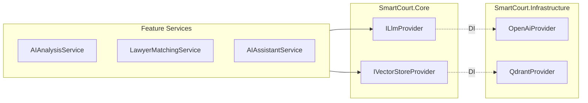
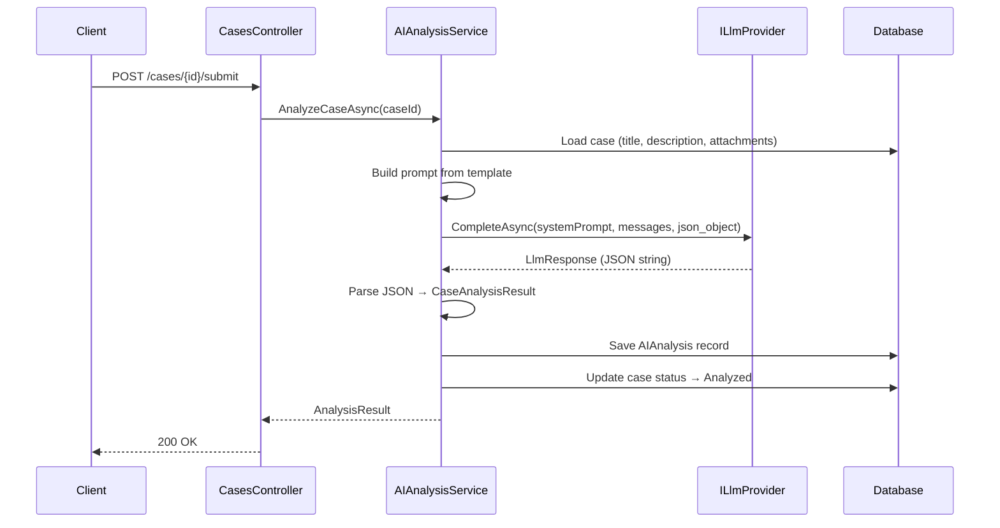
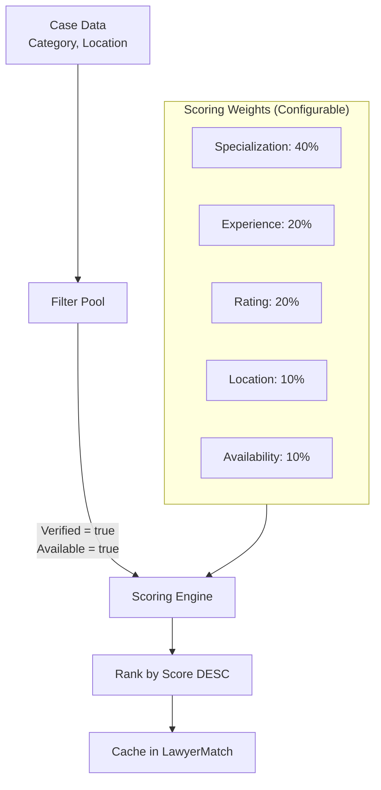
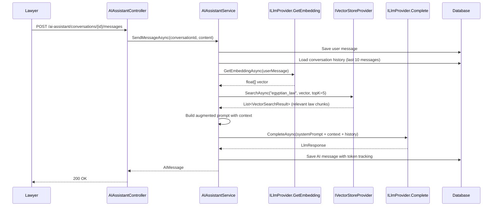

# Smart Court — AI Architecture

> **Version:** 1.0 | **Date:** 2026-07-03
> **LLM Provider:** OpenAI (gpt-4o) — swappable via `ILlmProvider`
> **Vector DB:** Qdrant (self-hosted) — swappable via `IVectorStoreProvider`
> **Language:** Arabic (all prompts, responses, UI)

---

## 1. Provider Abstraction Layer

All AI capabilities are isolated behind provider interfaces in `SmartCourt.Core.Providers`.



### ILlmProvider Interface

```csharp
public interface ILlmProvider
{
    Task<LlmResponse> CompleteAsync(LlmRequest request, CancellationToken ct = default);
    Task<EmbeddingResponse> GetEmbeddingAsync(string text, CancellationToken ct = default);
}

public record LlmRequest(
    string SystemPrompt,
    List<LlmMessage> Messages,
    string? ResponseFormat = null,   // "json_object" for structured output
    float Temperature = 0.3f,
    int MaxTokens = 4096
);

public record LlmResponse(
    string Content,
    string ModelName,
    int PromptTokens,
    int CompletionTokens,
    int TotalTokens,
    long ResponseTimeMs
);

public record EmbeddingResponse(
    float[] Vector,
    int Dimensions,
    int TokensUsed
);
```

### IVectorStoreProvider Interface

```csharp
public interface IVectorStoreProvider
{
    Task UpsertAsync(string collectionName, string id, float[] vector, 
                     Dictionary<string, object> payload, CancellationToken ct = default);
    Task<List<VectorSearchResult>> SearchAsync(string collectionName, float[] queryVector,
                     int topK = 5, float minScore = 0.7f, CancellationToken ct = default);
    Task DeleteAsync(string collectionName, string id, CancellationToken ct = default);
}

public record VectorSearchResult(
    string Id,
    float Score,
    Dictionary<string, object> Payload
);
```

### Configuration (appsettings.json)

```json
{
  "AI": {
    "LLM": {
      "Provider": "OpenAI",
      "ApiKey": "sk-xxx",
      "Model": "gpt-4o",
      "EmbeddingModel": "text-embedding-3-small",
      "MaxTokens": 4096,
      "Temperature": 0.3,
      "TimeoutSeconds": 60,
      "MaxRetries": 3
    },
    "VectorStore": {
      "Provider": "Qdrant",
      "Host": "localhost",
      "Port": 6333,
      "CollectionName": "egyptian_law",
      "VectorDimensions": 1536
    },
    "Prompts": {
      "BasePath": "Prompts/"
    }
  }
}
```

---

## 2. AI Pipeline 1 — Case Analysis

### Flow



### Prompt Template (`Prompts/case_analysis.txt`)

```
أنت مساعد قانوني ذكاء اصطناعي متخصص في القانون المصري.

مهمتك: تحليل القضية القانونية التالية وتقديم تقييم شامل.

---
عنوان القضية: {{case_title}}
وصف القضية: {{case_description}}
الموقع: {{case_location}}
المرفقات: {{attachment_summary}}
---

قم بتحليل القضية وأعد النتيجة بتنسيق JSON التالي بالضبط:
{
  "legalCategoryName": "اسم الفئة القانونية المناسبة",
  "strengthPoints": "نقاط القوة في القضية (نقاط مرقمة)",
  "weakPoints": "نقاط الضعف في القضية (نقاط مرقمة)",
  "missingInformation": "المعلومات والمستندات الناقصة (نقاط مرقمة)",
  "recommendations": "التوصيات القانونية (نقاط مرقمة)",
  "overallAssessment": "التقييم العام للقضية (فقرة واحدة)",
  "confidenceScore": 0.0
}

تعليمات:
1. confidenceScore يجب أن يكون بين 0.0 و 1.0
2. جميع الردود باللغة العربية
3. كن موضوعياً ودقيقاً
4. لا تقدم مشورة قانونية نهائية
5. أشر إلى أي قوانين مصرية ذات صلة بالموضوع
```

### CaseAnalysisResult Model

```csharp
public record CaseAnalysisResult
{
    public string LegalCategoryName { get; init; }
    public string StrengthPoints { get; init; }
    public string WeakPoints { get; init; }
    public string MissingInformation { get; init; }
    public string Recommendations { get; init; }
    public string OverallAssessment { get; init; }
    public decimal ConfidenceScore { get; init; }
}
```

### Category Resolution

After AI returns `legalCategoryName`, the service fuzzy-matches it against the seeded `LegalCategory` table:
1. Exact match → use that category
2. No match → create a mapping cache entry for future lookups
3. Fallback → `null` (no category assigned)

---

## 3. AI Pipeline 2 — Lawyer Matching

### Algorithm Design

Matching is **deterministic** (not AI-based). It uses a weighted scoring algorithm:



### Scoring Implementation

```csharp
public class MatchingWeights
{
    public double Specialization { get; set; } = 0.40;
    public double Experience { get; set; } = 0.20;
    public double Rating { get; set; } = 0.20;
    public double Location { get; set; } = 0.10;
    public double Availability { get; set; } = 0.10;
}

// Scoring logic per lawyer:
double score = 0;

// 1. Specialization match (0 or 1)
if (lawyer.Specializations.Any(s => s.Id == case.LegalCategoryId))
    score += weights.Specialization * 100;

// 2. Experience score (normalized 0-100)
double expScore = Math.Min(lawyer.YearsOfExperience / 20.0, 1.0) * 100;
score += weights.Experience * expScore;

// 3. Rating score (normalized 0-100)
double ratingScore = (lawyer.AverageRating / 5.0) * 100;
score += weights.Rating * ratingScore;

// 4. Location proximity (simple string match for MVP)
double locScore = lawyer.OfficeAddress?.Contains(case.CaseLocation) == true ? 100 : 50;
score += weights.Location * locScore;

// 5. Availability bonus
score += weights.Availability * (lawyer.IsAvailable ? 100 : 0);
```

### Match Reason Generation

The service generates a human-readable Arabic explanation:

```
"محامي متخصص في {categoryName} بخبرة {years} سنة في {location}. تقييم {rating}/5 من {reviewCount} عميل."
```

---

## 4. AI Pipeline 3 — AI Assistant

### Client Assistant (GeneralLegal)

Simple conversational Q&A without RAG:

```
System Prompt:
أنت مساعد قانوني ذكاء اصطناعي. تساعد المواطنين المصريين على فهم حقوقهم القانونية.

قواعد:
1. أجب باللغة العربية فقط
2. ابدأ كل رد بـ "⚠️ تنبيه: هذا ليس مشورة قانونية مهنية"
3. أشر إلى القوانين المصرية ذات الصلة عند الإمكان
4. اقترح استشارة محامي متخصص للحالات المعقدة
5. لا تصدر أحكام قانونية نهائية
6. كن واضحاً ومبسطاً
```

### Lawyer Assistant (LawyerResearch) — RAG Pipeline



### RAG Prompt Template

```
أنت مساعد أبحاث قانوني متقدم للمحامين المصريين.

لديك إمكانية الوصول إلى مصادر القانون المصري التالية:

--- مصادر ذات صلة ---
{{retrieved_chunks}}
--- نهاية المصادر ---

{{#if related_case}}
--- القضية المرتبطة ---
العنوان: {{case_title}}
الوصف: {{case_description}}
التحليل السابق: {{latest_analysis}}
--- نهاية القضية ---
{{/if}}

قواعد:
1. استند إلى المصادر المقدمة عند الإمكان
2. أشر إلى أرقام المواد والقوانين بدقة
3. إذا لم تجد معلومة في المصادر، أوضح ذلك
4. قدم إجابات مفصلة ومهنية
5. رتب المعلومات بشكل منظم
```

### Vector Store — Data Ingestion

```
Collection: "egyptian_law"
Dimensions: 1536 (text-embedding-3-small)

Chunking Strategy:
- Split by article/section (not fixed token count)
- Each chunk = one legal article or section
- Metadata: { lawName, articleNumber, chapter, year, source }

Payload per vector:
{
  "text": "مادة 1 - يلتزم المؤجر بتسليم...",
  "lawName": "القانون المدني المصري",
  "articleNumber": "558",
  "chapter": "الباب الثاني - الإيجار",
  "year": 1948,
  "source": "official_gazette"
}
```

> [!NOTE]
> The RAG corpus is empty at launch. Law data will be ingested incrementally. The AI Assistant for lawyers will still function without RAG — it falls back to the LLM's pretrained legal knowledge, with a note that source-based answers are unavailable.

---

## 5. Error Handling & Resilience

| Scenario | Handling |
|----------|---------|
| LLM API timeout | Retry 3x with exponential backoff (2s, 4s, 8s) |
| LLM API rate limit (429) | Queue request, retry after `Retry-After` header |
| LLM returns invalid JSON | Log raw response, return error to user, keep case in Submitted |
| LLM returns empty response | Retry once, then return generic error |
| Qdrant unavailable | Skip RAG, use LLM without context, note in response |
| Token limit exceeded | Truncate conversation history (keep last 5 messages) |
| Embedding fails | Skip RAG pipeline, use direct LLM call |

### Circuit Breaker (Polly)

```csharp
// In DI registration:
services.AddHttpClient<OpenAiProvider>()
    .AddPolicyHandler(Policy
        .Handle<HttpRequestException>()
        .Or<TaskCanceledException>()
        .WaitAndRetryAsync(3, attempt => TimeSpan.FromSeconds(Math.Pow(2, attempt)))
    )
    .AddPolicyHandler(Policy
        .Handle<HttpRequestException>()
        .CircuitBreakerAsync(5, TimeSpan.FromMinutes(1))
    );
```

---

## 6. Cost Monitoring & Quotas

### Token Tracking

Every AI call records:
- `PromptTokens` — input cost
- `CompletionTokens` — output cost
- `TotalTokens` — billed total
- `ModelName` — pricing tier reference
- `ResponseTimeMs` — latency monitoring

### Cost Estimation (GPT-4o pricing as of 2026)

| Feature | Avg Tokens/Call | Calls/Day (est.) | Daily Cost |
|---------|----------------|-------------------|------------|
| Case Analysis | ~3,000 | 50 | ~$0.75 |
| AI Assistant (Client) | ~1,500 | 200 | ~$1.50 |
| AI Assistant (Lawyer RAG) | ~2,500 | 100 | ~$1.25 |
| Embeddings | ~500 | 100 | ~$0.01 |
| **Total** | | | **~$3.50/day** |

### Quota Management (Future — `AIUsageQuota` table)

```
Table AIUsageQuota {
  Id uuid [pk]
  UserId uuid
  QuotaPeriod varchar          -- 'Daily', 'Monthly'
  MaxTokens int
  UsedTokens int
  PeriodStartDate datetime
  PeriodEndDate datetime
  CreatedAt datetime
  UpdatedAt datetime
}
```

For MVP: No hard quotas. Track usage for monitoring. Add quotas post-launch based on observed patterns.

---

## 7. Switching Providers

### Switching LLM Provider

1. Implement `ILlmProvider` in a new class (e.g., `AnthropicProvider`, `GeminiProvider`)
2. Update `appsettings.json`: `"Provider": "Anthropic"`
3. Update DI registration in `Program.cs`:
   ```csharp
   services.AddScoped<ILlmProvider, AnthropicProvider>();
   ```
4. **Zero changes to any service or controller**

### Switching Vector Store

1. Implement `IVectorStoreProvider` (e.g., `PineconeProvider`, `WeaviateProvider`)
2. Update config and DI registration
3. Re-index corpus into new store (one-time migration)
