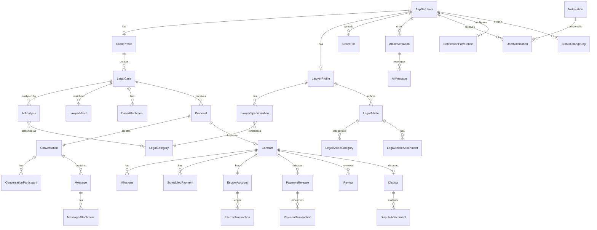
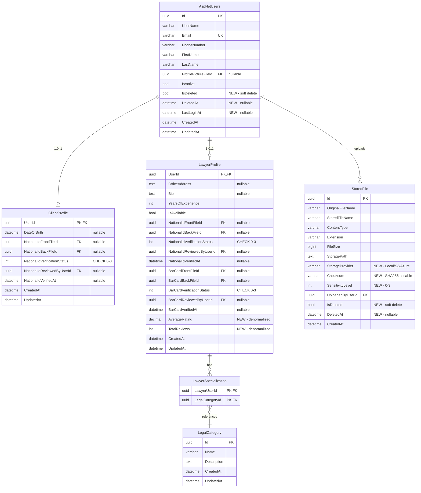
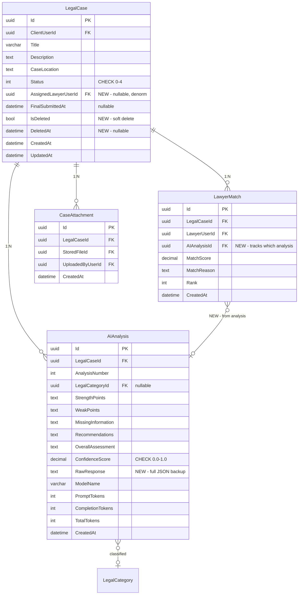
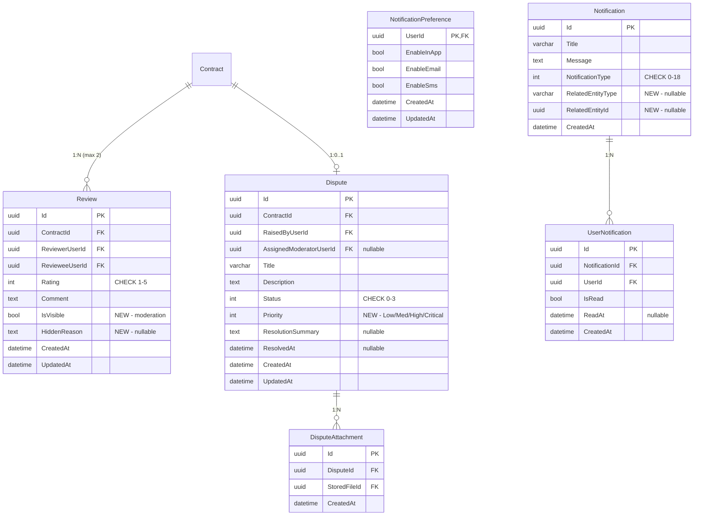
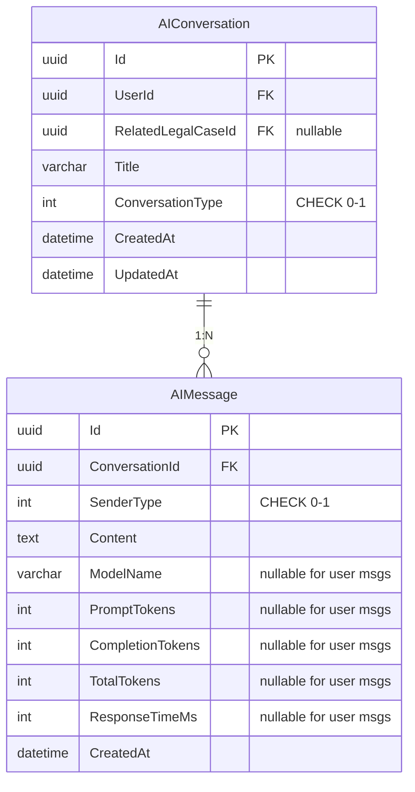
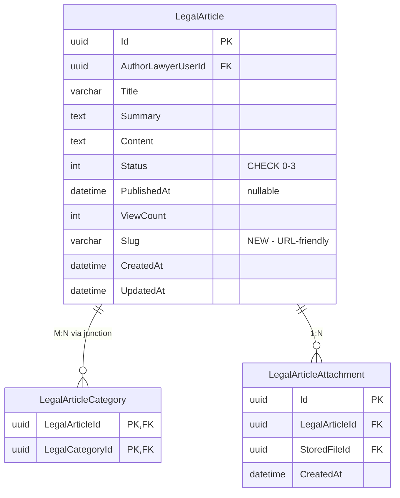

# Smart Court — Database ERD

> **Version:** 2.0 (Enhanced) | **Date:** 2026-07-03
> **Source:** `schema.md` + `schema_architectural_review.md` recommendations
> **Database:** SQL Server | **ORM:** EF Core 8

---

## Master Overview



---

## Module 1 — Identity & User Management



---

## Module 2 — Legal Cases & AI



---

## Module 3 — Proposals & Communication

```mermaid
erDiagram
    Proposal {
        uuid Id PK
        uuid LegalCaseId FK
        uuid ClientUserId FK
        uuid LawyerUserId FK
        int Status "CHECK 0-2"
        text RejectionReason "NEW - nullable"
        datetime CreatedAt
        datetime UpdatedAt
    }
    
    Conversation {
        uuid Id PK
        uuid ProposalId FK UK
        bool IsClosed
        datetime ClosedAt "nullable"
        datetime LastMessageAt "NEW - denormalized"
        varchar LastMessagePreview "NEW - first 100 chars"
        uuid LastMessageSenderUserId FK "NEW - nullable"
        datetime CreatedAt
        datetime UpdatedAt
    }
    
    ConversationParticipant {
        uuid ConversationId PK, FK
        uuid UserId PK, FK
        datetime JoinedAt
        datetime LeftAt "NEW - nullable"
    }
    
    Message {
        uuid Id PK
        uuid ConversationId FK
        uuid SenderUserId FK
        int MessageType "CHECK 0-4"
        text Content "nullable"
        bool IsEdited
        datetime EditedAt "nullable"
        bool IsDeleted "NEW - soft delete"
        datetime DeletedAt "NEW - nullable"
        datetime CreatedAt
    }
    
    MessageAttachment {
        uuid Id PK
        uuid MessageId FK
        uuid StoredFileId FK
        datetime CreatedAt
    }
    
    Proposal ||--|| Conversation : "1:1"
    Conversation ||--o{ ConversationParticipant : "1:N"
    Conversation ||--o{ Message : "1:N"
    Message ||--o{ MessageAttachment : "1:N"
```

---

## Module 4 — Contracts & Payments

```mermaid
erDiagram
    Contract {
        uuid Id PK
        uuid ProposalId FK UK
        int Status "CHECK 0-5"
        decimal TotalAmount
        varchar Currency "CHECK EGP"
        text TermsAndConditions
        datetime SignedByClientAt "nullable"
        datetime SignedByLawyerAt "nullable"
        datetime StartedAt "nullable"
        datetime CompletedAt "nullable"
        datetime CancelledAt "nullable"
        uuid CancelledByUserId FK "NEW - nullable"
        text CancellationReason "NEW - nullable"
        bool IsDeleted "NEW"
        datetime CreatedAt
        datetime UpdatedAt
    }
    
    Milestone {
        uuid Id PK
        uuid ContractId FK
        varchar Title
        text Description
        int OrderNumber
        decimal Amount
        datetime DueDate "nullable"
        int Status "CHECK 0-4"
        datetime SubmittedAt "nullable"
        datetime ApprovedAt "nullable"
        datetime RejectedAt "nullable"
        text RejectionReason "NEW - nullable"
        datetime CreatedAt
        datetime UpdatedAt
    }
    
    ScheduledPayment {
        uuid Id PK
        uuid ContractId FK
        varchar Title
        decimal Amount
        datetime StartDate
        datetime EndDate "nullable"
        int IntervalInDays
        datetime NextExecutionDate
        bool IsActive
        datetime CreatedAt
        datetime UpdatedAt
    }
    
    EscrowAccount {
        uuid Id PK "NEW TABLE"
        uuid ContractId FK UK
        decimal TotalDeposited
        decimal TotalReleased
        decimal TotalRefunded
        decimal PlatformFeeCollected
        decimal CurrentBalance "computed"
        varchar Currency
        int Status "Active/Settled/Frozen"
        datetime CreatedAt
        datetime UpdatedAt
    }
    
    EscrowTransaction {
        uuid Id PK "NEW TABLE"
        uuid EscrowAccountId FK
        int TransactionType "Deposit/Release/Refund/Fee"
        decimal Amount
        decimal RunningBalance
        varchar ReferenceEntityType "nullable"
        uuid ReferenceEntityId "nullable"
        uuid PaymentTransactionId FK "nullable"
        text Description "nullable"
        uuid CreatedByUserId FK "nullable"
        datetime CreatedAt
    }
    
    PaymentRelease {
        uuid Id PK
        uuid ContractId FK
        uuid MilestoneId FK "nullable"
        uuid ScheduledPaymentId FK "nullable"
        int ReleaseType "CHECK 0-1"
        decimal Amount
        int Status "CHECK 0-2"
        datetime ReleasedAt "nullable"
        datetime CreatedAt
    }
    
    PaymentTransaction {
        uuid Id PK
        uuid PaymentReleaseId FK
        varchar Gateway
        varchar GatewayTransactionId
        varchar GatewayEventId "NEW - webhook idempotency"
        decimal Amount
        varchar Currency
        int Status "CHECK 0-3"
        text FailureReason "nullable"
        decimal RefundedAmount "NEW - nullable"
        datetime RefundedAt "NEW - nullable"
        datetime ProcessedAt "nullable"
        datetime CreatedAt
    }
    
    ContractAttachment {
        uuid Id PK
        uuid ContractId FK
        uuid StoredFileId FK
        datetime CreatedAt
    }
    
    Contract ||--o{ Milestone : "1:N"
    Contract ||--o{ ScheduledPayment : "1:N"
    Contract ||--|| EscrowAccount : "NEW 1:1"
    EscrowAccount ||--o{ EscrowTransaction : "NEW 1:N ledger"
    Contract ||--o{ PaymentRelease : "1:N"
    PaymentRelease ||--o{ PaymentTransaction : "1:N"
    Contract ||--o{ ContractAttachment : "1:N"
```

---

## Module 5 — Reviews, Disputes & Notifications



---

## Module 6 — AI Assistant



---

## Module 7 — Knowledge Base



---

## Cross-Cutting — Audit Trail (NEW)

```mermaid
erDiagram
    StatusChangeLog {
        uuid Id PK "NEW TABLE"
        varchar EntityType "LegalCase/Contract/Dispute/etc"
        uuid EntityId
        int OldStatus
        int NewStatus
        uuid ChangedByUserId FK "nullable - null for system"
        text Reason "nullable"
        datetime CreatedAt
    }
```



---

## Critical Indexes

| Table | Index | Type | Purpose |
|-------|-------|------|---------|
| `Message` | `(ConversationId, CreatedAt DESC)` | Non-clustered | Chat pagination |
| `AIMessage` | `(ConversationId, CreatedAt)` | Non-clustered | AI chat history |
| `LegalCase` | `(ClientUserId, Status)` | Non-clustered | Client dashboard |
| `Proposal` | `(LawyerUserId, Status)` | Non-clustered | Lawyer proposals |
| `Proposal` | `(LegalCaseId, Status)` | Non-clustered | Case proposals |
| `UserNotification` | `(UserId, IsRead, CreatedAt DESC)` | Non-clustered | Notification bell |
| `PaymentTransaction` | `(GatewayTransactionId)` | Unique | Webhook lookup |
| `LawyerMatch` | `(LegalCaseId, Rank)` | Non-clustered | Match display |
| `Review` | `(RevieweeUserId)` | Non-clustered | Profile reviews |
| `LegalArticle` | `(Status, PublishedAt DESC)` | Non-clustered | Article listing |
| `StoredFile` | `(UploadedByUserId)` | Non-clustered | User's files |
| `EscrowTransaction` | `(EscrowAccountId, CreatedAt)` | Non-clustered | Ledger queries |
| `ScheduledPayment` | `(NextExecutionDate)` | Non-clustered | Background job |
