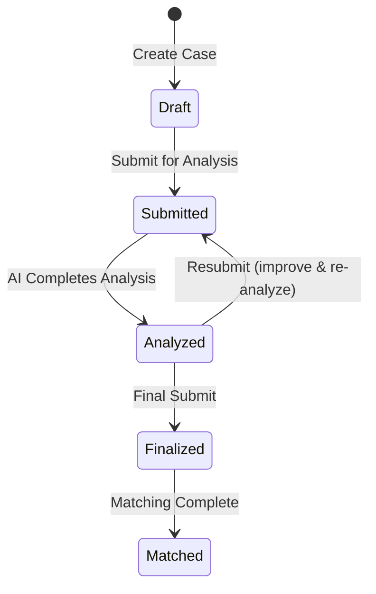

# Smart Court — API Contracts: Cases & AI

> **Version:** 1.0 | **Base URL:** `/api` | **Auth:** JWT Bearer Token
> **Depends on:** `06_API_Auth_Users.md` (ApiResponse wrapper, pagination, file upload)

---

## 1. Cases Slice

---

### POST `/api/cases`

**Description:** Create a new legal case (starts as Draft).
**Auth:** `[Authorize(Roles = "Client")]`

**Request Body:**

```json
{
  "title": "string — required, max 200 chars",
  "description": "string — required, max 5000 chars",
  "caseLocation": "string | null — max 300 chars, city/governorate"
}
```

**Response (201 Created):**

```json
{
  "success": true,
  "statusCode": 201,
  "message": "تم إنشاء القضية بنجاح",
  "data": {
    "id": "uuid",
    "title": "string",
    "description": "string",
    "caseLocation": "string | null",
    "status": 0,
    "statusName": "Draft",
    "clientUserId": "uuid",
    "clientName": "string",
    "finalSubmittedAt": null,
    "attachments": [],
    "latestAnalysis": null,
    "createdAt": "datetime",
    "updatedAt": "datetime"
  }
}
```

**Business Rules:**
- `ClientUserId` set from JWT claims (never from request body)
- Status defaults to `Draft (0)`
- No AI analysis triggered on creation

---

### GET `/api/cases`

**Description:** List the current client's legal cases (paginated, filterable).
**Auth:** `[Authorize(Roles = "Client")]`

**Query Parameters:**

| Param | Type | Default | Description |
|-------|------|---------|-------------|
| `pageNumber` | int | 1 | Page number |
| `pageSize` | int | 10 | Items per page |
| `status` | int? | null | Filter by CaseStatus enum value |
| `search` | string? | null | Search in title and description |
| `sortBy` | string | `createdAt` | Sort field: `createdAt`, `updatedAt`, `title`, `status` |
| `sortDirection` | string | `desc` | `asc` or `desc` |

**Response (200 OK):**

```json
{
  "success": true,
  "statusCode": 200,
  "data": {
    "items": [
      {
        "id": "uuid",
        "title": "نزاع عقد إيجار",
        "status": 2,
        "statusName": "Analyzed",
        "caseLocation": "القاهرة",
        "attachmentCount": 3,
        "hasAnalysis": true,
        "matchCount": 0,
        "createdAt": "datetime",
        "updatedAt": "datetime"
      }
    ],
    "pageNumber": 1,
    "pageSize": 10,
    "totalCount": 12,
    "totalPages": 2,
    "hasNextPage": true,
    "hasPreviousPage": false
  }
}
```

**Business Rules:**
- Data isolation: `WHERE ClientUserId == currentUser.Id`
- List response uses a lightweight DTO (no description, no analysis details)

---

### GET `/api/cases/{id}`

**Description:** Get full case details including latest analysis and attachments.
**Auth:** `[Authorize(Roles = "Client")]`

**Response (200 OK):**

```json
{
  "success": true,
  "statusCode": 200,
  "data": {
    "id": "uuid",
    "title": "نزاع عقد إيجار",
    "description": "لدي مشكلة مع المؤجر...",
    "caseLocation": "القاهرة",
    "status": 2,
    "statusName": "Analyzed",
    "clientUserId": "uuid",
    "clientName": "أحمد محمد",
    "finalSubmittedAt": null,
    "attachments": [
      {
        "id": "uuid (CaseAttachment.Id)",
        "fileId": "uuid (StoredFile.Id)",
        "fileName": "عقد_الإيجار.pdf",
        "contentType": "application/pdf",
        "fileSize": 524288,
        "downloadUrl": "/api/files/uuid/download",
        "createdAt": "datetime"
      }
    ],
    "latestAnalysis": {
      "id": "uuid",
      "analysisNumber": 2,
      "legalCategory": {
        "id": "uuid",
        "name": "قانون مدني"
      },
      "strengthPoints": "string — Arabic text",
      "weakPoints": "string — Arabic text",
      "missingInformation": "string — Arabic text",
      "recommendations": "string — Arabic text",
      "overallAssessment": "string — Arabic text",
      "confidenceScore": 0.85,
      "modelName": "gpt-4o",
      "createdAt": "datetime"
    },
    "matchCount": 5,
    "proposalCount": 1,
    "createdAt": "datetime",
    "updatedAt": "datetime"
  }
}
```

**Status Codes:**

| Code | Condition |
|------|-----------|
| 200 | Case found |
| 403 | Case belongs to another client |
| 404 | Case not found |

---

### PUT `/api/cases/{id}`

**Description:** Update case details (only when editable).
**Auth:** `[Authorize(Roles = "Client")]`

**Request Body:**

```json
{
  "title": "string — required, max 200 chars",
  "description": "string — required, max 5000 chars",
  "caseLocation": "string | null — max 300 chars"
}
```

**Response (200 OK):** Full case object.

**Status Codes:**

| Code | Condition |
|------|-----------|
| 200 | Updated |
| 400 | Validation errors |
| 403 | Not your case |
| 404 | Case not found |
| 409 | Case is not editable (status must be Draft or Analyzed) |

**Business Rules:**
- Editable only when status is `Draft` or `Analyzed`
- After editing an `Analyzed` case, status stays `Analyzed` (client must re-submit for new analysis)

---

### DELETE `/api/cases/{id}`

**Description:** Delete a draft case.
**Auth:** `[Authorize(Roles = "Client")]`

**Response (200 OK):**

```json
{
  "success": true,
  "statusCode": 200,
  "message": "تم حذف القضية"
}
```

**Status Codes:**

| Code | Condition |
|------|-----------|
| 200 | Deleted |
| 403 | Not your case |
| 404 | Not found |
| 409 | Can only delete Draft cases |

**Business Rules:**
- Only `Draft` status cases can be deleted
- Deletes associated `CaseAttachment` records (but not `StoredFile` records)

---

### POST `/api/cases/{id}/attachments`

**Description:** Add attachments to a case.
**Auth:** `[Authorize(Roles = "Client")]`

**Request Body:**

```json
{
  "fileIds": ["uuid", "uuid"]
}
```

**Response (201 Created):**

```json
{
  "success": true,
  "statusCode": 201,
  "message": "تم إضافة المرفقات",
  "data": [
    {
      "id": "uuid (CaseAttachment.Id)",
      "fileId": "uuid (StoredFile.Id)",
      "fileName": "document.pdf",
      "contentType": "application/pdf",
      "fileSize": 1048576,
      "downloadUrl": "/api/files/uuid/download",
      "createdAt": "datetime"
    }
  ]
}
```

**Business Rules:**
- `fileIds` must reference existing `StoredFile` records uploaded by the current user
- Creates `CaseAttachment` entries linking `LegalCase` → `StoredFile`
- Max 20 attachments per case

---

### GET `/api/cases/{id}/attachments`

**Description:** List all attachments for a case.
**Auth:** `[Authorize(Roles = "Client")]`

**Response (200 OK):** Array of attachment objects (same structure as above).

---

### DELETE `/api/cases/{id}/attachments/{attachmentId}`

**Description:** Remove an attachment from a case.
**Auth:** `[Authorize(Roles = "Client")]`

**Response (200 OK):**

```json
{
  "success": true,
  "statusCode": 200,
  "message": "تم حذف المرفق"
}
```

**Business Rules:**
- Deletes `CaseAttachment` record only (not the `StoredFile`)
- Only editable cases (Draft or Analyzed)

---

### POST `/api/cases/{id}/submit`

**Description:** Submit a case for AI analysis.
**Auth:** `[Authorize(Roles = "Client")]`

**Response (200 OK):**

```json
{
  "success": true,
  "statusCode": 200,
  "message": "تم تقديم القضية للتحليل",
  "data": {
    "id": "uuid",
    "status": 1,
    "statusName": "Submitted"
  }
}
```

**Status Codes:**

| Code | Condition |
|------|-----------|
| 200 | Submitted, AI analysis triggered |
| 403 | Not your case |
| 404 | Not found |
| 409 | Invalid status transition (must be Draft or Analyzed for resubmission) |

**Business Rules:**
- Status transition: `Draft → Submitted` or `Analyzed → Submitted` (resubmission)
- Triggers AI case analysis asynchronously
- After analysis completes, status automatically updates to `Analyzed`

---

### POST `/api/cases/{id}/finalize`

**Description:** Finalize the case and trigger lawyer matching.
**Auth:** `[Authorize(Roles = "Client")]`

**Response (200 OK):**

```json
{
  "success": true,
  "statusCode": 200,
  "message": "تم تقديم القضية النهائي وبدأ البحث عن محامين",
  "data": {
    "id": "uuid",
    "status": 3,
    "statusName": "Finalized",
    "finalSubmittedAt": "datetime"
  }
}
```

**Status Codes:**

| Code | Condition |
|------|-----------|
| 200 | Finalized, matching triggered |
| 409 | Must be Analyzed first |

**Business Rules:**
- Status transition: `Analyzed → Finalized`
- Sets `FinalSubmittedAt`
- Triggers lawyer matching asynchronously
- After matching completes, status updates to `Matched`
- This action is **irreversible** — client cannot edit case after finalization

---

## 2. AI Analysis Slice

---

### POST `/api/cases/{id}/analyze`

**Description:** Manually trigger AI analysis for a submitted case (normally auto-triggered).
**Auth:** `[Authorize(Roles = "Client")]`

**Response (200 OK):**

```json
{
  "success": true,
  "statusCode": 200,
  "message": "جاري تحليل القضية...",
  "data": {
    "analysisId": "uuid",
    "status": "Processing"
  }
}
```

**Business Rules:**
- Case must be in `Submitted` status
- Can be called to re-trigger analysis if previous attempt failed
- Creates new `AIAnalysis` record with incremented `AnalysisNumber`

---

### GET `/api/cases/{id}/analysis`

**Description:** Get the latest AI analysis for a case.
**Auth:** `[Authorize(Roles = "Client")]`

**Response (200 OK):**

```json
{
  "success": true,
  "statusCode": 200,
  "data": {
    "id": "uuid",
    "legalCaseId": "uuid",
    "analysisNumber": 2,
    "legalCategory": {
      "id": "uuid",
      "name": "قانون مدني"
    },
    "strengthPoints": "1. يوجد عقد إيجار موثق\n2. الشهود متاحون\n3. المدة الزمنية واضحة",
    "weakPoints": "1. لا يوجد إثبات للدفع\n2. العقد غير مسجل في الشهر العقاري",
    "missingInformation": "1. صور من إيصالات الدفع\n2. شهادة من الشهر العقاري\n3. أي مراسلات مع المؤجر",
    "recommendations": "1. جمع إيصالات الدفع\n2. تسجيل العقد رسمياً\n3. الاحتفاظ بنسخ من جميع المراسلات",
    "overallAssessment": "القضية لها أساس قانوني قوي لكن تحتاج إلى تعزيز الأدلة المالية. يُنصح بجمع المستندات المفقودة قبل التقدم.",
    "confidenceScore": 0.78,
    "modelName": "gpt-4o",
    "promptTokens": 1250,
    "completionTokens": 890,
    "totalTokens": 2140,
    "createdAt": "datetime"
  }
}
```

**Status Codes:**

| Code | Condition |
|------|-----------|
| 200 | Analysis found |
| 403 | Not your case |
| 404 | No analysis exists for this case |

---

### GET `/api/cases/{id}/analysis/history`

**Description:** Get all AI analyses for a case (shows improvement over time).
**Auth:** `[Authorize(Roles = "Client")]`

**Response (200 OK):**

```json
{
  "success": true,
  "statusCode": 200,
  "data": [
    {
      "id": "uuid",
      "analysisNumber": 2,
      "legalCategoryName": "قانون مدني",
      "confidenceScore": 0.85,
      "overallAssessment": "... (summary)",
      "modelName": "gpt-4o",
      "totalTokens": 2140,
      "createdAt": "datetime"
    },
    {
      "id": "uuid",
      "analysisNumber": 1,
      "legalCategoryName": "قانون مدني",
      "confidenceScore": 0.65,
      "overallAssessment": "... (summary)",
      "modelName": "gpt-4o",
      "totalTokens": 1980,
      "createdAt": "datetime"
    }
  ]
}
```

**Business Rules:**
- Ordered by `AnalysisNumber DESC` (newest first)
- This is a lightweight list — click individual analysis for full details
- GET `/api/cases/{id}/analysis/{analysisId}` for full detail of a specific analysis

---

### GET `/api/cases/{id}/analysis/{analysisId}`

**Description:** Get a specific AI analysis by its ID.
**Auth:** `[Authorize(Roles = "Client")]`

**Response (200 OK):** Same full analysis object as `GET /api/cases/{id}/analysis`.

---

## 3. Lawyer Matching Slice

---

### POST `/api/cases/{id}/match`

**Description:** Trigger or re-trigger lawyer matching for a finalized case.
**Auth:** `[Authorize(Roles = "Client")]`

**Response (200 OK):**

```json
{
  "success": true,
  "statusCode": 200,
  "message": "جاري البحث عن المحامين المناسبين...",
  "data": {
    "status": "Processing",
    "estimatedCount": 10
  }
}
```

**Status Codes:**

| Code | Condition |
|------|-----------|
| 200 | Matching triggered |
| 409 | Case must be Finalized or Matched |

**Business Rules:**
- Case must be `Finalized` or `Matched` (re-match)
- Clears existing `LawyerMatch` records and creates new ones
- Only includes verified, available lawyers
- Status updates to `Matched` after completion

---

### GET `/api/cases/{id}/matches`

**Description:** Get the ranked list of matched lawyers for a case.
**Auth:** `[Authorize(Roles = "Client")]`

**Query Parameters:**

| Param | Type | Default | Description |
|-------|------|---------|-------------|
| `pageNumber` | int | 1 | Page number |
| `pageSize` | int | 10 | Results per page (max 20) |

**Response (200 OK):**

```json
{
  "success": true,
  "statusCode": 200,
  "data": {
    "items": [
      {
        "id": "uuid (LawyerMatch.Id)",
        "rank": 1,
        "matchScore": 92.5,
        "matchReason": "تخصص في قانون مدني مع 15 سنة خبرة في القاهرة. تقييم مرتفع 4.8/5",
        "lawyer": {
          "userId": "uuid",
          "firstName": "محمد",
          "lastName": "عبدالرحمن",
          "profilePictureUrl": "string | null",
          "bio": "محامي متخصص في القانون المدني...",
          "officeAddress": "القاهرة، مصر الجديدة",
          "yearsOfExperience": 15,
          "isAvailable": true,
          "averageRating": 4.8,
          "reviewCount": 42,
          "specializations": [
            { "id": "uuid", "name": "قانون مدني" },
            { "id": "uuid", "name": "قانون عقاري" }
          ]
        },
        "hasExistingProposal": false,
        "createdAt": "datetime"
      },
      {
        "id": "uuid",
        "rank": 2,
        "matchScore": 87.3,
        "matchReason": "...",
        "lawyer": { /* ... */ },
        "hasExistingProposal": true,
        "createdAt": "datetime"
      }
    ],
    "pageNumber": 1,
    "pageSize": 10,
    "totalCount": 8,
    "totalPages": 1
  }
}
```

**Business Rules:**
- Ordered by `Rank ASC` (best match first)
- `hasExistingProposal` = true if client already sent a proposal to this lawyer for this case
- Matching algorithm weights (configurable):
  - Specialization match: 40%
  - Years of experience: 20%
  - Average rating: 20%
  - Location proximity: 10%
  - Availability: 10%

---

## 4. AI Assistant Slice

---

### POST `/api/ai-assistant/conversations`

**Description:** Start a new AI assistant conversation.
**Auth:** `[Authorize]`

**Request Body:**

```json
{
  "conversationType": "int — 0 (GeneralLegal) or 1 (LawyerResearch)",
  "relatedLegalCaseId": "uuid | null — optional, link to a case for context",
  "initialMessage": "string — required, the first question"
}
```

**Response (201 Created):**

```json
{
  "success": true,
  "statusCode": 201,
  "data": {
    "conversationId": "uuid",
    "title": "string — auto-generated from first message",
    "conversationType": 0,
    "conversationTypeName": "GeneralLegal",
    "messages": [
      {
        "id": "uuid",
        "senderType": 0,
        "senderTypeName": "User",
        "content": "ما هي إجراءات رفع دعوى إيجار؟",
        "createdAt": "datetime"
      },
      {
        "id": "uuid",
        "senderType": 1,
        "senderTypeName": "AI",
        "content": "⚠️ تنبيه: هذا ليس مشورة قانونية\n\nإجراءات رفع دعوى إيجار في مصر تتضمن...",
        "modelName": "gpt-4o",
        "promptTokens": 450,
        "completionTokens": 380,
        "totalTokens": 830,
        "responseTimeMs": 2500,
        "createdAt": "datetime"
      }
    ],
    "createdAt": "datetime"
  }
}
```

**Status Codes:**

| Code | Condition |
|------|-----------|
| 201 | Conversation created with first exchange |
| 400 | Missing initial message, invalid conversation type |
| 403 | Client cannot create LawyerResearch conversations |

**Business Rules:**
- `GeneralLegal (0)`: Available to clients — general legal Q&A
- `LawyerResearch (1)`: Available to lawyers only — uses RAG pipeline
- If `relatedLegalCaseId` is provided, case details are injected into the AI context
- Title auto-generated: first 50 chars of `initialMessage` truncated
- AI response always starts with disclaimer for `GeneralLegal`

---

### GET `/api/ai-assistant/conversations`

**Description:** List user's AI conversations.
**Auth:** `[Authorize]`

**Query Parameters:** Standard pagination.

**Response (200 OK):**

```json
{
  "success": true,
  "statusCode": 200,
  "data": {
    "items": [
      {
        "id": "uuid",
        "title": "إجراءات رفع دعوى إيجار",
        "conversationType": 0,
        "conversationTypeName": "GeneralLegal",
        "relatedLegalCaseId": null,
        "relatedLegalCaseTitle": null,
        "messageCount": 12,
        "lastMessageAt": "datetime",
        "createdAt": "datetime"
      }
    ],
    "pageNumber": 1,
    "pageSize": 10,
    "totalCount": 5
  }
}
```

---

### GET `/api/ai-assistant/conversations/{id}`

**Description:** Get conversation details with message history.
**Auth:** `[Authorize]`

**Query Parameters:**

| Param | Type | Default | Description |
|-------|------|---------|-------------|
| `messagePageNumber` | int | 1 | Messages page |
| `messagePageSize` | int | 50 | Messages per page |

**Response (200 OK):**

```json
{
  "success": true,
  "statusCode": 200,
  "data": {
    "id": "uuid",
    "title": "إجراءات رفع دعوى إيجار",
    "conversationType": 0,
    "conversationTypeName": "GeneralLegal",
    "relatedLegalCaseId": "uuid | null",
    "relatedLegalCaseTitle": "string | null",
    "messages": {
      "items": [
        {
          "id": "uuid",
          "senderType": 0,
          "senderTypeName": "User",
          "content": "ما هي إجراءات رفع دعوى إيجار؟",
          "modelName": null,
          "promptTokens": null,
          "completionTokens": null,
          "totalTokens": null,
          "responseTimeMs": null,
          "createdAt": "datetime"
        },
        {
          "id": "uuid",
          "senderType": 1,
          "senderTypeName": "AI",
          "content": "⚠️ تنبيه: هذا ليس مشورة قانونية\n\n...",
          "modelName": "gpt-4o",
          "promptTokens": 450,
          "completionTokens": 380,
          "totalTokens": 830,
          "responseTimeMs": 2500,
          "createdAt": "datetime"
        }
      ],
      "pageNumber": 1,
      "pageSize": 50,
      "totalCount": 12
    },
    "createdAt": "datetime",
    "updatedAt": "datetime"
  }
}
```

**Status Codes:**

| Code | Condition |
|------|-----------|
| 200 | Found |
| 403 | Conversation belongs to another user |
| 404 | Not found |

---

### POST `/api/ai-assistant/conversations/{id}/messages`

**Description:** Send a new message in an existing AI conversation and receive AI response.
**Auth:** `[Authorize]`

**Request Body:**

```json
{
  "content": "string — required, max 5000 chars"
}
```

**Response (200 OK):**

```json
{
  "success": true,
  "statusCode": 200,
  "data": {
    "userMessage": {
      "id": "uuid",
      "senderType": 0,
      "senderTypeName": "User",
      "content": "هل يمكن الاستئناف؟",
      "createdAt": "datetime"
    },
    "aiMessage": {
      "id": "uuid",
      "senderType": 1,
      "senderTypeName": "AI",
      "content": "⚠️ تنبيه: هذا ليس مشورة قانونية\n\nنعم، يمكن الاستئناف في...",
      "modelName": "gpt-4o",
      "promptTokens": 1200,
      "completionTokens": 450,
      "totalTokens": 1650,
      "responseTimeMs": 3200,
      "createdAt": "datetime"
    }
  }
}
```

**Status Codes:**

| Code | Condition |
|------|-----------|
| 200 | Message sent and AI responded |
| 400 | Empty or too long content |
| 403 | Not your conversation |
| 404 | Conversation not found |
| 503 | AI service unavailable (LLM API error) |

**Business Rules:**
- Sends full conversation history to LLM as context (up to token limit)
- For `LawyerResearch`: runs RAG pipeline (embed → search Qdrant → inject context → LLM)
- If LLM API fails: user message is still saved, AI message = error message, HTTP 503
- Token usage tracked per message for cost monitoring
- `responseTimeMs` measured end-to-end for latency monitoring
- Updates `AIConversation.UpdatedAt`

---

### DELETE `/api/ai-assistant/conversations/{id}`

**Description:** Delete an AI conversation and all its messages.
**Auth:** `[Authorize]`

**Response (200 OK):**

```json
{
  "success": true,
  "statusCode": 200,
  "message": "تم حذف المحادثة"
}
```

---

## Enum Reference

### CaseStatus

| Value | Name | Description | Can Edit? | Transitions To |
|-------|------|-------------|-----------|----------------|
| 0 | Draft | Initial state | ✅ | Submitted |
| 1 | Submitted | Sent for AI analysis | ❌ | Analyzed |
| 2 | Analyzed | AI analysis complete | ✅ | Submitted (re-analyze), Finalized |
| 3 | Finalized | Final submission for matching | ❌ | Matched |
| 4 | Matched | Lawyers matched | ❌ | — |

### Case Status State Machine



### AIConversationType

| Value | Name | Available To | Description |
|-------|------|-------------|-------------|
| 0 | GeneralLegal | Client | General legal Q&A with disclaimer |
| 1 | LawyerResearch | Lawyer | Legal research with RAG (Egyptian law) |

### AISenderType

| Value | Name |
|-------|------|
| 0 | User |
| 1 | AI |
