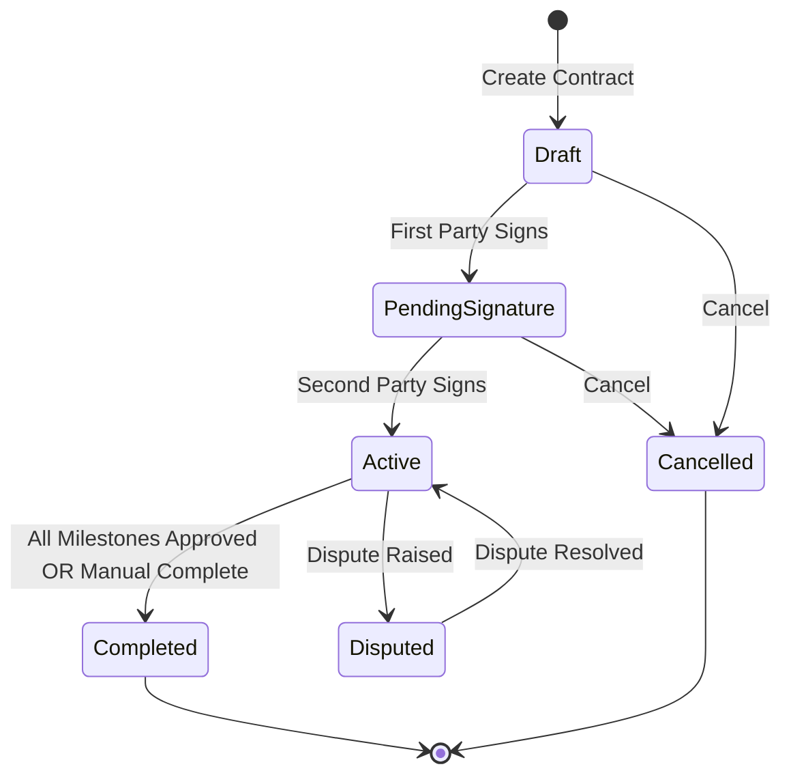

# Smart Court — API Contracts: Marketplace & Collaboration

> **Version:** 1.0 | **Base URL:** `/api` | **Auth:** JWT Bearer Token
> **Depends on:** `06_API_Auth_Users.md`, `07_API_Cases_AI.md`

---

## 1. Marketplace Slice

---

### GET `/api/marketplace/lawyers`

**Description:** Browse and search verified lawyers.
**Auth:** `[AllowAnonymous]` (public, no auth required)

**Query Parameters:**

| Param | Type | Default | Description |
|-------|------|---------|-------------|
| `pageNumber` | int | 1 | Page |
| `pageSize` | int | 12 | Items per page (max 50) |
| `search` | string? | null | Search in name, bio |
| `specialization` | uuid? | null | Filter by LegalCategoryId |
| `minExperience` | int? | null | Minimum years of experience |
| `maxExperience` | int? | null | Maximum years of experience |
| `location` | string? | null | Filter by officeAddress (partial match) |
| `minRating` | decimal? | null | Minimum average rating (1-5) |
| `isAvailable` | bool? | true | Filter by availability |
| `sortBy` | string | `rating` | `rating`, `experience`, `reviewCount`, `createdAt` |
| `sortDirection` | string | `desc` | `asc` or `desc` |

**Response (200 OK):**

```json
{
  "success": true,
  "statusCode": 200,
  "data": {
    "items": [
      {
        "userId": "uuid",
        "firstName": "محمد",
        "lastName": "عبدالرحمن",
        "profilePictureUrl": "string | null",
        "bio": "محامي متخصص في القانون المدني والعقاري بخبرة 15 عاماً...",
        "officeAddress": "القاهرة، مصر الجديدة",
        "yearsOfExperience": 15,
        "isAvailable": true,
        "averageRating": 4.8,
        "reviewCount": 42,
        "completedContractsCount": 38,
        "specializations": [
          { "id": "uuid", "name": "قانون مدني" },
          { "id": "uuid", "name": "قانون عقاري" }
        ]
      }
    ],
    "pageNumber": 1,
    "pageSize": 12,
    "totalCount": 35,
    "totalPages": 3,
    "hasNextPage": true,
    "hasPreviousPage": false
  }
}
```

**Business Rules:**
- Only shows verified lawyers (`NationalIdVerificationStatus = Approved AND BarCardVerificationStatus = Approved`)
- Default sort by rating descending
- `averageRating` and `reviewCount` computed from `Review` table
- `completedContractsCount` computed from `Contract` table (status = Completed)

---

### GET `/api/marketplace/lawyers/{userId}`

**Description:** Get a lawyer's full public profile.
**Auth:** `[AllowAnonymous]`

**Response (200 OK):**

```json
{
  "success": true,
  "statusCode": 200,
  "data": {
    "userId": "uuid",
    "firstName": "محمد",
    "lastName": "عبدالرحمن",
    "profilePictureUrl": "string | null",
    "bio": "string",
    "officeAddress": "القاهرة، مصر الجديدة",
    "yearsOfExperience": 15,
    "isAvailable": true,
    "memberSince": "datetime",
    "averageRating": 4.8,
    "reviewCount": 42,
    "completedContractsCount": 38,
    "specializations": [
      { "id": "uuid", "name": "قانون مدني" }
    ],
    "recentReviews": [
      {
        "id": "uuid",
        "reviewerName": "أحمد م.",
        "rating": 5,
        "comment": "محامي ممتاز ومتعاون جداً",
        "createdAt": "datetime"
      }
    ],
    "recentArticles": [
      {
        "id": "uuid",
        "title": "حقوق المستأجر في القانون المصري",
        "summary": "...",
        "publishedAt": "datetime"
      }
    ]
  }
}
```

**Status Codes:**

| Code | Condition |
|------|-----------|
| 200 | Found |
| 404 | Lawyer not found or not verified |

**Business Rules:**
- `recentReviews`: latest 5 reviews, reviewer name partially masked ("أحمد م.")
- `recentArticles`: latest 5 published articles
- Only verified lawyers have public profiles

---

## 2. Proposals Slice

---

### POST `/api/proposals`

**Description:** Send a proposal to a lawyer for a specific case.
**Auth:** `[Authorize(Roles = "Client")]`

**Request Body:**

```json
{
  "legalCaseId": "uuid — required",
  "lawyerUserId": "uuid — required",
  "message": "string — required, max 2000 chars — initial message to the lawyer"
}
```

**Response (201 Created):**

```json
{
  "success": true,
  "statusCode": 201,
  "message": "تم إرسال الاقتراح بنجاح",
  "data": {
    "id": "uuid",
    "legalCaseId": "uuid",
    "caseTitle": "نزاع عقد إيجار",
    "clientUserId": "uuid",
    "clientName": "أحمد محمد",
    "lawyerUserId": "uuid",
    "lawyerName": "محمد عبدالرحمن",
    "status": 0,
    "statusName": "Pending",
    "conversationId": "uuid",
    "createdAt": "datetime",
    "updatedAt": "datetime"
  }
}
```

**Status Codes:**

| Code | Condition |
|------|-----------|
| 201 | Proposal created |
| 400 | Validation errors |
| 404 | Case or lawyer not found |
| 409 | Case not in Finalized/Matched status |
| 409 | Active proposal already exists for this case + lawyer |
| 409 | Lawyer is not verified or not available |

**Business Rules:**
- Client must own the case
- Case must be `Finalized` or `Matched`
- No duplicate active proposals (same case + same lawyer + status = Pending)
- Auto-creates:
  1. `Conversation` linked to this proposal
  2. `ConversationParticipant` entries for client and lawyer
  3. `Message` with `message` content as the first message (type = ProposalMessage)
- Sends notification to the lawyer

---

### GET `/api/proposals`

**Description:** List proposals (sent by client or received by lawyer).
**Auth:** `[Authorize(Roles = "Client,Lawyer")]`

**Query Parameters:**

| Param | Type | Default | Description |
|-------|------|---------|-------------|
| `pageNumber` | int | 1 | Page |
| `pageSize` | int | 10 | Per page |
| `status` | int? | null | Filter by ProposalStatus |
| `sortBy` | string | `createdAt` | Sort field |
| `sortDirection` | string | `desc` | Sort direction |

**Response (200 OK):**

```json
{
  "success": true,
  "statusCode": 200,
  "data": {
    "items": [
      {
        "id": "uuid",
        "legalCaseId": "uuid",
        "caseTitle": "نزاع عقد إيجار",
        "clientUserId": "uuid",
        "clientName": "أحمد محمد",
        "lawyerUserId": "uuid",
        "lawyerName": "محمد عبدالرحمن",
        "lawyerProfilePictureUrl": "string | null",
        "status": 0,
        "statusName": "Pending",
        "conversationId": "uuid",
        "hasContract": false,
        "createdAt": "datetime"
      }
    ],
    "pageNumber": 1,
    "pageSize": 10,
    "totalCount": 3
  }
}
```

**Business Rules:**
- Client sees proposals they sent (`WHERE ClientUserId = currentUser`)
- Lawyer sees proposals they received (`WHERE LawyerUserId = currentUser`)

---

### GET `/api/proposals/{id}`

**Description:** Get proposal details.
**Auth:** `[Authorize(Roles = "Client,Lawyer")]`

**Response (200 OK):**

```json
{
  "success": true,
  "statusCode": 200,
  "data": {
    "id": "uuid",
    "legalCaseId": "uuid",
    "caseTitle": "نزاع عقد إيجار",
    "caseDescription": "لدي مشكلة مع المؤجر...",
    "caseStatus": 4,
    "caseStatusName": "Matched",
    "clientUserId": "uuid",
    "clientName": "أحمد محمد",
    "lawyerUserId": "uuid",
    "lawyerName": "محمد عبدالرحمن",
    "status": 0,
    "statusName": "Pending",
    "conversationId": "uuid",
    "hasContract": false,
    "contractId": null,
    "createdAt": "datetime",
    "updatedAt": "datetime"
  }
}
```

**Status Codes:**

| Code | Condition |
|------|-----------|
| 200 | Found |
| 403 | Not a participant in this proposal |
| 404 | Not found |

---

### PUT `/api/proposals/{id}/respond`

**Description:** Lawyer accepts or rejects a proposal.
**Auth:** `[Authorize(Roles = "Lawyer")]`

**Request Body:**

```json
{
  "status": "int — 1 (Accepted) or 2 (Rejected)"
}
```

**Response (200 OK):**

```json
{
  "success": true,
  "statusCode": 200,
  "message": "تم قبول الاقتراح" | "تم رفض الاقتراح",
  "data": {
    "id": "uuid",
    "status": 1,
    "statusName": "Accepted",
    "conversationId": "uuid"
  }
}
```

**Status Codes:**

| Code | Condition |
|------|-----------|
| 200 | Status updated |
| 400 | Invalid status value |
| 403 | Not the target lawyer |
| 409 | Proposal is not Pending |

**Business Rules:**
- Only the target lawyer can respond
- Only `Pending` proposals can be responded to
- On Accept: conversation remains open, notification sent to client
- On Reject: conversation is closed (`IsClosed = true, ClosedAt = now`), notification sent to client

---

## 3. Chat Slice

---

### SignalR Hub: `/hubs/chat`

**Connection:** `WSS` with JWT Bearer token

**Authentication:** Token passed via query string: `/hubs/chat?access_token={jwt}`

#### Hub Server Methods (Client → Server)

| Method | Parameters | Description |
|--------|-----------|-------------|
| `JoinConversation` | `conversationId: string` | Join a conversation group |
| `LeaveConversation` | `conversationId: string` | Leave a conversation group |
| `SendMessage` | `conversationId: string, content: string, messageType: int` | Send a text message |
| `SendFileMessage` | `conversationId: string, storedFileId: string` | Send a file attachment |
| `StartTyping` | `conversationId: string` | Notify typing started |
| `StopTyping` | `conversationId: string` | Notify typing stopped |

#### Hub Client Methods (Server → Client)

| Method | Payload | Description |
|--------|---------|-------------|
| `ReceiveMessage` | `MessageResponse` | New message in conversation |
| `UserTyping` | `{ conversationId, userId, userName }` | User is typing |
| `UserStoppedTyping` | `{ conversationId, userId }` | User stopped typing |
| `ConversationClosed` | `{ conversationId }` | Conversation was closed |
| `ReceiveNotification` | `NotificationResponse` | Real-time notification push |

#### MessageResponse (SignalR payload)

```json
{
  "id": "uuid",
  "conversationId": "uuid",
  "senderUserId": "uuid",
  "senderName": "أحمد محمد",
  "senderProfilePictureUrl": "string | null",
  "messageType": 0,
  "messageTypeName": "Text",
  "content": "مرحباً، أود مناقشة القضية",
  "isEdited": false,
  "editedAt": null,
  "attachments": [],
  "createdAt": "datetime"
}
```

---

### GET `/api/chat/conversations`

**Description:** List user's active conversations.
**Auth:** `[Authorize]`

**Query Parameters:** Standard pagination.

**Response (200 OK):**

```json
{
  "success": true,
  "statusCode": 200,
  "data": {
    "items": [
      {
        "id": "uuid",
        "proposalId": "uuid",
        "caseTitle": "نزاع عقد إيجار",
        "isClosed": false,
        "otherParticipant": {
          "userId": "uuid",
          "name": "محمد عبدالرحمن",
          "role": "Lawyer",
          "profilePictureUrl": "string | null"
        },
        "lastMessage": {
          "content": "سأراجع المستندات وأرد عليك",
          "senderName": "محمد عبدالرحمن",
          "messageType": 0,
          "createdAt": "datetime"
        },
        "unreadCount": 3,
        "createdAt": "datetime"
      }
    ],
    "pageNumber": 1,
    "pageSize": 20,
    "totalCount": 5
  }
}
```

**Business Rules:**
- Only shows conversations where user is a participant
- Sorted by last message time descending
- `unreadCount` = messages after last read timestamp for this user

---

### GET `/api/chat/conversations/{id}`

**Description:** Get conversation detail with metadata.
**Auth:** `[Authorize]`

**Response (200 OK):**

```json
{
  "success": true,
  "statusCode": 200,
  "data": {
    "id": "uuid",
    "proposalId": "uuid",
    "proposalStatus": 1,
    "proposalStatusName": "Accepted",
    "caseId": "uuid",
    "caseTitle": "نزاع عقد إيجار",
    "isClosed": false,
    "closedAt": null,
    "hasContract": true,
    "contractId": "uuid",
    "participants": [
      {
        "userId": "uuid",
        "name": "أحمد محمد",
        "role": "Client",
        "profilePictureUrl": "string | null",
        "joinedAt": "datetime"
      },
      {
        "userId": "uuid",
        "name": "محمد عبدالرحمن",
        "role": "Lawyer",
        "profilePictureUrl": "string | null",
        "joinedAt": "datetime"
      }
    ],
    "createdAt": "datetime"
  }
}
```

---

### GET `/api/chat/conversations/{id}/messages`

**Description:** Get paginated message history for a conversation.
**Auth:** `[Authorize]`

**Query Parameters:**

| Param | Type | Default | Description |
|-------|------|---------|-------------|
| `pageNumber` | int | 1 | Page |
| `pageSize` | int | 50 | Messages per page |
| `before` | datetime? | null | Get messages before this timestamp (for infinite scroll) |

**Response (200 OK):**

```json
{
  "success": true,
  "statusCode": 200,
  "data": {
    "items": [
      {
        "id": "uuid",
        "conversationId": "uuid",
        "senderUserId": "uuid",
        "senderName": "أحمد محمد",
        "senderProfilePictureUrl": "string | null",
        "messageType": 0,
        "messageTypeName": "Text",
        "content": "مرحباً، أود مناقشة تفاصيل القضية",
        "isEdited": false,
        "editedAt": null,
        "attachments": [],
        "createdAt": "datetime"
      },
      {
        "id": "uuid",
        "conversationId": "uuid",
        "senderUserId": "uuid",
        "senderName": "محمد عبدالرحمن",
        "senderProfilePictureUrl": "string | null",
        "messageType": 1,
        "messageTypeName": "File",
        "content": null,
        "isEdited": false,
        "attachments": [
          {
            "id": "uuid",
            "fileId": "uuid",
            "fileName": "ملاحظات.pdf",
            "contentType": "application/pdf",
            "fileSize": 1048576,
            "downloadUrl": "/api/files/uuid/download"
          }
        ],
        "createdAt": "datetime"
      },
      {
        "id": "uuid",
        "messageType": 2,
        "messageTypeName": "Voice",
        "content": null,
        "attachments": [
          {
            "id": "uuid",
            "fileId": "uuid",
            "fileName": "voice_message.webm",
            "contentType": "audio/webm",
            "fileSize": 245000,
            "downloadUrl": "/api/files/uuid/download"
          }
        ],
        "createdAt": "datetime"
      }
    ],
    "pageNumber": 1,
    "pageSize": 50,
    "totalCount": 28
  }
}
```

**Business Rules:**
- Only conversation participants can view messages
- Messages ordered by `CreatedAt ASC` (oldest first) within a page
- `before` parameter for infinite scroll: loads older messages

---

### POST `/api/chat/conversations/{id}/messages`

**Description:** Send a message via REST (alternative to SignalR for reliability).
**Auth:** `[Authorize]`

**Request Body:**

```json
{
  "content": "string — required for Text type, max 5000 chars",
  "messageType": "int — 0 (Text), 1 (File), 2 (Voice)",
  "attachmentFileIds": ["uuid"] | null
}
```

**Response (201 Created):**

```json
{
  "success": true,
  "statusCode": 201,
  "data": {
    "id": "uuid",
    "conversationId": "uuid",
    "senderUserId": "uuid",
    "senderName": "أحمد محمد",
    "messageType": 0,
    "messageTypeName": "Text",
    "content": "شكراً لك",
    "attachments": [],
    "createdAt": "datetime"
  }
}
```

**Status Codes:**

| Code | Condition |
|------|-----------|
| 201 | Message sent |
| 400 | Empty content for text, missing file for file/voice type |
| 403 | Not a participant |
| 409 | Conversation is closed |

**Business Rules:**
- Also broadcasts via SignalR to conversation group
- For `File (1)` or `Voice (2)`: `attachmentFileIds` required, `content` optional
- For `Text (0)`: `content` required, `attachmentFileIds` optional
- Creates `MessageAttachment` records for each file
- Sends notification to offline participants

---

## 4. Contracts Slice

---

### POST `/api/contracts`

**Description:** Create a contract for an accepted proposal.
**Auth:** `[Authorize(Roles = "Client,Lawyer")]`

**Request Body:**

```json
{
  "proposalId": "uuid — required",
  "totalAmount": "decimal — required, min 1",
  "currency": "string — default 'EGP'",
  "termsAndConditions": "string — required, max 10000 chars"
}
```

**Response (201 Created):**

```json
{
  "success": true,
  "statusCode": 201,
  "message": "تم إنشاء العقد بنجاح",
  "data": {
    "id": "uuid",
    "proposalId": "uuid",
    "caseTitle": "نزاع عقد إيجار",
    "clientUserId": "uuid",
    "clientName": "أحمد محمد",
    "lawyerUserId": "uuid",
    "lawyerName": "محمد عبدالرحمن",
    "status": 0,
    "statusName": "Draft",
    "totalAmount": 5000.00,
    "currency": "EGP",
    "termsAndConditions": "string",
    "milestones": [],
    "signedByClientAt": null,
    "signedByLawyerAt": null,
    "startedAt": null,
    "completedAt": null,
    "cancelledAt": null,
    "createdAt": "datetime",
    "updatedAt": "datetime"
  }
}
```

**Status Codes:**

| Code | Condition |
|------|-----------|
| 201 | Contract created |
| 400 | Validation errors |
| 404 | Proposal not found |
| 409 | Proposal not accepted |
| 409 | Contract already exists for this proposal |

**Business Rules:**
- Proposal must be `Accepted`
- One contract per proposal (unique constraint on `ProposalId`)
- Either party can create the contract draft
- Status starts as `Draft`
- Notifies the other party

---

### GET `/api/contracts`

**Description:** List user's contracts.
**Auth:** `[Authorize(Roles = "Client,Lawyer")]`

**Query Parameters:**

| Param | Type | Default | Description |
|-------|------|---------|-------------|
| `pageNumber` | int | 1 | Page |
| `pageSize` | int | 10 | Per page |
| `status` | int? | null | Filter by ContractStatus |

**Response (200 OK):**

```json
{
  "success": true,
  "statusCode": 200,
  "data": {
    "items": [
      {
        "id": "uuid",
        "caseTitle": "نزاع عقد إيجار",
        "otherPartyName": "محمد عبدالرحمن",
        "otherPartyRole": "Lawyer",
        "status": 2,
        "statusName": "Active",
        "totalAmount": 5000.00,
        "currency": "EGP",
        "milestoneCount": 3,
        "completedMilestones": 1,
        "startedAt": "datetime",
        "createdAt": "datetime"
      }
    ],
    "pageNumber": 1,
    "pageSize": 10,
    "totalCount": 2
  }
}
```

**Business Rules:**
- Client sees contracts where they are the client
- Lawyer sees contracts where they are the lawyer
- Join through `Contract → Proposal → LegalCase` for case title

---

### GET `/api/contracts/{id}`

**Description:** Get full contract details with milestones and payment info.
**Auth:** `[Authorize(Roles = "Client,Lawyer")]`

**Response (200 OK):**

```json
{
  "success": true,
  "statusCode": 200,
  "data": {
    "id": "uuid",
    "proposalId": "uuid",
    "caseId": "uuid",
    "caseTitle": "نزاع عقد إيجار",
    "conversationId": "uuid",
    "clientUserId": "uuid",
    "clientName": "أحمد محمد",
    "lawyerUserId": "uuid",
    "lawyerName": "محمد عبدالرحمن",
    "status": 2,
    "statusName": "Active",
    "totalAmount": 5000.00,
    "currency": "EGP",
    "totalPaid": 2000.00,
    "totalReleased": 1500.00,
    "termsAndConditions": "string",
    "signedByClientAt": "datetime | null",
    "signedByLawyerAt": "datetime | null",
    "startedAt": "datetime | null",
    "completedAt": "datetime | null",
    "cancelledAt": "datetime | null",
    "milestones": [
      {
        "id": "uuid",
        "title": "مراجعة المستندات",
        "description": "مراجعة جميع مستندات القضية",
        "orderNumber": 1,
        "amount": 2000.00,
        "dueDate": "datetime | null",
        "status": 3,
        "statusName": "Approved",
        "submittedAt": "datetime | null",
        "approvedAt": "datetime | null",
        "rejectedAt": null,
        "paymentStatus": "Released",
        "createdAt": "datetime"
      },
      {
        "id": "uuid",
        "title": "صياغة الدعوى",
        "description": "إعداد وصياغة دعوى قضائية",
        "orderNumber": 2,
        "amount": 3000.00,
        "dueDate": "datetime",
        "status": 1,
        "statusName": "InProgress",
        "submittedAt": null,
        "approvedAt": null,
        "rejectedAt": null,
        "paymentStatus": "Deposited",
        "createdAt": "datetime"
      }
    ],
    "attachments": [
      {
        "id": "uuid",
        "fileId": "uuid",
        "fileName": "عقد_خدمات.pdf",
        "downloadUrl": "/api/files/uuid/download",
        "createdAt": "datetime"
      }
    ],
    "hasDispute": false,
    "disputeId": null,
    "canReview": true,
    "hasReviewed": false,
    "createdAt": "datetime",
    "updatedAt": "datetime"
  }
}
```

---

### PUT `/api/contracts/{id}`

**Description:** Update contract terms (only when Draft).
**Auth:** `[Authorize(Roles = "Client,Lawyer")]`

**Request Body:**

```json
{
  "totalAmount": "decimal — required",
  "currency": "string — default 'EGP'",
  "termsAndConditions": "string — required, max 10000"
}
```

**Status Codes:**

| Code | Condition |
|------|-----------|
| 200 | Updated |
| 409 | Contract is not in Draft status |

---

### POST `/api/contracts/{id}/milestones`

**Description:** Add a milestone to a contract.
**Auth:** `[Authorize(Roles = "Client,Lawyer")]`

**Request Body:**

```json
{
  "title": "string — required, max 200",
  "description": "string | null — max 2000",
  "amount": "decimal — required, min 1",
  "dueDate": "datetime | null",
  "orderNumber": "int — required, position in sequence"
}
```

**Response (201 Created):**

```json
{
  "success": true,
  "statusCode": 201,
  "data": {
    "id": "uuid",
    "title": "مراجعة المستندات",
    "description": "...",
    "orderNumber": 1,
    "amount": 2000.00,
    "dueDate": "datetime | null",
    "status": 0,
    "statusName": "Pending",
    "createdAt": "datetime"
  }
}
```

**Status Codes:**

| Code | Condition |
|------|-----------|
| 201 | Milestone added |
| 409 | Contract is not Draft — cannot add milestones |

---

### PUT `/api/contracts/{id}/milestones/{milestoneId}`

**Description:** Update a milestone.
**Auth:** `[Authorize(Roles = "Client,Lawyer")]`

**Request Body:** Same as POST.

**Business Rules:**
- Only when contract is `Draft`
- Only when milestone is `Pending`

---

### DELETE `/api/contracts/{id}/milestones/{milestoneId}`

**Description:** Remove a milestone.
**Auth:** `[Authorize(Roles = "Client,Lawyer")]`

**Business Rules:** Only when contract is `Draft`.

---

### POST `/api/contracts/{id}/sign`

**Description:** Sign the contract (both parties must sign for activation).
**Auth:** `[Authorize(Roles = "Client,Lawyer")]`

**Response (200 OK):**

```json
{
  "success": true,
  "statusCode": 200,
  "message": "تم توقيع العقد" | "تم تفعيل العقد — وقع الطرفان",
  "data": {
    "id": "uuid",
    "status": 1 | 2,
    "statusName": "PendingSignature | Active",
    "signedByClientAt": "datetime | null",
    "signedByLawyerAt": "datetime | null",
    "startedAt": "datetime | null"
  }
}
```

**Status Codes:**

| Code | Condition |
|------|-----------|
| 200 | Signed |
| 400 | Milestone amounts don't match totalAmount |
| 409 | Contract must be Draft or PendingSignature |
| 409 | User already signed |

**Business Rules:**
- **Validation before first sign:** sum of milestone amounts must equal `totalAmount`
- **First signature:** status → `PendingSignature (1)`
- **Second signature:** status → `Active (2)`, sets `StartedAt`
- Notifies the other party on each signature
- If contract has zero milestones, creates one default milestone with `totalAmount`

---

### POST `/api/contracts/{id}/milestones/{milestoneId}/submit`

**Description:** Lawyer submits a milestone as completed.
**Auth:** `[Authorize(Roles = "Lawyer")]`

**Request Body:**

```json
{
  "notes": "string | null — completion notes, max 2000"
}
```

**Response (200 OK):**

```json
{
  "success": true,
  "statusCode": 200,
  "message": "تم تقديم المرحلة للمراجعة",
  "data": {
    "id": "uuid",
    "status": 2,
    "statusName": "Submitted",
    "submittedAt": "datetime"
  }
}
```

**Business Rules:**
- Only the contract's lawyer can submit
- Milestone must be `Pending (0)` or `InProgress (1)`
- Sets `SubmittedAt`
- Notifies client to review

---

### PUT `/api/contracts/{id}/milestones/{milestoneId}/approve`

**Description:** Client approves a submitted milestone.
**Auth:** `[Authorize(Roles = "Client")]`

**Response (200 OK):**

```json
{
  "success": true,
  "statusCode": 200,
  "message": "تم الموافقة على المرحلة",
  "data": {
    "id": "uuid",
    "status": 3,
    "statusName": "Approved",
    "approvedAt": "datetime"
  }
}
```

**Business Rules:**
- Milestone must be `Submitted (2)`
- Sets `ApprovedAt`
- Triggers payment release for this milestone
- If all milestones approved → contract status → `Completed (3)`, sets `CompletedAt`

---

### PUT `/api/contracts/{id}/milestones/{milestoneId}/reject`

**Description:** Client rejects a submitted milestone.
**Auth:** `[Authorize(Roles = "Client")]`

**Request Body:**

```json
{
  "reason": "string — required, max 2000 — reason for rejection"
}
```

**Response (200 OK):**

```json
{
  "success": true,
  "statusCode": 200,
  "message": "تم رفض المرحلة",
  "data": {
    "id": "uuid",
    "status": 4,
    "statusName": "Rejected",
    "rejectedAt": "datetime"
  }
}
```

**Business Rules:**
- Milestone must be `Submitted (2)`
- Sets `RejectedAt`
- Rejected milestone can be re-submitted by lawyer (status → `Pending` on re-submission)
- Notifies lawyer with rejection reason

---

### POST `/api/contracts/{id}/complete`

**Description:** Manually mark contract as completed.
**Auth:** `[Authorize(Roles = "Client")]`

**Business Rules:**
- Only client can mark complete
- Contract must be `Active`
- All milestones should be `Approved` (warns if not)
- Sets `CompletedAt`, status → `Completed (3)`
- Enables review submission for both parties

---

### POST `/api/contracts/{id}/cancel`

**Description:** Cancel a contract.
**Auth:** `[Authorize(Roles = "Client,Lawyer")]`

**Request Body:**

```json
{
  "reason": "string — required, max 2000"
}
```

**Business Rules:**
- Only `Draft` or `PendingSignature` contracts can be cancelled
- Active contracts cannot be cancelled (must raise dispute instead)
- Sets `CancelledAt`, status → `Cancelled (4)`
- Notifies other party

---

### POST `/api/contracts/{id}/attachments`

**Description:** Add attachments to a contract.
**Auth:** `[Authorize(Roles = "Client,Lawyer")]`

**Request Body:**

```json
{
  "fileIds": ["uuid"]
}
```

**Business Rules:**
- Both parties can add attachments
- Creates `ContractAttachment` records

---

### Contract Status State Machine



---

## 5. Payments Slice

---

### POST `/api/payments/deposit`

**Description:** Deposit escrow funds for a milestone.
**Auth:** `[Authorize(Roles = "Client")]`

**Request Body:**

```json
{
  "milestoneId": "uuid — required"
}
```

**Response (200 OK):**

```json
{
  "success": true,
  "statusCode": 200,
  "message": "تم إيداع المبلغ في الضمان",
  "data": {
    "paymentReleaseId": "uuid",
    "milestoneId": "uuid",
    "milestoneTitle": "مراجعة المستندات",
    "amount": 2000.00,
    "currency": "EGP",
    "releaseType": 0,
    "releaseTypeName": "Milestone",
    "status": 0,
    "statusName": "Pending",
    "transaction": {
      "id": "uuid",
      "gateway": "Stub",
      "gatewayTransactionId": "stub_txn_xxx",
      "amount": 2000.00,
      "status": 1,
      "statusName": "Completed",
      "processedAt": "datetime"
    },
    "createdAt": "datetime"
  }
}
```

**Status Codes:**

| Code | Condition |
|------|-----------|
| 200 | Deposit successful |
| 400 | Invalid milestone |
| 403 | Not the contract's client |
| 409 | Contract not Active |
| 409 | Milestone already has a deposit |
| 502 | Payment gateway error |

**Business Rules:**
- Creates `PaymentRelease` (type = Milestone, status = Pending)
- Creates `PaymentTransaction` and processes via `IPaymentProvider`
- On success: sets milestone to `InProgress (1)`
- On failure: records failure reason, allows retry
- Notifies lawyer that escrow funds deposited

---

### POST `/api/payments/release/{paymentReleaseId}`

**Description:** Release escrowed funds to the lawyer (after milestone approval).
**Auth:** `[Authorize(Roles = "Client")]`

**Response (200 OK):**

```json
{
  "success": true,
  "statusCode": 200,
  "message": "تم تحرير المبلغ للمحامي",
  "data": {
    "paymentReleaseId": "uuid",
    "amount": 2000.00,
    "status": 1,
    "statusName": "Released",
    "releasedAt": "datetime"
  }
}
```

**Status Codes:**

| Code | Condition |
|------|-----------|
| 200 | Released |
| 409 | Milestone not approved |
| 409 | Already released |

**Business Rules:**
- Milestone must be `Approved`
- Sets `PaymentRelease.ReleasedAt` and status to `Released`
- Creates new `PaymentTransaction` for the release
- Notifies lawyer of payment received

---

### GET `/api/payments/contract/{contractId}`

**Description:** Get all payment releases and transactions for a contract.
**Auth:** `[Authorize(Roles = "Client,Lawyer")]`

**Response (200 OK):**

```json
{
  "success": true,
  "statusCode": 200,
  "data": {
    "contractId": "uuid",
    "totalAmount": 5000.00,
    "totalDeposited": 5000.00,
    "totalReleased": 2000.00,
    "totalPending": 3000.00,
    "currency": "EGP",
    "releases": [
      {
        "id": "uuid",
        "milestoneId": "uuid",
        "milestoneTitle": "مراجعة المستندات",
        "scheduledPaymentId": null,
        "releaseType": 0,
        "releaseTypeName": "Milestone",
        "amount": 2000.00,
        "status": 1,
        "statusName": "Released",
        "releasedAt": "datetime",
        "transactions": [
          {
            "id": "uuid",
            "gateway": "Paymob",
            "gatewayTransactionId": "pmb_txn_123",
            "amount": 2000.00,
            "currency": "EGP",
            "status": 1,
            "statusName": "Completed",
            "failureReason": null,
            "processedAt": "datetime",
            "createdAt": "datetime"
          }
        ],
        "createdAt": "datetime"
      }
    ]
  }
}
```

---

### POST `/api/payments/webhook`

**Description:** Payment gateway webhook callback.
**Auth:** `[AllowAnonymous]` (validated via HMAC signature)

**Request Headers:**

| Header | Description |
|--------|-------------|
| `X-Webhook-Signature` | HMAC-SHA256 signature for payload verification |

**Request Body (gateway-specific):**

```json
{
  "transactionId": "string",
  "status": "string — completed | failed | refunded",
  "amount": 2000.00,
  "currency": "EGP",
  "metadata": {
    "paymentReleaseId": "uuid",
    "paymentTransactionId": "uuid"
  }
}
```

**Business Rules:**
- Validates HMAC signature using shared secret
- Updates `PaymentTransaction` status
- On success: triggers downstream business logic (milestone activation, etc.)
- On failure: records failure reason
- Idempotent: processing same webhook twice is safe

---

## 6. Articles Slice

---

### POST `/api/articles`

**Description:** Create a new legal article.
**Auth:** `[Authorize(Roles = "Lawyer")]`

**Request Body:**

```json
{
  "title": "string — required, max 200",
  "summary": "string — required, max 500",
  "content": "string — required, max 50000 — supports markdown",
  "legalCategoryIds": ["uuid"],
  "attachmentFileIds": ["uuid"] | null,
  "saveAsDraft": "bool — default false"
}
```

**Response (201 Created):**

```json
{
  "success": true,
  "statusCode": 201,
  "message": "تم إنشاء المقال وإرساله للمراجعة" | "تم حفظ المسودة",
  "data": {
    "id": "uuid",
    "title": "حقوق المستأجر في القانون المصري",
    "summary": "دليل شامل عن حقوق المستأجرين...",
    "status": 0 | 1,
    "statusName": "Draft | PendingApproval",
    "authorName": "محمد عبدالرحمن",
    "categories": [
      { "id": "uuid", "name": "قانون مدني" }
    ],
    "createdAt": "datetime"
  }
}
```

**Business Rules:**
- Only verified lawyers can create articles
- `saveAsDraft = true` → status = `Draft (0)`
- `saveAsDraft = false` → status = `PendingApproval (1)`, notification sent to admin
- At least one `legalCategoryId` required

---

### GET `/api/articles`

**Description:** Browse published articles (public).
**Auth:** `[AllowAnonymous]`

**Query Parameters:**

| Param | Type | Default | Description |
|-------|------|---------|-------------|
| `pageNumber` | int | 1 | Page |
| `pageSize` | int | 12 | Per page |
| `categoryId` | uuid? | null | Filter by LegalCategoryId |
| `search` | string? | null | Search in title, summary, content |
| `authorUserId` | uuid? | null | Filter by author |
| `sortBy` | string | `publishedAt` | `publishedAt`, `viewCount`, `title` |

**Response (200 OK):**

```json
{
  "success": true,
  "statusCode": 200,
  "data": {
    "items": [
      {
        "id": "uuid",
        "title": "حقوق المستأجر في القانون المصري",
        "summary": "دليل شامل عن حقوق المستأجرين...",
        "authorUserId": "uuid",
        "authorName": "محمد عبدالرحمن",
        "authorProfilePictureUrl": "string | null",
        "categories": [
          { "id": "uuid", "name": "قانون مدني" }
        ],
        "viewCount": 1250,
        "publishedAt": "datetime"
      }
    ],
    "pageNumber": 1,
    "pageSize": 12,
    "totalCount": 45
  }
}
```

**Business Rules:**
- Only `Published (2)` articles shown publicly
- Sorted by `publishedAt DESC` by default

---

### GET `/api/articles/{id}`

**Description:** Get full article content.
**Auth:** `[AllowAnonymous]`

**Response (200 OK):**

```json
{
  "success": true,
  "statusCode": 200,
  "data": {
    "id": "uuid",
    "title": "حقوق المستأجر في القانون المصري",
    "summary": "دليل شامل عن حقوق المستأجرين...",
    "content": "# حقوق المستأجر\n\nيتمتع المستأجر بعدة حقوق...",
    "authorUserId": "uuid",
    "authorName": "محمد عبدالرحمن",
    "authorProfilePictureUrl": "string | null",
    "authorBio": "محامي متخصص في القانون المدني...",
    "categories": [
      { "id": "uuid", "name": "قانون مدني" }
    ],
    "attachments": [
      {
        "id": "uuid",
        "fileId": "uuid",
        "fileName": "ملحق.pdf",
        "downloadUrl": "/api/files/uuid/download"
      }
    ],
    "viewCount": 1251,
    "publishedAt": "datetime",
    "createdAt": "datetime",
    "updatedAt": "datetime"
  }
}
```

**Business Rules:**
- Increments `ViewCount` on each view (fire-and-forget, no transaction needed)
- Non-published articles: only accessible by author or admin

---

### GET `/api/articles/my`

**Description:** List the current lawyer's articles (all statuses).
**Auth:** `[Authorize(Roles = "Lawyer")]`

**Response:** Same structure as GET `/api/articles` but includes all statuses and a `status` field.

---

### PUT `/api/articles/{id}`

**Description:** Update an article.
**Auth:** `[Authorize(Roles = "Lawyer")]`

**Request Body:** Same as POST.

**Business Rules:**
- Only author can update
- Can update if `Draft` or `PendingApproval`
- Published articles: update creates new version with `PendingApproval` status

---

### DELETE `/api/articles/{id}`

**Description:** Delete an article.
**Auth:** `[Authorize(Roles = "Lawyer")]`

**Business Rules:**
- Only author can delete
- Only `Draft` or `Rejected` articles can be deleted

---

### PUT `/api/admin/articles/{id}/review`

**Description:** Admin approves or rejects an article.
**Auth:** `[Authorize(Roles = "Admin")]`

**Request Body:**

```json
{
  "status": "int — 2 (Published) or 3 (Rejected)",
  "rejectionReason": "string | null — required if rejected"
}
```

**Business Rules:**
- On approve: status → `Published (2)`, sets `PublishedAt`
- On reject: status → `Rejected (3)`, notification to author with reason
- Author can edit and resubmit rejected articles

---

## 7. Reviews Slice

---

### POST `/api/reviews`

**Description:** Submit a review after contract completion.
**Auth:** `[Authorize(Roles = "Client,Lawyer")]`

**Request Body:**

```json
{
  "contractId": "uuid — required",
  "rating": "int — required, 1-5",
  "comment": "string — required, max 2000"
}
```

**Response (201 Created):**

```json
{
  "success": true,
  "statusCode": 201,
  "message": "تم إرسال التقييم بنجاح",
  "data": {
    "id": "uuid",
    "contractId": "uuid",
    "reviewerUserId": "uuid",
    "reviewerName": "أحمد محمد",
    "revieweeUserId": "uuid",
    "revieweeName": "محمد عبدالرحمن",
    "rating": 5,
    "comment": "محامي ممتاز ومتعاون جداً",
    "createdAt": "datetime"
  }
}
```

**Status Codes:**

| Code | Condition |
|------|-----------|
| 201 | Review created |
| 400 | Invalid rating (not 1-5) |
| 409 | Contract not completed |
| 409 | Already reviewed this contract |

**Business Rules:**
- Contract must be `Completed`
- Client reviews the lawyer, lawyer reviews the client (auto-determined from JWT role)
- One review per user per contract (unique constraint: `ContractId + ReviewerUserId`)
- `RevieweeUserId` auto-set to the other party

---

### GET `/api/reviews/user/{userId}`

**Description:** Get reviews for a specific user.
**Auth:** `[AllowAnonymous]`

**Query Parameters:** Standard pagination + `sortBy` (`rating`, `createdAt`).

**Response (200 OK):**

```json
{
  "success": true,
  "statusCode": 200,
  "data": {
    "items": [
      {
        "id": "uuid",
        "reviewerName": "أحمد م.",
        "rating": 5,
        "comment": "محامي ممتاز ومتعاون جداً",
        "createdAt": "datetime"
      }
    ],
    "pageNumber": 1,
    "pageSize": 10,
    "totalCount": 42
  }
}
```

**Business Rules:**
- Reviewer name partially masked for privacy (first name + first letter of last name)

---

### GET `/api/reviews/user/{userId}/summary`

**Description:** Get review summary (average rating, count, distribution).
**Auth:** `[AllowAnonymous]`

**Response (200 OK):**

```json
{
  "success": true,
  "statusCode": 200,
  "data": {
    "userId": "uuid",
    "averageRating": 4.8,
    "totalReviews": 42,
    "distribution": {
      "5": 30,
      "4": 8,
      "3": 3,
      "2": 1,
      "1": 0
    }
  }
}
```

---

## 8. Disputes Slice

---

### POST `/api/disputes`

**Description:** Raise a dispute on an active contract.
**Auth:** `[Authorize(Roles = "Client,Lawyer")]`

**Request Body:**

```json
{
  "contractId": "uuid — required",
  "title": "string — required, max 200",
  "description": "string — required, max 5000",
  "attachmentFileIds": ["uuid"] | null
}
```

**Response (201 Created):**

```json
{
  "success": true,
  "statusCode": 201,
  "message": "تم تقديم النزاع بنجاح",
  "data": {
    "id": "uuid",
    "contractId": "uuid",
    "raisedByUserId": "uuid",
    "raisedByName": "أحمد محمد",
    "assignedModeratorUserId": null,
    "title": "تأخر في تسليم المرحلة الثانية",
    "description": "...",
    "status": 0,
    "statusName": "Open",
    "attachments": [],
    "createdAt": "datetime"
  }
}
```

**Status Codes:**

| Code | Condition |
|------|-----------|
| 201 | Dispute created |
| 409 | Contract not Active |
| 409 | Active dispute already exists for this contract |

**Business Rules:**
- Contract must be `Active`
- Only one active dispute per contract at a time
- Creates `DisputeAttachment` records if files provided
- Notifies other party + all admins
- Contract status → `Disputed`

---

### GET `/api/disputes`

**Description:** List user's disputes.
**Auth:** `[Authorize(Roles = "Client,Lawyer")]`

**Response:** Paginated list of disputes where user is `RaisedByUserId` or is a contract participant.

---

### GET `/api/disputes/{id}`

**Description:** Get dispute details.
**Auth:** `[Authorize(Roles = "Client,Lawyer,Admin")]`

**Response (200 OK):**

```json
{
  "success": true,
  "statusCode": 200,
  "data": {
    "id": "uuid",
    "contractId": "uuid",
    "caseTitle": "نزاع عقد إيجار",
    "raisedByUserId": "uuid",
    "raisedByName": "أحمد محمد",
    "raisedByRole": "Client",
    "otherPartyName": "محمد عبدالرحمن",
    "otherPartyRole": "Lawyer",
    "assignedModeratorUserId": "uuid | null",
    "assignedModeratorName": "string | null",
    "title": "تأخر في تسليم المرحلة الثانية",
    "description": "...",
    "status": 1,
    "statusName": "UnderReview",
    "resolutionSummary": null,
    "resolvedAt": null,
    "attachments": [
      {
        "id": "uuid",
        "fileId": "uuid",
        "fileName": "evidence.pdf",
        "downloadUrl": "/api/files/uuid/download"
      }
    ],
    "createdAt": "datetime",
    "updatedAt": "datetime"
  }
}
```

---

### PUT `/api/admin/disputes/{id}/assign`

**Description:** Admin assigns a moderator to a dispute.
**Auth:** `[Authorize(Roles = "Admin")]`

**Request Body:**

```json
{
  "moderatorUserId": "uuid — required, must be an admin user"
}
```

**Business Rules:**
- Sets `AssignedModeratorUserId`
- Status → `UnderReview (1)`
- Notifies both parties that dispute is being reviewed

---

### PUT `/api/admin/disputes/{id}/resolve`

**Description:** Admin resolves a dispute.
**Auth:** `[Authorize(Roles = "Admin")]`

**Request Body:**

```json
{
  "resolutionSummary": "string — required, max 5000",
  "contractAction": "string — 'resume' | 'cancel' | 'refund'"
}
```

**Business Rules:**
- Status → `Resolved (2)`, sets `ResolvedAt`
- `contractAction`:
  - `resume`: Contract status → `Active` (dispute resolved, work continues)
  - `cancel`: Contract status → `Cancelled`, remaining escrow refunded
  - `refund`: Full refund to client, contract → `Cancelled`
- Notifies both parties with resolution summary

---

## 9. Notifications Slice

---

### GET `/api/notifications`

**Description:** Get user's notifications.
**Auth:** `[Authorize]`

**Query Parameters:**

| Param | Type | Default | Description |
|-------|------|---------|-------------|
| `pageNumber` | int | 1 | Page |
| `pageSize` | int | 20 | Per page |
| `isRead` | bool? | null | Filter by read status |

**Response (200 OK):**

```json
{
  "success": true,
  "statusCode": 200,
  "data": {
    "items": [
      {
        "id": "uuid (UserNotification.Id)",
        "title": "اقتراح جديد",
        "message": "لديك اقتراح جديد من أحمد محمد للقضية: نزاع عقد إيجار",
        "notificationType": 0,
        "notificationTypeName": "ProposalReceived",
        "isRead": false,
        "readAt": null,
        "createdAt": "datetime"
      }
    ],
    "pageNumber": 1,
    "pageSize": 20,
    "totalCount": 15
  }
}
```

---

### GET `/api/notifications/unread-count`

**Description:** Get count of unread notifications (for bell badge).
**Auth:** `[Authorize]`

**Response (200 OK):**

```json
{
  "success": true,
  "statusCode": 200,
  "data": {
    "unreadCount": 7
  }
}
```

---

### PUT `/api/notifications/{id}/read`

**Description:** Mark a single notification as read.
**Auth:** `[Authorize]`

**Response (200 OK):**

```json
{
  "success": true,
  "statusCode": 200,
  "message": "تم تحديد الإشعار كمقروء"
}
```

---

### PUT `/api/notifications/read-all`

**Description:** Mark all notifications as read.
**Auth:** `[Authorize]`

**Response (200 OK):**

```json
{
  "success": true,
  "statusCode": 200,
  "message": "تم تحديد جميع الإشعارات كمقروءة"
}
```

---

### GET `/api/notifications/preferences`

**Description:** Get notification preferences.
**Auth:** `[Authorize]`

**Response (200 OK):**

```json
{
  "success": true,
  "statusCode": 200,
  "data": {
    "enableInApp": true,
    "enableEmail": true,
    "enableSms": false
  }
}
```

---

### PUT `/api/notifications/preferences`

**Description:** Update notification preferences.
**Auth:** `[Authorize]`

**Request Body:**

```json
{
  "enableInApp": true,
  "enableEmail": true,
  "enableSms": false
}
```

---

## 10. Admin Slice

---

### GET `/api/admin/dashboard`

**Description:** Get platform statistics.
**Auth:** `[Authorize(Roles = "Admin")]`

**Query Parameters:**

| Param | Type | Default | Description |
|-------|------|---------|-------------|
| `from` | datetime? | 30 days ago | Start date |
| `to` | datetime? | now | End date |

**Response (200 OK):**

```json
{
  "success": true,
  "statusCode": 200,
  "data": {
    "users": {
      "totalClients": 150,
      "totalLawyers": 45,
      "totalAdmins": 3,
      "newUsersInPeriod": 22
    },
    "cases": {
      "total": 200,
      "draft": 30,
      "submitted": 15,
      "analyzed": 25,
      "finalized": 20,
      "matched": 110
    },
    "contracts": {
      "total": 85,
      "draft": 5,
      "active": 30,
      "completed": 45,
      "cancelled": 5
    },
    "payments": {
      "totalRevenue": 250000.00,
      "totalDeposited": 180000.00,
      "totalReleased": 150000.00,
      "currency": "EGP"
    },
    "pending": {
      "verifications": 8,
      "articles": 3,
      "disputes": 2
    }
  }
}
```

---

### GET `/api/admin/users`

**Description:** List all users with filters.
**Auth:** `[Authorize(Roles = "Admin")]`

**Query Parameters:**

| Param | Type | Default | Description |
|-------|------|---------|-------------|
| `role` | string? | null | `Client`, `Lawyer`, `Admin` |
| `isActive` | bool? | null | Filter by active status |
| `search` | string? | null | Search in name, email |
| Standard pagination params |

**Response (200 OK):**

```json
{
  "success": true,
  "statusCode": 200,
  "data": {
    "items": [
      {
        "id": "uuid",
        "email": "user@example.com",
        "firstName": "أحمد",
        "lastName": "محمد",
        "role": "Client",
        "isActive": true,
        "isVerified": true,
        "createdAt": "datetime",
        "casesCount": 5,
        "contractsCount": 3
      }
    ],
    "pageNumber": 1,
    "pageSize": 20,
    "totalCount": 198
  }
}
```

---

### GET `/api/admin/users/{id}`

**Description:** Get detailed admin view of a user.
**Auth:** `[Authorize(Roles = "Admin")]`

**Response:** Complete user profile + statistics (cases, contracts, reviews, etc.)

---

### PUT `/api/admin/users/{id}/suspend`

**Description:** Suspend a user account.
**Auth:** `[Authorize(Roles = "Admin")]`

**Request Body:**

```json
{
  "reason": "string — required"
}
```

**Business Rules:**
- Sets `IsActive = false`
- Revokes all refresh tokens (forces logout)
- Logs admin action in audit trail

---

### PUT `/api/admin/users/{id}/activate`

**Description:** Reactivate a suspended user account.
**Auth:** `[Authorize(Roles = "Admin")]`

---

## Enum Reference — All Enums

### ProposalStatus

| Value | Name |
|-------|------|
| 0 | Pending |
| 1 | Accepted |
| 2 | Rejected |

### ContractStatus

| Value | Name |
|-------|------|
| 0 | Draft |
| 1 | PendingSignature |
| 2 | Active |
| 3 | Completed |
| 4 | Cancelled |
| 5 | Disputed |

### MilestoneStatus

| Value | Name |
|-------|------|
| 0 | Pending |
| 1 | InProgress |
| 2 | Submitted |
| 3 | Approved |
| 4 | Rejected |

### PaymentReleaseType

| Value | Name |
|-------|------|
| 0 | Milestone |
| 1 | ScheduledPayment |

### PaymentReleaseStatus

| Value | Name |
|-------|------|
| 0 | Pending |
| 1 | Released |
| 2 | Refunded |

### PaymentTransactionStatus

| Value | Name |
|-------|------|
| 0 | Pending |
| 1 | Completed |
| 2 | Failed |
| 3 | Refunded |

### DisputeStatus

| Value | Name |
|-------|------|
| 0 | Open |
| 1 | UnderReview |
| 2 | Resolved |
| 3 | Closed |

### ArticleStatus

| Value | Name |
|-------|------|
| 0 | Draft |
| 1 | PendingApproval |
| 2 | Published |
| 3 | Rejected |

### MessageType

| Value | Name |
|-------|------|
| 0 | Text |
| 1 | File |
| 2 | Voice |
| 3 | System |
| 4 | ProposalMessage |

### NotificationType

| Value | Name |
|-------|------|
| 0 | ProposalReceived |
| 1 | ProposalAccepted |
| 2 | ProposalRejected |
| 3 | ContractCreated |
| 4 | ContractSigned |
| 5 | ContractCompleted |
| 6 | MilestoneSubmitted |
| 7 | MilestoneApproved |
| 8 | MilestoneRejected |
| 9 | PaymentDeposited |
| 10 | PaymentReleased |
| 11 | DisputeRaised |
| 12 | DisputeResolved |
| 13 | VerificationApproved |
| 14 | VerificationRejected |
| 15 | ArticleApproved |
| 16 | ArticleRejected |
| 17 | NewMessage |
| 18 | General |
