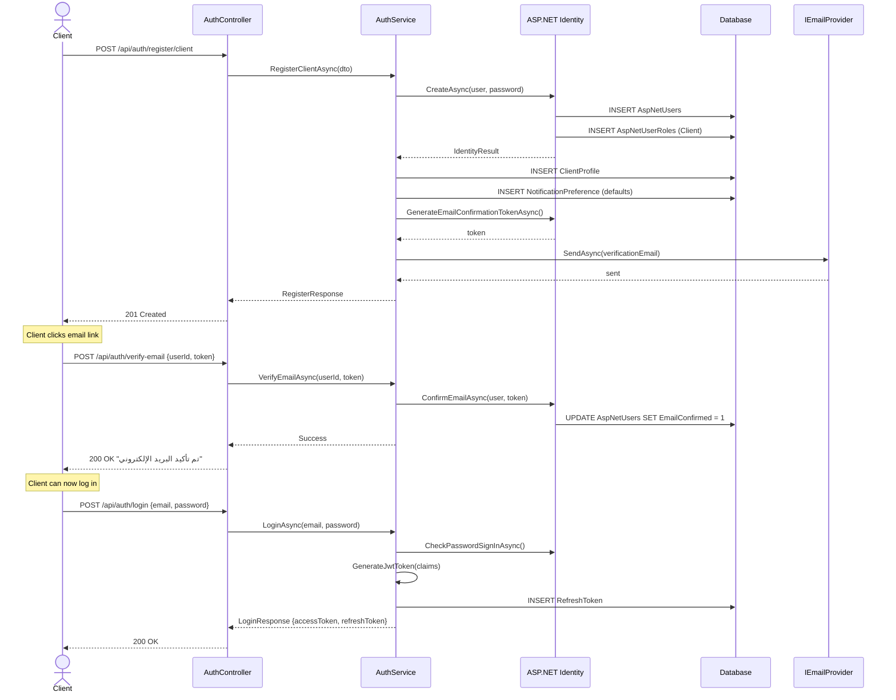
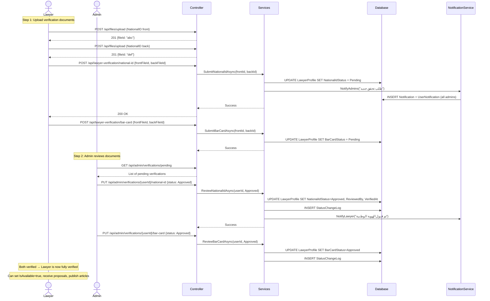
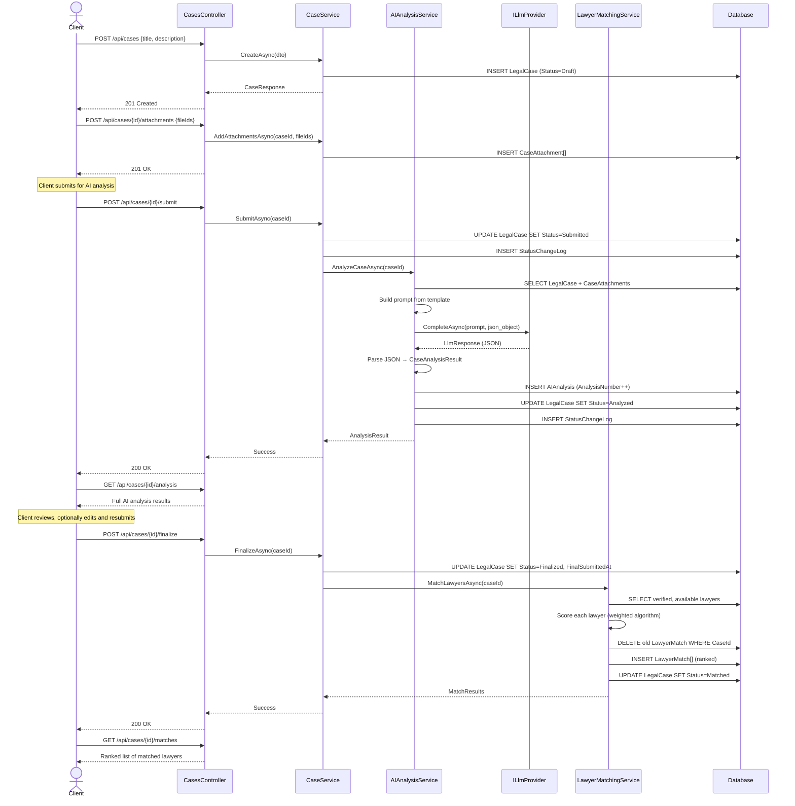
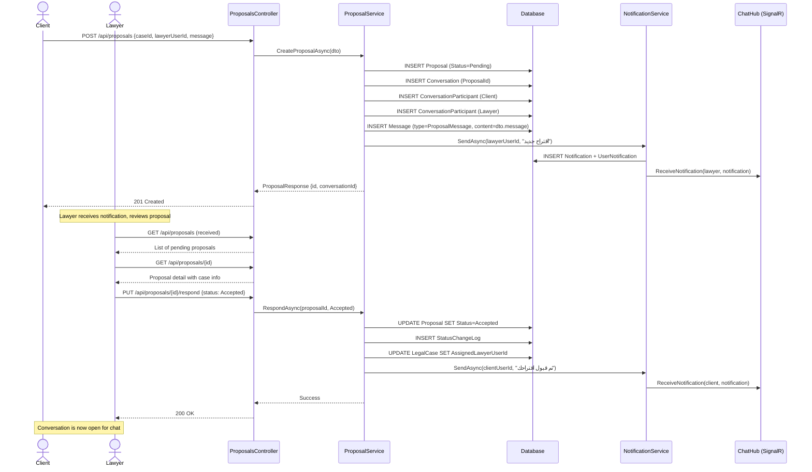
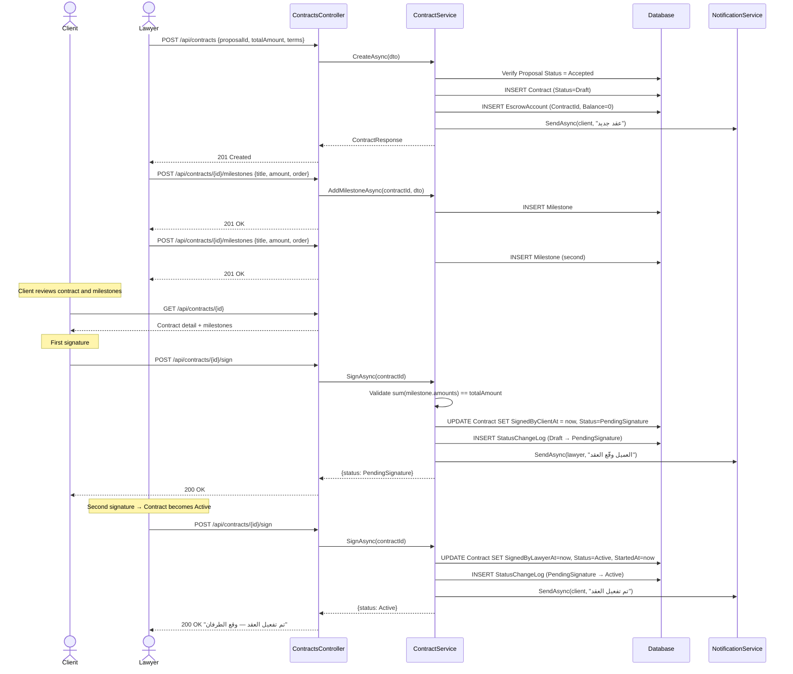
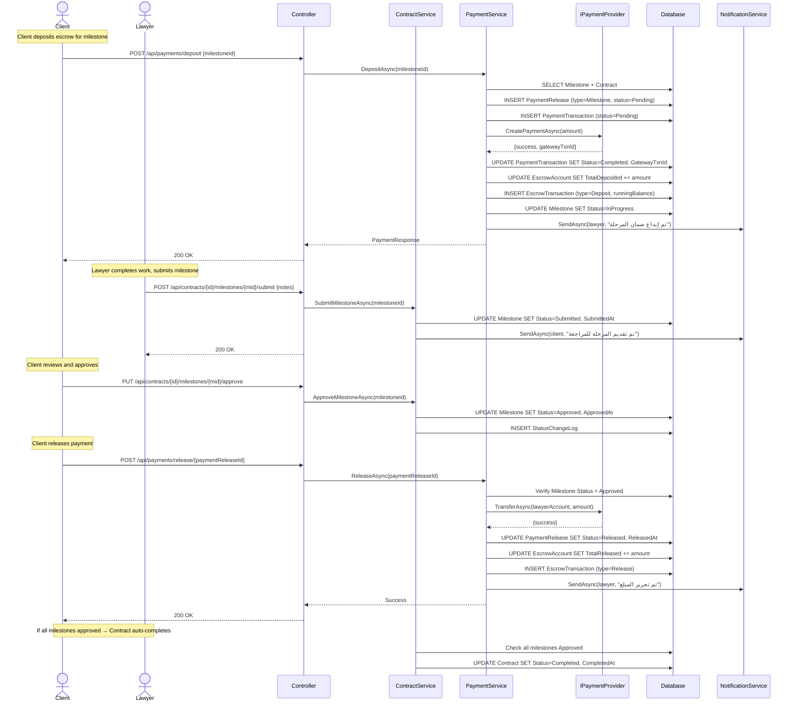
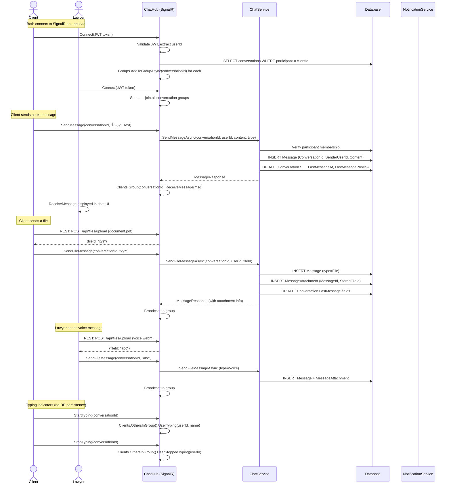
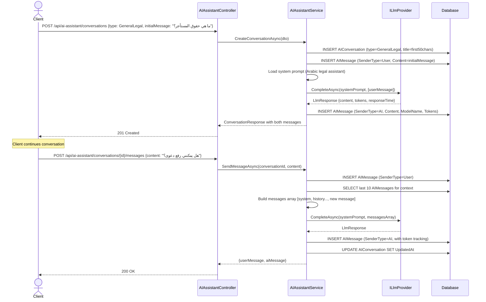
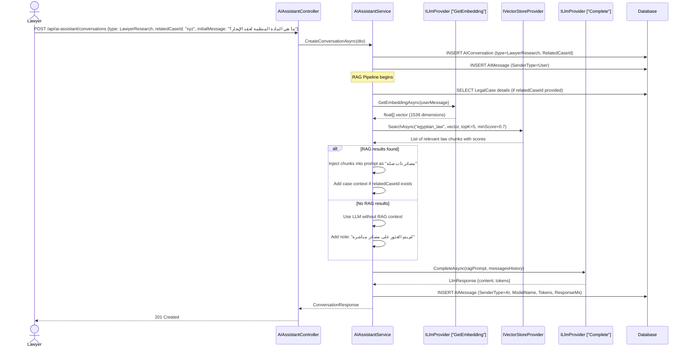
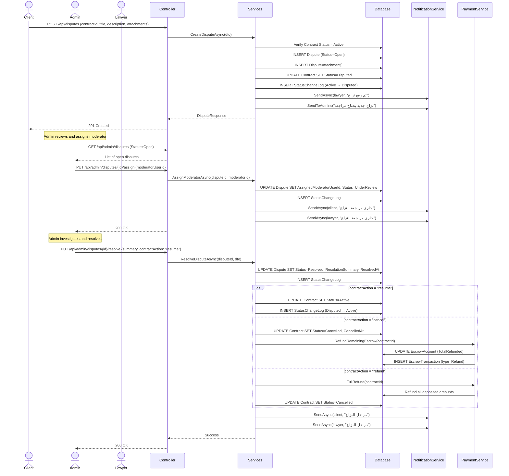

# Smart Court — UML Sequence Diagrams

> **Version:** 1.0 | **Date:** 2026-07-03
> **Notation:** Mermaid Sequence Diagrams
> **Coverage:** 10 critical business workflows

---

## 1. Client Registration & Email Verification

---

## 2. Lawyer Verification Flow

---

## 3. Case Lifecycle (Create → AI Analysis → Matching)

---

## 4. Proposal & Accept Flow

---

## 5. Contract Creation & Dual-Party Signing

---

## 6. Milestone Submit → Approve → Payment Release

---

## 7. Real-Time Chat (SignalR)

---

## 8. AI Assistant — Client (General Legal Q&A)

---

## 9. Lawyer AI Assistant with RAG Pipeline

---

## 10. Dispute Resolution Flow

