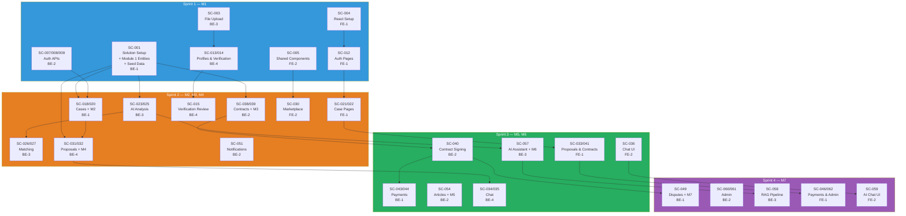

# Smart Court — Sprint Plan (30 Days)

> **Timeline:** 30 calendar days | **Sprints:** 4 × 1 week (5 working days each)
> **Team:** BE-1, BE-2, BE-3, BE-4 (Backend) + FE-1, FE-2 (Frontend)
> **Buffer:** Days 29-30 reserved for final testing & deployment prep
> **Approach:** Code-First — entities, EF configurations, and migrations evolve incrementally per feature per sprint.

---

## Capacity Planning

| Per Person | Value |
|------------|-------|
| Working days per sprint | 5 |
| Productive hours per day | ~6h |
| Story points per person per sprint | ~8-10 SP |

| Role | Members | SP/Sprint | 4 Sprints Total |
|------|---------|-----------|-----------------| 
| Backend | 4 | 32-40 | 128-160 |
| Frontend | 2 | 16-20 | 64-80 |
| **Total** | **6** | **48-60** | **192-240** |
| **Planned** | | | **202 SP** ✅ |

---

## Code-First Migration Schedule

> Each migration is small, focused, and owned by the developer building the feature that needs the tables.

| Migration | Sprint | Owner | Tables Created | Feature Trigger |
|-----------|--------|-------|----------------|-----------------|
| **M1** | S1 | BE-1 | Identity (ASP.NET), `ClientProfile`, `LawyerProfile`, `StoredFile`, `LegalCategory`, `LawyerSpecialization` | Auth & Profiles |
| **M2** | S2 | BE-1 | `LegalCase`, `AIAnalysis`, `LawyerMatch`, `CaseAttachment` | Cases & AI |
| **M3** | S2 | BE-2 | `Contract`, `Milestone`, `ScheduledPayment`, `PaymentRelease`, `PaymentTransaction`, `ContractAttachment`, `Notification`, `UserNotification`, `NotificationPreference` | Contracts & Notifications |
| **M4** | S2 | BE-4 | `Proposal`, `Conversation`, `ConversationParticipant`, `Message`, `MessageAttachment` | Proposals & Chat |
| **M5** | S3 | BE-2 | `LegalArticle`, `LegalArticleCategory`, `LegalArticleAttachment`, `Review` | Articles & Reviews |
| **M6** | S3 | BE-3 | `AIConversation`, `AIMessage` | AI Assistant |
| **M7** | S4 | BE-1 | `Dispute`, `DisputeAttachment` | Disputes |

---

## Sprint Overview

```mermaid
gantt
    title Smart Court — 30 Day Sprint Plan
    dateFormat  X
    axisFormat  Day %s
    
    section Sprint 1
    Foundation & Auth           :s1, 1, 5d
    
    section Sprint 2
    Cases, AI & Marketplace     :s2, 6, 5d
    
    section Sprint 3
    Chat, Contracts & Payments  :s3, 11, 5d
    
    section Sprint 4
    Admin, Polish & Integration :s4, 16, 5d
    
    section Buffer
    Testing & Deployment Prep   :buf, 21, 2d
```

---

## Sprint 1 — Foundation & Auth (Days 1-5)

> **Sprint Goal:** Project infrastructure ready, authentication working end-to-end, shared UI components built, file upload functional.
> **Migration:** M1 (Identity + Profiles + Files + Categories)

### BE-1 — Infrastructure Lead

| Day | Tasks | Story |
|-----|-------|-------|
| D1 | Configure `Program.cs` middleware pipeline (CORS, JWT auth, rate limiting, exception handling, Swagger), install NuGet packages (EF Core, Identity, FluentValidation, Serilog, Swagger, SignalR, MailKit) | SC-001 |
| D2 | Create `ApiResponse<T>`, `PagedRequest/Response`, `ExceptionHandlingMiddleware` with Arabic error messages, configure Serilog | SC-001 |
| D3 | Write **Module 1 entities** only: `StoredFile`, `ClientProfile`, `LawyerProfile`, `LegalCategory`, `LawyerSpecialization` — each in its feature slice or `Common/Entities` | SC-001 |
| D4 | Write EF Core Fluent API configurations for Module 1 entities, generate **Migration M1**, test against SQL Server | SC-001 |
| D5 | Seed Egyptian legal categories (قانون مدني، قانون جنائي، etc.) in M1 migration, configure Swagger, configure CORS, finalize `appsettings.json` | SC-001 |

### BE-2 — Auth Developer

| Day | Tasks | Story |
|-----|-------|-------|
| D1 | Set up ASP.NET Identity, configure JWT options, create `JwtTokenService` | SC-006, SC-009 |
| D2 | Implement `AuthService.RegisterClientAsync()`, `RegisterLawyerAsync()` (multipart + file uploads) with `IEmailProvider` | SC-007, SC-008 |
| D3 | Implement `AuthService.LoginAsync()`, JWT generation with claims, refresh token storage | SC-009 |
| D4 | Implement email verification, password reset, `ICurrentUserService` | SC-010, SC-011, SC-006 |
| D5 | Create `AuthController` with all endpoints, test with Swagger, implement `ConsoleEmailProvider` for dev | SC-007-011 |

### BE-3 — File & Providers

| Day | Tasks | Story |
|-----|-------|-------|
| D1 | Define `ILlmProvider`, `IPaymentProvider`, `ISmsProvider`, `IEmailProvider`, `IFileStorageProvider`, `IVectorStoreProvider` interfaces in `Infrastructure/Providers` | SC-003 |
| D2 | Implement `LocalFileStorageProvider` (upload, download, delete, URL generation) | SC-003 |
| D3 | Create `FileUploadService`, `FileUploadController` (multipart upload, validation) | SC-003 |
| D4 | Test file upload end-to-end, add file type & size validation | SC-003 |
| D5 | Create `SmtpEmailProvider` (MailKit), `ConsoleSmsProvider`, register all providers in DI | SC-003 |

### BE-4 — Profiles & Verification

| Day | Tasks | Story |
|-----|-------|-------|
| D1 | Study schema.md Module 1 entities, plan UserService interface | SC-013 |
| D2 | Implement `UserService` — get/update profile (client + lawyer), profile picture | SC-013 |
| D3 | Implement `LawyerVerificationService` — re-submit National ID + Bar Card docs | SC-014 |
| D4 | Implement specialization management (`GET /legal-categories`, `PUT /specializations`) | SC-017 |
| D5 | Create `UsersController`, `LawyerVerificationController`, test all endpoints | SC-013, SC-014, SC-017 |

### FE-1 — Auth & Core Setup

| Day | Tasks | Story |
|-----|-------|-------|
| D1 | Initialize React project (Vite + TS), configure React Router, set up folder structure mirroring backend slices | SC-004 |
| D2 | Configure i18next (Arabic RTL), create Axios instance with JWT interceptor, set up `AuthProvider` context | SC-004 |
| D3 | Build Login page (form, validation, API integration, token storage) | SC-012 |
| D4 | Build Registration pages (Client + Lawyer), Forgot Password page | SC-012 |
| D5 | Build Email Verification page, Reset Password page, `ProtectedRoute` component | SC-012 |

### FE-2 — Shared Components

| Day | Tasks | Story |
|-----|-------|-------|
| D1 | Set up theme system (CSS variables, colors, spacing, typography — Arabic fonts), create `GlobalStyles` | SC-005 |
| D2 | Build Layout components: Sidebar (RTL, collapsible), Top Navbar, Page Container | SC-005 |
| D3 | Build Client layout + Lawyer layout (different menu items), Admin layout stub | SC-005 |
| D4 | Build DataTable (pagination, sort, search), FileUpload (drag/drop, preview), Modal, ConfirmDialog | SC-005 |
| D5 | Build Form components (Input, TextArea, Select, DatePicker), LoadingSpinner, ErrorBoundary, Toast | SC-005 |

### Sprint 1 — Task Assignment Table

| ID | Title | Assignee | SP | Priority | Dep | Sprint |
|----|-------|----------|-----|----------|-----|--------|
| SC-001 | Backend Solution Scaffolding + Module 1 Entities + Seed Data | BE-1 | 5 | P0 | — | S1 |
| SC-006 | ICurrentUserService & JWT Claims | BE-2 | 2 | P0 | SC-001 | S1 |
| SC-007 | Client Registration | BE-2 | 3 | P0 | SC-001 | S1 |
| SC-008 | Lawyer Registration | BE-2 | 2 | P0 | SC-001, SC-003 | S1 |
| SC-009 | Login & JWT Token | BE-2 | 3 | P0 | SC-001 | S1 |
| SC-010 | Email Verification | BE-2 | 2 | P1 | SC-007 | S1 |
| SC-011 | Password Reset | BE-2 | 2 | P1 | SC-007 | S1 |
| SC-003 | File Upload Service & Provider | BE-3 | 4 | P0 | SC-001 | S1 |
| SC-013 | User Profile Management | BE-4 | 3 | P1 | SC-001 | S1 |
| SC-014 | Lawyer Verification Re-submission | BE-4 | 3 | P1 | SC-003 | S1 |
| SC-017 | Lawyer Specialization Management | BE-4 | 2 | P1 | SC-001 | S1 |
| SC-004 | React Project Setup | FE-1 | 4 | P0 | — | S1 |
| SC-012 | Auth Pages (Frontend) | FE-1 | 6 | P0 | SC-004 | S1 |
| SC-005 | Shared UI Component Library | FE-2 | 4 | P0 | — | S1 |

**Sprint 1 Total: 45 SP** (BE: 31 SP, FE: 14 SP)

> [!NOTE]
> SC-002 (Seed Data — Legal Categories) is merged into SC-001. Seeding is part of the same Migration M1 that creates the `LegalCategory` table. No separate story is needed.

### Sprint 1 — Definition of Done
- [ ] Backend API running with Swagger docs accessible
- [ ] **Migration M1** applied — Module 1 tables created (Identity, Profiles, Files, Categories)
- [ ] Client + Lawyer can register, verify email, login, get JWT
- [ ] File upload working (local storage)
- [ ] User profiles viewable and editable via API
- [ ] Lawyer verification documents uploadable
- [ ] Legal categories seeded
- [ ] React app running with login → dashboard flow working
- [ ] Shared component library built and documented
- [ ] All auth pages functional and integrated with API

---

## Sprint 2 — Cases, AI & Marketplace (Days 6-10)

> **Sprint Goal:** Case lifecycle working (create → submit → AI analysis → matching), marketplace browsable, proposals submittable, contracts & notifications available.
> **Migrations:** M2 (Cases & AI), M3 (Contracts & Notifications), M4 (Proposals & Chat)

### BE-1 — Cases

| Day | Tasks | Story |
|-----|-------|-------|
| D6 | Write **Module 2 entities**: `LegalCase`, `AIAnalysis`, `LawyerMatch`, `CaseAttachment` + EF configs → generate **Migration M2** | SC-018 |
| D7 | Implement `CaseService` — CreateCase, UpdateCase, DeleteCase, GetCases (paginated) | SC-018 |
| D8 | Implement case attachments (upload, list, delete), link to `StoredFile`. Implement case status transitions — submit, finalize, resubmit, status machine validation | SC-019, SC-020 |
| D9 | Implement `MarketplaceService` — browse lawyers with filters, search | SC-028 |
| D10 | Implement lawyer public profile endpoint, create `CasesController`, `MarketplaceController`, test all endpoints | SC-029 |

### BE-2 — Contracts & Notifications

| Day | Tasks | Story |
|-----|-------|-------|
| D6 | Write **Module 4 entities** (`Contract`, `Milestone`, `ScheduledPayment`, `PaymentRelease`, `PaymentTransaction`, `ContractAttachment`) + **Module 5 notification entities** (`Notification`, `UserNotification`, `NotificationPreference`) + EF configs → generate **Migration M3** | SC-038, SC-051 |
| D7 | Implement `ContractService` — CreateContract, UpdateContract, GetContracts | SC-038 |
| D8 | Implement milestones CRUD — add, update, delete, ordering, amount validation | SC-039 |
| D9 | Implement `NotificationService` — SendAsync, GetUserNotifications, MarkAsRead, UnreadCount | SC-051 |
| D10 | Create `ContractsController`, `NotificationsController`, push notification via SignalR stub | SC-038, SC-051 |

### BE-3 — AI

| Day | Tasks | Story |
|-----|-------|-------|
| D6 | Implement `OpenAiProvider` — HTTP client setup, configuration, error handling, retry policy | SC-023 |
| D7 | Design & test case analysis prompt (Arabic), implement structured JSON output parsing | SC-024 |
| D8 | Implement `AIAnalysisService` — AnalyzeCase, analysis history, token tracking, update case status | SC-025 |
| D9 | Implement `LawyerMatchingService` — scoring algorithm (specialization, experience, availability, location, rating) | SC-026 |
| D10 | Implement matching endpoint, cache results in `LawyerMatch` table, create controllers | SC-027 |

### BE-4 — Proposals & Verification Review

| Day | Tasks | Story |
|-----|-------|-------|
| D6 | Write **Module 3 entities**: `Proposal`, `Conversation`, `ConversationParticipant`, `Message`, `MessageAttachment` + EF configs → generate **Migration M4** | SC-031 |
| D7 | Implement `ProposalService` — CreateProposal with auto-conversation creation | SC-031 |
| D8 | Implement proposal accept/reject, notifications on status change | SC-032 |
| D9 | Implement verification review endpoints (admin approve/reject national ID, bar card) | SC-015 |
| D10 | Create `ProposalsController`, test full proposal flow end-to-end, add notification triggers | SC-031, SC-032, SC-015 |

### FE-1 — Cases

| Day | Tasks | Story |
|-----|-------|-------|
| D6 | Build Case list page (table with status filters, search, pagination) | SC-021 |
| D7 | Build Create/Edit case form (title, description, location, file upload) | SC-021 |
| D8 | Build Case detail page (status badge, description, attachments, actions) | SC-021, SC-022 |
| D9 | Build AI Analysis results section on case detail (strengths, weaknesses, recommendations) | SC-022 |
| D10 | Build Matched lawyers section on case detail + "Send Proposal" button | SC-022 |

### FE-2 — Marketplace & Notifications

| Day | Tasks | Story |
|-----|-------|-------|
| D6 | Build Profile pages (client view/edit, lawyer view/edit + specializations) | SC-016 |
| D7 | Build Lawyer verification upload page | SC-016 |
| D8 | Build Marketplace — lawyer listing page (cards, filters, search) | SC-030 |
| D9 | Build Lawyer detail profile page (bio, specializations, rating, reviews) | SC-030 |
| D10 | Build Notification bell + dropdown in navbar, notification list page | SC-053 |

### Sprint 2 — Task Assignment Table

| ID | Title | Assignee | SP | Priority | Dep | Sprint |
|----|-------|----------|-----|----------|-----|--------|
| SC-018 | Case CRUD + Module 2 Entities (M2) | BE-1 | 5 | P0 | SC-001 | S2 |
| SC-019 | Case Attachments | BE-1 | 2 | P1 | SC-003 | S2 |
| SC-020 | Case Status Transitions | BE-1 | 3 | P0 | SC-018 | S2 |
| SC-028 | Marketplace Browse & Search | BE-1 | 3 | P1 | SC-001 | S2 |
| SC-029 | Lawyer Public Profile | BE-1 | 2 | P1 | SC-028 | S2 |
| SC-038 | Contract CRUD + Module 4 & Notification Entities (M3) | BE-2 | 4 | P0 | SC-001 | S2 |
| SC-039 | Milestones | BE-2 | 3 | P1 | SC-038 | S2 |
| SC-051 | Notification Service — In-App | BE-2 | 4 | P1 | SC-038 | S2 |
| SC-023 | ILlmProvider + OpenAI | BE-3 | 4 | P0 | SC-001 | S2 |
| SC-024 | Case Analysis Prompt | BE-3 | 3 | P0 | SC-023 | S2 |
| SC-025 | AI Analysis Service | BE-3 | 4 | P0 | SC-024 | S2 |
| SC-026 | Matching Algorithm | BE-3 | 5 | P0 | SC-023 | S2 |
| SC-027 | Matching Endpoint | BE-3 | 3 | P0 | SC-026 | S2 |
| SC-031 | Proposal Service + Module 3 Entities (M4) | BE-4 | 4 | P0 | SC-018 | S2 |
| SC-032 | Proposal Accept/Reject | BE-4 | 2 | P0 | SC-031 | S2 |
| SC-015 | Verification Review (Admin) | BE-4 | 2 | P1 | SC-014 | S2 |
| SC-021 | Case Management Pages | FE-1 | 4 | P0 | SC-012 | S2 |
| SC-022 | Case Detail with AI & Matching | FE-1 | 2 | P0 | SC-021 | S2 |
| SC-016 | Profile Pages | FE-2 | 4 | P1 | SC-005 | S2 |
| SC-030 | Marketplace Pages | FE-2 | 3 | P1 | SC-005 | S2 |
| SC-053 | Notification UI | FE-2 | 3 | P1 | SC-005 | S2 |

**Sprint 2 Total: 69 SP** (BE: 53 SP, FE: 16 SP)

> [!WARNING]
> Sprint 2 is the heaviest sprint. Backend is over capacity at ~53 SP vs ~40 SP capacity. **Mitigation:** Entity/migration creation is included as part of each feature story (not separate SP). SC-029 (Lawyer Public Profile) is a simple query and can be combined with SC-028 as part of the same endpoint work. SC-051 (Notifications, 4 SP) can be a stretch goal for BE-2 — if not completed, push to S3.

### Sprint 2 — Definition of Done
- [ ] **Migrations M2, M3, M4** applied — Cases, AI, Contracts, Notifications, Proposals, Chat tables created
- [ ] Client can create case → submit → see AI analysis → improve → resubmit → finalize → see matched lawyers
- [ ] AI analysis returns structured Arabic results (strengths, weaknesses, recommendations)
- [ ] Matching shows ranked lawyers with scores
- [ ] Client can browse marketplace independently of matching
- [ ] Client can send proposal to lawyer from case detail or marketplace
- [ ] Lawyer can accept/reject proposals
- [ ] Contracts can be created with milestones
- [ ] In-app notifications working
- [ ] Admin can approve/reject lawyer verification
- [ ] Frontend: case lifecycle, marketplace, notifications all functional

---

## Sprint 3 — Chat, Contracts & Payments (Days 11-15)

> **Sprint Goal:** Real-time chat working, contracts signable, escrow payments functional, articles publishable, AI assistant available.
> **Migrations:** M5 (Articles & Reviews), M6 (AI Assistant)

### BE-1 — Payments

| Day | Tasks | Story |
|-----|-------|-------|
| D11 | Define `IPaymentProvider`, implement `StubPaymentProvider` (always returns success) | SC-043 |
| D12 | Implement `PaymentService` — create PaymentRelease, create PaymentTransaction | SC-044 |
| D13 | Implement escrow deposit flow (milestone → PaymentRelease → PaymentTransaction) | SC-044 |
| D14 | Implement payment release (on milestone approval) and refund logic | SC-044 |
| D15 | Implement webhook handler stub, create `PaymentsController` | SC-045 |

### BE-2 — Contracts, Articles & Reviews

| Day | Tasks | Story |
|-----|-------|-------|
| D11 | Implement contract signing — both parties sign, status transitions, validation | SC-040 |
| D12 | Implement contract complete and cancel flows | SC-040 |
| D13 | Write **Module 7 entities** (`LegalArticle`, `LegalArticleCategory`, `LegalArticleAttachment`) + `Review` entity (Module 5) + EF configs → generate **Migration M5**. Implement `ArticleService` — CRUD, categories, status (PendingApproval → Published), viewCount | SC-054 |
| D14 | Implement article moderation endpoints (admin approve/reject) | SC-056 |
| D15 | Implement `ReviewService` — create review, get reviews, average calculation | SC-047 |

### BE-3 — AI Assistant

| Day | Tasks | Story |
|-----|-------|-------|
| D11 | Write **Module 6 entities** (`AIConversation`, `AIMessage`) + EF configs → generate **Migration M6**. Implement `AIAssistantService` — create conversation, send message, get history | SC-057 |
| D12 | Design legal assistant system prompt (Arabic, with disclaimer), test with OpenAI | SC-057 |
| D13 | Implement conversation management — list conversations, auto-title from first message | SC-057 |
| D14 | Set up Qdrant vector store, implement `QdrantProvider` — store/search embeddings | SC-058 |
| D15 | Build RAG pipeline skeleton — embed query → search → context injection → LLM | SC-058 |

### BE-4 — Chat & SignalR

| Day | Tasks | Story |
|-----|-------|-------|
| D11 | Set up SignalR hub, implement `ChatHub` — JoinRoom, SendMessage, OnConnected | SC-034 |
| D12 | Implement `ChatService` — send message, get conversations, get message history | SC-034 |
| D13 | Implement participant validation, conversation-scoped groups | SC-034 |
| D14 | Implement file + voice message support in chat (upload → MessageAttachment → broadcast) | SC-035 |
| D15 | Add notification triggers to chat (new message notification for offline users), test full flow | SC-034, SC-035 |

### FE-1 — Contracts & Proposals

| Day | Tasks | Story |
|-----|-------|-------|
| D11 | Build Proposal pages — send proposal form, proposal list (client + lawyer views) | SC-033 |
| D12 | Build Proposal accept/reject UI (lawyer), proposal detail page | SC-033 |
| D13 | Build Contract create/detail page — terms, milestones, status | SC-041 |
| D14 | Build Contract signing flow (sign button, dual-signature display) | SC-041 |
| D15 | Build Milestone management UI — add/edit/submit/approve milestones | SC-042 |

### FE-2 — Chat & Articles

| Day | Tasks | Story |
|-----|-------|-------|
| D11 | Build `useSignalR` hook (connection, auth, reconnect, events) | SC-037 |
| D12 | Build Chat UI — conversation list sidebar, message window | SC-036 |
| D13 | Build Chat — text input, send, real-time receive, auto-scroll | SC-036 |
| D14 | Build Chat — file upload, voice recorder (MediaRecorder API), playback | SC-036 |
| D15 | Build Article pages — listing, detail, create/edit (for lawyers) | SC-055 |

### Sprint 3 — Task Assignment Table

| ID | Title | Assignee | SP | Priority | Dep | Sprint |
|----|-------|----------|-----|----------|-----|--------|
| SC-043 | IPaymentProvider + Stub | BE-1 | 3 | P0 | SC-001 | S3 |
| SC-044 | Escrow Deposit & Release | BE-1 | 5 | P0 | SC-043 | S3 |
| SC-045 | Payment Webhook Handler | BE-1 | 3 | P1 | SC-044 | S3 |
| SC-040 | Contract Signing | BE-2 | 3 | P0 | SC-038 | S3 |
| SC-054 | Article Service + Module 7 Entities (M5) | BE-2 | 4 | P2 | SC-003 | S3 |
| SC-056 | Article Moderation | BE-2 | 2 | P2 | SC-054 | S3 |
| SC-047 | Review Service + Review Entity (M5) | BE-2 | 3 | P2 | SC-040 | S3 |
| SC-057 | Client AI Assistant + Module 6 Entities (M6) | BE-3 | 4 | P1 | SC-023 | S3 |
| SC-058 | Lawyer AI Assistant (RAG) | BE-3 | 5 | P2 | SC-057 | S3* |
| SC-034 | Chat Service & SignalR Hub | BE-4 | 5 | P0 | SC-031 | S3 |
| SC-035 | File & Voice Messages in Chat | BE-4 | 3 | P1 | SC-034 | S3 |
| SC-033 | Proposal Pages (FE) | FE-1 | 3 | P0 | SC-021 | S3 |
| SC-041 | Contract Pages (FE) | FE-1 | 4 | P0 | SC-033 | S3 |
| SC-042 | Milestone Workflow Pages | FE-1 | 2 | P1 | SC-041 | S3 |
| SC-037 | SignalR React Hook | FE-2 | 2 | P0 | SC-004 | S3 |
| SC-036 | Chat UI | FE-2 | 4 | P0 | SC-037 | S3 |
| SC-055 | Article Pages | FE-2 | 3 | P2 | SC-005 | S3 |

**Sprint 3 Total: 58 SP** (BE: 40 SP, FE: 18 SP)

> [!NOTE]
> *SC-058 (RAG pipeline) starts in S3 but may carry over into S4 for refinement. The skeleton must work by end of S3; tuning continues in S4.

### Sprint 3 — Definition of Done
- [ ] **Migrations M5, M6** applied — Articles, Reviews, AI Assistant tables created
- [ ] Real-time chat working (text + file + voice between client and lawyer)
- [ ] Contracts signable by both parties → status becomes Active
- [ ] Milestones submittable and approvable
- [ ] Escrow deposit and release flow working (with stub provider)
- [ ] Client AI assistant functional (conversational Q&A in Arabic)
- [ ] RAG pipeline skeleton operational (lawyer assistant)
- [ ] Articles publishable by lawyers (with admin approval)
- [ ] Reviews submittable after contract completion
- [ ] Frontend: proposals, contracts, chat, articles all functional

---

## Sprint 4 — Admin, Polish & Integration (Days 16-20)

> **Sprint Goal:** Admin dashboard functional, disputes working, AI refined, all features integrated end-to-end, bug fixes.
> **Migration:** M7 (Disputes)

### BE-1 — Disputes & Polish

| Day | Tasks | Story |
|-----|-------|-------|
| D16 | Write **Module 5 remaining entities** (`Dispute`, `DisputeAttachment`) + EF configs → generate **Migration M7**. Implement `DisputeService` — create dispute, list, assign moderator, resolve | SC-049 |
| D17 | Wire dispute notifications, dispute attachments | SC-049 |
| D18 | Payment edge cases — retry failed payments, partial refunds, timeout handling | SC-044 |
| D19 | Performance review — add database indexes, optimize heavy queries (marketplace, notifications) | — |
| D20 | Integration testing — full case lifecycle end-to-end, fix critical bugs | — |

### BE-2 — Admin

| Day | Tasks | Story |
|-----|-------|-------|
| D16 | Implement `AdminService` — dashboard stats (users, cases, contracts, revenue, pending counts) | SC-060 |
| D17 | Implement admin user management — list, detail, suspend, activate | SC-061 |
| D18 | Implement admin route protection, audit logging for admin actions | SC-063 |
| D19 | Final admin endpoints: article moderation queue, dispute queue, verification queue | SC-060, SC-061 |
| D20 | Bug fixes, API documentation review, response format consistency check | — |

### BE-3 — AI Refinement

| Day | Tasks | Story |
|-----|-------|-------|
| D16 | Refine RAG pipeline — chunking strategy, embedding optimization, context window management | SC-058 |
| D17 | Tune case analysis prompts based on test results, edge case handling | SC-024 |
| D18 | Tune matching algorithm weights, test with diverse case types | SC-026 |
| D19 | Add error handling for AI failures — fallback messages, retry logic, user-facing error states | SC-023 |
| D20 | Integration testing for all AI features, token usage monitoring | — |

### BE-4 — Notifications & Polish

| Day | Tasks | Story |
|-----|-------|-------|
| D16 | Implement notification preferences (enable/disable per channel) | SC-052 |
| D17 | Add notification triggers across ALL features (contract signed, milestone approved, payment released, dispute) | SC-051 |
| D18 | SignalR notification push for real-time bell updates | SC-051 |
| D19 | Chat edge cases — reconnection handling, offline message delivery, read receipts (optional) | SC-034 |
| D20 | Bug fixes, full chat + notification integration testing | — |

### FE-1 — Payments & Admin

| Day | Tasks | Story |
|-----|-------|-------|
| D16 | Build Payment pages — deposit escrow, payment status, transaction history | SC-046 |
| D17 | Build Review UI — star rating form on completed contracts, reviews list | SC-048 |
| D18 | Build Admin dashboard — stats cards, charts | SC-062 |
| D19 | Build Admin pages — user management, verification queue, article moderation, disputes | SC-062 |
| D20 | Full integration testing, responsive design fixes, edge case UI states | — |

### FE-2 — AI Assistant & Polish

| Day | Tasks | Story |
|-----|-------|-------|
| D16 | Build AI Assistant chat UI — conversation list, chat interface | SC-059 |
| D17 | Build AI Assistant — message input, AI response rendering (markdown), loading states | SC-059 |
| D18 | Build Dispute pages — raise dispute form, dispute list, detail page | SC-050 |
| D19 | UI polish — loading states, empty states, error states across all pages | — |
| D20 | RTL fixes, Arabic text consistency, cross-browser testing | — |

### Sprint 4 — Task Assignment Table

| ID | Title | Assignee | SP | Priority | Dep | Sprint |
|----|-------|----------|-----|----------|-----|--------|
| SC-049 | Dispute Service + Dispute Entities (M7) | BE-1 | 4 | P2 | SC-040 | S4 |
| SC-060 | Admin Dashboard Stats | BE-2 | 3 | P2 | SC-001 | S4 |
| SC-061 | Admin User Management | BE-2 | 3 | P2 | SC-060 | S4 |
| SC-063 | Admin Role & Route Protection | BE-2 | 1 | P0 | SC-001 | S4 |
| SC-058 | Lawyer AI Assistant (RAG) cont. | BE-3 | — | P2 | SC-057 | S4 |
| SC-052 | Notification Preferences | BE-4 | 2 | P3 | SC-051 | S4 |
| SC-046 | Payment Pages (FE) | FE-1 | 5 | P0 | SC-041 | S4 |
| SC-048 | Review UI (FE) | FE-1 | 2 | P2 | SC-041 | S4 |
| SC-062 | Admin Dashboard Pages (FE) | FE-1 | 5 | P2 | SC-004 | S4 |
| SC-059 | AI Assistant Chat UI | FE-2 | 3 | P1 | SC-036 | S4 |
| SC-050 | Dispute Pages (FE) | FE-2 | 2 | P2 | SC-005 | S4 |

**Sprint 4 Total: 30 SP** (BE: 13 SP + polish/testing, FE: 17 SP)

> [!TIP]
> Sprint 4 has lower planned SP to allow for bug fixes, integration testing, and polish. Days 19-20 for all team members are dedicated to testing and fixing issues found during integration.

### Sprint 4 — Definition of Done
- [ ] **Migration M7** applied — Dispute tables created
- [ ] Admin dashboard fully functional (stats, user management, moderation queues)
- [ ] Disputes can be raised and resolved
- [ ] All notifications wired across features
- [ ] AI assistant working for both clients and lawyers
- [ ] Payment flow working end-to-end (deposit → milestone → release)
- [ ] All pages responsive and RTL-correct
- [ ] No P0 or P1 bugs remaining
- [ ] Full case lifecycle tested end-to-end

---

## Days 21-22 (Buffer) — Final Testing & Deployment Prep

| Person | Focus |
|--------|-------|
| BE-1 | Deployment configuration, production appsettings, health checks |
| BE-2 | API documentation final review, missing edge cases |
| BE-3 | AI prompt final tuning, RAG knowledge base quality check |
| BE-4 | Load testing SignalR, notification delivery verification |
| FE-1 | Cross-browser testing, responsive design final pass |
| FE-2 | Accessibility pass, Arabic text review, final UI polish |

---

## Dependency Graph (Cross-Sprint)

---

## Full Team Calendar View

| Sprint | BE-1 | BE-2 | BE-3 | BE-4 | FE-1 | FE-2 |
|--------|------|------|------|------|------|------|
| **S1** | Solution Setup, **Module 1 Entities + M1 Migration**, Seed Data, Swagger, CORS | Auth Service (Register, Login, JWT, Email Verify, Password Reset) | Provider Interfaces, File Upload Service, Email/SMS Providers | User Profiles, Lawyer Verification, Specializations | React Setup, i18n RTL, Auth Pages (Login, Register, Forgot) | Theme, Layouts, Shared Components (DataTable, FileUpload, Modal, Forms) |
| **S2** | **Module 2 Entities + M2 Migration**, Cases CRUD, Attachments, Status Transitions, Marketplace API | **Module 4 + Notification Entities + M3 Migration**, Contracts CRUD, Milestones, Notification Service | OpenAI Provider, Case Analysis Prompt, AI Analysis Service, Matching Algorithm | **Module 3 Entities + M4 Migration**, Proposal Service, Accept/Reject, Verification Review | Case Pages (List, Create, Detail), AI Analysis View, Matched Lawyers | Profile Pages, Verification Page, Marketplace, Notification UI |
| **S3** | Payment Provider, Escrow Deposit/Release, Webhook | Contract Signing, **Module 7 + Review Entities + M5 Migration**, Articles CRUD, Article Moderation, Reviews | **Module 6 Entities + M6 Migration**, Client AI Assistant, Qdrant Setup, RAG Pipeline Skeleton | Chat Hub (SignalR), Chat Service, File/Voice Messages | Proposal Pages, Contract Pages, Milestone Workflow | SignalR Hook, Chat UI, Article Pages |
| **S4** | **Dispute Entities + M7 Migration**, Disputes, Payment Edge Cases, Performance, Integration Testing | Admin Dashboard, User Management, Route Protection, Bug Fixes | RAG Refinement, Prompt Tuning, Matching Tuning, AI Testing | Notification Preferences, Notification Triggers (all features), Chat Polish | Payment Pages, Review UI, Admin Dashboard Pages | AI Assistant UI, Dispute Pages, UI Polish, RTL Fixes |

---

## Risk Assessment

| Risk | Impact | Likelihood | Mitigation |
|------|--------|-----------|------------|
| Migration conflicts between team members (S2 has 3 parallel migrations) | Medium | Medium | Each developer owns their migration; coordinate via pull request order. Run `dotnet ef migrations add` sequentially. |
| OpenAI API integration complexity | High | Medium | BE-3 starts AI in S2 Day 1; stub responses available for frontend testing |
| Sprint 2 backend overload (53 SP) | Medium | High | Entity/migration work is absorbed into feature stories. SC-029 is a simple query combined with SC-028. SC-051 is a stretch goal. |
| Payment gateway not finalized | High | High | `StubPaymentProvider` used through all sprints; real integration can happen post-MVP |
| Arabic RTL edge cases | Medium | Medium | FE-2 dedicated to RTL fixes in S4; test early in S1 |
| SignalR scalability on-prem | Low | Low | Connection limits manageable for MVP user base |
| RAG corpus not ready | Medium | High | RAG works in S4 with minimal seed data; full corpus can be loaded post-launch |
| Team unfamiliar with AI/LLM | High | High | BE-3 is designated AI lead; team studies AI in Sprint 1 parallel |

---

## Backlog Coverage Verification

> All 63 stories from the Product Backlog are accounted for in this sprint plan.

| Epic | Stories | Sprint(s) | Status |
|------|---------|-----------|--------|
| E-01: Project Setup & Infrastructure | SC-001 (includes SC-002), SC-003, SC-004, SC-005, SC-006 | S1 | ✅ All covered |
| E-02: Authentication & Registration | SC-007, SC-008, SC-009, SC-010, SC-011, SC-012 | S1 | ✅ All covered |
| E-03: User Profiles & Verification | SC-013, SC-014, SC-015, SC-016, SC-017 | S1-S2 | ✅ All covered |
| E-04: Legal Case Management | SC-018, SC-019, SC-020, SC-021, SC-022 | S2 | ✅ All covered |
| E-05: AI Case Analysis | SC-023, SC-024, SC-025 | S2 | ✅ All covered |
| E-06: Lawyer Matching | SC-026, SC-027 | S2 | ✅ All covered |
| E-07: Lawyer Marketplace | SC-028, SC-029, SC-030 | S2 | ✅ All covered |
| E-08: Proposals | SC-031, SC-032, SC-033 | S2-S3 | ✅ All covered |
| E-09: Communication (Chat) | SC-034, SC-035, SC-036, SC-037 | S3 | ✅ All covered |
| E-10: Contract Management | SC-038, SC-039, SC-040, SC-041, SC-042 | S2-S3 | ✅ All covered |
| E-11: Payments & Escrow | SC-043, SC-044, SC-045, SC-046 | S3-S4 | ✅ All covered |
| E-12: Reviews & Ratings | SC-047, SC-048 | S3-S4 | ✅ All covered |
| E-13: Disputes | SC-049, SC-050 | S4 | ✅ All covered |
| E-14: Notifications | SC-051, SC-052, SC-053 | S2, S4 | ✅ All covered |
| E-15: Articles & Knowledge Base | SC-054, SC-055, SC-056 | S3-S4 | ✅ All covered |
| E-16: AI Assistant | SC-057, SC-058, SC-059 | S3-S4 | ✅ All covered |
| E-17: Admin Dashboard | SC-060, SC-061, SC-062, SC-063 | S4 | ✅ All covered |

---

## Quick Import Guide (Jira / Azure DevOps)

### How to Import This Plan

1. **Create Epics** (E-01 through E-17) in your board
2. **Create Stories** (SC-001 through SC-063) under their respective epics
   - Note: SC-002 is merged into SC-001 — create a single story with combined acceptance criteria
3. **Copy Acceptance Criteria** from the Product Backlog into each story's description
4. **Set Story Points** as specified
5. **Create Sprints** (S1, S2, S3, S4) and drag stories into the correct sprint
6. **Assign** team members using the role codes (BE-1 → actual name, etc.)
7. **Set Labels**: `backend`, `frontend`, `ai`, `infrastructure` as specified
8. **Set Priority**: P0 = Highest, P1 = High, P2 = Medium, P3 = Low

### Jira Custom Fields Suggested
- `Dependency` — link type "is blocked by" for task dependencies
- `Sprint` — use Jira's sprint board
- `Role` — custom field or use labels for team filtering
- `Migration` — custom field to tag which migration (M1-M7) a story contributes to
